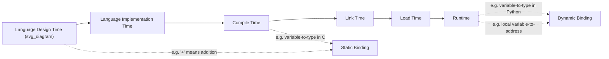

## Binding and Binding Times

### Overview

A **binding** is an association between an attribute and an entity, such as between a variable and its type, or between a variable and its memory address. The **binding time** is the moment at which that association is created. Binding time is one of the most important concepts in understanding how programming languages work, because it determines the flexibility, efficiency, and safety trade-offs a language makes.

### The Concept of Binding

**Key Points**
- A binding is simply an association — between an attribute (type, value, operation, memory address) and an entity (a variable, a name, an operator).
- Binding can happen at many different points in a program's life: during language design, language implementation, compilation, linking, loading, or execution.

**Example**
```
x = 3 + 4
```
This single statement involves multiple bindings:
- The `+` operator is bound to the addition operation for integers.
- The literal `3` is bound to a specific bit-string representation.
- The variable `x` is bound to a type.
- `x` is bound to a memory address.
- `x` is bound to the value `7`.

### Possible Binding Times

**Key Points**
- Binding times can be classified broadly into two categories: **static** (before runtime, and remaining fixed throughout execution) and **dynamic** (during runtime, or changeable during execution).

**Points at Which Binding Can Occur**

1. **Language design time** — bindings built into the language definition itself, such as the binding of the `+` operator symbol to the addition operation.
2. **Language implementation time** — bindings fixed by the language implementor, such as binding a data type like `int` to a specific range of possible values (e.g., 32-bit two's complement).
3. **Compile time** — bindings performed by a compiler, such as binding a variable to a specific data type in a statically typed language.
4. **Load time** — bindings that occur when a program is loaded into memory, such as binding a `static` global C variable to a specific memory address.
5. **Link time** — bindings that occur when separately compiled modules are linked together, such as binding a call to an external function to that function's actual code.
6. **Runtime** — bindings that occur during program execution, such as binding a non-static local variable to a memory cell.

### Static vs. Dynamic Binding

**Static Binding**
A binding is **static** if it first occurs before runtime begins and remains unchanged throughout program execution.

**Dynamic Binding**
A binding is **dynamic** if it first occurs during execution, or can change during execution of the program.

**Example — Type Binding**
```c
int x;   // In C, x is statically bound to type int at compile time,
         // and this binding never changes during execution.
```

```python
x = 5      # In Python, x is dynamically bound to type int
x = "five" # x is now dynamically re-bound to type str, at runtime
```

### Case Study: The Binding of Variables to Types

**Static Type Binding**
In statically typed languages such as C, C++, Java, and C#, a variable is bound to a type either through an explicit declaration or an implicit declaration (inferred from context, such as the first use of a name in older FORTRAN), and this binding is determined at compile time.

**Dynamic Type Binding**
In dynamically typed languages such as Python, JavaScript, and PHP, a variable's type is bound when it is assigned a value during execution, via an assignment statement. Because reassignment can bind the variable to a different type entirely, this is called dynamic type binding.

**Trade-offs**
- **Static type binding** [Inference] enables the compiler to detect type errors before execution, improving reliability, and generally allows for more efficient code generation.
- **Dynamic type binding** provides greater flexibility, allowing generic code to be written that operates over multiple types, at the cost of runtime type-checking overhead and the loss of compile-time error detection for type mismatches.

### Case Study: The Binding of Variables to Storage (Lifetime, Revisited)

The binding of a variable to a memory address is closely tied to its **lifetime**, and can occur at different times depending on the storage category:

- **Static binding to storage** — occurs once, before execution, and does not change (static variables).
- **Dynamic binding to storage** — occurs and can recur during execution (stack-dynamic and heap-dynamic variables).

**Example**
```c
void f() {
    static int a = 0;  // storage bound once, at load time; persists across calls
    int b = 0;          // storage bound at each call (stack-dynamic); rebound every call
}
```

### Binding Time Progression Diagram



### Conclusion

Binding is the conceptual glue that connects a program's abstract entities — names, variables, operators — to their concrete attributes: types, values, memory addresses, and meanings. The binding time of a given attribute determines whether that association is fixed early and permanently (static binding) or established and potentially changed during execution (dynamic binding). This single distinction underlies many of the deepest trade-offs in language design, including the difference between statically and dynamically typed languages, and the different lifetime categories of variables.

**Related Topics**
- Static vs. dynamic type checking
- Storage bindings and variable lifetime categories
- Type inference vs. explicit/implicit declaration
- Scope: static scope vs. dynamic scope
- Type compatibility rules