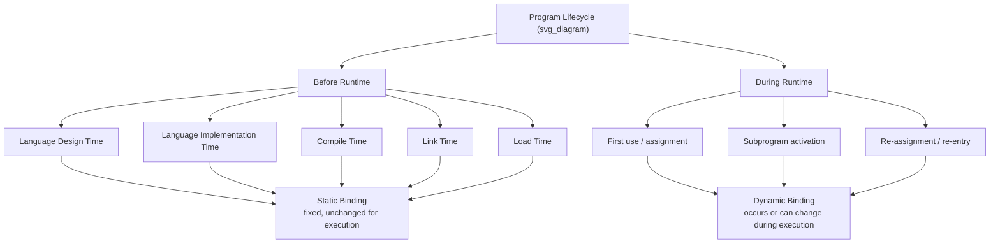

## Static versus Dynamic Binding

### Overview

Static and dynamic binding represent the two fundamental categories into which every binding time falls. This topic examines the distinction directly as a design axis: what characterizes each category, why a language designer chooses one over the other for a given attribute, and how the choice reverberates through error detection, flexibility, and execution efficiency.

### Defining the Two Categories

**Static Binding**
A binding is static if it first occurs before run time begins and remains unchanged throughout program execution. Static bindings are fixed by the time the program starts running, whether that fixing happens at language design time, language implementation time, or compile time.

**Dynamic Binding**
A binding is dynamic if it first occurs during execution, or it is possible for the binding to change during execution of the program. Dynamic bindings may be established once at runtime and remain fixed thereafter, or they may change repeatedly as execution proceeds.

**Key Points**
- The dividing line between the two categories is runtime, not any specific mechanism.
- A dynamic binding does not necessarily mean it changes repeatedly — a stack-dynamic variable's address is dynamically bound but stays fixed for the duration of one subprogram activation.

### Comparison by Attribute

**Type Binding**

```c
int x = 5;   // C: static — x is permanently bound to type int at compile time
```

```python
x = 5        # Python: dynamic — x is bound to type int at this assignment
x = "hello"  # x is dynamically re-bound to type str
```

**Storage (Address) Binding**

```c
void f() {
    static int counter = 0;  // static binding: same address across all calls
    int local = 0;             // dynamic binding: new address bound on each call
}
```

**Operator Binding (Overloading)**
```c++
// C++: operator+ can be statically bound at compile time based on operand types
int a = 2 + 3;          // + bound to integer addition
std::string s = s1 + s2; // + bound to string concatenation, resolved statically
```

### Why the Choice Matters: Error Detection

**Key Points**
- Static binding [Inference] generally enables earlier detection of certain classes of errors, because the compiler can verify the binding before the program ever runs.
- Dynamic binding defers that verification to execution, so equivalent errors surface only when the offending code path actually executes.

**Example**
```java
int x = "hello";   // Java: caught at compile time — static type binding
```
```python
x = 5
x = x + "hello"    # Python: only fails at runtime, when this line executes —
                    # dynamic type binding defers the check
```

### Why the Choice Matters: Flexibility

**Key Points**
- Dynamic binding provides flexibility that static binding cannot, such as writing a single function that operates correctly over arguments of different types without the language designer needing generics or templates.
- This flexibility comes at the cost of runtime overhead, since the language implementation must carry and check binding information (such as type tags) during execution.

**Example**
```python
def describe(value):
    return f"{value} is a {type(value).__name__}"

describe(5)        # works
describe("text")   # also works, same function, dynamic type binding
describe([1, 2])   # also works
```

### Why the Choice Matters: Efficiency

**Key Points**
- Static binding [Inference] typically allows a compiler to generate more efficient code, because decisions such as memory layout, operator selection, and storage size are fixed and known in advance rather than resolved at execution time.
- Dynamic binding requires the runtime system to maintain extra information (tags, dispatch tables, or interpreter-level bookkeeping) to resolve the binding as the program runs, which [Inference] generally imposes some performance cost relative to an equivalent statically bound operation, though the actual overhead varies by implementation.

### Static and Dynamic Binding Across a Program's Lifecycle



### Summary Comparison

| Aspect | Static Binding | Dynamic Binding |
|---|---|---|
| When established | Before runtime | During runtime |
| Can change during execution | No | Possibly |
| Error detection | Earlier (compile time) | Later (runtime) |
| Flexibility | Lower | Higher |
| Typical runtime cost | Lower | Higher [Inference] |
| Example attribute | Type in C | Type in Python |

### Conclusion

Static and dynamic binding are not competing mechanisms but two ends of a single design spectrum applied to every bindable attribute in a language — type, storage, operator meaning, and more. Static binding trades flexibility for earlier error detection and generally more efficient generated code. Dynamic binding trades that early safety and efficiency for the ability to write more general, adaptable code and to defer decisions until the information needed to make them is actually available at runtime. Most real languages are not purely static or purely dynamic; they combine both, choosing the binding time independently for each attribute based on the trade-offs that matter most for that attribute.

**Related Topics**
- Type checking: static type checking vs. dynamic type checking
- Storage lifetime categories (static, stack-dynamic, heap-dynamic)
- Operator overloading and static dispatch vs. dynamic dispatch
- Type inference and its relationship to binding time
- Scope resolution: static scope vs. dynamic scope