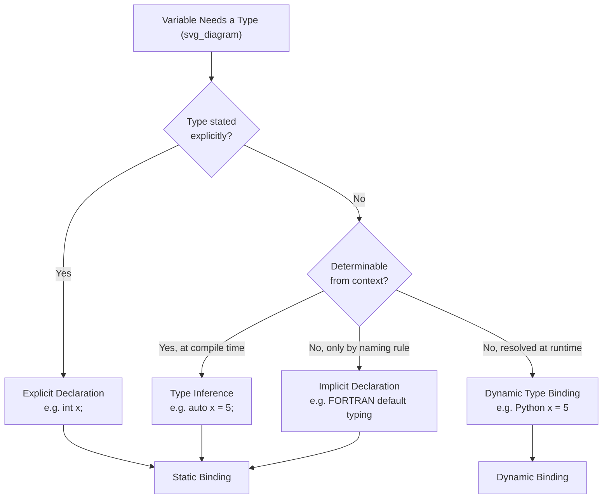

## Type Binding and Type Inference

### Overview

Type binding determines how and when a variable becomes associated with a data type. This can happen through explicit or implicit declaration before execution, or through the values assigned to a variable during execution. Type inference is a related but distinct mechanism in which the compiler determines a variable's or expression's type from context, without the programmer stating it directly. This topic separates these two concepts and shows how they interact.

### Type Binding: Explicit vs. Implicit Declaration

**Explicit Declaration**
A variable is explicitly declared when the programmer writes a statement that directly states the variable's type.

```java
int count;
double price;
```

**Implicit Declaration**
A variable is implicitly declared when the type binding is done through default conventions rather than explicit declaration statements. A classic example is default typing in early FORTRAN, where identifiers beginning with letters I through N were implicitly typed as `INTEGER`, and all others as `REAL`.

```fortran
      INTEGER I
      K = 5        ! K implicitly typed INTEGER (starts with I-N range)
      X = 2.5       ! X implicitly typed REAL (outside I-N range)
```

**Key Points**
- Both explicit and implicit declaration are forms of **static** type binding, since the type is fixed before execution and does not change.
- Implicit declaration by naming convention is largely a historical design; most modern languages have replaced it with type inference.

### Type Binding: Static vs. Dynamic

**Static Type Binding**
The variable is bound to a type prior to execution, either explicitly or implicitly, and the binding does not change during execution.

```c#
int x = 10;
// x is permanently int; x = "text" would be a compile-time error
```

**Dynamic Type Binding**
The variable is bound to a type at the time an assignment statement is executed, and reassignment can rebind the variable to a different type.

```python
x = 10       # x is dynamically bound to int
x = "ten"    # x is dynamically re-bound to str
x = [1, 2]   # x is dynamically re-bound to list
```

**Key Points**
- Dynamic type binding is typically implemented by attaching a type tag to the value itself (not the variable name), and the variable's apparent "type" is really just whatever value it currently references.
- Languages using dynamic type binding [Inference] generally perform type checking at runtime rather than compile time, since the type is not known until the assignment executes.

### Type Inference

**Key Points**
- Type inference is a compile-time process in which the compiler determines the type of a variable or expression from the context in which it is used, without requiring an explicit type annotation.
- Type inference is still a form of **static** type binding — the type is fully determined before execution and fixed thereafter. It differs from implicit declaration by naming convention in that it examines the actual expression or initializer, not the spelling of the identifier.

**Example — C++ `auto`**
```cpp
auto x = 5;          // inferred as int
auto y = 3.14;        // inferred as double
auto z = std::string("hi");  // inferred as std::string
```

**Example — C# `var`**
```csharp
var count = 10;       // inferred as int
var name = "Ada";     // inferred as string
```

**Example — Swift**
```swift
let value = 42        // inferred as Int
let ratio = 0.5        // inferred as Double
```

**Contrast with Dynamic Typing**
It is a common point of confusion to equate type inference with dynamic typing. They are different:

```cpp
auto x = 5;
x = "hello";   // ERROR: x was inferred as int at compile time and cannot change type
```

```python
x = 5
x = "hello"    # Legal: Python uses dynamic type binding, not static inference
```

The C++ example shows that once `auto` infers a type, that type is fixed — this is static binding achieved through inference rather than explicit annotation. The Python example shows genuine dynamic type binding, where the variable itself can be rebound to different types across its lifetime.

### Type Inference Across an Expression

Some languages extend inference beyond a single initializer to entire expressions, using algorithms such as Hindley-Milner type inference, commonly associated with ML-family and Haskell-family languages.

```haskell
add x y = x + y
-- The compiler infers: add :: Num a => a -> a -> a
-- without any type annotation written by the programmer
```

### Decision Flow: How a Variable Gets Its Type



### Summary Comparison

| Mechanism | Binding Time | Type Fixed After First Use? | Example Language |
|---|---|---|---|
| Explicit declaration | Static | Yes | C, Java |
| Implicit declaration (naming rule) | Static | Yes | Early FORTRAN |
| Type inference | Static | Yes | C++ (`auto`), Haskell |
| Dynamic type binding | Dynamic | No | Python, JavaScript |

### Conclusion

Type binding and type inference are related but conceptually separate. Type binding concerns *when* and *how firmly* a type is associated with a variable — statically and permanently, or dynamically and changeably. Type inference concerns a specific *mechanism* for determining a type without an explicit annotation, but it still produces a static, unchanging binding. Confusing inference with dynamic typing is a common error: inferred types in languages like C++ and Swift are fixed at compile time, while dynamically typed languages like Python allow the same variable to be rebound to entirely different types throughout execution.

**Related Topics**
- Static versus dynamic type checking
- Hindley-Milner type inference and parametric polymorphism
- Type compatibility and coercion rules
- Generic programming and templates as an alternative to dynamic typing
- Gradual typing (e.g., Python type hints, TypeScript)