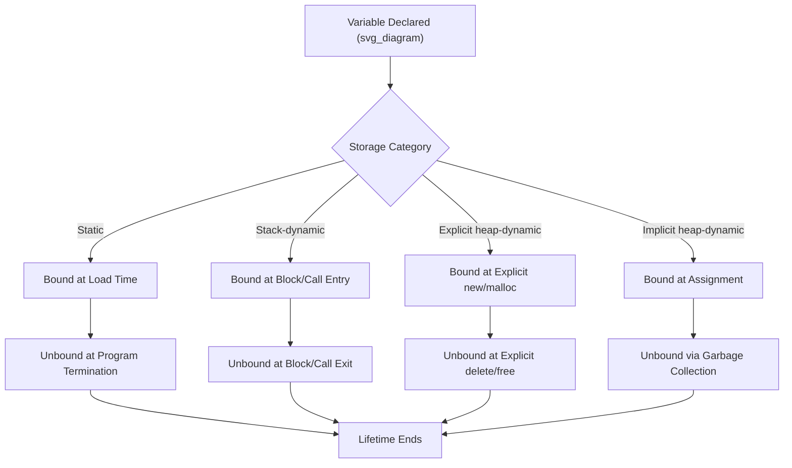

## Storage Bindings and Variable Lifetime

### Overview

The binding of a variable to a specific area of memory is called its **storage binding**, and the period during which that binding persists is the variable's **lifetime**. These two concepts are inseparable: lifetime is defined *in terms of* the storage binding. This topic classifies variables into four storage categories based on how and when their storage bindings are created and destroyed, and examines the mechanisms — stacks and heaps — that implement them.

### The Core Distinction: Lifetime vs. Scope

**Key Points**
- Lifetime is a runtime concept: the actual time during execution that a variable is bound to a particular memory cell.
- Scope is a compile-time, textual concept: the range of statements in the program's source code over which the variable's name is visible.
- These two concepts frequently correlate but are not identical — a variable can be in scope without currently having live storage, and storage-binding behavior varies independently of the textual region in which a name is valid.

### Category 1: Static Variables

**Definition**
A static variable is bound to a single memory cell for the entire execution of the program.

**Example**
```c
static int callCount = 0;   // bound once; persists for the whole program run
int globalTotal;             // C globals are also static by default
```

**Key Points**
- Storage is typically allocated at load time, before execution begins, in a fixed data segment.
- **Advantages**: efficiency (no allocation/deallocation overhead at runtime), and the value persists reliably across function calls — useful for counters or accumulated state.
- **Disadvantages**: no support for recursion (a static variable cannot have multiple simultaneous instances), and the memory remains allocated for the program's entire run even when the variable is not being used.

### Category 2: Stack-Dynamic Variables

**Definition**
Storage bindings for stack-dynamic variables are created when their declaration is elaborated at runtime (i.e., when execution reaches the declaration or enters the enclosing block/subprogram), and are destroyed when that block or subprogram is exited.

**Example**
```java
void process() {
    int localTotal = 0;   // storage allocated when process() is called
    // ... uses localTotal ...
}   // storage deallocated when process() returns
```

**Key Points**
- Storage is managed on a runtime stack: each call frame (activation record) allocates space for its local stack-dynamic variables and pops that space off when the call returns.
- **Advantages**: naturally supports recursion, since each active call gets its own fresh storage; memory is reclaimed automatically and promptly when the block exits.
- **Disadvantages**: [Inference] allocation/deallocation, though typically cheap (a stack-pointer adjustment), still occurs on every call, and values do not persist between separate calls, so state cannot be retained across invocations without an alternative mechanism.

### Category 3: Explicit Heap-Dynamic Variables

**Definition**
Explicit heap-dynamic variables are allocated and deallocated by explicit run-time directives, specified by the programmer, and are referenced only through pointer or reference variables.

**Example**
```c++
int* p = new int(5);   // explicit allocation directive
// ... use *p ...
delete p;                // explicit deallocation directive
```
```python
# Python objects created via constructors are explicit heap-dynamic,
# though deallocation is handled by garbage collection rather than
# an explicit programmer directive
node = Node(value=5)
```

**Key Points**
- **Advantages**: allows dynamic data structures (linked lists, trees) whose size is not known until runtime, and storage lifetime is fully under programmer control.
- **Disadvantages**: manual management (in languages like C++) introduces the risk of memory leaks (forgetting to deallocate) and dangling pointers (deallocating while a reference still exists).

### Category 4: Implicit Heap-Dynamic Variables

**Definition**
Implicit heap-dynamic variables are bound to heap storage only when they are assigned a value; the storage is allocated and reclaimed automatically by the runtime system, without any explicit directive from the programmer.

**Example**
```python
x = [1, 2, 3]      # list storage allocated implicitly on assignment
x = [1, 2, 3, 4, 5]  # old storage becomes eligible for reclamation implicitly;
                      # new storage allocated implicitly for the larger list
```

**Key Points**
- **Advantages**: offers maximum programmer flexibility, since data structures can change size and even type dynamically without any explicit storage management code.
- **Disadvantages**: [Inference] typically incurs greater runtime overhead than the other three categories, since the runtime system must track and manage storage continuously, including the cost of automatic reclamation (garbage collection).

### Storage Category Comparison

| Category | Allocation Trigger | Deallocation Trigger | Supports Recursion | Typical Language Example |
|---|---|---|---|---|
| Static | Load time | Program termination | No | C `static` variables |
| Stack-dynamic | Block/subprogram entry | Block/subprogram exit | Yes | Local variables in C, Java |
| Explicit heap-dynamic | Explicit directive (`new`) | Explicit directive (`delete`) or scope-based (RAII) | N/A | C++ `new`/`delete` |
| Implicit heap-dynamic | Assignment | Automatic (garbage collection) | N/A | Python, JavaScript variables |

### Storage Binding Lifecycle



### Conclusion

Storage binding and lifetime describe the runtime dimension of a variable's existence: when memory is claimed on its behalf and when that memory is given back. The four categories — static, stack-dynamic, explicit heap-dynamic, and implicit heap-dynamic — represent a spectrum from maximal efficiency and predictability (static) to maximal flexibility at the cost of runtime management overhead (implicit heap-dynamic). A language's choice of which categories to support, and which to make the default for ordinary variable declarations, is a defining characteristic of its overall design philosophy — contrast C's stack-dynamic-by-default locals against Python's implicit-heap-dynamic-by-default objects.

**Related Topics**
- Garbage collection algorithms (reference counting, mark-and-sweep, generational)
- Dangling pointers and memory leaks
- Activation records and runtime stack management
- Scope and the referencing environment
- RAII and deterministic resource management in C++