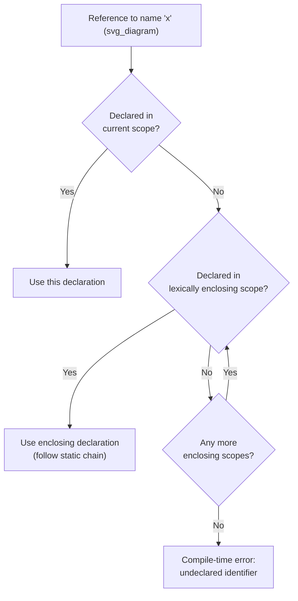
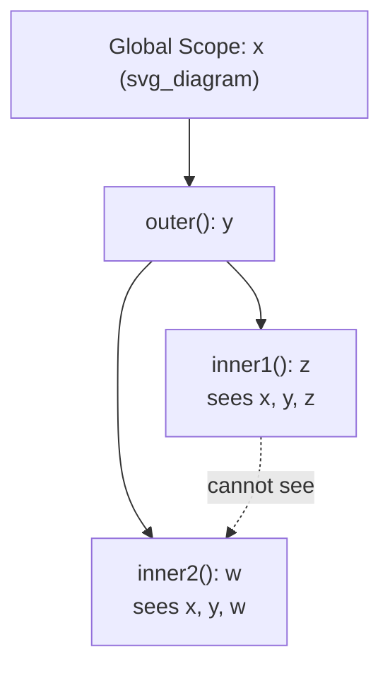

## Static Scope and Lexical Scoping Rules

### Overview

Scope is a compile-time, textual property that determines the region of a program's source code over which a given name binding is visible and usable. **Static scoping** — also called **lexical scoping** — is the most widely adopted scoping rule in modern languages, resolving a name based purely on the program's physical text, without regard to the runtime call sequence. This topic defines static scope precisely, walks through its resolution rules, and examines the mechanisms and consequences that follow from it.

### Definition of Static Scope

**Key Points**
- A variable's static scope is the range of program text in which the variable's name is visible.
- Under static scoping, the scope of a variable can be determined prior to execution, by examining the program's source code alone.
- The term "lexical" reflects that resolution depends on the lexical (textual) nesting of program blocks, not on which function called which at runtime.

**Example**
```python
x = "global"

def outer():
    x = "outer"
    def inner():
        print(x)   # resolves to "outer" — determined by textual nesting
    inner()

outer()   # prints: outer
```

### The Resolution Rule: Nearest Enclosing Scope

**Key Points**
- When a name is referenced, static scoping searches outward through the sequence of statically (lexically) enclosing scopes, starting with the current scope, and uses the first declaration found.
- This nested structure of enclosing scopes is often visualized as a chain, sometimes called the **static chain** or **scope chain**.

**Example — Nested Scope Chain**
```javascript
let a = 1;
function level1() {
    let b = 2;
    function level2() {
        let c = 3;
        console.log(a, b, c);  // a from global, b from level1, c from level2
    }
    level2();
}
level1();  // prints: 1 2 3
```

**Example — Shadowing**
When an inner scope declares a name that already exists in an outer scope, the inner declaration **shadows** (hides) the outer one for the remainder of the inner scope.

```java
int x = 10;
void method() {
    int x = 20;       // shadows the outer x
    System.out.println(x);  // prints 20
}
```

### Block Scoping vs. Subprogram-Level Scoping

**Key Points**
- Many languages extend static scoping down to the level of individual blocks (such as the body of an `if` or `for` statement), not just entire subprograms. This is called **block scoping**.
- Languages differ in the granularity at which new scopes are introduced.

**Example — Block Scoping in C**
```c
int x = 1;
{
    int x = 2;   // new nested block scope
    {
        int x = 3;   // yet another nested scope
        printf("%d", x);  // 3
    }
    printf("%d", x);  // 2
}
printf("%d", x);  // 1
```

**Example — JavaScript `let`/`const` vs. `var`**
```javascript
if (true) {
    let blockScoped = "visible only in this block";
    var functionScoped = "visible throughout the enclosing function";
}
console.log(functionScoped);  // accessible
console.log(blockScoped);     // ReferenceError: not accessible outside the block
```
This contrast [Unverified — exact browser/engine error message text may vary] illustrates that `let` and `const` introduce true block scope, while `var` does not respect block boundaries and is instead scoped to the nearest enclosing function.

### The Static Chain Mechanism

**Key Points**
- At the implementation level, one common technique for resolving non-local references under static scoping is the **static chain**: each subprogram activation record contains a pointer to the activation record of its statically enclosing subprogram.
- To resolve a reference to a non-local variable, the runtime follows the static chain outward the appropriate number of levels (determined at compile time) until it reaches the activation record where the variable was declared.

**Example**
```pascal
procedure outer;
  var x: integer;
  procedure inner;
  begin
    x := 5;   { resolved by following the static chain one level up to outer's frame }
  end;
begin
  inner;
end;
```

### Consequences of Static Scoping

**Key Points**
- **Advantage**: because scope is determined at compile time from the program text alone, static scoping makes programs significantly easier to read and reason about — a reader can determine which declaration a name refers to just by examining the surrounding code, without tracing the program's execution.
- **Advantage**: static scoping enables compile-time detection of undeclared or out-of-scope variable references.
- **Trade-off**: static scoping can make it awkward to access variables that are "close" during execution but textually distant, since the only path to a non-local variable is through the chain of lexically enclosing scopes — this is part of the motivation behind the alternative rule, dynamic scoping, examined separately.

### Static Scope Resolution Diagram



### Static Scope vs. Textual Nesting Example



### Conclusion

Static (lexical) scoping resolves every name reference according to the program's textual structure, using the nearest enclosing declaration found by searching outward through the chain of lexically containing blocks and subprograms. Because this resolution can be performed entirely from the source code, without executing the program, static scoping supports strong compile-time reasoning, predictable behavior, and early detection of scope-related errors. It is the dominant scoping rule in essentially all major contemporary languages, including C, C++, Java, C#, Python, and JavaScript, though these languages differ in the granularity — block-level versus subprogram-level — at which new static scopes are introduced.

**Related Topics**
- Dynamic scoping and its contrast with static scoping
- The static chain and activation record implementation
- Closures and how they capture lexical scope
- Referencing environments
- Named constants and their scope rules