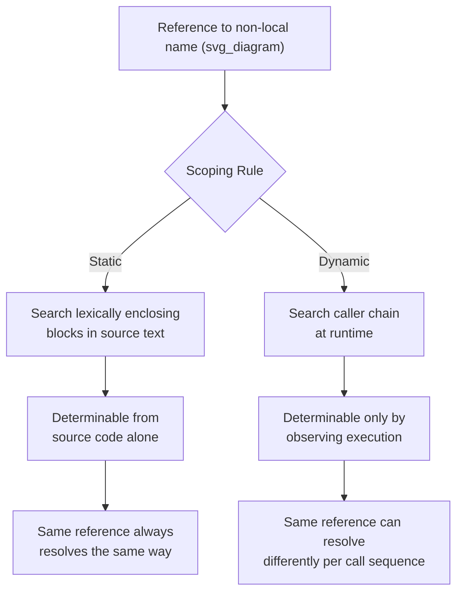

## Dynamic Scope and Its Implications

### Overview

Dynamic scoping is an alternative to static scoping in which a name reference is resolved based on the sequence of subprogram *calls* that led to the current point of execution, rather than on the program's textual nesting. Under dynamic scope, the same reference in the same line of source code can resolve to different declarations depending on how the enclosing subprogram was invoked. This topic defines dynamic scope, contrasts it directly with static scope, and examines its consequences for readability, implementation, and practical use.

### Definition of Dynamic Scope

**Key Points**
- A variable's dynamic scope is determined by the flow of execution — specifically, by the chronological chain of subprogram calls that are currently active — rather than by the physical layout of the program text.
- Under dynamic scoping, a reference to a non-local name is resolved by searching outward through the **call chain**: first the caller of the current subprogram, then the caller of that caller, and so on, using the most recent still-active declaration found.
- Because the applicable call chain can differ from one execution to the next, the scope of a variable under dynamic scoping generally cannot be determined by reading the source code alone; it can only be determined by observing execution.

### Contrast with Static Scope

**Example**
```
var x

sub first()
    print x
end sub

sub second()
    x = 1
    first()
end sub

sub third()
    x = 2
    first()
end sub

second()   ! calls first(); under dynamic scope, prints 1
third()    ! calls first(); under dynamic scope, prints 2
```

Under **static scoping**, `x` inside `first` would resolve to whatever `x` is declared in `first`'s lexically enclosing scope — fixed regardless of who calls `first`. Under **dynamic scoping**, `x` inside `first` resolves to the most recent active binding of `x`, which depends on whether `second` or `third` called `first`, so the very same statement in `first` produces different results on different calls.

### Historical and Practical Examples

**Key Points**
- Dynamic scoping was used in early versions of the language APL, and it is the scoping rule used for local variables in most implementations of Lisp's ancestor, particularly early Lisp dialects such as the original Lisp and early Common Lisp special variables.
- [Inference] Dynamic scoping has become rare as a language's *default* scoping rule in mainstream programming; most contemporary general-purpose languages use static scoping exclusively for ordinary variables.
- A well-known partial exception is **Common Lisp**, which supports dynamic scoping explicitly for variables declared `special`, alongside static (lexical) scoping as the default for ordinary variables.

**Example — Perl's `local`**
Perl provides static scoping by default (`my`), but also offers an explicit mechanism, `local`, that gives a variable dynamic-scope-like behavior for the duration of the call chain:

```perl
our $x = "global";

sub inner {
    print "$x\n";
}

sub outer {
    local $x = "outer-local";
    inner();   # prints: outer-local — dynamic-style resolution via the call chain
}

outer();
print "$x\n";  # prints: global — restored after outer() returns
```

### Implications for Readability

**Key Points**
- The central drawback of dynamic scoping is that it substantially harms readability: to determine which declaration a non-local reference binds to, a reader must trace the actual sequence of calls that will occur at runtime, which cannot in general be determined from the text of the subprogram alone.
- This same property makes dynamic scoping [Inference] considerably more error-prone in large programs, since a change to an unrelated, distant part of the call chain can silently alter the meaning of a variable reference deep inside another subprogram.
- Because scope cannot be resolved from source text alone, dynamic scoping also complicates compile-time error detection for undeclared or mistyped variable references, since apparent errors may only manifest for certain call sequences.

### Implications for Implementation

**Key Points**
- Because resolution follows the call chain rather than the lexical chain, dynamic scoping is commonly implemented by searching backward through the runtime **call stack** (the sequence of active subprogram activation records), rather than through a static chain of lexically enclosing frames.
- An alternative implementation technique uses a **central table of active bindings**, in which each variable name maps to a stack of currently active bindings; entering a subprogram pushes a new binding, and exiting pops it, with the top of each name's binding stack always representing the currently visible one.

### Where Dynamic Scope Still Appears

**Key Points**
- Dynamic-scope-like behavior remains useful in specific, contained contexts, such as configuration or context variables that should apply throughout a call chain without being explicitly threaded as parameters through every intermediate function.
- Examples include Common Lisp's `special` variables for dynamically scoped configuration state, and analogous "dynamic binding" utilities found in some other Lisp-family languages, used deliberately and sparingly rather than as the default rule for all variables.

### Static vs. Dynamic Scope Resolution Compared



### Summary Comparison

| Aspect | Static Scope | Dynamic Scope |
|---|---|---|
| Resolution basis | Lexical/textual nesting | Runtime call chain |
| Determinable from source alone | Yes | No |
| Readability | [Inference] Generally higher | [Inference] Generally lower |
| Compile-time error detection | Supported | Complicated |
| Typical usage today | Default in nearly all mainstream languages | Rare; opt-in for special cases (e.g., Common Lisp `special`) |
| Historical example | Algol-descended languages | Early APL, early Lisp |

### Conclusion

Dynamic scoping resolves non-local references according to the chronological chain of active subprogram calls rather than the program's lexical structure, making a variable's binding a function of *how* a subprogram was reached rather than *where* it is written. While this offers a convenient way to pass context implicitly through a call chain without explicit parameters, it substantially undermines readability and static error detection, since the same reference can resolve differently depending on runtime call history. For these reasons, dynamic scoping has largely been abandoned as a default rule in mainstream language design, surviving mainly as an explicit, opt-in feature — as in Common Lisp's `special` variables — for the narrow cases where its context-passing convenience outweighs its readability cost.

**Related Topics**
- Static (lexical) scope and the static chain
- Common Lisp special variables and dynamic binding
- Referencing environments
- Closures and lexical capture
- Implicit parameter passing patterns as alternatives to dynamic scope