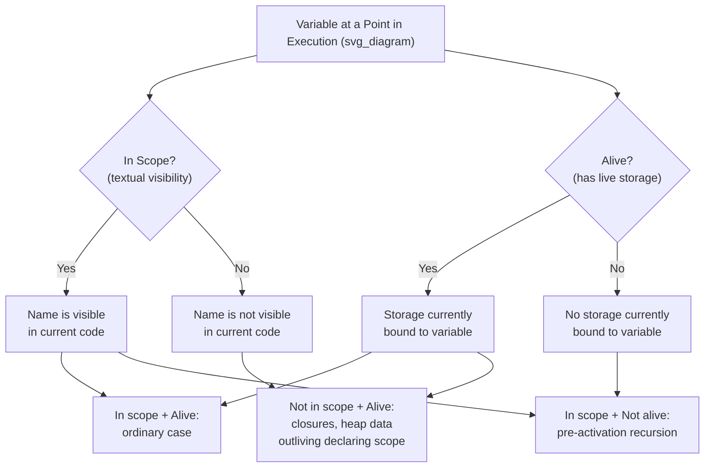

## Scope and Lifetime Distinctions

### Overview

Scope and lifetime are two of the most frequently conflated concepts in language design, because they usually coincide for ordinary local variables. Scope is a **compile-time, textual** property describing where in the source code a name is visible. Lifetime is a **runtime, temporal** property describing when a variable is bound to storage during execution. This topic isolates the two concepts explicitly and works through the cases in which they diverge.

### Restating the Two Definitions

**Scope**
The scope of a variable is the range of statements in the program's source text over which the variable's name is visible and can be referenced.

**Lifetime**
The lifetime of a variable is the time during program execution in which the variable is bound to a particular memory cell.

**Key Points**
- Scope answers: *"Where in the code can this name be used?"*
- Lifetime answers: *"When during execution does this variable actually have live storage?"*
- One is a static property of program text; the other is a dynamic property of program execution.

### The Common Case: Scope and Lifetime Coincide

For an ordinary stack-dynamic local variable, scope and lifetime happen to align closely, which is why the two concepts are often blurred together.

```java
void method() {
    int x = 5;   // scope begins here; storage also allocated here
    // ... x is both in scope and alive ...
}   // scope ends here; storage also deallocated here
```

In this typical case, `x` is visible exactly during the interval it is alive. This overlap is common enough that it can obscure the fact that the two properties are conceptually distinct — and several other cases make the distinction explicit.

### Divergence Case 1: In Scope but Not Alive

A variable can be lexically in scope at a point in the program text while having no live storage bound to it at that moment during a particular execution.

**Example — Recursion Before First Call**
```c
int factorial(int n) {
    int result;   // 'result' is in scope for the whole function body,
                   // but before factorial() is ever called, there is no
                   // storage bound to this instance of 'result' at all —
                   // its storage only comes into existence per-activation
    if (n <= 1) return 1;
    result = n * factorial(n - 1);
    return result;
}
```
Before `factorial` is called, `result` is not alive anywhere, even though it is a declared, in-scope name within the function body as written.

**Example — Uninitialized but Allocated**
```c
void demo() {
    int x;         // storage allocated (alive) here, in stack-dynamic terms,
                    // but x's scope, as far as visibility, spans the whole block
    printf("%d", x);  // legal reference (in scope), but value is indeterminate —
                        // illustrates storage existing without meaningful value,
                        // a related but distinct subtlety from scope/lifetime itself
}
```

### Divergence Case 2: Alive but Not in Scope

A variable can retain live storage — its value persists in memory — even at a point in the program text where its name is no longer visible, because some other mechanism keeps the storage alive beyond the textual region where the name applies.

**Example — Closures**
```javascript
function makeCounter() {
    let count = 0;          // count's scope is the body of makeCounter
    return function() {
        count = count + 1;   // this inner function captures count
        return count;
    };
}

const counter = makeCounter();
// makeCounter() has returned; 'count' is no longer in scope anywhere
// in the surrounding code that called makeCounter — yet its storage
// is still alive, kept alive by the closure returned and referenced by 'counter'
console.log(counter());  // 1
console.log(counter());  // 2
```
Here, `count` remains alive — bound to storage, retaining its value across calls — well after the textual scope in which it was declared has been exited by the calling code. The closure mechanism keeps the storage alive precisely because a reference to it still exists, even though no visible name for it exists in the calling scope.

**Example — Heap-Allocated Data Outliving Its Declaring Scope**
```c++
int* makeValue() {
    int local = 42;
    int* p = new int(local);  // heap storage: its lifetime is independent
                                // of 'local' and of this function's scope
    return p;
}
// The name 'p' and 'local' both go out of scope when makeValue() returns,
// but the heap-allocated int that p pointed to remains alive —
// referenced by whatever variable receives the returned pointer
```

### Divergence Case 3: Static Variables Inside Local Scope

A `static` local variable is textually scoped to its enclosing function, but its lifetime spans the entire program execution — the lifetime vastly outlasts any single entry into the scope.

```c
void counter() {
    static int calls = 0;   // scope: only visible inside counter()
    calls++;                 // lifetime: spans the entire program run,
    printf("%d\n", calls);   // persisting across every call, not just this one
}
```
`calls` is in scope only within `counter`, yet it is alive for the program's entire execution — including all the time between calls, when `counter` is not even executing and its scope is not "active" in any runtime sense.

### Summary Table

| Case | In Scope? | Alive (Has Storage)? | Example |
|---|---|---|---|
| Ordinary local variable | Yes, within block | Yes, during block execution | `int x` in a typical function |
| Local variable before first call | Yes (textually) | No (no activation yet) | `result` in `factorial` before any call |
| Variable captured by a closure | No, after enclosing call returns | Yes, kept alive by the closure | `count` in `makeCounter` |
| Heap object after pointer's declaring scope ends | No | Yes, until deallocated | `new int(local)` returned by `makeValue` |
| `static` local variable outside its calls | No, outside the function body | Yes, for the whole program | `calls` in `counter` |

### Scope and Lifetime as Independent Axes



### Conclusion

Scope and lifetime describe two entirely different axes of a variable's existence: scope is fixed by the program's textual structure and can be determined by reading the source code, while lifetime is determined by the sequence of events that actually occur during a specific execution. They coincide for the common case of an ordinary stack-dynamic local variable, which is why the distinction is easy to overlook — but closures, heap-allocated data that outlives its declaring pointer's scope, static local variables, and variables referenced before their first activation all demonstrate that a variable can be alive without being in scope, or in scope without being alive. Recognizing this distinction is essential for reasoning correctly about memory safety, closures, and the behavior of static storage.

**Related Topics**
- Closures and how they extend a variable's lifetime beyond its lexical scope
- Storage bindings and the four lifetime categories (static, stack-dynamic, explicit/implicit heap-dynamic)
- Dangling references and memory safety
- Activation records and the runtime stack
- Garbage collection and reachability-based lifetime extension