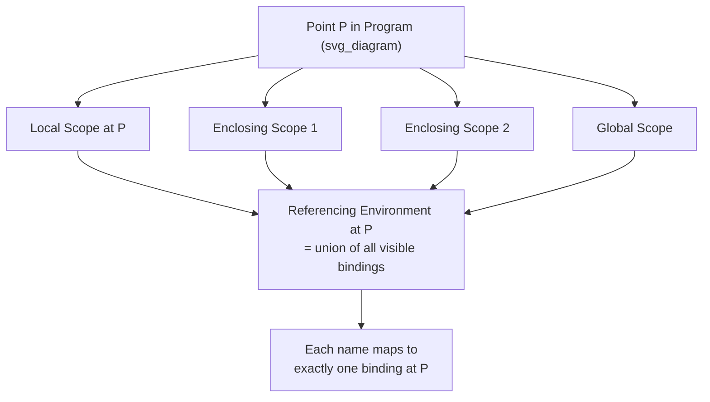

## Referencing Environments

### Overview

A **referencing environment** is the complete collection of all names that are visible at a particular point in a program, along with the specific variable each name is bound to at that point. While scope describes visibility for a single variable across the program text, the referencing environment describes the *entire set* of visible bindings at one specific location in the code — a more complete, situated view that pulls together every currently applicable scope simultaneously.

### Formal Definition

**Key Points**
- The referencing environment of a statement is the collection of all names that are visible at that point in the program, together with their current bindings.
- In a language with static scoping, the referencing environment at any given statement is formed by the local scope of the statement's immediately enclosing subprogram or block, plus the referencing environments contributed by all of its statically enclosing scopes, out to the global scope.

**Example**
```python
x = "global"

def outer():
    y = "outer"
    def inner():
        z = "inner"
        # Referencing environment of this line includes:
        #   z  (local to inner)
        #   y  (from outer, statically enclosing)
        #   x  (from global, statically enclosing)
        print(x, y, z)
    inner()

outer()
```
At the marked point inside `inner`, the referencing environment is `{z, y, x}` — the union of the local scope and every lexically enclosing scope, each contributing its own visible names.

### Referencing Environments Under Static Scope

**Key Points**
- Under static scoping, the referencing environment at a given point is determined entirely by the program's textual nesting structure and can be computed at compile time.
- As execution moves into a nested block or subprogram, the referencing environment grows to include the new local scope layered on top of all enclosing scopes; as execution exits that block, the local names drop back out of the referencing environment.

**Example — Referencing Environment Changing With Block Structure**
```c
int a = 1;                 // env: {a}
void f() {
    int b = 2;              // env: {b, a}
    {
        int c = 3;           // env: {c, b, a}
    }                          // env reverts to: {b, a}
}                              // env reverts to: {a}
```

### Referencing Environments Under Dynamic Scope

**Key Points**
- Under dynamic scoping, the referencing environment at a given point in a subprogram's text is not fixed — it depends on the specific chain of calls that led to that point during a particular execution, so the same line of code can have a different referencing environment on different invocations.

**Example**
```
sub first()
    print x    ! referencing environment here depends on the caller
end sub

sub second()
    x = 1
    first()     ! referencing environment of the print in first() includes x from second()
end sub

sub third()
    x = 2
    first()     ! referencing environment of the print in first() includes x from third()
end sub
```
The referencing environment for the statement inside `first` is not a single fixed set; it shifts depending on whether `second` or `third` is the active caller.

### Referencing Environments and Closures

**Key Points**
- A closure is, precisely, a subprogram together with the referencing environment in which it was defined — captured and carried along even after execution leaves the scope in which that environment originally existed.
- This is what allows a closure to continue accessing names from its defining context even when called from a completely different referencing environment.

**Example**
```javascript
function makeAdder(x) {
    // referencing environment at this point includes x
    return function(y) {
        // this inner function's captured referencing environment
        // includes x from makeAdder, even after makeAdder has returned
        return x + y;
    };
}

const add5 = makeAdder(5);
console.log(add5(3));  // 8 — x=5 is still part of the referencing environment
                         // carried by the closure, regardless of where add5 is called
```

### Referencing Environment vs. Scope: A Direct Comparison

**Key Points**
- Scope is a property of a single variable: the range of program text over which that one name is visible.
- A referencing environment is a property of a single point in the program: the complete set of all variables (and their bindings) visible at that point, drawn from every applicable scope simultaneously.
- Every point in a program has exactly one referencing environment; every declared variable has exactly one scope. The two concepts describe the same underlying visibility rules from complementary directions — one variable-centered, one location-centered.

### Referencing Environment Composition



### Conclusion

The referencing environment generalizes the concept of scope from a single variable's visibility to the complete, situated set of all bindings accessible at one point in a program. Under static scoping, this environment is fully determined by lexical nesting and can be computed before execution; under dynamic scoping, it depends on the runtime call chain and can vary across executions of the same line of code. The referencing environment is also the concept that makes closures precise: a closure is formally the pairing of a function with the referencing environment captured at its point of definition, which is why that function continues to see those bindings no matter where it is later invoked.

**Related Topics**
- Closures as captured referencing environments
- Static scope and the static chain
- Dynamic scope and the call chain
- Scope and lifetime distinctions
- Nested subprograms and block structure