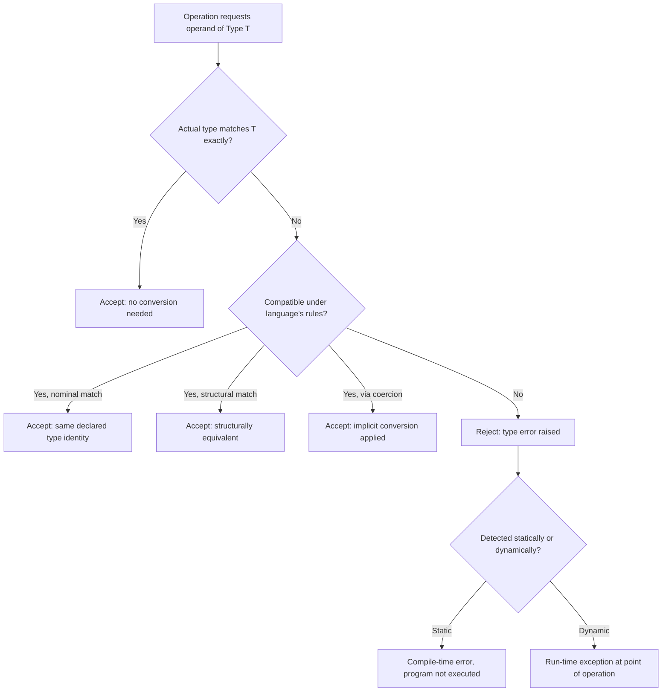

## Type Checking and Type Compatibility

### Definition

Type checking is the process by which a language processor verifies that the operations performed within a program are applied to operands of types the language permits, either rejecting the program (or a portion of it) or coercing/converting operands to make the operation valid. Type compatibility is the underlying rule set that determines whether a given type is acceptable in a context expecting another type — for example, whether an actual parameter's type is acceptable for a formal parameter, or whether the right-hand side of an assignment is acceptable for the left-hand side's declared type.

### Static vs. Dynamic Type Checking

**Key Points**

- **Static type checking** occurs at compile time, before the program runs, by analyzing the program's text and declared or inferred types.
- **Dynamic type checking** occurs at run time, by inspecting the actual type of a value immediately before performing an operation on it.
- A language may be **statically typed**, **dynamically typed**, or use a hybrid approach where some checks are static and others are deferred to runtime.
- Static checking catches type errors before execution, at the cost of sometimes rejecting programs that would have executed correctly (over-conservative rejection). Dynamic checking permits more flexibility but defers error discovery to execution, when a type error may occur deep into a long-running process.

In a statically typed language such as Java or C, the following would be rejected before the program ever runs:

```java
int x = "hello"; // compile-time type error
```

In a dynamically typed language such as Python, the equivalent kind of error is only detected when the offending line actually executes:

```python
def add_one(x):
    return x + 1

add_one("hello")  # raises TypeError only when this line runs
```

### Type Checking and Coercion

When an operand's type does not exactly match what an operator or context expects, some languages perform an automatic, implicit conversion known as coercion rather than rejecting the program. Coercion rules are part of a language's type compatibility policy.

```c
int i = 5;
double d = 2.5;
double result = i + d; // i is coerced to double before addition
```

**Key Points**

- Coercion trades strictness for convenience: fewer explicit conversions are required in source code.
- Excessive or poorly designed coercion rules can mask genuine programmer errors, since an operation that should have been a type error instead silently produces a (possibly nonsensical) result.
- Languages differ widely in how permissive their coercion rules are; JavaScript's `==` operator is a widely cited example of coercion producing results that surprise many programmers, such as `"5" == 5` evaluating to `true`.

### Type Compatibility Models

**Nominal (Name) Compatibility**

Two types are compatible only if they share the same declared name/type identity, regardless of whether their structures are identical.

```java
class Meters { double value; }
class Seconds { double value; }
// Even though structurally identical, Meters and Seconds are NOT
// interchangeable in a nominally typed language.
```

**Structural Compatibility**

Two types are compatible if their structures (the shape of their members, fields, or signatures) match, regardless of the name given to the type.

```typescript
interface Point { x: number; y: number; }
interface Coordinate { x: number; y: number; }

let p: Point = { x: 1, y: 2 };
let c: Coordinate = p; // legal: structurally identical
```

[Inference] The choice between nominal and structural compatibility is a significant language design decision affecting refactoring safety: nominal typing prevents accidental interchangeability of semantically distinct but structurally similar types, while structural typing reduces boilerplate for languages that favor duck-typing-like flexibility within a static system.

### Type Equivalence

Type equivalence is a stricter, related concept asking whether two type expressions denote literally the same type (as opposed to merely compatible types that can substitute for one another in some context).

- **Name equivalence:** Two types are equivalent only if they have the same name/declaration.
- **Structural equivalence:** Two types are equivalent if their structures are identical, field-for-field, down to base types.

Ada is a well-documented case of a language using name equivalence strictly enough that two `type` declarations with identical underlying structure are still considered distinct, incompatible types unless one is declared as a subtype of the other:

```ada
type Meters is new Integer;
type Seconds is new Integer;
-- Meters and Seconds are distinct types despite identical representation
```

### Visual: Type Compatibility Decision Flow



### Type Checking of Composite Operations

Type checking extends beyond simple variable assignment to cover:

- **Expressions:** verifying that operand types are valid for each operator (e.g., `+` may be valid for numeric types and, in some languages, overloaded for strings, but invalid for a boolean and a record).
- **Function/procedure calls:** verifying that the number and types of actual arguments match the formal parameter list (or an applicable overload).
- **Assignment statements:** verifying that the right-hand side's type is compatible with the left-hand side's declared or inferred type.
- **Return statements:** verifying that a returned expression's type matches the function's declared return type.

### Strong vs. Weak Typing

**Key Points**

- **Strong typing** refers to a language's tendency to disallow or tightly restrict operations between incompatible types, whether checked statically or dynamically.
- **Weak typing** refers to a language's tendency to permit implicit conversions liberally, sometimes producing results from operations on seemingly incompatible types.
- These terms are informal and used inconsistently across the literature; they do not map cleanly onto the static/dynamic axis. Python is dynamically typed but considered strongly typed (it will not implicitly convert a string and an integer in addition), whereas C is statically typed but considered comparatively weakly typed (it permits many implicit numeric conversions and pointer/integer interactions).

[Unverified: precise, universally agreed-upon definitions of "strong" and "weak" typing do not exist in the programming language theory literature; usage varies by author and community.]

### Type Checking in Polymorphic and Generic Contexts

Languages supporting generics or parametric polymorphism must type-check code before the specific type parameter is known, verifying that operations used within a generic body are valid for *any* type satisfying the declared constraints, rather than for one concrete type.

```typescript
function identity<T extends { length: number }>(arg: T): number {
  return arg.length; // valid for any T guaranteed to have a .length property
}
```

This form of checking ensures type safety is preserved uniformly across all valid instantiations of the generic, without requiring the implementation to be re-checked for every concrete type it is later used with.

### Consequences of Type Checking Strategy

**Key Points**

- Static type checking generally enables earlier error detection, better IDE tooling (autocomplete, refactoring safety), and can enable compiler optimizations based on known types.
- Dynamic type checking generally enables faster iteration during development and more flexible, duck-typing-oriented code patterns, at the cost of type errors surfacing only when the relevant code path executes.
- Some languages (TypeScript, Python with type hints, Ada with runtime constraint checks) blend static analysis with runtime checks to capture benefits of both strategies. [Inference] This hybridization reflects an industry trend toward gradual typing as a practical compromise rather than a strict either/or choice.

### Conclusion

Type checking and type compatibility together define how strictly and at what point a language enforces the rule that operations apply only to sensible operand types. The static/dynamic axis determines *when* violations are caught; the nominal/structural axis determines *how* the language decides whether two differently-named or differently-declared types may be used interchangeably; and coercion rules determine how much implicit bridging occurs between types that are related but not identical. These three dimensions, taken together, shape a language's overall type safety profile and heavily influence its debugging experience, tooling quality, and suitability for large-scale or safety-critical software.

**Related Topics**

- Type inference algorithms
- Type equivalence (name vs. structural, revisited in depth)
- Parametric polymorphism and generic type constraints
- Gradual typing and optional static typing (TypeScript, Python type hints)
- Overload resolution and function/operator overloading
- Duck typing and dynamic dispatch
- Type coercion rules across specific languages