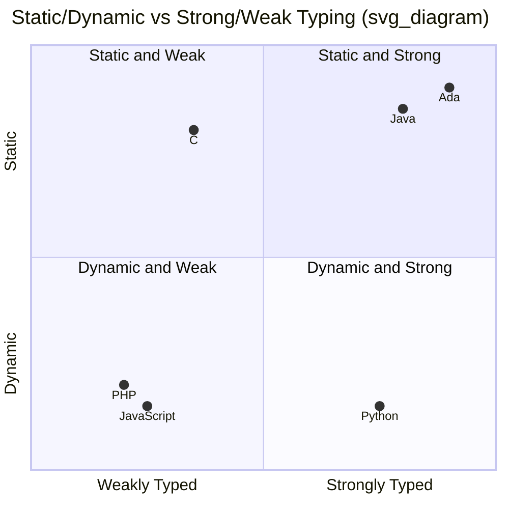

## Strong Typing Versus Weak Typing

### Definition

Strong typing and weak typing describe a language's tendency to restrict or permit operations between values of incompatible or mismatched types. A strongly typed language enforces strict rules about which type combinations are allowed in an operation, generally disallowing implicit conversions that could silently produce a nonsensical or unintended result. A weakly typed language permits looser rules, often performing implicit conversions between otherwise incompatible types so an operation can proceed rather than fail.

[Unverified: "strong" and "weak" typing are informal, contested terms without a single agreed-upon technical definition in the programming language theory literature. Different authors and communities apply them inconsistently, and some language designers avoid the terms altogether in favor of more precise properties such as type soundness, coercion rules, or static/dynamic checking.]

### Independence from the Static/Dynamic Axis

**Key Points**

- Strong/weak typing is often conflated with static/dynamic typing, but the two are independent dimensions.
- Static/dynamic describes *when* type checking occurs (compile time vs. run time).
- Strong/weak describes *how strictly* type mismatches are handled once checking (at whichever time) is performed.
- A language can occupy any combination of the two axes.



Note that the diagram above intentionally places languages that many practitioners would dispute the exact coordinates of — this reflects the inherent fuzziness of the strong/weak distinction rather than a precise, measurable ranking. [Speculation] Exact numeric placement of any language along a "strength" axis cannot be rigorously defended, since no standard metric exists; the diagram is illustrative of relative tendencies only.

### Examples of Weak Typing Behavior

**Example**

JavaScript is frequently cited as comparatively weakly typed because of its permissive implicit coercion rules, particularly with the `==` operator:

```javascript
"5" == 5        // true: string coerced to number
"" == 0         // true: empty string coerced to number
null == undefined // true: special-cased loose equality
[] + []         // "" : arrays coerced to strings and concatenated
[] + {}         // "[object Object]" : mixed coercion
```

These behaviors arise from JavaScript's abstract equality comparison algorithm, which applies a sequence of type conversion rules before comparing values, rather than rejecting the comparison outright when operand types differ.

PHP similarly performs extensive implicit conversion in many contexts, historically including comparisons between numeric strings and integers that produced results many developers considered surprising, which motivated the introduction of a stricter comparison operator and later changes to PHP's own comparison semantics in more recent versions.

C is often described as comparatively weakly typed relative to other statically typed languages because it permits many implicit numeric conversions, permits pointers to be cast to integers and back, and historically allowed implicit conversion between pointer types with only a compiler warning rather than an error:

```c
int x = 5;
float y = x;      // implicit int-to-float conversion, no complaint
char *p = (char *)100; // integer reinterpreted as a pointer, permitted with a cast
```

### Examples of Strong Typing Behavior

**Example**

Python is dynamically typed but widely regarded as strongly typed because it refuses to implicitly convert between fundamentally unrelated types, raising a runtime exception instead:

```python
"5" + 5          # TypeError: cannot mix str and int with +
```

Ada is both statically and strongly typed, requiring explicit conversion functions even between numerically similar types that share an underlying representation:

```ada
Meters : Integer := 10;
Seconds : Float := Float(Meters); -- explicit conversion required
```

Java requires explicit casting for narrowing numeric conversions and disallows many implicit conversions between unrelated reference types, though it does still perform some automatic widening conversions (e.g., `int` to `long`) that a maximally strict definition of "strong" might consider a weak-typing behavior:

```java
long l = 5;        // implicit widening, permitted
int i = (long) 5L;  // narrowing requires explicit cast in the reverse direction
```

[Inference] The fact that Java permits implicit widening numeric conversions while still being broadly labeled "strongly typed" illustrates that the strong/weak distinction is a matter of degree rather than a binary property; most practical languages sit somewhere along a spectrum rather than at either extreme.

### Consequences for Program Correctness

**Key Points**

- Stronger typing tends to surface type-related mistakes earlier and more loudly, since fewer operand combinations are silently "fixed up" by the language.
- Weaker typing tends to allow programs to keep executing through type mismatches, which can be convenient for rapid, informal scripting but can also mask genuine logic errors that a stricter language would have flagged.
- The practical safety benefit of strong typing depends heavily on the surrounding tooling (linters, static analyzers, test coverage) in dynamically-but-strongly typed languages, since strong typing alone only prevents *silent* type coercion — it does not prevent type errors from occurring, only from being silently papered over.

A commonly cited illustrative failure mode in weakly typed contexts is unintended string concatenation replacing intended numeric addition when user input (which often arrives as a string) is combined with a numeric constant without explicit conversion:

```javascript
function addTax(price, taxRate) {
  return price + taxRate; // if price is "100" (a string) due to form input,
}                          // this silently concatenates instead of adding
addTax("100", 0.08); // "1000.08" instead of 108
```

A strongly typed language, whether checked statically or dynamically, would reject or flag this operation rather than silently producing a plausible-looking but incorrect string.

### Strength of Typing and Type Safety

Strong typing is related to, but distinct from, the formal notion of type safety (or type soundness) used in programming language theory, which concerns whether a language's type system guarantees that well-typed programs cannot exhibit certain classes of undefined behavior at runtime. A language can be informally "strongly typed" in the colloquial sense used by practitioners while still permitting operations that formal type theory would consider unsafe, and conversely, formal soundness proofs are typically discussed independently of the informal strong/weak vocabulary.

[Unverified: the precise relationship between colloquial "strong typing" and formal type soundness is not standardized, and different sources draw the boundary differently.]

### Language Positioning Summary

| Language | Static/Dynamic | Colloquial Strength | Notable Behavior |
| --- | --- | --- | --- |
| Ada | Static | Strong | Requires explicit conversions even between related numeric types |
| Java | Static | Strong (with implicit widening) | Implicit numeric widening permitted; narrowing requires a cast |
| C | Static | Comparatively weak | Permissive implicit numeric and pointer conversions |
| Python | Dynamic | Strong | Refuses implicit conversion between unrelated types (e.g., str + int) |
| JavaScript | Dynamic | Comparatively weak | Extensive implicit coercion, especially via `==` |
| PHP | Dynamic | Comparatively weak (historically) | Implicit numeric string comparisons; behavior has evolved across versions |

### Conclusion

Strong versus weak typing describes a language's philosophy toward implicit type conversion: whether mismatched types are treated as an error to be surfaced, or as a situation to be silently resolved through coercion so execution can continue. This dimension is orthogonal to whether checking happens statically or dynamically, and unlike that more precisely defined axis, the strong/weak distinction remains an informal, graded spectrum without a rigorous, universally accepted definition. In practice, a language's position along this spectrum has direct consequences for how early and how loudly type-related mistakes are surfaced to the programmer.

**Related Topics**

- Type coercion and implicit conversion rules
- Type checking and type compatibility (static vs. dynamic)
- Type safety and type soundness in formal language theory
- Equality operators and comparison semantics across languages
- Gradual typing and optional type annotations
- Duck typing and structural typing