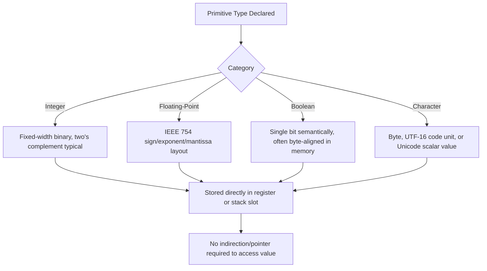

## Primitive Data Types

### Definition

A primitive data type is a data type built directly into a programming language rather than being composed from other types. Primitive types are typically implemented directly in hardware or in a minimal runtime layer, giving them efficient, predictable representations in memory. They form the foundational building blocks from which composite and abstract data types (arrays, records, classes) are constructed.

### Common Categories of Primitive Types

**Key Points**
- **Integer types** represent whole numbers, typically with fixed bit-widths determining their range.
- **Floating-point types** represent approximations of real numbers using a format such as IEEE 754.
- **Boolean types** represent the two logical truth values.
- **Character types** represent single textual symbols, historically ASCII-based, increasingly Unicode-based.
- Some languages also treat additional types (such as complex numbers, or a language-specific string type) as primitive, though string is more commonly implemented as a composite type internally even when it behaves like a primitive at the language's surface syntax level.

### Integer Types

Integer types differ across languages primarily in bit-width, signedness, and overflow behavior.

```c
int8_t   a;  // 8-bit signed
uint8_t  b;  // 8-bit unsigned
int32_t  c;  // 32-bit signed
uint64_t d;  // 64-bit unsigned
```

**Key Points**
- **Bit-width** determines the representable range; an unsigned 8-bit integer represents $0$ to $2^8 - 1 = 255$, while a signed 8-bit integer using two's complement represents $-2^7$ to $2^7 - 1$, i.e., $-128$ to $127$.
- **Overflow behavior** varies: C's unsigned integer overflow wraps around by definition (modulo arithmetic), while C's signed integer overflow is undefined behavior per the language standard. Other languages, such as Python, use arbitrary-precision integers that grow as needed and therefore never overflow in the traditional sense.
- Languages such as Java specify fixed-width integer types (`byte`, `short`, `int`, `long`) with precisely defined signed two's-complement wraparound behavior on overflow, removing the undefined-behavior ambiguity present in C.

### Floating-Point Types

Floating-point types approximate real numbers using a sign, exponent, and mantissa (significand), most commonly following the IEEE 754 standard.

$$\text{value} = (-1)^{\text{sign}} \times 1.\text{mantissa} \times 2^{\text{exponent} - \text{bias}}$$

**Key Points**
- **Single precision** (`float` in many languages) typically uses 32 bits: 1 sign bit, 8 exponent bits, 23 mantissa bits.
- **Double precision** (`double`) typically uses 64 bits: 1 sign bit, 11 exponent bits, 52 mantissa bits.
- Floating-point representation is inherently approximate for most decimal fractions, since many decimal values (such as $0.1$) have no exact finite binary representation, leading to well-known comparison pitfalls:

```python
0.1 + 0.2 == 0.3  # False, due to floating-point rounding error
```

[Inference] This behavior is a direct, well-documented mathematical consequence of representing base-10 fractions in base-2 floating-point format, not a defect specific to any one language's implementation; the same phenomenon appears across virtually all IEEE 754–compliant languages.

### Boolean Type

The Boolean type represents the two truth values, typically `true` and `false`. Its internal representation and treatment varies:

- Languages such as Java, Python, and Ada treat Boolean as a genuinely distinct type, disallowing arithmetic operations on Boolean values without explicit conversion.
- C, prior to C99, had no dedicated Boolean type; the convention was to use `int`, where `0` represented false and any nonzero value represented true. C99 introduced `_Bool`, and C11 popularized the `bool` alias via `<stdbool.h>`.
- JavaScript and Python both allow non-Boolean values to be evaluated in a Boolean context (truthiness/falsiness), where certain values (`0`, `""`, `null`, `undefined`, `NaN`, `None`, empty containers) are treated as false-equivalent and most other values as true-equivalent.

### Character Type

**Key Points**
- Early languages (C, original Pascal) typically defined `char` as a single byte, sufficient for ASCII but not for representing the full range of Unicode code points.
- Modern languages increasingly use a character representation capable of holding a full Unicode code point; Java's `char` is a 16-bit UTF-16 code unit (which, notably, cannot alone represent code points outside the Basic Multilingual Plane without a surrogate pair), while languages such as Rust define `char` as a 32-bit value capable of holding any single Unicode scalar value.
- The distinction between a "character," a "code point," and a "grapheme cluster" (a user-perceived character, which may be composed of multiple code points, such as an emoji with a modifier) is a persistent source of subtle bugs when primitive character types are assumed to correspond one-to-one with what a human considers a single visible character.

### Primitive Types and Memory Representation



### Primitive vs. Reference/Composite Types

**Key Points**
- Primitive types are typically stored by value: assignment copies the actual bit pattern, and each variable holds an independent copy.
- Composite or reference types (objects, arrays in many languages) are typically stored by reference: assignment copies a reference/pointer, and multiple variables can refer to the same underlying data.
- This distinction has direct consequences for parameter passing, equality comparison (value equality vs. reference/identity equality), and mutation semantics.

```java
int a = 5;
int b = a;
b = 10;
// a is still 5: primitive int is copied by value

int[] arr1 = {1, 2, 3};
int[] arr2 = arr1;
arr2[0] = 99;
// arr1[0] is now 99: array is a reference type, both variables point to the same array
```

Java's design is notable for making a strict distinction between primitive types (`int`, `double`, `boolean`, `char`, etc., always stack-allocated value types) and their corresponding boxed reference-type wrappers (`Integer`, `Double`, `Boolean`, `Character`), which are heap-allocated objects used when a reference-type context (such as a generic collection) is required.

### Primitive Types in Statically vs. Dynamically Typed Languages

In statically typed languages, primitive types are usually explicit in variable declarations and are checked at compile time. In dynamically typed languages, values still carry an underlying primitive representation at runtime, but the language does not require (and often does not permit) declaring that representation in source code; the interpreter determines and, in many implementations, may even change the internal representation transparently.

```python
x = 5        # internally an int object
x = 5.0      # now internally a float object, same variable name, no error
```

[Inference] This flexibility in dynamically typed languages reflects that the "type" being tracked is a property of the runtime value rather than of the variable's declaration, whereas statically typed languages bind the type to the declaration itself and enforce it across all subsequent assignments to that variable.

### Language Comparison Table

| Language | Integer Sizes | Float Precision | Boolean | Char Representation |
|---|---|---|---|---|
| C | Implementation-defined widths; `<stdint.h>` for fixed widths | `float` (32-bit), `double` (64-bit) | `_Bool`/`bool` (C99+); historically `int` | 1 byte, typically ASCII/Latin-1 range |
| Java | `byte`, `short`, `int`, `long` — fixed, signed | `float` (32-bit), `double` (64-bit) | `boolean`, distinct type | `char`, 16-bit UTF-16 code unit |
| Python | Arbitrary-precision `int` | `float` (typically 64-bit, IEEE 754 double) | `bool`, distinct type (subclass of `int`) | No separate char type; single-character `str` |
| Rust | `i8`...`i128`, `u8`...`u128`, `isize`/`usize` | `f32`, `f64` | `bool`, distinct type | `char`, 32-bit Unicode scalar value |
| JavaScript | No separate int type; `Number` (IEEE 754 double); `BigInt` for arbitrary precision | `Number` (IEEE 754 double) | `Boolean`, distinct type, with truthiness rules | No separate char type; single-character `String` |

### Overflow, Underflow, and Precision Pitfalls

**Key Points**
- **Integer overflow:** occurs when an arithmetic result exceeds the representable range of a fixed-width integer type; behavior ranges from wraparound (defined) to undefined behavior, depending on language and signedness.
- **Floating-point precision loss:** occurs when a value requires more significant digits than the mantissa can represent, causing rounding.
- **Floating-point special values:** IEEE 754 defines special bit patterns for positive/negative infinity and `NaN` (Not a Number), which arise from operations such as division by zero (`1.0 / 0.0`) or invalid operations (`0.0 / 0.0`, `sqrt(-1.0)` in real-valued contexts).

```c
int8_t x = 127;
x = x + 1; // wraps to -128 in a two's-complement signed 8-bit type,
           // though signed overflow is technically undefined behavior in standard C
```

### Conclusion

Primitive data types are the atomic building blocks a language provides natively, typically corresponding closely to hardware-level representations for integers, floating-point numbers, Booleans, and characters. Their exact bit-widths, overflow semantics, and value-versus-reference storage behavior vary meaningfully across languages, and these variations have direct, sometimes subtle, consequences for correctness — from integer overflow bugs to floating-point comparison pitfalls to the surprising aliasing behavior that emerges once a language moves from primitive value types into reference-based composite types.

**Related Topics**
- IEEE 754 floating-point representation in depth
- Integer overflow and wraparound semantics across languages
- Value semantics vs. reference semantics
- Boxing and unboxing (primitive-to-object conversion)
- Unicode, code points, and grapheme clusters
- Arbitrary-precision arithmetic (bignum) implementations
- Type coercion between primitive types