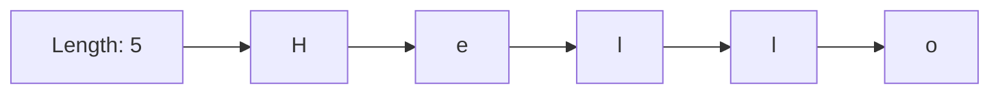
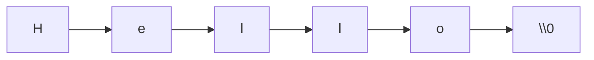

## Character String Types

### Definition

A character string type represents a sequence of characters treated as a single value or data structure. Unlike primitive scalar types (integer, float, Boolean, single character), a string is inherently a composite type, though many languages give it special syntax, literal notation, and built-in operators that make it feel like a primitive from the programmer's perspective.

### Strings as a Composite Type

**Key Points**
- Internally, a string is almost universally implemented as some form of array or sequence of character/byte units, plus metadata such as a length or a terminating marker.
- Despite this composite implementation, many languages expose strings with primitive-like syntax: string literals, a dedicated type name, and operators such as concatenation (`+`) that would otherwise be reserved for numeric types.
- Whether a language's strings behave as value types (compared and copied by content) or reference types (compared and copied by identity/pointer) is a significant design decision with direct consequences for equality semantics and mutation.

### String Representation Strategies

**Length-Prefixed Strings**

The string stores its length explicitly alongside its character data, so the end of the string is known without scanning.



Pascal strings historically used this approach (a leading length byte), and many modern language runtimes (Python's `str`, Java's `String`, C++'s `std::string`) internally track an explicit length rather than relying solely on a terminator, even when a null terminator is also present for interoperability.

**Null-Terminated Strings**

The string is stored as a contiguous sequence of characters followed by a special sentinel value (typically the null byte, `\0`) marking the end. This is the traditional C string representation.



**Key Points**
- Null-terminated strings require scanning the entire string to determine its length, an $O(n)$ operation, whereas a length-prefixed string can report its length in $O(1)$.
- Null-terminated strings are a well-documented source of security vulnerabilities, most notably buffer overflows, when a function writes past the allocated buffer while searching for or writing the terminator (as in the historically unsafe C function `strcpy`).
- A null-terminated string cannot natively contain an embedded null byte as data, since that byte would be interpreted as the end of the string; length-prefixed representations do not share this limitation.

### Character Encoding and Its Impact on String Representation

**Key Points**
- Early languages assumed a one-byte-per-character encoding, typically ASCII or a regional single-byte extension.
- Unicode's growth necessitated encoding schemes capable of representing far more characters than fit in a single byte: UTF-8 (variable-width, 1 to 4 bytes per code point, backward-compatible with ASCII), UTF-16 (variable-width, 2 or 4 bytes per code point via surrogate pairs), and UTF-32 (fixed-width, 4 bytes per code point).
- A language's choice of internal string encoding affects indexing semantics: fixed-width encodings allow $O(1)$ indexing by code point, while variable-width encodings such as UTF-8 generally require $O(n)$ traversal to find the $n$-th code point, since byte offset and code point index no longer coincide.

Python 3's `str` type stores text as a sequence of Unicode code points and, since PEP 393, uses a flexible internal representation (choosing 1, 2, or 4 bytes per character depending on the widest code point actually present in the string) to balance memory efficiency with $O(1)$ indexing. Go's `string` type is defined as an immutable sequence of bytes conventionally interpreted as UTF-8, meaning indexing a Go string with `[]` yields a byte, not necessarily a full character, requiring iteration via `range` or explicit rune conversion to correctly walk Unicode code points.

```go
s := "héllo"
fmt.Println(len(s))       // 6: byte length, since é is 2 bytes in UTF-8
for i, r := range s {     // range correctly decodes UTF-8 code points (runes)
    fmt.Println(i, r)
}
```

### Mutability of Strings

**Key Points**
- **Immutable strings:** once created, the character sequence cannot be changed in place; any "modification" produces a new string object. Java, Python, JavaScript, and C# all use immutable string types.
- **Mutable strings:** the character sequence can be modified in place. C's character arrays and C++'s `std::string` (via its mutable buffer) support in-place modification.
- Immutability enables safe sharing of string data across multiple references without risk of one reference's mutation affecting another, and permits certain optimizations such as string interning.

```java
String a = "hello";
String b = a;
a = a + " world"; // creates a NEW string object; does not mutate the original
// b still refers to the original "hello" string
```

```c
char buffer[6] = "hello";
buffer[0] = 'H'; // legal: character array is mutable in place
```

[Inference] The widespread industry trend toward immutable strings in newer or more recently redesigned languages reflects the practical benefits of immutability for thread safety and for enabling safe string interning, at the acknowledged cost of extra allocation overhead when strings are built incrementally through repeated concatenation.

### String Interning

Many languages with immutable strings employ interning: identical string literals (or explicitly interned strings) are stored once in a shared pool, and multiple variables holding the "same" string content reference the identical underlying object, saving memory and allowing fast reference-equality comparison as an optimization.

```java
String x = "hello";
String y = "hello";
x == y;              // true: both refer to the same interned literal
String z = new String("hello");
x == z;               // false: z is a distinct heap object, despite equal content
x.equals(z);           // true: content equality, independent of interning
```

### String Concatenation and Performance

**Key Points**
- Repeated concatenation of immutable strings in a loop is a well-documented performance anti-pattern in languages such as Java and Python, since each `+` operation allocates an entirely new string object, yielding $O(n^2)$ total time for building a string of length $n$ through $n$ individual appends.
- Languages typically provide a mutable builder type to address this: `StringBuilder` in Java and C#, or accumulating a list and joining it in Python (`"".join(list_of_parts)`), both achieving amortized $O(n)$ total construction time.

```python
# Inefficient: O(n^2) due to repeated immutable string creation
result = ""
for part in parts:
    result += part

# Efficient: O(n) amortized
result = "".join(parts)
```

### String Comparison Semantics

**Key Points**
- **Value/content equality** compares the actual character sequences of two strings.
- **Reference/identity equality** compares whether two variables point to the exact same underlying string object in memory.
- Languages differ in what their default equality operator performs: Python's `==` and Java's `.equals()` perform content comparison, while Java's `==` on `String` objects (non-primitive reference type) performs identity comparison unless interning happens to make the references coincide — a frequently cited source of subtle bugs for programmers coming from languages where `==` performs content comparison by default.

### Common String Operations Across Languages

| Operation | Typical Purpose |
|---|---|
| Concatenation | Combine two or more strings into one |
| Substring/slicing | Extract a portion of a string by index range |
| Length/size query | Determine the number of characters or bytes |
| Search/indexOf | Locate a substring or character's position |
| Split | Divide a string into an array/list by a delimiter |
| Trim/strip | Remove leading/trailing whitespace |
| Case conversion | Convert to uppercase/lowercase |
| Format/interpolation | Substitute values into a template string |

### Conclusion

Character string types occupy a distinctive position in language design: structurally composite (a sequence of characters), yet almost universally granted primitive-like ergonomics through dedicated literal syntax and operators. The major design axes — representation strategy (length-prefixed vs. null-terminated), character encoding (fixed vs. variable width), and mutability — interact to shape a language's performance characteristics, security profile, and the correctness of common operations such as indexing and equality comparison. Understanding these axes clarifies why seemingly simple string code can behave very differently, and carry very different risks, across languages.

**Related Topics**
- Unicode encoding schemes (UTF-8, UTF-16, UTF-32) in depth
- String interning and memory optimization
- Buffer overflow vulnerabilities in null-terminated strings
- Regular expressions and pattern matching over strings
- Immutability and its role in concurrency safety
- Rune/grapheme cluster handling versus code point indexing
- StringBuilder and other mutable string-construction patterns