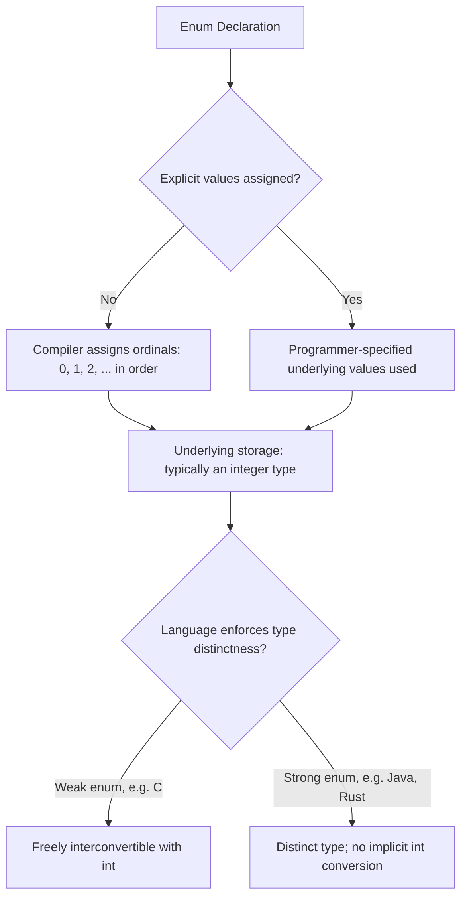

## Enumeration Types

### Definition

An enumeration type (enum) is a user-defined type whose set of possible values is an explicitly enumerated, finite list of named identifiers. Rather than representing a value with a bare numeric code whose meaning must be inferred or documented separately, an enumeration binds each possible value to a descriptive name, making the set of valid values both self-documenting and, in statically typed languages, checkable by the compiler.

### Motivation

**Key Points**
- Replaces "magic numbers" with named, self-documenting alternatives (e.g., `Color.RED` instead of an unexplained `0`).
- Restricts a variable to a closed, known set of values, allowing the compiler to catch invalid assignments or comparisons that a plain integer type could not.
- Enables exhaustiveness checking in some languages: the compiler can verify that a `switch`/`match` construct handles every possible enumerated value, flagging an error or warning if a case is missing.
- Improves readability at call sites, since a named constant communicates intent more clearly than a positional numeric argument.

### Basic Enumeration Declaration

**Example**

In C, an enumeration is a set of named integer constants, historically with relatively weak type enforcement:

```c
enum Color { RED, GREEN, BLUE };
enum Color c = RED; // RED implicitly has value 0, GREEN 1, BLUE 2
```

In Java, an enum is a full-fledged type, more restrictive and more powerful than C's:

```java
enum Color { RED, GREEN, BLUE }
Color c = Color.RED;
```

In Python, the `enum` module provides enumeration support built atop the class system:

```python
from enum import Enum

class Color(Enum):
    RED = 1
    GREEN = 2
    BLUE = 3

c = Color.RED
```

In Rust, an `enum` can additionally carry data per variant, extending far beyond the simple named-constant model:

```rust
enum Shape {
    Circle(f64),
    Rectangle(f64, f64),
    Triangle(f64, f64, f64),
}
```

### Underlying Representation

**Key Points**
- In many languages, each enumerated value is internally represented by an ordinal integer, typically starting at $0$ and incrementing by $1$ in declaration order, unless explicit values are assigned.
- Some languages allow explicit control over the underlying values, useful when the enumeration must correspond to an external protocol, file format, or hardware register layout.
- The degree to which the language exposes or hides this underlying integer representation varies significantly and is a major axis distinguishing "weak" enums (C-style) from "strong" enums (Java-style, Rust-style).

```csharp
enum StatusCode
{
    Ok = 200,
    NotFound = 404,
    ServerError = 500
}
```



### Weak Enums vs. Strong Enums

**Weak/Unscoped Enumerations**

In C (and C++ prior to C++11's `enum class`), enum values behave largely like named integer constants: they implicitly convert to and from `int`, and their names are injected directly into the enclosing scope rather than being namespaced under the enum's own name.

```c
enum Color { RED, GREEN, BLUE };
enum Fruit { APPLE, BANANA }; // BANANA also implicitly = 1, same as GREEN
int x = RED;     // legal: implicit conversion to int
if (RED == APPLE) { /* legal, and true: both equal 0 - likely a bug */ }
```

**Strong/Scoped Enumerations**

C++11 introduced `enum class` specifically to address the weaknesses above: no implicit conversion to `int`, and names are scoped under the enum type name.

```cpp
enum class Color { Red, Green, Blue };
enum class Fruit { Apple, Banana };
Color c = Color::Red;
// int x = c;              // compile error: no implicit conversion
// if (Color::Red == Fruit::Apple) // compile error: incompatible types
```

Java's `enum` is strongly typed by design from its introduction, disallowing implicit conversion to `int` and treating each enum as a distinct reference type, with each constant being a singleton instance of that type.

[Inference] The historical progression from C's weakly typed enums to C++11's `enum class` and Java's inherently strong enums reflects a broader language design trend of tightening type safety around enumerations once the practical bug patterns caused by implicit int conversion and name collision became well understood in the field.

### Enums as Full Types (Java-Style)

**Key Points**
- In Java, an enum is compiled to a class that implicitly extends `java.lang.Enum`, meaning enum constants can have fields, constructors, and methods, and each constant can even override behavior individually.
- This allows an enum to encapsulate not just a name but associated data and logic, blurring the line between a simple enumeration and a small closed hierarchy of singleton objects.

```java
enum Planet {
    MERCURY(3.303e+23, 2.4397e6),
    VENUS(4.869e+24, 6.0518e6);

    private final double mass;
    private final double radius;

    Planet(double mass, double radius) {
        this.mass = mass;
        this.radius = radius;
    }

    double surfaceGravity() {
        final double G = 6.67300E-11;
        return G * mass / (radius * radius);
    }
}
```

### Algebraic Data Type Enums (Rust-Style)

**Key Points**
- Some languages extend the enumeration concept into a full algebraic data type (sum type), where each variant may carry different associated data rather than being a bare label.
- This subsumes many use cases that would otherwise require a class hierarchy with subclassing in a purely object-oriented language, and pairs naturally with pattern matching constructs for exhaustive, type-safe handling of each variant.

```rust
enum Option<T> {
    Some(T),
    None,
}

fn describe(opt: Option<i32>) -> String {
    match opt {
        Option::Some(value) => format!("Got {}", value),
        Option::None => "Nothing here".to_string(),
    }
}
```

[Inference] Rust's `enum` and similar algebraic data type constructs in functional languages (such as Haskell's data declarations or OCaml's variant types) represent a meaningfully different design lineage from C-style or Java-style enums; grouping them under the single umbrella term "enumeration" is a simplification, since these constructs are more precisely sum types capable of associating heterogeneous payloads with each named case.

### Exhaustiveness Checking

**Key Points**
- A language with strong enum support can verify at compile time that a `switch`/`match` statement over an enum handles every declared variant, either raising an error or a warning for missing cases.
- This is a significant defensive-programming benefit: adding a new enum variant later forces every relevant `switch`/`match` in the codebase to be revisited, rather than silently falling through to unhandled default behavior.

```rust
enum TrafficLight { Red, Yellow, Green }

fn action(light: TrafficLight) -> &'static str {
    match light {
        TrafficLight::Red => "Stop",
        TrafficLight::Yellow => "Caution",
        TrafficLight::Green => "Go",
        // Omitting a variant here is a compile-time error in Rust
    }
}
```

Languages without true enum types, or with weak enums lacking exhaustiveness checking, cannot offer this guarantee; a missing case in a C `switch` over an `enum` is typically only a compiler warning at best, not a hard error, depending on compiler flags.

### Enumerations Without Native Language Support

**Key Points**
- Languages lacking a dedicated `enum` construct (older JavaScript, for instance) often simulate enumeration via a plain object or a set of named constants, sacrificing exhaustiveness checking and, in weakly enforced cases, type safety.

```javascript
const Color = Object.freeze({
  RED: "RED",
  GREEN: "GREEN",
  BLUE: "BLUE"
});

let c = Color.RED;
```

TypeScript later added a dedicated `enum` keyword atop JavaScript, alongside an alternative idiom using a union of string literal types, which many style guides now prefer for its closer alignment with structural typing and avoidance of certain enum-specific runtime quirks.

```typescript
type Color = "RED" | "GREEN" | "BLUE";
let c: Color = "RED";
```

### Conclusion

Enumeration types formalize the idea of a closed, named set of possible values, ranging from C's thin, integer-convertible labels to Java's fully object-oriented enum classes to Rust's data-carrying algebraic sum types. The degree of type strictness a language applies to its enums — whether they freely convert to integers, whether names are namespaced, and whether the compiler enforces exhaustive handling — directly affects how much protection the enumeration actually provides against a class of bugs involving invalid, mismatched, or unhandled values.

**Related Topics**
- Algebraic data types and sum types
- Pattern matching and exhaustiveness checking
- Named constants and manifest constants
- Bit flags and flag enumerations (bitwise-combinable enum values)
- Discriminated unions in TypeScript
- Singleton pattern (as related to Java's enum-as-singleton behavior)