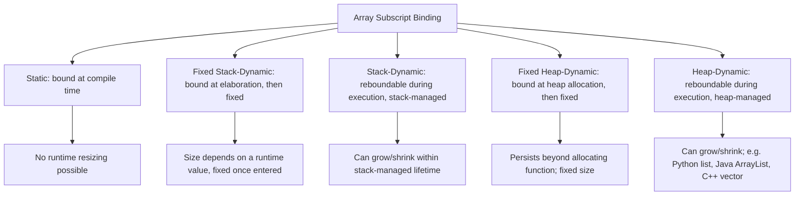

## Array Types and Subscript Binding

### Definition

An array is a composite data type consisting of an ordered, fixed- or variable-length collection of elements of a uniform type, accessed via a subscript (index). Subscript binding refers to the point in a program's lifecycle at which the array's index range — its lower and upper bounds — and, by extension, its total size, become fixed. Different languages bind these properties at different times, producing categories of array with meaningfully different flexibility, safety, and performance characteristics.

### Array Type Fundamentals

**Key Points**
- Elements of an array are homogeneous in type (with some languages relaxing this via arrays of a variant/union/dynamic type).
- Elements are accessed by an index, or subscript, which in most languages is an integer, though some languages generalize this to allow arbitrary discrete types (such as an enumerated type or a character range) as the index type.
- The mapping from a subscript to the corresponding element's memory location is typically computed via an address formula rather than a search, giving array access its characteristic $O(1)$ time complexity.

### Subscript Range Binding Categories

**Static Arrays**

The array's index range and size are fixed at compile time and cannot change during execution.

```c
int values[10]; // size fixed at compile time; cannot be resized
```

**Fixed Stack-Dynamic Arrays**

The array's size is determined when the declaration is elaborated (at runtime, upon entering the enclosing scope), but remains fixed for the array's lifetime thereafter.

```c
void process(int n) {
    int values[n]; // C99 variable-length array: size set at runtime, then fixed
}
```

**Stack-Dynamic Arrays**

The array's size can be changed during execution, with storage typically managed on a stack-like structure that grows and shrinks as the array is resized, though the array remains bound to a single contiguous storage region at any given point.

**Fixed Heap-Dynamic Arrays**

Storage is allocated from the heap at runtime, and the size is set once at allocation time but the binding of storage itself occurs later than compile time and can, unlike a stack-dynamic array, persist beyond the lifetime of the allocating function's local scope.

```c
int *values = malloc(n * sizeof(int)); // heap-allocated, size fixed after allocation
```

**Heap-Dynamic Arrays**

The array can grow or shrink at any point during execution, typically implemented by reallocating heap storage (often to a larger contiguous block, with existing elements copied over) as needed.

```python
values = []
values.append(10)  # dynamically resizable
values.append(20)
```



[Inference] This five-category taxonomy of array subscript binding is a well-established classification used in comparative programming language literature; the exact category boundaries and terminology can vary slightly between textbooks, but the underlying binding-time distinctions are consistent.

### Index Origin (Lower Bound)

**Key Points**
- Most C-derived languages (C, Java, JavaScript, Python) use zero-based indexing, where the first element is accessed at index $0$.
- Some languages default to one-based indexing (Lua, Fortran, historically some Pascal dialects and R), where the first element is at index $1$.
- A subset of languages allow the programmer to specify an arbitrary lower bound explicitly, decoupling the index origin from any fixed convention.

```ada
type Vector is array (1 .. 10) of Integer;         -- index range 1 to 10
type Offset_Array is array (-5 .. 5) of Integer;    -- index range -5 to 5, explicit
```

[Unverified: whether zero-based or one-based indexing is objectively "better" is a long-running, largely unresolved debate in language design discourse, with arguments on both sides tied to mathematical convention, historical hardware address-offset reasoning, and off-by-one error prevention; no consensus exists.]

### Address Calculation for Array Access

For a one-dimensional array with a known base address, element size, and lower bound, the address of element at index $i$ is typically computed as:

$$\text{address}(i) = \text{base} + (i - \text{lower\_bound}) \times \text{element\_size}$$

For a row-major two-dimensional array (the layout convention used by C, C++, Java, and Python's nested lists) with dimensions $\text{rows} \times \text{cols}$:

$$\text{address}(i, j) = \text{base} + (i \times \text{cols} + j) \times \text{element\_size}$$

For a column-major two-dimensional array (the layout convention used by Fortran and, by default, MATLAB):

$$\text{address}(i, j) = \text{base} + (j \times \text{rows} + i) \times \text{element\_size}$$

**Key Points**
- Row-major layout stores an entire row contiguously before moving to the next row; column-major stores an entire column contiguously before moving to the next column.
- The choice of layout has significant performance implications for cache locality: iterating in the order matching the storage layout (row-by-row for row-major, column-by-column for column-major) accesses memory sequentially, while iterating against the layout produces scattered, cache-unfriendly access patterns.

### Bounds Checking

**Key Points**
- **Bounds-checked languages** (Java, Python, Ada, Rust) verify at each access that the subscript falls within the valid range, raising an exception or error if it does not.
- **Unchecked languages** (C, C++ by default) perform no automatic verification; accessing an out-of-range index produces undefined behavior, potentially reading or corrupting unrelated memory.
- Bounds checking trades a runtime performance cost (an additional comparison per access) for memory safety; this cost is frequently mitigated by compiler optimizations that can eliminate redundant checks when the compiler can statically prove an index is always in range (such as within a bounded loop).

```java
int[] arr = new int[5];
arr[10] = 1; // throws ArrayIndexOutOfBoundsException at runtime
```

```c
int arr[5];
arr[10] = 1; // undefined behavior: no automatic check, may corrupt memory
```

Rust achieves memory safety with bounds checking by default on indexing operations, while also offering explicitly unsafe, unchecked access methods for the narrow cases where a programmer can guarantee safety and wants to avoid the check's overhead.

### Multidimensional Arrays and Ragged Arrays

**Key Points**
- A true multidimensional array is stored as a single contiguous block, with all rows the same length, and one address formula computing any element's location.
- A "ragged" (or "jagged") array is instead an array of arrays (or array of references to arrays), where each inner array can independently have a different length, common in languages such as Java and JavaScript where a "2D array" is actually implemented this way rather than as a true contiguous multidimensional block.

```java
int[][] ragged = new int[3][];
ragged[0] = new int[]{1, 2};
ragged[1] = new int[]{3, 4, 5, 6};
ragged[2] = new int[]{7};
```

### Array Type in the Type System

**Key Points**
- In statically typed languages, an array's element type is generally part of its static type, meaning an `int[]` and a `String[]` are distinct, incompatible types.
- Whether the array's *size* is also part of its static type varies: languages like Ada can encode fixed bounds in the type itself (making arrays of different declared sizes distinct types), while C, Java, and most others treat size as a runtime property not reflected in the static type.
- Generic or templated array-like containers (Java's `ArrayList<T>`, C++'s `std::vector<T>`, Rust's `Vec<T>`) decouple the resizable-array abstraction from the language's built-in fixed-size array construct, offering dynamic behavior through a library type rather than the core array primitive.

### Conclusion

Array types and their subscript binding rules determine when the size and shape of a collection become fixed, ranging from purely compile-time-bound static arrays to fully heap-dynamic, resizable arrays whose bounds can change throughout execution. Layered on top of this binding-time question are further design choices — index origin, bounds checking, storage layout for multiple dimensions — each carrying direct consequences for safety, performance, and how naturally the array abstraction maps onto a program's actual data.

**Related Topics**
- Pointer arithmetic and its relationship to array indexing in C-like languages
- Dynamic array (vector/ArrayList) amortized growth strategies
- Row-major vs. column-major memory layout and cache performance
- Bounds checking and memory safety guarantees
- Slices and array views (as in Go, Rust, Python)
- Sparse arrays and associative arrays (maps/dictionaries) as alternatives