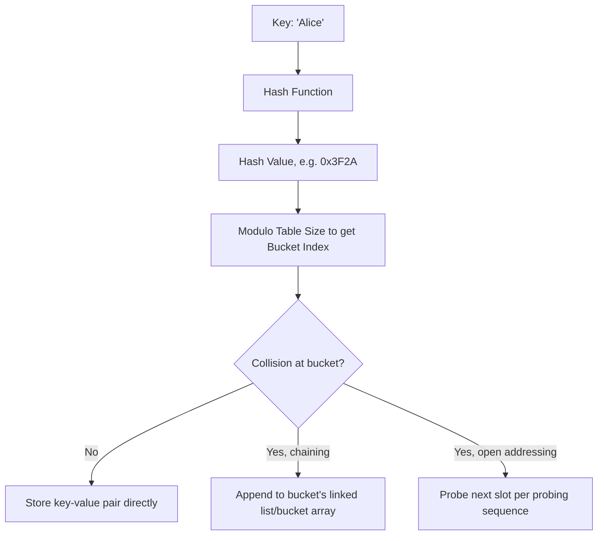

## Associative Arrays

### Definition

An associative array is a composite data type that maps a set of keys to a set of corresponding values, allowing lookup, insertion, and deletion of a value by its associated key rather than by a positional integer index. This structure is also referred to as a map, dictionary, hash, or symbol table depending on the language and context, though these terms sometimes carry slightly different implementation connotations.

### Distinction from Ordinary Arrays

**Key Points**
- An ordinary array uses a positional integer index (typically contiguous, starting from a fixed origin) to access elements; an associative array uses an arbitrary key, which may be of any type the language permits (commonly strings, but often integers, tuples, or other hashable/comparable types).
- An ordinary array's index range is generally dense and bounded; an associative array's key set is generally sparse and can grow or shrink dynamically without needing to reserve space for unused positions.
- Iteration order over an associative array is, in many implementations, unspecified or implementation-dependent, unlike an ordinary array's inherently sequential order — though some languages (Python dictionaries since 3.7, for instance) explicitly guarantee insertion-order iteration as a language-level guarantee rather than an implementation detail.

### Basic Usage Across Languages

**Example**

```python
ages = {"Alice": 30, "Bob": 25}
ages["Carol"] = 35
print(ages["Alice"])  # 30
```

```javascript
const ages = { Alice: 30, Bob: 25 };
ages.Carol = 35;
console.log(ages["Alice"]); // 30
```

```java
Map<String, Integer> ages = new HashMap<>();
ages.put("Alice", 30);
ages.put("Bob", 25);
System.out.println(ages.get("Alice")); // 30
```

```php
$ages = ["Alice" => 30, "Bob" => 25];
$ages["Carol"] = 35;
echo $ages["Alice"]; // 30
```

PHP's array type is notable among mainstream languages for natively unifying the ordinary array and associative array concepts into a single ordered map structure, where integer keys behave array-like and string keys behave dictionary-like within the same underlying type.

### Underlying Implementation Strategies

**Hash Table Implementation**

The most common implementation strategy computes a hash of the key, uses that hash to determine a bucket/slot, and stores the key-value pair there, resolving collisions (two keys hashing to the same slot) via chaining (a linked list or similar structure per bucket) or open addressing (probing for the next available slot).



**Key Points**
- Average-case time complexity for lookup, insertion, and deletion in a well-implemented hash table is $O(1)$, though this degrades to $O(n)$ in the worst case if many keys collide (e.g., due to a poor hash function or adversarially chosen keys).
- The hash table must periodically resize (rehash all entries into a larger table) as it fills, to maintain a low load factor and preserve average $O(1)$ performance; this resizing operation is itself $O(n)$ but occurs infrequently enough that insertion remains amortized $O(1)$.
- The key type must be hashable (support a consistent hash function) and, for correctness, keys that compare as equal must produce the same hash value — a requirement most languages enforce as a contract between a type's equality and hash implementations rather than a compiler-checked guarantee. [Inference] Violating this contract, such as by implementing a custom equality method without a correspondingly consistent hash method, is a well-documented source of subtle bugs (lookups silently failing) across virtually every language offering hash-based associative arrays.

**Balanced Tree Implementation**

An alternative implementation stores key-value pairs in a self-balancing binary search tree (such as a red-black tree), ordered by key comparison rather than by hash.

**Key Points**
- Guarantees $O(\log n)$ worst-case time for lookup, insertion, and deletion, avoiding the hash table's worst-case $O(n)$ degradation.
- Naturally supports ordered iteration and range queries (e.g., "all keys between X and Y") without additional sorting, which a hash table cannot offer efficiently.
- Requires the key type to support a total ordering (a comparison function) rather than merely a hash function.

C++'s `std::map` and Java's `TreeMap` use a balanced tree implementation (typically a red-black tree), while C++'s `std::unordered_map` and Java's `HashMap` use a hash table implementation, explicitly exposing this implementation choice at the type level so the programmer can select the appropriate trade-off.

### Static vs. Dynamic Key Sets

**Key Points**
- Associative arrays are, by their nature, almost universally heap-dynamic in terms of their key set: keys can be added or removed at runtime, and the structure grows or shrinks accordingly.
- This distinguishes associative arrays sharply from static or fixed-size ordinary arrays, whose size and, in some languages, index range are bound earlier and cannot change.
- Some statically typed languages still enforce a fixed *key type* and *value type* at compile time even though the *number* of entries is dynamic; for example, `Map<String, Integer>` in Java statically constrains keys to `String` and values to `Integer`, while the number of entries is unconstrained by the type system.

### Ordered vs. Unordered Associative Arrays

| Category | Iteration Order | Typical Implementation | Example |
|---|---|---|---|
| Unordered | Unspecified/implementation-dependent | Hash table | C++ `std::unordered_map`, older language dictionary implementations |
| Insertion-ordered | Order of key insertion | Hash table with auxiliary order tracking | Python `dict` (3.7+), JavaScript `Map`/plain object (for string keys, largely) |
| Sorted | Key comparison order | Balanced tree | C++ `std::map`, Java `TreeMap` |

[Unverified: JavaScript's plain object key ordering has additional nuances, since integer-like string keys are iterated in ascending numeric order before other string keys in insertion order, per the ECMAScript specification; this mixed ordering behavior is a frequently cited source of confusion and is best verified against the current specification for the exact edge cases involved.]

### Default Values and Missing-Key Behavior

**Key Points**
- Languages differ in how they handle a lookup for a key that is not present: raising an exception/error, returning a special "not found" marker value, or silently inserting a default value.

```python
ages = {"Alice": 30}
ages["Bob"]              # raises KeyError
ages.get("Bob")           # returns None, no exception
ages.get("Bob", 0)        # returns 0, an explicit default
```

```javascript
const ages = { Alice: 30 };
ages.Bob;    // undefined, no exception
```

```cpp
std::map<std::string, int> ages;
ages["Bob"];  // inserts Bob with default-constructed int value (0), as a side effect of access
```

C++'s behavior of `operator[]` silently inserting a default-valued entry on a missed lookup is a well-documented, sometimes surprising quirk relative to languages where a missed lookup either raises an error or returns a sentinel without mutating the structure.

### Key Type Requirements

**Key Points**
- Hash-table-backed associative arrays require the key type to be hashable and to implement equality consistently with that hash.
- Tree-backed associative arrays require the key type to support a total ordering (a less-than or comparison operation).
- Many languages restrict which built-in types may serve as keys by default (commonly excluding mutable composite types such as lists, since mutation after insertion would invalidate the structure's internal hashing or ordering invariants), while allowing custom types to opt in by implementing the required hash/equality or comparison methods.

```python
d = {[1, 2]: "value"}  # TypeError: unhashable type 'list'
d = {(1, 2): "value"}  # legal: tuple is hashable (assuming its elements are)
```

### Conclusion

Associative arrays generalize the array concept from positional integer indexing to arbitrary-key lookup, trading the guaranteed sequential ordering and dense index range of an ordinary array for flexible, sparse, key-based access. The two dominant implementation strategies — hash tables (favoring average $O(1)$ operations, unordered or insertion-ordered iteration) and balanced trees (favoring guaranteed $O(\log n)$ operations, sorted iteration) — represent a foundational trade-off in data structure design that recurs across nearly every language's standard library, and the choice between them, along with a language's specific missing-key and ordering semantics, has direct, practical consequences for both correctness and performance.

**Related Topics**
- Hash functions and collision resolution strategies (chaining vs. open addressing)
- Self-balancing binary search trees (red-black trees, AVL trees)
- Hashable and comparable type contracts in custom classes
- Sets as a related associative structure (keys without values)
- Load factor and dynamic resizing/rehashing strategies
- Ordered dictionaries and their guarantees across language versions