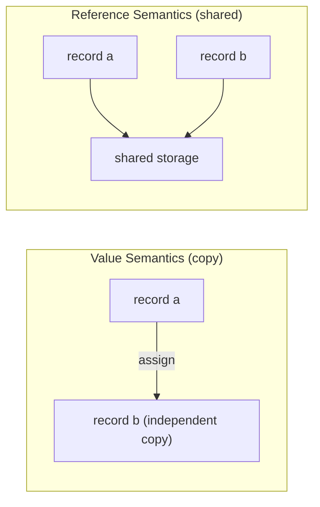
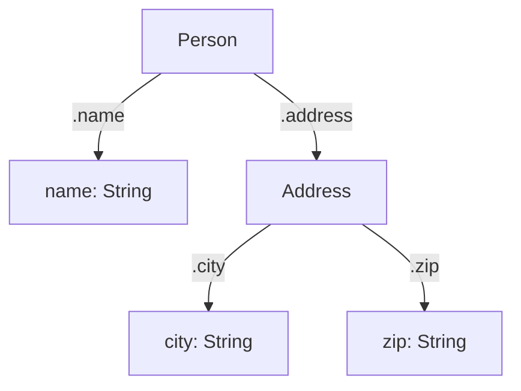

## Record Types and Field Access

### Overview

A record type is a composite data type that groups multiple named fields, each potentially of a different type, into a single logical unit. Unlike arrays or lists, which index elements by position, records index their components by name (a *field* or *member*). Records are among the oldest structuring mechanisms in programming languages, tracing back to Pascal, COBOL, and PL/I, and remain foundational to nearly every modern language under names such as `struct` (C, Go, Rust), `class` (Java, C++, Python), `record` (Pascal, C#, Java 16+), or plain object literals (JavaScript).

Records solve a specific problem: representing heterogeneous, related data as one value, so a function can accept "a point" instead of two separate `x` and `y` parameters, or "a person" instead of a name string, an age integer, and an email string passed independently.

### Core Concepts

**Fields**

A field is a named slot within a record, consisting of an identifier and a type. In a statically typed language, the field's type is fixed at compile time; in a dynamically typed language, the field may hold any value permitted by the language's object model.

**Structural shape**

The set of field names, their order, and their types together define the record's *shape* or *layout*. Two records are typically considered to have the same type if they have the same shape — though whether this comparison is *structural* (shape-based) or *nominal* (name-based) depends on the language's type system.

**Field access**

Field access is the operation of retrieving or updating the value stored in a specific field of a record instance. The two dominant syntactic conventions are:

- **Dot notation**: `record.field` — used by C, C++, Java, C#, Python, JavaScript, Go, Rust, Swift, and most C-family and C-family-influenced languages.
- **Arrow notation**: `pointer->field` — used in C and C++ specifically when accessing a field through a pointer to a record, as syntactic sugar for `(*pointer).field`.

### Declaring Record Types

**C — struct**

```c
struct Point {
    double x;
    double y;
};

struct Point p = {3.0, 4.0};
printf("%f\n", p.x);       // dot access on a value
```

When working through a pointer, C requires arrow notation:

```c
struct Point *ptr = &p;
printf("%f\n", ptr->x);    // arrow access on a pointer
```

**Go — struct**

```go
type Point struct {
    X float64
    Y float64
}

p := Point{X: 3.0, Y: 4.0}
fmt.Println(p.X)
```

Go uses dot notation uniformly for both values and pointers; the compiler automatically dereferences pointers, so `ptr.X` works even when `ptr` is `*Point`.

**Rust — struct**

```rust
struct Point {
    x: f64,
    y: f64,
}

let p = Point { x: 3.0, y: 4.0 };
println!("{}", p.x);
```

Rust structs are immutable by default; mutable field access requires `let mut p = ...` and the binding, not the type, controls mutability.

**Python — dataclass**

```python
from dataclasses import dataclass

@dataclass
class Point:
    x: float
    y: float

p = Point(3.0, 4.0)
print(p.x)
```

The `dataclass` decorator auto-generates `__init__`, `__repr__`, and `__eq__` based on the declared fields, which is a documented behavior of the `dataclasses` module rather than an inference.

**C# — record**

```csharp
public record Point(double X, double Y);

var p = new Point(3.0, 4.0);
Console.WriteLine(p.X);
```

C# 9+ `record` types provide value-based equality and an immutable-by-default positional constructor, distinguishing them from ordinary `class` declarations.

**Java — record (Java 16+)**

```java
public record Point(double x, double y) {}

Point p = new Point(3.0, 4.0);
System.out.println(p.x());
```

Java records expose fields through auto-generated **accessor methods** named after the field (`x()`, not `.x`), which differs structurally from C#'s direct property syntax — this is a documented language design choice, not a bug.

### Field Access Semantics

**Read access**

Reading a field retrieves the current value stored at that field's location within the record instance. In value-semantics languages (C structs, Rust structs, Go structs by default), the record is a contiguous block of memory, and field access compiles to a fixed memory offset lookup — an O(1), compile-time-computed operation.

$$\text{address}(record.field) = \text{address}(record) + \text{offset}(field)$$

**Write access (mutation)**

Whether `record.field = value` is permitted depends on:

1. Whether the language allows mutable records at all (Rust, C, Go: yes by default; F#, Haskell: no by default).
2. Whether the specific field was declared mutable (e.g., Rust requires `mut` on the binding).
3. Whether the record was obtained through an immutable reference or view.

**Copy vs. reference semantics**

This is one of the most consequential design decisions surrounding record types.

- **Value semantics**: assigning or passing a record copies its fields. C structs, Go structs, Rust structs (unless behind a reference), and C# `struct` all copy on assignment.
- **Reference semantics**: assigning or passing a record copies a reference to shared underlying storage. Java objects, Python objects, JavaScript objects, and C# `class`/`record` all share storage on assignment.



This distinction directly determines whether mutating one variable's field is visible through another variable — a frequent source of bugs when a language's default semantics are assumed incorrectly.

### Memory Layout

For value-semantics records, fields are typically laid out contiguously in memory, though the compiler may insert **padding** between fields to satisfy alignment requirements of the target architecture.

birlikte

Below is a conceptual layout for a struct with mismatched field sizes:

```c
struct Mixed {
    char  a;   // 1 byte
    int   b;   // 4 bytes
    char  c;   // 1 byte
};
```

<svg xmlns="http://www.w3.org/2000/svg" viewBox="0 0 640 220" font-family="monospace">
<text x="10" y="20" font-size="14" font-weight="bold">Struct Memory Layout with Padding (svg_diagram)</text>

<g font-size="11">

<rect x="10" y="50" width="40" height="40" fill="#a8d8ff" stroke="#333" />
<text x="30" y="75" text-anchor="middle">a</text>



```

<rect x="50" y="50" width="120" height="40" fill="#eeeeee" stroke="#333" stroke-dasharray="3,3" />
<text x="110" y="75" text-anchor="middle" font-style="italic">pad (3B)</text>


<rect x="170" y="50" width="160" height="40" fill="#ffd7a8" stroke="#333" />
<text x="250" y="75" text-anchor="middle">b (int, 4B)</text>


<rect x="330" y="50" width="40" height="40" fill="#a8d8ff" stroke="#333" />
<text x="350" y="75" text-anchor="middle">c</text>


<rect x="370" y="50" width="120" height="40" fill="#eeeeee" stroke="#333" stroke-dasharray="3,3" />
<text x="430" y="75" text-anchor="middle" font-style="italic">pad (3B)</text>
```

</g>

<g font-size="10" fill="#555">
<text x="30" y="105" text-anchor="middle">0</text>
<text x="170" y="105" text-anchor="middle">4</text>
<text x="350" y="105" text-anchor="middle">8</text>
<text x="490" y="105" text-anchor="middle">12</text>
</g>

<text x="10" y="140" font-size="12">Total size: 12 bytes (not 6) due to alignment padding.</text>

<text x="10" y="160" font-size="12">Field order affects total size — reordering can reduce padding.</text>

<text x="10" y="190" font-size="11" font-style="italic" fill="#555">Exact layout is compiler- and platform-dependent [Unverified for any specific toolchain].</text>

</svg>

Reordering fields from largest to smallest alignment requirement generally minimizes padding — a technique sometimes called "struct packing" — though the precise resulting layout is governed by the platform's ABI (Application Binary Interface) and compiler, so exact byte counts should be treated as [Unverified] without checking a specific compiler and target.

### Nested Records and Field Access Chains

Records can contain other records as fields, and field access chains navigate this hierarchy left to right.

```rust
struct Address {
    city: String,
    zip: String,
}

struct Person {
    name: String,
    address: Address,
}

let p = Person {
    name: String::from("Alex"),
    address: Address { city: String::from("Manila"), zip: String::from("1000") },
};

println!("{}", p.address.city);  // chained field access
```



### Optional / Nullable Field Access

Because nested field access can fail when an intermediate value is absent, many languages provide **optional chaining** to short-circuit the chain safely.

```javascript
// JavaScript
const city = person?.address?.city; // undefined if person or address is null/undefined
```

```csharp
// C#
string? city = person?.Address?.City;
```

```rust
// Rust — no built-in ?. operator; expressed via Option combinators
let city = person.address.map(|a| a.city);
```

The absence of a native optional-chaining operator in Rust is a deliberate design choice tied to its `Option<T>` type and explicit error/null handling philosophy, distinguishing it from languages with implicit null.

### Structural vs. Nominal Typing of Records

- **Nominal typing** (Java, C#, Rust, Go's named structs): two record types with identical fields are still *distinct types* unless declared with the same name.
- **Structural typing** (TypeScript, Go interfaces, OCaml objects): two record types are compatible if their field shapes match, regardless of declared name.

```typescript
// TypeScript — structural typing
interface Point { x: number; y: number; }

function magnitude(p: Point): number {
  return Math.sqrt(p.x ** 2 + p.y ** 2);
}

const p = { x: 3, y: 4 }; // no explicit "Point" annotation
magnitude(p); // valid — shape matches
```

$$\text{magnitude}(p) = \sqrt{p.x^2 + p.y^2} = 5$$

### Record Update Patterns (Immutable Records)

Languages favoring immutability provide a "functional update" syntax that produces a new record with select fields changed, rather than mutating in place.

```rust
#[derive(Clone)]
struct Point { x: f64, y: f64 }

let p1 = Point { x: 1.0, y: 2.0 };
let p2 = Point { x: 5.0, ..p1 };  // p2.y == 2.0, copied from p1
```

```haskell
-- Haskell
data Point = Point { x :: Double, y :: Double }

p1 = Point { x = 1.0, y = 2.0 }
p2 = p1 { x = 5.0 }  -- record update syntax
```

```fsharp
// F#
type Point = { X: float; Y: float }

let p1 = { X = 1.0; Y = 2.0 }
let p2 = { p1 with X = 5.0 }
```

This pattern avoids aliasing bugs since `p1` remains untouched, at the cost of allocating a new record on every update — a well-documented tradeoff of persistent/immutable data structures, though the actual performance impact depends on the workload and is [Inference] without profiling a specific case.

### Field Access in Dynamically Typed Languages

In Python and JavaScript, field access is resolved at runtime via an underlying dictionary-like or property-lookup mechanism rather than a fixed compile-time offset.

```python
class Point:
    def __init__(self, x, y):
        self.x = x
        self.y = y

p = Point(3, 4)
print(p.x)          # attribute lookup via __dict__ (or __slots__ if defined)
```

By default, Python instances store fields in a per-instance `__dict__`, which permits adding fields dynamically at runtime (`p.z = 10`) but incurs more memory and lookup overhead than a fixed layout. Declaring `__slots__` restricts instances to a fixed set of fields and switches storage to a more compact, array-like layout — this is documented CPython behavior.

```python
class Point:
    __slots__ = ("x", "y")
    def __init__(self, x, y):
        self.x = x
        self.y = y
```

### Access Control on Fields

Some languages allow fields to restrict visibility, coupling record definition with encapsulation:

| Language | Mechanism | Example |
| --- | --- | --- |
| C++ | `public`/`private`/`protected` keywords | `private: int x;` |
| Java | access modifiers on fields | `private int x;` |
| Python | naming convention only (no enforcement) | `self._x` (single underscore, weakly private) |
| Rust | `pub` keyword, module-scoped by default | `pub x: f64` |
| Go | capitalization convention | `X` exported, `x` unexported |

Python's underscore convention is not enforced by the language runtime — it is a documented social convention rather than a compiler-checked restriction, so calling it "private" is an [Inference]-adjacent simplification worth flagging precisely because the mechanism is weaker than the term implies.

### Common Pitfalls

- **Shallow copy confusion**: copying a record with reference-type fields (e.g., a list field) does not deep-copy the nested structure; both records end up pointing to the same nested object unless a deep copy is explicitly performed.
- **Padding assumptions**: assuming `sizeof(struct)` equals the sum of field sizes ignores alignment padding, producing incorrect serialization or memory-budgeting calculations.
- **Null/undefined field access**: dereferencing a field on a `null`/`nil`/`None` record raises a runtime error (`NullPointerException`, `AttributeError`, segmentation fault) in most languages without optional chaining.
- **Mutating a record received "by value"**: in reference-semantics languages, passing a record to a function still allows the function to mutate the caller's record through the shared reference, which surprises programmers coming from value-semantics languages.

### Key Points

- A record groups named, typed fields into one composite value; field access retrieves or updates a field by name.
- Dot notation is near-universal; arrow notation (`->`) is specific to pointer-based access in C/C++.
- Value semantics (copy on assignment) versus reference semantics (shared storage) is a foundational distinction that determines mutation visibility across variables.
- Memory layout of value-type records may include compiler-inserted padding for alignment; total size is not simply the sum of field sizes.
- Structural typing treats records as compatible by shape; nominal typing treats them as compatible only by declared name.
- Optional chaining (`?.`) provides safe navigation through potentially absent nested fields in languages that support it.
- Immutable records favor functional update syntax (`{ p1 with X = ... }`, `Point { x: 5.0, ..p1 }`) to derive new values without mutation.

**Related Topics**

- Algebraic data types and tagged unions/enums with associated data
- Structural vs. nominal type systems in depth
- Object-oriented classes vs. plain records (methods, inheritance, encapsulation)
- Memory alignment, padding, and struct packing at the ABI level
- Pattern matching and destructuring on record fields
- Serialization of record types (JSON, binary formats, schema evolution)
- Persistent data structures and structural sharing in immutable languages