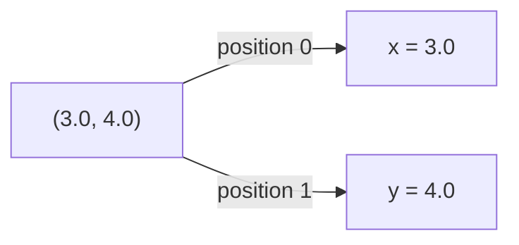
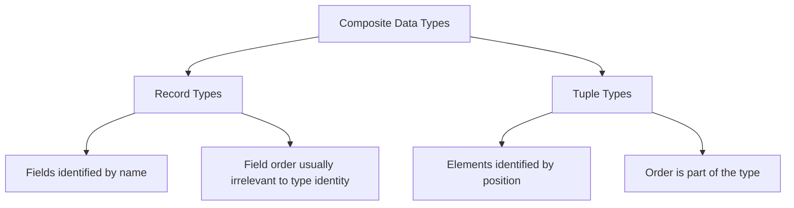

## Tuple Types

### Overview

A tuple type is a fixed-size, ordered collection of values, where each position (or *slot*) may hold a different type. Unlike a record, whose fields are identified by name, a tuple's components are identified by *position* — the first element, the second element, and so on. Tuples occupy a conceptual middle ground between records (named, heterogeneous) and arrays (unnamed, homogeneous): they are heterogeneous like records but positional like arrays.

Tuples appear across nearly every type-system tradition — from ML-family languages (OCaml, F#, Haskell), where tuples are a primitive building block of the type system, to systems languages (Rust, Swift, Go via multiple return values), to dynamically typed languages (Python), where the tuple is a core immutable sequence type.

### Core Concepts

**Arity**

The *arity* of a tuple is the number of elements it holds — a 2-tuple is called a *pair*, a 3-tuple a *triple*, and so on. Arity is fixed as part of the tuple's type; a 2-tuple and a 3-tuple are different types even if their element types otherwise match.

**Positional typing**

A tuple type is written as an ordered list of component types, such as `(int, string, bool)`. Two tuple types are equal only if they have the same arity and the same type at every corresponding position.

$$T = (T_1, T_2, \ldots, T_n)$$

**Heterogeneity**

Each slot may hold a distinct type — this is the defining difference from a homogeneous array or list, where all elements must share one type (in statically typed languages).

### Tuple Declaration and Construction

**Python**

```python
point: tuple[float, float] = (3.0, 4.0)
person: tuple[str, int, bool] = ("Alex", 30, True)
```

Python tuples are immutable sequences — attempting `point[0] = 5.0` raises a `TypeError`, which is documented CPython behavior tied to the tuple type's implementation.

**Rust**

```rust
let point: (f64, f64) = (3.0, 4.0);
let person: (&str, i32, bool) = ("Alex", 30, true);
```

Rust tuples are value types; like other Rust bindings, mutability is controlled by `let mut` on the binding, not by the tuple type itself.

**Haskell**

```haskell
point :: (Double, Double)
point = (3.0, 4.0)

person :: (String, Int, Bool)
person = ("Alex", 30, True)
```

Haskell's tuple types are built into the language syntax itself — `(a, b)` is simultaneously the value syntax and the type syntax, differing by context.

**OCaml**

```ocaml
let point : float * float = (3.0, 4.0)
let person : string * int * bool = ("Alex", 30, true)
```

OCaml denotes tuple *types* with `*` between component types (e.g., `float * float`), while tuple *values* use commas — a notational split some learners find confusing at first.

**Swift**

```swift
let point: (Double, Double) = (3.0, 4.0)
let person: (name: String, age: Int, active: Bool) = ("Alex", 30, true)
```

Swift additionally supports **named tuple elements**, blurring the line between tuples and lightweight records — `person.name` is valid alongside `person.0`.

**TypeScript**

```typescript
const point: [number, number] = [3.0, 4.0];
const person: [string, number, boolean] = ["Alex", 30, true];
```

TypeScript represents tuples as specially-typed arrays with fixed length and per-position types — a structural encoding rather than a genuinely distinct runtime type, since JavaScript itself has no native tuple type.

### Tuple Element Access

Because tuple elements are unnamed, access is positional, and the exact syntax varies significantly by language.

| Language | Access syntax | Notes |
| --- | --- | --- |
| Python | `point[0]`, `point[1]` | Standard indexing, zero-based |
| Rust | `point.0`, `point.1` | Dot followed by a numeric index, not a method call |
| Haskell | `fst point`, `snd point` | Only pairs have built-in `fst`/`snd`; larger tuples require pattern matching |
| OCaml | pattern matching: `let (x, y) = point` | No direct indexing operator |
| Swift | `point.0`, `point.1`, or `person.name` if labeled | Supports both positional and labeled access |
| TypeScript/JavaScript | `point[0]`, `point[1]` | Same as array indexing |
| Go | N/A (no tuple type) | Multiple return values are the closest analogue |

```rust
let point = (3.0, 4.0);
println!("{}", point.0); // 3.0
println!("{}", point.1); // 4.0
```

```haskell
point = (3.0, 4.0)
x = fst point  -- 3.0
y = snd point  -- 4.0
```

Haskell's restriction of `fst`/`snd` to pairs specifically (not triples or larger) is a documented consequence of how these functions are typed in the standard library — accessing elements of larger tuples requires pattern matching instead.

### Destructuring (Pattern Matching on Tuples)

Most languages with genuine tuple support allow **destructuring**: binding each element to a separate name in one statement, rather than accessing by position repeatedly.

```python
x, y = (3.0, 4.0)
name, age, active = ("Alex", 30, True)
```

```rust
let (x, y) = (3.0, 4.0);
let (name, age, active) = ("Alex", 30, true);
```

```ocaml
let (x, y) = (3.0, 4.0)
```

```javascript
const [x, y] = [3.0, 4.0];
```



Destructuring can also be **partial**, ignoring elements the caller doesn't need:

```rust
let (x, _, active) = ("Alex", 30, true); // age discarded via `_`
```

```haskell
(x, _, active) = ("Alex", 30, True)  -- wildcard pattern
```

### Tuples as Multiple Return Values

One of the most common practical uses of tuples is returning more than one value from a function without declaring a dedicated record type.

```go
// Go — not a true tuple type, but positionally identical in usage
func divide(a, b int) (int, int) {
    return a / b, a % b
}

quotient, remainder := divide(17, 5)
```

```python
def divide(a: int, b: int) -> tuple[int, int]:
    return a // b, a % b

quotient, remainder = divide(17, 5)
```

```rust
fn divide(a: i32, b: i32) -> (i32, i32) {
    (a / b, a % b)
}

let (quotient, remainder) = divide(17, 5);
```

Go's multiple return values are a distinct language feature rather than a first-class tuple type — Go has no way to store `(int, int)` in a variable of tuple type, pass it as a single argument, or nest it inside another structure; it exists only in function signatures and multiple-assignment contexts. This is a documented design distinction, not a limitation shared by genuine tuple types.

### Tuple Types vs. Record Types



| Aspect | Tuple | Record |
| --- | --- | --- |
| Element identity | Position | Name |
| Readability at call site | Lower (what is `.0`?) | Higher (`.age` is self-documenting) |
| Typical use case | Ad hoc grouping, multiple returns | Modeling a defined domain entity |
| Reordering fields | Changes the type | Usually does not change the type (if nominal) |

[Inference]: the readability tradeoff is a widely cited rationale in language design discussions and style guides for preferring named records over large tuples, though "widely cited" reflects common practice rather than a universally quantified metric.

### Tuple Type Equality and Structural Typing

Tuple types are inherently structural: two tuple types with the same arity and matching component types at each position are the same type, regardless of where or how they were constructed — this follows directly from the absence of any name to compare against.

```typescript
type Pair = [number, number];

function distance(p: [number, number]): number {
  return Math.sqrt(p[0] ** 2 + p[1] ** 2);
}

const p: Pair = [3, 4];
distance(p);        // valid
distance([3, 4]);   // also valid — same structural shape
```

$$\text{distance}(p) = \sqrt{p_0^2 + p_1^2}$$

### Nested Tuples

Tuples can contain other tuples as elements, producing nested positional access.

```haskell
nested :: ((Int, Int), String)
nested = ((3, 4), "origin-offset")

getFirst :: ((Int, Int), String) -> Int
getFirst ((x, _), _) = x
```

```rust
let nested: ((i32, i32), &str) = ((3, 4), "origin-offset");
let x = (nested.0).0; // 3
```

Nested tuple access syntax can become visually dense quickly, which is one practical argument in favor of switching to named records once nesting exceeds one or two levels — an [Inference] grounded in common style-guide advice rather than a formal language rule.

### The Empty Tuple / Unit Type

A 0-arity tuple, written `()`, is called the **unit type** in many languages and is used to represent "no meaningful value" — distinct from `null`/`None`, since unit is a genuine, single-valued type rather than the absence of a value.

```haskell
-- Haskell: functions with no meaningful return value return ()
printMessage :: String -> IO ()
printMessage msg = putStrLn msg
```

```rust
fn log_event(msg: &str) -> () {
    println!("{}", msg);
}
// equivalently, omitting -> () entirely, since () is the default return type
```

$$() : \text{Unit}, \quad |\text{Unit}| = 1$$

The unit type has exactly one inhabitant (the empty tuple itself), which is what formally distinguishes it from types like `bool` (two inhabitants) or `Option<T>`/`Maybe a` (which additionally encode absence).

### Tuple Immutability

In most languages that treat tuples as a distinct first-class type (Python, Haskell, OCaml, Rust, Swift), tuples are immutable by default or entirely — there is no in-place "set element 0" operation; producing a modified tuple requires constructing a new one.

```python
point = (3.0, 4.0)
# point[0] = 5.0  # raises TypeError — tuples are immutable

point = (5.0, point[1])  # construct a new tuple instead
```

This immutability is frequently exploited for using tuples as dictionary/hash-map keys or set elements, since mutable types generally cannot be hashed safely — in Python specifically, this is documented behavior: lists are unhashable, but tuples (of hashable elements) are.

```python
distances: dict[tuple[int, int], float] = {}
distances[(0, 0)] = 0.0
distances[(1, 1)] = 1.4142135
```

### Common Pitfalls

- **Positional confusion at scale**: tuples with more than 2–3 elements become error-prone, since swapping two same-typed elements (e.g., `(int, int, int)`) compiles fine but silently changes meaning.
- **Treating Go's multiple returns as a storable type**: attempting to assign `result := divide(a, b)` to a single variable in Go fails to compile, since Go's multiple return values are not packaged into one addressable tuple value.
- **Assuming tuple mutability**: code ported from a mutable-array mindset into Python or Rust may incorrectly assume `tup[i] = x` works.
- **Overusing tuples where a record would communicate intent better**: returning `(bool, string, int)` from a function forces every caller to remember what each position means, whereas a named record documents itself.

### Key Points

- A tuple is a fixed-arity, ordered, heterogeneous collection whose elements are identified by position, not name.
- Arity and per-position types together define a tuple's type; changing either produces a different type.
- Access syntax varies widely: indexing (Python), dot-numeric (Rust, Swift), or exclusively pattern matching (OCaml, and effectively Haskell beyond pairs).
- Destructuring is the idiomatic way to extract multiple tuple elements at once, and supports partial extraction via wildcards.
- Tuples are commonly used for multiple return values, though some languages (Go) implement multiple returns as a distinct mechanism rather than a true tuple type.
- Tuple types are structurally compared by nature, since there is no name to compare.
- The 0-arity tuple `()` is the unit type, representing "no meaningful value" with exactly one inhabitant.
- Most first-class tuple implementations are immutable, which also makes them suitable as hash keys where the language requires hashable keys.

**Related Topics**

- Record types and field access
- Algebraic data types, sum types, and pattern matching
- Structural vs. nominal typing
- Multiple return values and function signature design
- Hashable and comparable type constraints
- Destructuring assignment across languages
- Option/Maybe types and the unit type in type theory