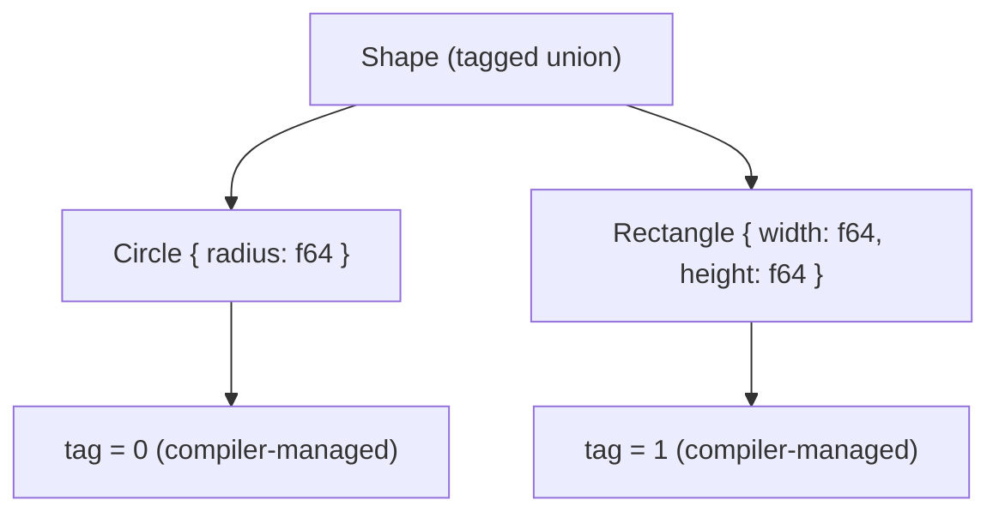
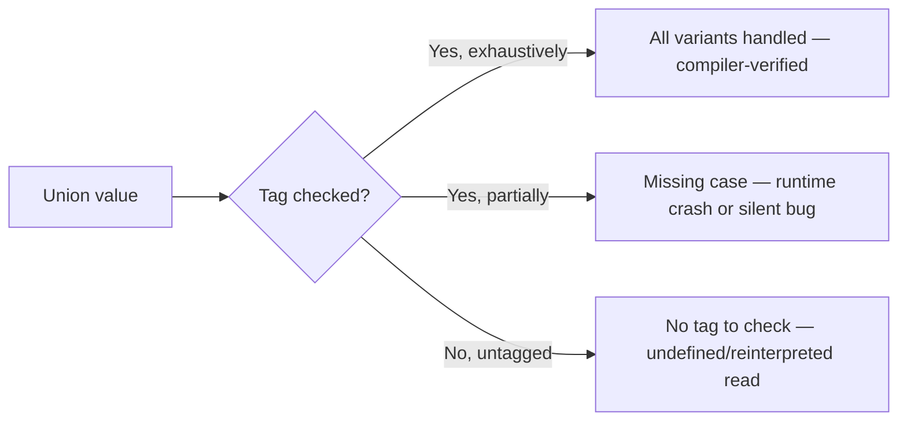

## Union Types and Type Safety Concerns

### Overview

A union type describes a value that may be one of several possible types. Where a record combines multiple values *simultaneously* (a person has a name **and** an age **and** an email), a union expresses that a value is *one of several alternatives* at any given time (a value is a `string` **or** a `number`, but never both at once). Unions appear in two structurally distinct forms across languages: **tagged (discriminated) unions**, which carry a runtime marker identifying which alternative is present, and **untagged unions**, which do not — a distinction with direct and serious consequences for type safety.

### Core Concepts

**Alternatives**

Each possible type a union value may hold is called a *variant* or *alternative*. A union type is often written as $T = T_1 \mid T_2 \mid \ldots \mid T_n$, read "T is a $T_1$ or a $T_2$ or ... or a $T_n$."

**Tag / discriminant**

A tag is a runtime value (often an enum, integer, or string literal) stored alongside the union's payload, identifying which variant is currently active. Tagged unions store this automatically; untagged unions do not store one at all, leaving tracking entirely to the programmer.

**Exhaustiveness**

Exhaustiveness checking is a compile-time guarantee that every branch handling a union value covers all possible variants, with no variant silently unhandled. This is a defining feature of type-safe union systems and a documented capability of the type checkers listed below.

### Tagged Unions (Discriminated Unions)

**Rust — enum**

```rust
enum Shape {
    Circle { radius: f64 },
    Rectangle { width: f64, height: f64 },
}

fn area(s: &Shape) -> f64 {
    match s {
        Shape::Circle { radius } => std::f64::consts::PI * radius * radius,
        Shape::Rectangle { width, height } => width * height,
    }
}
```

Rust's `enum` is a genuine tagged union: each `Shape` value carries a hidden discriminant identifying whether it is a `Circle` or `Rectangle`, and the compiler enforces that `match` covers every variant — omitting a case is a compile error unless a wildcard `_` arm is present. This exhaustiveness check is a documented feature of the Rust compiler.

**TypeScript — discriminated union**

```typescript
type Shape =
| { kind: "circle"; radius: number }
| { kind: "rectangle"; width: number; height: number };

function area(s: Shape): number {
  switch (s.kind) {
    case "circle":
      return Math.PI * s.radius ** 2;
    case "rectangle":
      return s.width * s.height;
  }
}
```

The `kind` field is a **literal type tag**; TypeScript's control-flow analysis narrows `s` to the specific variant inside each `case` branch based on this tag, a documented mechanism called *discriminated union narrowing*.

**Haskell — algebraic data type**

```haskell
data Shape
  = Circle Double
| Rectangle Double Double

area :: Shape -> Double
area (Circle r) = pi * r * r
area (Rectangle w h) = w * h
```

Haskell's `data` declarations with multiple constructors are tagged unions by construction; GHC emits a warning (configurable to an error) for non-exhaustive pattern matches, which is documented compiler behavior.

**Swift — enum with associated values**

```swift
enum Shape {
    case circle(radius: Double)
    case rectangle(width: Double, height: Double)
}

func area(_ shape: Shape) -> Double {
    switch shape {
    case .circle(let radius):
        return .pi * radius * radius
    case .rectangle(let width, let height):
        return width * height
    }
}
```

Swift requires `switch` statements over enums to be exhaustive, or include a `default` case — enforced by the compiler.



### Untagged Unions

**TypeScript — plain union type**

```typescript
function stringify(value: string | number): string {
  if (typeof value === "string") {
    return value.toUpperCase();
  }
  return value.toFixed(2);
}
```

Here, TypeScript narrows the union using `typeof` at runtime rather than a stored tag, since primitives like `string` and `number` carry no explicit discriminant — the language relies on runtime type inspection instead of a payload-embedded marker.

**C — union**

```c
union Value {
    int i;
    float f;
    char *s;
};

union Value v;
v.i = 42;
printf("%d\n", v.i);   // well-defined: reading the field just written

v.f = 3.14f;
printf("%d\n", v.i);   // undefined/implementation-defined behavior: reading a
                        // different field than was last written
```

This is the canonical example of an **untagged union's danger**: a C `union` allocates storage sized for its largest member and provides *zero* runtime tracking of which member was last written. Reading a member other than the one most recently written is, per the C standard, implementation-defined or undefined behavior depending on the specific case (type punning via unions has a long, contested history across C standard revisions) — this nuance is genuinely [Unverified] without pinning to a specific C standard version and compiler, and is flagged as such deliberately.

### Type Safety Concerns

**The core problem: unchecked variant access**

The central type-safety risk of unions is accessing a union value *as* a variant it does not currently hold. Tagged unions prevent this by making the tag mandatory to inspect before access; untagged unions do not.

```c
union Value v;
v.i = 42;
printf("%f\n", v.f); // compiles and runs; reads garbage/reinterpreted bits
```

No compiler error occurs here, because a C `union` has no concept of "the wrong branch" — it is simply reinterpreting the same memory. This class of bug is a well-documented source of memory-safety and correctness issues in C and C++ codebases.

**Exhaustiveness as a safety net**



Adding a new variant to a tagged union in Rust, Swift, or Haskell causes every existing exhaustive `match`/`switch` over that type to fail to compile until updated — a property often called "the compiler as your refactoring safety net," and this is a direct, documented consequence of exhaustiveness checking rather than an incidental benefit.

**Nullable references as a degenerate union**

Many languages model "value or absence" as an implicit two-variant union between a type and `null`. Where this union is *untracked* by the type system (Java pre-`Optional`, JavaScript, historically C#), any reference type is silently `T | null`, and the compiler does not force a check before access — a pattern whose inventor, Tony Hoare, has publicly referred to null references as his "billion-dollar mistake." This is a widely reported quote and is treated here as [Unverified] in exact wording but well-documented in substance across multiple secondary sources.

```java
String name = getUserName(); // could be null; Java's type system does not say so
System.out.println(name.length()); // NullPointerException if name is null — no compile-time warning
```

Contrast with Rust's explicit tagged union for optionality:

```rust
fn get_user_name() -> Option<String> {
    // ...
    None
}

let name = get_user_name();
match name {
    Some(n) => println!("{}", n.len()),
    None => println!("no name"),
}
```

`Option<T>` is an ordinary tagged union (`Some(T) | None`) with no special-cased compiler magic beyond what any other enum receives; the safety benefit comes entirely from exhaustiveness checking forcing the `None` case to be handled.

**Structural narrowing pitfalls in untagged unions**

Even in languages with sophisticated narrowing (TypeScript), untagged unions without a literal-type discriminant can still be narrowed incorrectly if the checks used are not mutually exclusive or not exhaustive:

```typescript
function process(value: string | number | boolean) {
  if (typeof value === "string") {
    // handled
  } else if (typeof value === "number") {
    // handled
  }
  // boolean case silently unhandled — no compiler error unless
  // the function's return type or strict checks force exhaustiveness
}
```

TypeScript does not, by default, force exhaustive `typeof` checks the way it forces exhaustive `switch` over literal-tagged discriminated unions — a documented gap between the two union-narrowing patterns.

### Achieving Exhaustiveness Enforcement Manually

**TypeScript — the "never" exhaustiveness check idiom**

```typescript
function assertNever(x: never): never {
  throw new Error("Unexpected value: " + x);
}

function area(s: Shape): number {
  switch (s.kind) {
    case "circle":
      return Math.PI * s.radius ** 2;
    case "rectangle":
      return s.width * s.height;
    default:
      return assertNever(s); // compile error if a variant is left unhandled
  }
}
```

This idiom exploits TypeScript's `never` type — if every case is handled, `s` narrows to `never` in the `default` branch, and passing anything else to a `never`-typed parameter is a type error, catching an unhandled variant at compile time. This is a widely used, documented pattern in the TypeScript community rather than a built-in language keyword.

### Union Types vs. Sum Types (Terminology)

In type theory, a **sum type** is the formal name for what tagged unions implement — it is the "OR" counterpart to the record/tuple's "AND" (formally, a *product type*). "Union type" and "sum type" are frequently used interchangeably in casual discussion, but precisely:

- A **sum type** always carries a tag distinguishing variants (by construction, in the type theory sense).
- A **union type**, as the term is used in TypeScript and C, may or may not carry a tag.

$$|\,T_1 + T_2\,| = |T_1| + |T_2| \quad \text{(sum type cardinality)}$$


$$|\,T_1 \times T_2\,| = |T_1| \times |T_2| \quad \text{(product type cardinality, for contrast)}$$

This cardinality relationship — that a sum type's possible-value count is the *sum* of its variants' counts, while a product type's (record/tuple) is the *product* — is a standard result from type theory and is why the terms "sum" and "product" were chosen.

### Common Pitfalls

- **Treating a C union as a "safe variant type"**: C unions provide no runtime safety whatsoever; they are purely a memory-layout mechanism for overlapping storage, and using one without an accompanying manually maintained tag reproduces the exact class of bug tagged unions were invented to prevent.
- **Assuming TypeScript narrowing is always exhaustive**: only `switch`/`if-else` chains over a literal discriminant field are checked exhaustively by tools like the `assertNever` idiom; ad hoc `typeof`/`instanceof` chains are not automatically exhaustive-checked.
- **Ignoring exhaustiveness warnings-as-warnings rather than errors**: in Haskell and some linter-based TypeScript setups, non-exhaustive pattern matches are warnings by default, not compile errors, and can be missed unless explicitly escalated to errors in build configuration.
- **Conflating `null`/`undefined` handling across languages**: assuming a language treats absence as a tracked union member (as Rust, Swift, and Kotlin do) when it in fact treats it as an implicit, untracked possibility on every reference type (as pre-strict-mode TypeScript, Java, and JavaScript do) is a frequent source of null-related runtime errors.

### Key Points

- A union type represents a value that is one of several possible alternatives, contrasted with a record's simultaneous combination of fields.
- Tagged (discriminated) unions store a runtime marker identifying the active variant and enable compiler-enforced exhaustiveness checking; untagged unions do not.
- C's `union` is untagged and purely a memory-overlay mechanism, offering no protection against reading the wrong variant.
- Rust's `enum`, Haskell's `data`, Swift's `enum`, and TypeScript's discriminated unions are tagged and support exhaustive matching, catching unhandled cases at compile time.
- Nullable references are a common real-world case of a two-variant union; whether the "null variant" is tracked by the type system is a major source of divergence in type-safety guarantees across languages.
- Formally, tagged unions correspond to *sum types*, the dual of product types (records/tuples), with cardinality equal to the sum of variant cardinalities.
- Exhaustiveness enforcement, where available, is one of the strongest practical type-safety tools a union-based type system provides, since it converts a class of runtime bugs into compile-time errors.

**Related Topics**

- Record types and field access
- Tuple types
- Algebraic data types and pattern matching
- Option/Maybe and Result/Either types for error handling
- Null safety and non-nullable reference types
- Type narrowing and control-flow analysis
- Structural vs. nominal typing