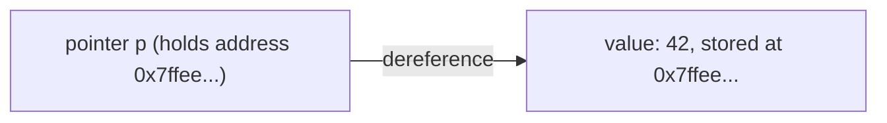
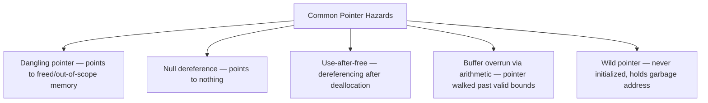
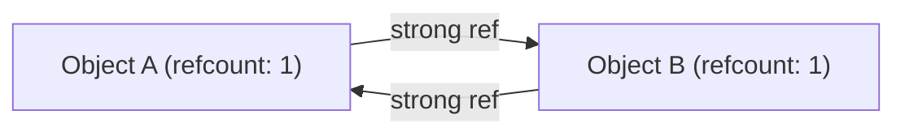

## Pointer and Reference Types


### Overview

A pointer or reference type is a value that does not itself hold data but instead holds the *location* of data stored elsewhere in memory. This indirection is one of the most consequential and historically contentious mechanisms in programming language design: it enables efficient sharing, mutation-through-aliasing, dynamic data structures (linked lists, trees, graphs), and polymorphism — while simultaneously being responsible for an enormous share of historical memory-safety bugs (dangling pointers, null dereferences, buffer overruns, use-after-free). Languages differ sharply in how much raw pointer power they expose versus how much they abstract behind a safer "reference" concept, and this spectrum is one of the clearest lines separating systems languages from managed/high-level languages.

### Core Concepts

**Address**

An address is a numeric identifier for a location in memory. A pointer's value, at the hardware level, is simply an address.

**Dereference**

Dereferencing a pointer means following it to access the data at the address it holds. This is the fundamental operation that makes pointers useful — a pointer alone is just a number; dereferencing turns it into "the thing over there."

**Aliasing**

Aliasing occurs when two or more pointers/references refer to the same underlying memory location. Aliasing is what allows mutation through one reference to be visible through another — the same phenomenon discussed under reference semantics for records, but here made explicit and directly manipulable.

**Indirection**

Indirection is the general concept of accessing a value through an intermediate reference rather than directly — pointers and references are both mechanisms of indirection, differing mainly in how much control and safety surrounds that indirection.



### Pointers vs. References: Terminology Across Languages

The words "pointer" and "reference" are used inconsistently across language communities, which is itself a frequent source of confusion:

| Language | Term used | Raw address arithmetic? | Can be null? |
| --- | --- | --- | --- |
| C / C++ | pointer | Yes | Yes |
| C++ | reference (`&`) | No | No (by design; cannot be reseated or null in well-formed code) |
| Rust | reference (`&T`, `&mut T`) | No (safe Rust) | No (statically prevented) |
| Rust | raw pointer (`*const T`, `*mut T`) | Yes (in `unsafe` blocks) | Yes |
| Java | reference | No | Yes |
| Python | reference (implicit; all variables) | No | Yes (`None`) |
| Go | pointer (`*T`) | No (no pointer arithmetic) | Yes (`nil`) |

The distinction "pointer" often implies raw address manipulation is possible, while "reference" often implies a safer, restricted form of indirection — though this is a general tendency in usage rather than a strict rule, since Go explicitly calls its safe, non-arithmetic indirection mechanism a "pointer."

### C — Raw Pointers

```c
int x = 42;
int *p = &x;      // p holds the address of x
printf("%d\n", *p); // dereference: prints 42

*p = 100;          // writing through the pointer mutates x
printf("%d\n", x);  // prints 100
```

**Pointer arithmetic** is a defining, and dangerous, C/C++ capability: pointers can be incremented, decremented, and offset, with the compiler scaling the offset by the pointee's size.

```c
int arr[5] = {10, 20, 30, 40, 50};
int *p = arr;       // arrays decay to a pointer to their first element
printf("%d\n", *(p + 2)); // 30 — pointer arithmetic, equivalent to arr[2]
```

**Null pointers** in C are represented by the value `NULL` (typically `0`), and dereferencing one is undefined behavior — in practice, usually a segmentation fault on hosted platforms, though the C standard itself does not guarantee any specific outcome.

```c
int *p = NULL;
printf("%d\n", *p); // undefined behavior — commonly crashes, not guaranteed to
```

### C++ — References as a Safer Layer

C++ introduced references (`&`) alongside pointers, intended as a more restricted, safer form of indirection for common cases.

```cpp
int x = 42;
int &ref = x;   // ref is an alias for x, not a separate pointer value
ref = 100;      // mutates x directly
```

Key differences from pointers, per the C++ standard's design:

- A reference must be initialized at declaration and cannot later be "reseated" to refer to a different object.
- A reference cannot be null in well-formed, defined-behavior code (though it is possible to construct a dangling reference through undefined behavior, e.g., binding to a destroyed temporary).
- References do not support pointer arithmetic.

```cpp
int a = 1, b = 2;
int &ref = a;
ref = b;   // this ASSIGNS b's value to a; it does NOT rebind ref to refer to b
```

This last example is a common source of confusion for programmers coming from pointer-based languages: `ref = b` is an assignment through the reference, not a rebinding of the reference itself — a documented distinction in C++'s reference semantics.

### Rust — Ownership-Checked References

Rust's references (`&T` for shared/immutable, `&mut T` for exclusive/mutable) are checked at compile time by the **borrow checker**, which enforces that references can never outlive the data they point to and that mutable and immutable borrows cannot coexist.

```rust
fn print_length(s: &String) {
    println!("{}", s.len());
}

let name = String::from("Alex");
print_length(&name); // borrow, not a move — name is still usable afterward
```

```rust
fn main() {
    let mut v = vec![1, 2, 3];
    let first = &v[0];       // immutable borrow
    v.push(4);                // ERROR: cannot borrow `v` as mutable while
                               // immutable borrow `first` is still in use
    println!("{}", first);
}
```

This compile-time rejection is Rust's core value proposition regarding pointer safety: memory-safety bugs that would be runtime crashes (or worse, silent corruption) in C become compile errors, a documented and central design goal of the borrow checker.

**Raw pointers** remain available in Rust for cases the borrow checker cannot express (FFI, certain data structures), but only within `unsafe` blocks, and the safety guarantees are explicitly the programmer's responsibility at that point.

```rust
let x = 42;
let p: *const i32 = &x;
unsafe {
    println!("{}", *p); // dereferencing a raw pointer requires `unsafe`
}
```

### Managed Languages — References Without Arithmetic

**Java**

```java
class Node {
    int value;
    Node next;
}

Node a = new Node();
Node b = a;      // b references the same object as a
b.value = 100;
System.out.println(a.value); // 100 — aliasing is visible
```

Java exposes references but no pointer arithmetic and no direct address manipulation; the garbage collector tracks reachability from references to determine when memory can be reclaimed, which is documented JVM behavior. Java references can be `null`, and dereferencing a `null` reference throws a `NullPointerException` at runtime rather than crashing silently or corrupting memory.

**Python**

Every Python variable is conceptually a reference to an object; there is no separate "value type" at the language-semantics level, though small integers and interned strings are implementation-optimized in CPython.

```python
a = [1, 2, 3]
b = a          # b references the same list object
b.append(4)
print(a)       # [1, 2, 3, 4] — aliasing visible
```

**Go**

```go
type Node struct {
    Value int
    Next  *Node
}

x := 42
p := &x          // p is a pointer to x
*p = 100          // dereference and mutate
fmt.Println(x)    // 100
```

Go retains pointer syntax (`&`, `*`) for explicitness about indirection and to allow efficient passing of large structs without copying, but deliberately omits pointer arithmetic — a documented design decision aimed at eliminating an entire class of C-style bugs while keeping some of C's performance-relevant indirection control.

### Memory Safety Hazards of Unrestricted Pointers



**Dangling pointer example (C)**

```c
int *make_dangling() {
    int local = 42;
    return &local;   // returns address of a stack variable that goes
                      // out of scope when the function returns
}

int *p = make_dangling();
printf("%d\n", *p);  // undefined behavior — local's storage may be reused
```

**Use-after-free (C)**

```c
int *p = malloc(sizeof(int));
*p = 42;
free(p);
printf("%d\n", *p);  // undefined behavior — memory has been released
```

Both of these classes of bug are, per the C and C++ standards, undefined behavior rather than guaranteed crashes — meaning the actual observed effect (correct-looking output, garbage, or a crash) is genuinely unpredictable and can vary by compiler, optimization level, and platform. This unpredictability is precisely why such bugs are considered severe: they may pass testing and manifest only in production or under different compiler flags — a documented and widely discussed characteristic of undefined behavior in C/C++, not a claim specific to any one toolchain.

### Language Design Responses to Pointer Hazards

| Approach | Mechanism | Example languages |
| --- | --- | --- |
| Garbage collection | Runtime tracks reachability; memory freed automatically, only when unreachable | Java, Python, Go, JavaScript, C# |
| Ownership + borrow checking | Compile-time verification that references never outlive their data | Rust |
| Reference counting | Each object tracks a count of active references; freed at zero | Swift (ARC), pre-GC Objective-C, C++ `shared_ptr` |
| No pointers exposed at all | Language never exposes raw memory addresses to the programmer | Python, JavaScript, high-level scripting languages generally |
| Smart pointers (opt-in safety layer atop raw pointers) | RAII-based wrapper types that automate deallocation | C++ `unique_ptr`, `shared_ptr` |

**C++ smart pointers**

```cpp
#include <memory>

std::unique_ptr<int> p = std::make_unique<int>(42);
// no manual delete needed — p's destructor frees the memory
// automatically when p goes out of scope (RAII)
```

`unique_ptr` enforces single ownership at compile time (it is move-only, not copyable), while `shared_ptr` implements reference counting for shared ownership — both are documented standard-library mechanisms introduced specifically to reduce manual `new`/`delete` pointer bugs, though they do not eliminate all hazards (e.g., `shared_ptr` cycles can still leak memory, and this is a documented, acknowledged limitation of pure reference counting).

### Reference Counting Cycles



If A holds a strong reference to B and B holds a strong reference back to A, neither refcount ever reaches zero, even if nothing external references either — both objects leak. This is a well-documented limitation of pure reference-counting garbage collection, addressed in Swift via `weak` and `unowned` reference qualifiers, and in C++ via `weak_ptr`, both of which hold a reference without incrementing the strong count.

```swift
class Node {
    var next: Node?
    weak var previous: Node?  // weak reference breaks the potential cycle
}
```

### Pointers to Functions

Many languages also support pointers/references to functions or code, distinct from pointers to data, enabling callback patterns and dynamic dispatch.

```c
int add(int a, int b) { return a + b; }

int (*fn_ptr)(int, int) = add;
printf("%d\n", fn_ptr(3, 4)); // 7
```

```rust
fn add(a: i32, b: i32) -> i32 { a + b }

let fn_ptr: fn(i32, i32) -> i32 = add;
println!("{}", fn_ptr(3, 4)); // 7
```

Function pointers underlie mechanisms like C's callback-based APIs (`qsort` comparator arguments) and are a conceptual ancestor of closures and first-class functions in higher-level languages, though closures additionally capture surrounding environment state, which a bare function pointer does not.

### Common Pitfalls

- **Confusing reference reassignment with mutation through a reference**: in C++, `ref = b` mutates the referent, not the binding — unlike a pointer, where `p = &b` rebinds the pointer itself to a new address.
- **Assuming garbage-collected languages have no aliasing bugs**: GC eliminates dangling-pointer and use-after-free classes of bugs, but aliasing-based logic errors (mutating a shared object unexpectedly through one of several references) remain entirely possible and common.
- **Treating Go's `*T` as C-style pointers**: Go pointers support dereferencing and address-of, but deliberately omit pointer arithmetic, so idioms relying on offsetting pointers do not translate.
- **Ignoring reference-count cycles**: assuming `shared_ptr`/ARC alone prevents all memory leaks overlooks the cycle case, which requires manual intervention via weak references.
- **Relying on undefined behavior "working" across compilers or optimization levels**: dangling-pointer or use-after-free code that appears to run correctly in one build configuration provides no guarantee it will continue to do so under a different compiler, flags, or platform.

### Key Points

- A pointer/reference holds the location of data rather than the data itself, enabling indirection, aliasing, and dynamic structures.
- C exposes raw pointers with arithmetic and no built-in safety; dereferencing null or dangling pointers is undefined behavior.
- C++ references offer a restricted, non-reseatable, non-null (in well-formed code) alternative to pointers for common cases.
- Rust's borrow checker enforces reference-lifetime and aliasing rules at compile time, converting many classes of pointer bugs into compile errors.
- Managed languages (Java, Python, Go, JavaScript) expose references without pointer arithmetic and rely on garbage collection to prevent use-after-free and dangling references.
- Reference counting (Swift ARC, C++ `shared_ptr`) is an alternative to tracing garbage collection but is vulnerable to reference cycles unless paired with weak references.
- Smart pointers in C++ (`unique_ptr`, `shared_ptr`) layer RAII-based automatic deallocation atop raw pointers to reduce, though not eliminate, manual memory-management bugs.
- Function pointers extend the pointer concept to executable code, underlying callback mechanisms and prefiguring closures in higher-level languages.

**Related Topics**

- Manual memory management vs. garbage collection strategies
- Ownership, borrowing, and lifetimes in Rust
- Smart pointers and RAII in C++
- Null safety and Option/Maybe types
- Value semantics vs. reference semantics
- Reference counting vs. tracing garbage collectors
- Closures and first-class functions