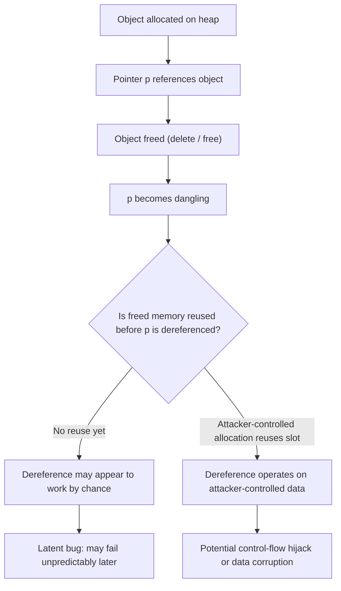

## Dangling Pointers and Memory Safety

### Definition

A dangling pointer is a pointer that still holds the address of a memory location after that memory has been freed, reallocated, or has otherwise gone out of scope. The pointer's bit pattern remains unchanged, but the memory it references no longer legitimately belongs to the program in the way the pointer assumes. Dereferencing a dangling pointer produces undefined behavior in languages that permit it.

Memory safety, in contrast, is a property of a language or program guaranteeing that memory accesses never read or write outside the bounds of a valid, live allocation, and never access memory after its lifetime has ended. Dangling pointers are one of the primary ways memory safety is violated.

### How Dangling Pointers Arise

**Freed Heap Memory**

The most common cause: memory is explicitly deallocated while a pointer to it still exists.

```c
int *p = malloc(sizeof(int));
*p = 42;
free(p);
// p is now dangling — the memory may be reused by the allocator
printf("%d\n", *p); // undefined behavior
```

**Stack Frame Expiration**

A pointer or reference to a local (automatic) variable becomes dangling once the enclosing function returns and its stack frame is popped.

```c
int *make_dangling(void) {
    int local = 10;
    return &local; // address of a variable that ceases to exist on return
}
```

**Reallocation**

`realloc` may move a block to a new address. Any pointer aliasing the old address is now dangling, even though the logical data still exists elsewhere.

```c
int *arr = malloc(10 * sizeof(int));
int *alias = arr;
arr = realloc(arr, 20 * sizeof(int));
// if realloc moved the block, alias is dangling
```

**Container Reallocation (Iterator Invalidation)**

In languages with dynamic array types, growing the container can invalidate pointers or iterators into it — a variant of the reallocation problem at the library level.

```cpp
std::vector<int> v = {1, 2, 3};
int *p = &v[0];
v.push_back(4); // may reallocate v's internal buffer
// p may now be dangling
```

**Object Destruction**

In object-oriented languages with manual lifetime management, a pointer or reference can outlive the object it refers to.

```cpp
Widget *w = new Widget();
delete w;
w->doSomething(); // dangling pointer dereference
```

### The Underlying Danger: Use-After-Free

Dereferencing a dangling pointer is commonly called a **use-after-free** bug. Its consequences are unpredictable because the outcome depends on what the memory allocator does with the freed block:

- The memory may be untouched, and the program appears to work correctly by chance.
- The memory may be reallocated to a different object, so the dangling pointer now silently corrupts unrelated data.
- The memory may be returned to the operating system, causing an immediate segmentation fault.
- In security-sensitive contexts, an attacker who can control what gets allocated into the freed slot may hijack program control flow (a well-documented class of exploitable memory-corruption vulnerability).

[Unverified] The specific behavior in any given run depends on the allocator implementation, memory layout, compiler optimizations, and operating system, so it cannot be predicted from source code alone.

### Related Defect: Double Free

A closely related error is freeing the same memory block twice, which typically corrupts the allocator's internal bookkeeping structures and can produce effects similar to a dangling pointer dereference — including crashes or, in adversarial conditions, exploitable corruption.

```c
free(p);
free(p); // double free — undefined behavior
```

### Visualizing the Lifecycle

<svg xmlns="http://www.w3.org/2000/svg" viewBox="0 0 820 420">
<text x="410" y="30" text-anchor="middle" font-size="18" font-weight="bold" fill="#1a1a2e">Dangling Pointer Lifecycle (svg_diagram)</text>

<rect x="30" y="70" width="160" height="70" rx="8" fill="#dff0d8" stroke="#3c763d" stroke-width="2" />
<text x="110" y="100" text-anchor="middle" font-size="13" fill="#1a1a2e">Pointer p</text>
<text x="110" y="120" text-anchor="middle" font-size="13" fill="#1a1a2e">points to valid block</text>
<line x1="190" y1="105" x2="240" y2="105" stroke="#1a1a2e" stroke-width="2" marker-end="url(#arrow1)" />

<rect x="240" y="70" width="160" height="70" rx="8" fill="#fcf8e3" stroke="#8a6d3b" stroke-width="2" />
<text x="320" y="100" text-anchor="middle" font-size="13" fill="#1a1a2e">free(p) called</text>
<text x="320" y="120" text-anchor="middle" font-size="13" fill="#1a1a2e">block returned to heap</text>
<line x1="400" y1="105" x2="450" y2="105" stroke="#1a1a2e" stroke-width="2" marker-end="url(#arrow1)" />

<rect x="450" y="70" width="160" height="70" rx="8" fill="#f2dede" stroke="#a94442" stroke-width="2" />
<text x="530" y="94" text-anchor="middle" font-size="13" fill="#1a1a2e">p still holds</text>
<text x="530" y="112" text-anchor="middle" font-size="13" fill="#1a1a2e">old address</text>
<text x="530" y="130" text-anchor="middle" font-size="13" fill="#a94442" font-weight="bold">(dangling)</text>
<line x1="610" y1="105" x2="660" y2="105" stroke="#1a1a2e" stroke-width="2" marker-end="url(#arrow1)" />

<rect x="660" y="70" width="140" height="70" rx="8" fill="#f2dede" stroke="#a94442" stroke-width="2" />
<text x="730" y="100" text-anchor="middle" font-size="13" fill="#1a1a2e">*p dereferenced</text>
<text x="730" y="120" text-anchor="middle" font-size="13" fill="#a94442">undefined behavior</text>

<line x1="530" y1="140" x2="530" y2="190" stroke="#1a1a2e" stroke-width="2" marker-end="url(#arrow1)" />
<rect x="60" y="200" width="200" height="60" rx="8" fill="#eef2f7" stroke="#5b6b7c" stroke-width="1.5" />
<text x="160" y="225" text-anchor="middle" font-size="12" fill="#1a1a2e">Block untouched</text>
<text x="160" y="243" text-anchor="middle" font-size="12" fill="#1a1a2e">appears "fine" by luck</text>
<rect x="310" y="200" width="200" height="60" rx="8" fill="#eef2f7" stroke="#5b6b7c" stroke-width="1.5" />
<text x="410" y="225" text-anchor="middle" font-size="12" fill="#1a1a2e">Block reallocated</text>
<text x="410" y="243" text-anchor="middle" font-size="12" fill="#1a1a2e">silent data corruption</text>
<rect x="560" y="200" width="200" height="60" rx="8" fill="#eef2f7" stroke="#5b6b7c" stroke-width="1.5" />
<text x="660" y="225" text-anchor="middle" font-size="12" fill="#1a1a2e">Page unmapped</text>
<text x="660" y="243" text-anchor="middle" font-size="12" fill="#1a1a2e">crash / segfault</text>
<line x1="530" y1="200" x2="160" y2="200" stroke="#1a1a2e" stroke-width="1.5" />
<line x1="530" y1="200" x2="660" y2="200" stroke="#1a1a2e" stroke-width="1.5" />

<rect x="130" y="300" width="560" height="90" rx="10" fill="#d9edf7" stroke="#31708f" stroke-width="2" />
<text x="410" y="325" text-anchor="middle" font-size="14" font-weight="bold" fill="#1a1a2e">Prevention Strategies</text>
<text x="410" y="348" text-anchor="middle" font-size="12" fill="#1a1a2e">Ownership/borrow checking · Garbage collection · Smart pointers</text>
<text x="410" y="368" text-anchor="middle" font-size="12" fill="#1a1a2e">Set pointer to null after free · Sanitizer tooling (ASan, Valgrind)</text>
</svg>

### Language-Level Mitigation Strategies

**Garbage Collection**

Languages like Java, C#, Go, Python, and JavaScript avoid dangling pointers by design: memory is not freed explicitly by the programmer. A garbage collector reclaims an object only when it determines the object is unreachable from any live reference, so a reference to a live object can never point to freed memory. This eliminates dangling pointers for garbage-collected objects but introduces its own tradeoffs (pause times, throughput overhead, and non-determinism in reclamation timing).

**Ownership and Borrow Checking**

Rust's ownership model enforces, at compile time, that a value has exactly one owner responsible for freeing it, and that references (borrows) cannot outlive the data they point to. The borrow checker rejects programs at compile time where a reference could become dangling.

```rust
fn make_dangling() -> &i32 {
    let local = 10;
    &local // compile-time error: `local` does not live long enough
}
```

[Inference] This compile-time rejection is why Rust is frequently described as providing memory safety "without a garbage collector" — the cost is paid in compile-time restrictions and occasional friction with the borrow checker rather than in runtime overhead.

**Smart Pointers (C++)**

Modern C++ mitigates, without eliminating, dangling-pointer risk through RAII-based smart pointers:

- `std::unique_ptr` — enforces single ownership; the object is destroyed when the owning `unique_ptr` goes out of scope.
- `std::shared_ptr` — reference-counted shared ownership; the object is destroyed when the last `shared_ptr` referencing it is destroyed.
- `std::weak_ptr` — a non-owning reference to a `shared_ptr`-managed object that can be checked for validity before use, specifically to avoid dangling access.

```cpp
std::shared_ptr<Widget> sp = std::make_shared<Widget>();
std::weak_ptr<Widget> wp = sp;
sp.reset(); // Widget destroyed
if (auto locked = wp.lock()) {
    locked->doSomething(); // safe: only runs if object still exists
} else {
    // handle expired reference
}
```

Smart pointers reduce but do not fully eliminate the possibility of dangling access; raw pointers or references extracted from a smart pointer (e.g., via `.get()`) can still dangle if misused.

**Regions and Arenas**

Some systems allocate groups of objects from a single region (arena) and free the entire region at once, which can reduce the surface area for individual dangling-pointer bugs by tying lifetimes to a coarser-grained scope. [Inference] This approach trades fine-grained control for simpler reasoning about lifetimes, at the cost of potentially holding memory longer than strictly necessary.

**Null-ing Pointers After Free**

A common defensive convention in manually-managed languages is to set a pointer to `NULL` immediately after freeing it, converting a silent dangling-pointer dereference into an immediate, detectable null-pointer dereference.

```c
free(p);
p = NULL;
if (p != NULL) {
    *p = 5; // this branch is now unreachable via this pointer
}
```

This does not help with **other** pointers that still alias the same freed memory (aliasing dangling pointers), since only the nulled pointer itself is protected.

### Detection Tooling

- **Valgrind (Memcheck)** — a dynamic binary instrumentation tool that detects use-after-free, invalid reads/writes, and memory leaks at runtime.
- **AddressSanitizer (ASan)** — a compiler-inserted instrumentation (available in GCC and Clang) that poisons freed memory regions so subsequent accesses trigger immediate, precise crash reports.
- **Static analyzers** (e.g., Clang Static Analyzer, Coverity) — attempt to detect potential dangling-pointer patterns at compile time through control-flow and data-flow analysis, without executing the program.

[Unverified] Detection tool effectiveness varies by codebase complexity, and dynamic tools generally cannot find bugs on code paths that are not actually executed during testing.

### Comparative View Across Language Paradigms

| Language | Dangling Pointer Possible? | Primary Mechanism |
| --- | --- | --- |
| C / C++ (raw pointers) | Yes | Manual memory management; no compile- or run-time protection |
| C++ (smart pointers) | Reduced | RAII + reference counting / ownership |
| Rust | No (safe code) | Compile-time ownership and borrow checking |
| Java / C# | No | Tracing garbage collection |
| Python / JavaScript | No | Reference counting and/or tracing garbage collection |
| Go | No | Tracing garbage collection |

`unsafe` blocks in Rust, and native interop layers (e.g., JNI in Java, P/Invoke in C#, native modules in Node.js) can reintroduce dangling-pointer risk even in otherwise memory-safe languages, since they bypass the language's normal safety guarantees.

### Control Flow of a Use-After-Free Exploit Pattern



### Best Practices Summary

- Prefer languages or constructs with compile-time or runtime lifetime enforcement when memory safety is critical.
- In C/C++, prefer smart pointers and RAII over manual `malloc`/`free` or `new`/`delete`.
- Null out raw pointers immediately after freeing them.
- Avoid retaining raw pointers or references derived from containers across operations that may reallocate (e.g., `push_back`, `insert`).
- Use sanitizers (ASan, Valgrind) routinely in testing and CI pipelines, not just when a bug is suspected.
- Treat any `unsafe` code block, FFI boundary, or native interop layer as a zone requiring manual, careful lifetime reasoning even within a memory-safe language.

**Related Topics**

- Use-after-free vulnerabilities and exploit mitigation techniques
- Rust's ownership, borrowing, and lifetime annotations in depth
- Garbage collection algorithms (mark-and-sweep, generational, reference counting)
- RAII (Resource Acquisition Is Initialization) as a general resource-management pattern
- Memory leaks as the inverse failure mode of dangling pointers
- Buffer overflows and other spatial memory-safety violations
- Data races and memory safety in concurrent programming