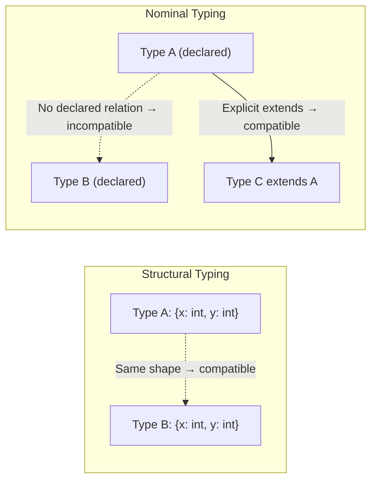

## Type Theory and Structural Versus Nominal Typing


### Overview

Type theory is the branch of mathematical logic and computer science concerned with classifying values into types and studying the rules governing how types relate, combine, and constrain program behavior. One of the most consequential design decisions a language makes, grounded in this theory, is how it decides whether two types are compatible: by their **structure** (structural typing) or by their **declared identity** (nominal typing). This decision affects type checking, subtyping, code reuse, and how errors are caught.

### Foundations of Type Theory

**What a Type Is**

A type can be understood, informally, as a set of values together with the operations valid on them. Formally, type theory treats types as classifiers that a type system uses to prove properties about programs before they run (in statically typed languages) or to guide runtime dispatch and safety checks (in dynamically typed languages).

**Type Equivalence**

Type equivalence answers the question: are two type expressions "the same type" for purposes of assignment, function calls, and substitution? This is the central question that splits into structural and nominal answers.

**Type Compatibility and Subtyping**

Related to equivalence is subtyping: when is a value of type $A$ permitted where a value of type $B$ is expected? This is often written $A <: B$, read "$A$ is a subtype of $B$." The rule governing when $A <: B$ holds differs sharply between structural and nominal systems.

### Structural Typing

**Definition**

In a structural type system, two types are considered equivalent — or one is considered a subtype of another — purely based on the shape of their members: field names and types, method signatures, and so on. The name given to a type is irrelevant to compatibility.

**Example (TypeScript)**

```typescript
interface Point2D {
  x: number;
  y: number;
}

interface Coordinate {
  x: number;
  y: number;
}

function printPoint(p: Point2D) {
  console.log(`${p.x}, ${p.y}`);
}

const c: Coordinate = { x: 1, y: 2 };
printPoint(c); // valid — Coordinate has the same structure as Point2D
```

`Point2D` and `Coordinate` are never declared as related to one another, yet `c` is accepted wherever `Point2D` is expected, because TypeScript checks the shape, not the name.

**Example (Go — Interface Satisfaction)**

Go's interfaces are satisfied structurally: a type need not declare that it implements an interface.

```go
type Stringer interface {
    String() string
}

type Point struct{ X, Y int }

func (p Point) String() string {
    return fmt.Sprintf("(%d, %d)", p.X, p.Y)
}

// Point implicitly satisfies Stringer — no "implements" clause needed
var s Stringer = Point{1, 2}
```

**Structural Subtyping (Width and Depth)**

Structural systems commonly support:

- **Width subtyping** — a type with extra fields is still a subtype, provided it has at least the required fields.
- **Depth subtyping** — a type is a subtype if its corresponding fields are themselves subtypes of the required fields' types.

```typescript
interface Named { name: string; }

const obj = { name: "Ada", age: 36 };
function greet(n: Named) { console.log(n.name); }
greet(obj); // valid — obj has more fields than required (width subtyping)
```

### Nominal Typing

**Definition**

In a nominal type system, two types are equivalent only if they share the same declared name/identity — typically established via explicit declaration, inheritance, or an `implements`/`extends` clause. Identical structure alone is insufficient.

**Example (Java)**

```java
class Point2D {
    double x, y;
}

class Coordinate {
    double x, y;
}

void printPoint(Point2D p) { System.out.println(p.x + ", " + p.y); }

Coordinate c = new Coordinate();
printPoint(c); // compile-time error — Coordinate is not a Point2D, despite identical fields
```

Even though `Point2D` and `Coordinate` are structurally identical, Java's nominal type system rejects the call because there is no declared relationship between the two classes.

**Example (Java — Nominal Subtyping via Inheritance)**

```java
class Animal { void speak() { System.out.println("..."); } }
class Dog extends Animal { void speak() { System.out.println("Woof"); } }

Animal a = new Dog(); // valid — Dog is explicitly declared to extend Animal
```

Here, `Dog <: Animal` holds specifically because the `extends` clause explicitly declares the relationship — not because `Dog` happens to have compatible methods.

### Side-by-Side Comparison

| Aspect | Structural Typing | Nominal Typing |
| --- | --- | --- |
| Compatibility basis | Shape/members of the type | Declared name/identity |
| Explicit relationship required? | No | Yes (`implements`, `extends`, or equivalent) |
| Accidental compatibility | Possible (two unrelated types can be interchangeable) | Not possible |
| Refactoring risk | Renaming/restructuring can silently break or create compatibility | Compatibility is explicit and intentional |
| Common languages | TypeScript, Go, OCaml (structural aspects), Python (via `Protocol`) | Java, C#, C++, Rust (traits are nominal but implemented structurally in some respects) |
| Typical use case | Flexible, duck-typing-like interfaces without inheritance hierarchies | Strong intent-driven contracts; large codebases wanting explicit APIs |

### Duck Typing as a Dynamic Analogue

Structural typing is the static-typing counterpart to duck typing found in dynamically typed languages: "if it walks like a duck and quacks like a duck, treat it as a duck." Python is dynamically typed and does not check types before running, but its `typing.Protocol` (introduced via PEP 544) brings an explicitly structural, statically-checkable analogue into an otherwise dynamic language.

```python
from typing import Protocol

class Quacker(Protocol):
    def quack(self) -> str: ...

class Duck:
    def quack(self) -> str:
        return "Quack!"

def make_it_quack(q: Quacker) -> None:
    print(q.quack())

make_it_quack(Duck()) # valid under static analysis — Duck structurally satisfies Quacker
```

[Inference] This shows that "structural vs. nominal" is a property a language's type system can choose per-construct, not necessarily an all-or-nothing commitment across the whole language, since Python is nominally-oriented in class inheritance (`isinstance` checks by default) yet supports structural typing specifically through `Protocol`.

### Diagrammatic Comparison



### Visual: Compatibility Decision Path

<svg xmlns="http://www.w3.org/2000/svg" viewBox="0 0 800 380">
<text x="400" y="30" text-anchor="middle" font-size="18" font-weight="bold" fill="#1a1a2e">Type Compatibility Check (svg_diagram)</text>
<rect x="320" y="60" width="160" height="60" rx="8" fill="#eef2f7" stroke="#5b6b7c" stroke-width="2" />
<text x="400" y="95" text-anchor="middle" font-size="13" fill="#1a1a2e">Is value V usable</text>
<text x="400" y="110" text-anchor="middle" font-size="11" fill="#1a1a2e">as type T?</text>
<line x1="400" y1="120" x2="400" y2="160" stroke="#1a1a2e" stroke-width="2" marker-end="url(#arrow2)" />
<rect x="320" y="160" width="160" height="60" rx="8" fill="#fcf8e3" stroke="#8a6d3b" stroke-width="2" />
<text x="400" y="185" text-anchor="middle" font-size="12" fill="#1a1a2e">What kind of type</text>
<text x="400" y="203" text-anchor="middle" font-size="12" fill="#1a1a2e">system is this?</text>
<line x1="330" y1="220" x2="180" y2="270" stroke="#1a1a2e" stroke-width="2" marker-end="url(#arrow2)" />
<line x1="470" y1="220" x2="620" y2="270" stroke="#1a1a2e" stroke-width="2" marker-end="url(#arrow2)" />
<rect x="60" y="270" width="240" height="90" rx="8" fill="#dff0d8" stroke="#3c763d" stroke-width="2" />
<text x="180" y="295" text-anchor="middle" font-size="13" font-weight="bold" fill="#1a1a2e">Structural</text>
<text x="180" y="315" text-anchor="middle" font-size="12" fill="#1a1a2e">Check: does V have all</text>
<text x="180" y="332" text-anchor="middle" font-size="12" fill="#1a1a2e">members required by T?</text>
<text x="180" y="349" text-anchor="middle" font-size="12" fill="#1a1a2e">Name of V's type ignored</text>
<rect x="500" y="270" width="240" height="90" rx="8" fill="#f2dede" stroke="#a94442" stroke-width="2" />
<text x="620" y="295" text-anchor="middle" font-size="13" font-weight="bold" fill="#1a1a2e">Nominal</text>
<text x="620" y="315" text-anchor="middle" font-size="12" fill="#1a1a2e">Check: is V's declared type</text>
<text x="620" y="332" text-anchor="middle" font-size="12" fill="#1a1a2e">T, or declared as extending/</text>
<text x="620" y="349" text-anchor="middle" font-size="12" fill="#1a1a2e">implementing T?</text>
</svg>

### Trade-offs

**Advantages of Structural Typing**

- Enables flexible composition without requiring types to anticipate every interface they might satisfy.
- Reduces boilerplate: no need to declare `implements` for every interface a type happens to satisfy.
- Works well with anonymous or ad-hoc object shapes (common in JavaScript/TypeScript codebases).

**Risks of Structural Typing**

- Two semantically unrelated types with coincidentally identical shapes can be silently interchanged, which may violate the programmer's intended domain semantics — for example, a `Meters` type and a `Seconds` type both represented as `{ value: number }` would be structurally interchangeable despite representing incompatible units. [Inference] This risk is commonly cited as a reason teams introduce nominal-style wrapper patterns (e.g., branded types) even within structurally-typed languages.

**Advantages of Nominal Typing**

- Compatibility is explicit and intentional, reducing accidental misuse.
- API contracts are self-documenting through the type hierarchy.
- Refactoring tools can more reliably reason about relationships since they are declared, not inferred from shape.

**Risks of Nominal Typing**

- Can force unrelated-but-structurally-identical types to be manually related (e.g., via adapter/wrapper types or shared interfaces) even when no such relationship was originally designed.
- Encourages deeper inheritance hierarchies in older nominal-only languages, which can increase coupling.

### Simulating One Paradigm Inside the Other

**Nominal Typing Simulated Structurally (Branded/Nominal Types in TypeScript)**

```typescript
type Meters = number & { readonly __brand: "Meters" };
type Seconds = number & { readonly __brand: "Seconds" };

function toMeters(n: number): Meters {
  return n as Meters;
}

function speed(distance: Meters, time: Seconds): number {
  return distance / time;
}
// speed(5 as Seconds, 2 as Meters) — would be caught due to the brand mismatch,
// even though both are structurally `number`-based
```

**Structural Typing Simulated Nominally (Marker Interfaces)**

Older Java code sometimes uses empty "marker" interfaces (e.g., `Serializable`) purely as tags, which is a nominal mechanism used to approximate a capability check without inspecting structure.

### Formal Notes

In type-theoretic terms, structural subtyping is often formalized through rules such as:

$$\frac{\{x_1: T_1, \ldots, x_n: T_n\} \subseteq \{y_1: U_1, \ldots, y_m: U_m\} \quad \text{(width)} \qquad T_i <: U_i \; \forall i \; \text{(depth)}}{\{y_1: U_1, \ldots, y_m: U_m\} <: \{x_1: T_1, \ldots, x_n: T_n\}}$$

This states that a record type with all required labels present (width), whose corresponding field types are themselves compatible by subtyping (depth), is a subtype of the required record type. Nominal subtyping, by contrast, is typically defined not by a structural inference rule but by an explicit declaration relation, often written as an axiom directly from the source program's `extends`/`implements` clauses rather than derived from field comparison.

### Language Positioning Summary

| Language | Typing Discipline | Notes |
| --- | --- | --- |
| TypeScript | Primarily structural | Even classes are compared structurally by default |
| Go | Structural (interfaces only) | Concrete struct types are otherwise nominal |
| OCaml | Structural (object/module types) | Variants/records have nominal aspects too |
| Java | Nominal | Structural typing absent from the core type system |
| C# | Nominal | Some structural-like features via duck-typed generics constraints in narrow cases |
| Rust | Nominal (traits) | Trait implementation must be explicit (`impl Trait for Type`), even though usage patterns can resemble structural interfaces |
| Python | Dynamic; structural via `Protocol` | Nominal by default (`isinstance`), structural opt-in via `typing.Protocol` |

**Next Steps**

- Subtyping variance: covariance, contravariance, and invariance in generic types
- Duck typing and dynamic typing more broadly
- Algebraic data types and how they interact with structural pattern matching
- Trait systems and typeclasses (Rust traits, Haskell typeclasses) as a middle ground
- Row polymorphism and extensible records in structurally typed languages
- Gradual typing systems that mix static structural checks with dynamic fallback