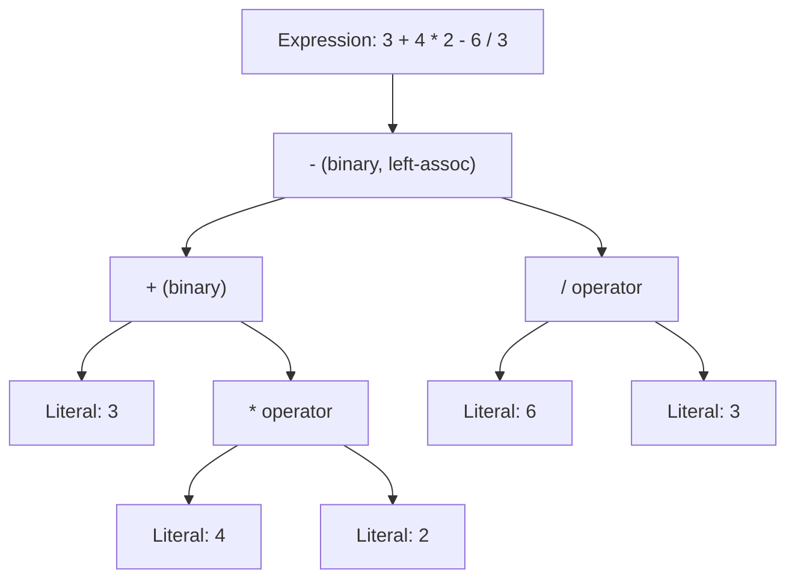

## Arithmetic Expressions and Operator Precedence

### Definition

An arithmetic expression is a syntactic construct combining literals, variables, and operators that evaluates to a numeric value. Operator precedence is the set of rules a language uses to determine which operator in an expression containing multiple operators is applied first, when no explicit grouping (parentheses) disambiguates the order.

### Core Concepts

**Precedence**

Precedence ranks operators by binding strength. Higher-precedence operators bind more tightly to their operands and are evaluated before lower-precedence ones.



```
2 + 3 * 4
```

Multiplication has higher precedence than addition, so this evaluates as $2 + (3 \times 4) = 14, not $(2 + 3) \times 4 = 20
.

**Associativity**

When two operators of the *same* precedence appear adjacently, associativity determines grouping direction:

- **Left-associative**: grouped left-to-right. Most arithmetic operators (`+`, `-`, `*`, `/`) are left-associative.
- **Right-associative**: grouped right-to-left. Exponentiation (`**` in Python) and assignment (`=`) are commonly right-associative.

```python
10 - 3 - 2   # left-associative: (10 - 3) - 2 = 5, not 10 - (3 - 2) = 9
2 ** 3 ** 2  # right-associative: 2 ** (3 ** 2) = 512, not (2 ** 3) ** 2 = 64
```

**Parentheses**

Explicit grouping with `()` overrides both precedence and associativity, and is evaluated with the highest priority in essentially every mainstream language.



```
(2 + 3) * 4  # forces addition first → 20
```

### Standard Precedence Table (Common Across Most C-Family Languages)

| Precedence (high to low) | Operators | Associativity |
| --- | --- | --- |
| 1 | `()` (grouping), function call, array subscript | Left-to-right |
| 2 | Unary `+`, unary `-`, `!`, `~`, prefix `++`/`--` | Right-to-left |
| 3 | `**` (exponentiation, where supported) | Right-to-left |
| 4 | `*`, `/`, `%` (multiplication, division, modulo) | Left-to-right |
| 5 | `+`, `-` (binary addition, subtraction) | Left-to-right |
| 6 | `\<\<`, `\>\>` (bitwise shifts) | Left-to-right |
| 7 | `<`, `<=`, `>`, `>=` (relational) | Left-to-right |
| 8 | `==`, `!=` (equality) | Left-to-right |
| 9 | `&` (bitwise AND) | Left-to-right |
| 10 | `^` (bitwise XOR) | Left-to-right |
| 11 | `|` (bitwise OR) | Left-to-right |
| 12 | `&&` (logical AND) | Left-to-right |
| 13 | `||` (logical OR) | Left-to-right |
| 14 | `=`, `+=`, `-=`, etc. (assignment) | Right-to-left |

[Unverified] Exact precedence levels and the presence/absence of specific operators vary by language; this table reflects a common C-family baseline (broadly shared by C, C++, Java, JavaScript, and similar languages) and should be checked against a specific language's reference manual for edge cases such as where `**` sits relative to unary minus.

### Worked Example: Full Evaluation Trace



```
3 + 4 * 2 - 6 / 3
```

Step-by-step, applying precedence (multiplication and division before addition and subtraction), then left-to-right associativity among equal-precedence operators:

1. `4 * 2` → `8`
2. `6 / 3` → `2`
3. Expression is now `3 + 8 - 2`
4. Left-to-right: `3 + 8` → `11`
5. `11 - 2` → `9`

Final result: `9`.

### The Classic Ambiguity: Unary Minus and Exponentiation

A well-known precedence subtlety appears when unary minus interacts with exponentiation:

```python
-2 ** 2   # Python: evaluates as -(2 ** 2) = -4, NOT (-2) ** 2 = 4
```

[Inference] This is because in Python's grammar, unary minus binds *less* tightly than `**`, which surprises many learners who expect unary operators to always bind tightest. This specific ordering is a documented, language-defined choice rather than a universal mathematical convention, and other languages may resolve the same expression differently, so this exact case should always be checked against the specific language's operator precedence reference rather than assumed to generalize.

### Diagram: Precedence-Driven Parse Tree



The parse tree shows that `*` and `/` are structurally nested *beneath* the `+`/`-` operators, meaning they are evaluated first as the tree is walked bottom-up during evaluation.

### Visual: Precedence Binding Strength

<svg xmlns="http://www.w3.org/2000/svg" viewBox="0 0 780 320">
<text x="390" y="30" text-anchor="middle" font-size="18" font-weight="bold" fill="#1a1a2e">Operator Binding Strength (svg_diagram)</text>
<line x1="60" y1="270" x2="720" y2="270" stroke="#1a1a2e" stroke-width="2" />
<text x="390" y="300" text-anchor="middle" font-size="12" fill="#1a1a2e">Lower binding strength (evaluated last) → Higher binding strength (evaluated first)</text>

<rect x="80" y="220" width="90" height="50" fill="#f2dede" stroke="#a94442" stroke-width="1.5" />
<text x="125" y="245" text-anchor="middle" font-size="12" fill="#1a1a2e">= </text>
<text x="125" y="260" text-anchor="middle" font-size="10" fill="#1a1a2e">assignment</text>
<rect x="190" y="195" width="90" height="75" fill="#fcf8e3" stroke="#8a6d3b" stroke-width="1.5" />
<text x="235" y="225" text-anchor="middle" font-size="12" fill="#1a1a2e">|| &amp;&amp;</text>
<text x="235" y="240" text-anchor="middle" font-size="10" fill="#1a1a2e">logical</text>
<rect x="300" y="165" width="90" height="105" fill="#fcf8e3" stroke="#8a6d3b" stroke-width="1.5" />
<text x="345" y="200" text-anchor="middle" font-size="12" fill="#1a1a2e">== &lt; &gt;</text>
<text x="345" y="215" text-anchor="middle" font-size="10" fill="#1a1a2e">comparison</text>
<rect x="410" y="135" width="90" height="135" fill="#d9edf7" stroke="#31708f" stroke-width="1.5" />
<text x="455" y="170" text-anchor="middle" font-size="12" fill="#1a1a2e">+ -</text>
<text x="455" y="185" text-anchor="middle" font-size="10" fill="#1a1a2e">additive</text>
<rect x="520" y="100" width="90" height="170" fill="#d9edf7" stroke="#31708f" stroke-width="1.5" />
<text x="565" y="135" text-anchor="middle" font-size="12" fill="#1a1a2e">* / %</text>
<text x="565" y="150" text-anchor="middle" font-size="10" fill="#1a1a2e">multiplicative</text>
<rect x="630" y="60" width="90" height="210" fill="#dff0d8" stroke="#3c763d" stroke-width="1.5" />
<text x="675" y="95" text-anchor="middle" font-size="12" fill="#1a1a2e">** ()</text>
<text x="675" y="110" text-anchor="middle" font-size="10" fill="#1a1a2e">power/grouping</text>
</svg>

### Short-Circuit Evaluation and Precedence Interaction

Logical operators' low precedence relative to comparison operators enables idiomatic guard expressions:

```javascript
if (x !== null && x.value > 0) { /* ... */ }
```

Because `!==` and `>` bind tighter than `&&`, this parses as `(x !== null) && (x.value > 0)`, and `&&` short-circuits so `x.value` is never accessed when `x` is `null`. If precedence were reversed, this common null-guard idiom would not work correctly.

### Modulo and Its Precedence Placement

The modulo operator `%` (remainder) sits at the same precedence level as `*` and `/` in most C-family languages, which can be surprising given it is conceptually distinct from multiplication/division.



```
17 % 5 + 1   // evaluates as (17 % 5) + 1 = 2 + 1 = 3
```

[Unverified] Modulo's exact semantics for negative operands (whether the result takes the sign of the dividend or the divisor) is language-specific and should not be assumed to generalize; this affects evaluation results even when precedence is correctly understood.

### Mixed-Type Arithmetic and Implicit Coercion Interaction

Precedence determines *order*, but type coercion rules determine *what value results* once operators are applied to mixed operand types. These are separate concerns that interact:

```javascript
"5" + 3 * 2   // * evaluates first: 3 * 2 = 6 (numeric)
              // then "5" + 6 → string concatenation → "56"
```

Here precedence correctly applies `*` before `+`, but the `+` operator's behavior itself depends on operand types (numeric addition vs. string concatenation), a separate rule layered on top of precedence.

### Compiler/Interpreter Perspective

During parsing, operator precedence and associativity are typically encoded either through:

- **Precedence climbing / operator-precedence parsing** — an efficient parsing technique that directly encodes precedence levels and associativity into a loop-based algorithm, commonly used in expression parsers.
- **Grammar stratification** — defining a separate grammar production rule per precedence level (e.g., `expression → term (('+' | '-') term)*` and `term → factor (('*' | '/') factor)*`), which naturally encodes precedence through the grammar's structure and is common in recursive-descent parsers.

Both techniques produce an abstract syntax tree (AST) in which higher-precedence operations are nested more deeply, matching the parse tree shown earlier.

### Common Pitfalls

- Assuming precedence is universal across all languages, when in fact bitwise-versus-comparison-operator precedence in particular varies and has historically caused bugs (C's `&`/`|` sitting below `==` is a frequently cited source of subtle defects requiring explicit parenthesization).
- Forgetting that unary minus and binary minus are different operators with potentially different precedence levels.
- Relying on implicit precedence in complex expressions rather than using parentheses for clarity, which harms readability even when the precedence rules are technically correct.
- Assuming exponentiation is always right-associative across languages that provide it as a built-in operator; this is common but should be verified per language.

### Best Practices

- Use parentheses liberally in any expression mixing more than two distinct operator types, even when not strictly required, to aid human readability.
- Do not rely on memorized precedence tables for bitwise operators mixed with comparisons; parenthesize explicitly.
- When translating a mathematical formula into code, verify the generated expression against the intended order using a small set of test values before trusting it in production logic.

**Related Topics**

- Abstract syntax trees and expression parsing techniques (recursive descent, precedence climbing, Pratt parsing)
- Type coercion and implicit conversion rules in mixed-type expressions
- Short-circuit evaluation of logical operators
- Floating-point arithmetic precision and rounding error accumulation in expressions
- Operator overloading and how it interacts with fixed precedence rules
- Bitwise operators and their common precedence pitfalls