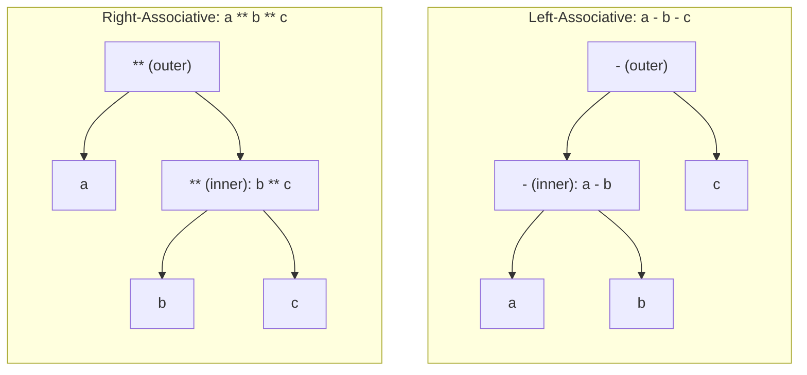

## Operator Associativity Rules

### Definition

Associativity determines how operators of the *same* precedence level are grouped when they appear consecutively in an expression, in the absence of parentheses. It answers a narrower question than precedence: precedence resolves conflicts *between* operators of different rank (e.g., `*` vs `+`), while associativity resolves conflicts *among repeated operators of equal rank* (e.g., `-` next to `-`, or `**` next to `**`).

### Left Associativity

An operator is left-associative if, when chained, it groups from left to right — the leftmost operation is evaluated first, and its result becomes the left operand of the next operation.

$$a - b - c \;=\; (a - b) - c$$

```python
10 - 3 - 2   # (10 - 3) - 2 = 5
```

Most binary arithmetic operators (`+`, `-`, `*`, `/`, `%`) are left-associative in the overwhelming majority of mainstream languages, matching conventional mathematical reading order for these operators.

### Right Associativity

An operator is right-associative if, when chained, it groups from right to left — the rightmost operation is evaluated first, and its result becomes the right operand of the preceding operation.

$$

a ;{**}; b ;{**}; c ;=; a ;{**}; (b ;{**}; c)

$$

```python
2 ** 3 ** 2   # 2 ** (3 ** 2) = 2 ** 9 = 512, not (2 ** 3) ** 2 = 64
```

**Assignment as the Canonical Right-Associative Case**

Assignment operators are right-associative in most C-family and similarly structured languages, which is precisely what makes chained assignment work as intuitively expected:

```c
int a, b, c;
a = b = c = 5;
// parses as: a = (b = (c = 5))
// c is assigned 5, that result (5) is assigned to b, then to a
```

If assignment were left-associative instead, `a = b = c = 5` would parse as `((a = b) = c) = 5`, which is nonsensical (assigning to the result of an assignment expression) and would be rejected or behave very differently in most languages.

### Non-Associative Operators

Some operators are defined as non-associative, meaning the language's grammar does not permit them to be chained at all without explicit parentheses — chaining them is a syntax error rather than being resolved by an implicit grouping direction.

```python
# In some languages, chained comparisons without special-casing are non-associative:
# a < b < c  →  syntax error if < is non-associative
```

[Unverified] Whether comparison chaining is treated as non-associative, left-associative, or given special chained semantics differs substantially by language and must be checked individually — Python, for instance, gives chained comparisons special semantics rather than plain non-associativity, treated separately below.

### Special Case: Chained Comparisons in Python

Python does not treat `a < b < c` as strictly non-associative or as ordinary left-to-right binary chaining of a single operator; instead, it defines chained comparisons with dedicated semantics equivalent to `a < b and b < c`, with `b` evaluated only once.

```python
1 < 2 < 3   # True — equivalent to (1 < 2) and (2 < 3)
3 < 2 < 1   # False
```

[Inference] This is a deliberate language design choice distinct from generic associativity rules, since it does not correspond to `(a < b) < c` (which would be nonsensical, as a boolean compared to `c`) — it is documented Python behavior specific to comparison chaining rather than a general associativity pattern applicable elsewhere.

### Associativity Table Across Common Operator Classes

| Operator Class | Typical Associativity | Example Languages |
| --- | --- | --- |
| Addition/subtraction (`+`, `-`) | Left | C, Java, Python, JavaScript |
| Multiplication/division/modulo (`*`, `/`, `%`) | Left | C, Java, Python, JavaScript |
| Exponentiation (`**`, `^`) | Right | Python (`**`), Excel/Fortran-style languages |
| Unary prefix (`-x`, `!x`, `++x`) | Right (conceptually, applied nearest operand first) | C, Java, JavaScript |
| Assignment (`=`, `+=`, etc.) | Right | C, Java, JavaScript, Python |
| Ternary conditional (`? :`) | Right | C, Java, JavaScript |
| Function composition / pipe operators | Left (typically) | Varies by language; check per-language |
| String concatenation (`+` overload, `.` in PHP) | Left | JavaScript, PHP |

[Unverified] This table reflects common conventions; specific languages may deviate, and associativity for less common operators (e.g., bitwise shift chains, custom overloaded operators) should always be verified against the specific language specification rather than assumed from this general table.

### Worked Example: Ternary Right-Associativity

The conditional (ternary) operator's right-associativity enables clean chaining that resembles an if-else-if ladder:

```javascript
let grade = score >= 90 ? "A"
          : score >= 80 ? "B"
          : score >= 70 ? "C"
          : "F";
// parses as:
// score >= 90 ? "A" : (score >= 80 ? "B" : (score >= 70 ? "C" : "F"))
```

If the ternary operator were left-associative, this chain would instead group as `((score >= 90 ? "A" : score >= 80) ? "B" : score >= 70) ? "C" : "F"`, which would be both semantically wrong and, in statically typed languages, likely a type error.

### Diagram: Left vs. Right Grouping



The left-associative tree nests the earlier (leftmost) operation deeper on the left branch, while the right-associative tree nests the later (rightmost) operation deeper on the right branch — this structural difference is what the parser encodes when it applies associativity rules.

### Visual: Grouping Direction

<svg xmlns="http://www.w3.org/2000/svg" viewBox="0 0 780 300">
<text x="390" y="30" text-anchor="middle" font-size="18" font-weight="bold" fill="#1a1a2e">Associativity Grouping Direction (svg_diagram)</text>


<text x="60" y="90" font-size="13" font-weight="bold" fill="`#1a1a2e`">Left-assoc:</text>

<text x="180" y="90" font-size="16" fill="`#1a1a2e`">a</text>

<text x="210" y="90" font-size="16" fill="`#1a1a2e`">-</text>

<text x="240" y="90" font-size="16" fill="`#1a1a2e`">b</text>

<text x="270" y="90" font-size="16" fill="`#1a1a2e`">-</text>

<text x="300" y="90" font-size="16" fill="`#1a1a2e`">c</text>

<path d="M 180 105 Q 210 130 240 105" stroke="`#31708f`" stroke-width="2" fill="none" marker-end="url(#arrow3)" />

<text x="210" y="145" text-anchor="middle" font-size="10" fill="`#31708f`">grouped first</text>

<path d="M 195 160 Q 250 190 300 105" stroke="`#a94442`" stroke-width="2" fill="none" marker-end="url(#arrow3)" />

<text x="250" y="205" text-anchor="middle" font-size="10" fill="`#a94442`">then grouped with c</text>


<text x="60" y="260" font-size="13" font-weight="bold" fill="`#1a1a2e`">Right-assoc:</text>

<text x="180" y="260" font-size="16" fill="`#1a1a2e`">a</text>

<text x="210" y="260" font-size="16" fill="`#1a1a2e`">**</text>

<text x="250" y="260" font-size="16" fill="#1a1a2e">b</text>

<text x="280" y="260" font-size="16" fill="#1a1a2e">**</text>

<text x="310" y="260" font-size="16" fill="`#1a1a2e`">c</text>

<path d="M 250 245 Q 280 220 310 245" stroke="`#31708f`" stroke-width="2" fill="none" marker-end="url(#arrow3)" />

<text x="280" y="205" text-anchor="middle" font-size="10" fill="`#31708f`">grouped first</text>

<path d="M 195 235 Q 250 195 310 245" stroke="`#a94442`" stroke-width="2" fill="none" marker-end="url(#arrow3)" />

<text x="250" y="185" text-anchor="middle" font-size="10" fill="`#a94442`">then grouped with a</text>

</svg>

### Associativity and Floating-Point Non-Associativity Interaction

A subtle but important distinction: grammatical associativity (a parsing/grouping rule) is independent from mathematical associativity (a property of the operation itself). Floating-point addition, for example, is grammatically left-associative in essentially all languages, but is *not* mathematically associative due to rounding error — meaning the grouping choice can actually change the numeric result.

```python
a = 1e16
b = 1.0
c = -1e16

(a + b) + c   # may not equal a + (b + c) due to floating-point rounding
```

[Unverified] The specific magnitude of such discrepancies depends on the floating-point representation (e.g., IEEE 754 double precision) and the specific values involved, so no fixed numeric example generalizes across all cases — but the *existence* of the discrepancy for suitably chosen values is a well-documented consequence of finite floating-point precision, not a language-specific quirk. This is why grammatical left-associativity for `+` does not guarantee that reordering floating-point sums is safe; compilers generally do not reorder floating-point operations under strict IEEE 754 compliance modes for exactly this reason.

### Associativity in Parser Implementation

**Recursive Descent**

Left-associative operators are naturally implemented with an iterative (loop-based) parsing structure at a given precedence level, avoiding unbounded left-recursion:



```
term := factor (('+' | '-') factor)*
```

Right-associative operators are naturally implemented with direct recursion on the right-hand side:



```
power := factor ('**' power)?
```

The structural difference between a `*` (loop) and a direct recursive call on the right operand is precisely what encodes left- versus right-associativity in a hand-written recursive-descent parser.

**Precedence Climbing / Pratt Parsing**

These techniques generalize the above pattern into a single parameterized loop, where associativity is expressed by whether the recursive call for the next operand uses the *same* minimum-precedence threshold (right-associative) or a *strictly higher* one (left-associative).

### Common Pitfalls

- Assuming all operators at "the same conceptual level" share associativity; unary and binary versions of the same symbol (e.g., `-`) can differ.
- Writing chained custom/overloaded operators without checking the host language's default associativity rule for user-defined operators, which can silently produce a different grouping than intended.
- Reordering floating-point sums or products for optimization purposes without accounting for the fact that grammatical associativity does not imply mathematical associativity.
- Assuming exponentiation associativity is universal; some languages and calculators historically implement `^`/`**` as left-associative rather than right-associative, contrary to common mathematical convention — this should be verified per language rather than assumed.

### Best Practices

- When chaining operators known to have non-obvious associativity (exponentiation, ternary, custom overloads), add parentheses even if not strictly required, for reader clarity.
- Do not assume mathematical properties (associativity, commutativity) hold for floating-point operations even when the grammar is left-associative.
- When designing a new language or DSL grammar, document associativity explicitly for every operator, especially custom or overloaded ones, since implicit assumptions are a frequent source of subtle parsing bugs.

**Related Topics**

- Operator precedence and its distinct but related role in expression evaluation
- Precedence climbing and Pratt parsing implementation techniques
- Floating-point representation (IEEE 754) and the limits of arithmetic properties like associativity and commutativity
- Grammar design for domain-specific languages (DSLs)
- Chained comparison semantics across different languages
- Abstract syntax tree construction from associativity and precedence rules