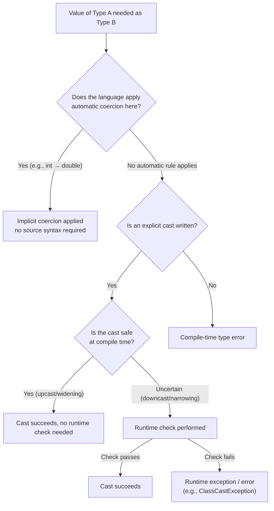

## Type Conversions: Coercion and Casting

### Definition

A type conversion transforms a value from one type to another. Languages distinguish two broad mechanisms: **coercion**, an implicit conversion performed automatically by the language according to fixed rules, and **casting**, an explicit conversion requested directly by the programmer in source code. Both aim to bridge type mismatches, but they differ in visibility, control, and risk profile.

### Implicit Coercion

**Definition**

Coercion occurs when the language automatically converts a value's type to satisfy an operation, function signature, or context, without the programmer writing any explicit conversion syntax.

**Numeric Widening (Safe Coercion)**

Many languages automatically promote a "smaller" numeric type to a "larger" one when needed, since this conversion cannot lose information (excluding some floating-point precision edge cases).

```java
int i = 5;
double d = i; // implicit widening: int → double, no explicit cast needed
```

**Type Coercion in Dynamically Typed Languages**

JavaScript is frequently cited for aggressive coercion rules applied during operators like `+`, `==`, and in conditional contexts.

```javascript
"5" + 3        // "53"  — number coerced to string, then concatenated
"5" - 3        // 2     — string coerced to number, then subtracted
"5" == 5       // true  — string coerced to number for comparison
[] + []        // ""    — both arrays coerced to strings, then concatenated
[] + {}        // "[object Object]" — arrays/objects coerced to strings
```

[Inference] These results are frequently cited as evidence that implicit coercion, while convenient in simple cases, can produce results that are difficult to predict without memorizing the specific coercion algorithm the language applies per operator — this is a well-documented pattern in JavaScript's abstract operations (e.g., `ToPrimitive`, `ToNumber`) rather than arbitrary behavior, but its practical unpredictability for readers is a widely shared observation rather than a strictly provable claim.

**Boolean (Truthy/Falsy) Coercion**

Many dynamically typed languages coerce arbitrary values to boolean in conditional contexts according to a "truthy/falsy" rule set.

```python
if []:        # falsy — empty list
    print("yes")
else:
    print("no")   # printed
```

```javascript
if (0) { }       // falsy
if ("") { }      // falsy
if (null) { }    // falsy
if ("0") { }     // truthy — non-empty string, despite representing zero
```

### Explicit Casting

**Definition**

Casting is a conversion explicitly written by the programmer, using dedicated syntax, to convert a value's type. Casting can be **safe** (widening/upcasting) or **unsafe/lossy** (narrowing/downcasting), and the language typically requires explicit syntax specifically because the conversion may lose information or fail.

**Numeric Narrowing Cast**

```c
double d = 3.99;
int i = (int)d;  // explicit cast: truncates to 3, fractional part discarded
```

```java
long bigValue = 3_000_000_000L;
int narrowed = (int) bigValue; // explicit cast: overflow, result is implementation-defined per two's complement wraparound
```

[Unverified] The exact overflow behavior for narrowing casts on values exceeding the target type's range is defined by each language's specification (e.g., Java specifies truncation to the low-order bits), and should not be assumed to be undefined behavior without checking — this differs meaningfully from C, where certain narrowing conversions of out-of-range values for signed types are undefined behavior rather than a specified wraparound.

**Reference/Object Casting (Downcasting)**

In object-oriented languages with class hierarchies, casting a reference from a supertype to a subtype is called downcasting and typically includes a runtime check.

```java
Animal a = new Dog();
Dog d = (Dog) a;       // safe: a actually refers to a Dog at runtime
Cat c = (Cat) a;       // throws ClassCastException at runtime: a is not a Cat
```

**Checked vs. Unchecked Casts**

Some languages provide both a throwing cast and a non-throwing, nullable-result alternative:

```csharp
object obj = "hello";
int n = (int) obj;          // throws InvalidCastException
int? m = obj as int?;       // "as" returns null instead of throwing (reference/nullable types only)
```

```kotlin
val obj: Any = "hello"
val s = obj as String       // throws ClassCastException if obj is not a String
val t = obj as? String      // returns null instead of throwing
```

### Coercion vs. Casting: Side-by-Side

| Aspect | Coercion | Casting |
| --- | --- | --- |
| Triggered by | Language rules, automatically | Explicit programmer syntax |
| Visibility in source code | Invisible | Visible (`(int)`, `as`, `static_cast<T>`, etc.) |
| Risk of silent errors | Higher — conversion happens without programmer awareness at the call site | Lower — programmer has explicitly acknowledged the conversion |
| Typical direction | Often widening/safe by convention | Both widening and narrowing; narrowing more common reason to write it explicitly |
| Common in | Dynamically typed languages (JavaScript, PHP, Perl); some coercion also in statically typed languages (numeric widening) | Statically typed languages (Java, C, C++, C#, Kotlin, TypeScript) |

### Kinds of Casts in Statically Typed Languages

**Upcasting**

Converting a subtype reference to a supertype reference. Always safe, and often implicit (a form of coercion) rather than requiring explicit syntax.

```java
Dog d = new Dog();
Animal a = d; // implicit upcast — no cast syntax needed
```

**Downcasting**

Converting a supertype reference to a subtype reference. Requires explicit syntax and typically a runtime type check, since the compiler cannot statically guarantee the actual runtime type matches.

**Cross-Casting**

In multiple-inheritance or multiple-interface systems, converting between two unrelated types that both derive from a common ancestor or both implement a shared interface, without going through a common supertype reference type known at compile time. [Unverified] Support and terminology for cross-casting varies significantly by language, and it is more commonly discussed in the context of C++'s `dynamic_cast` with multiple inheritance than in most other mainstream languages.

**Named C++ Cast Operators**

C++ distinguishes casting intent through dedicated keywords rather than a single generic cast syntax:

```cpp
static_cast<int>(3.99);         // compile-time checked, no runtime type check
dynamic_cast<Derived*>(basePtr); // runtime-checked, returns nullptr on failure (pointers) or throws (references)
const_cast<int*>(constIntPtr);   // adds/removes const qualification
reinterpret_cast<char*>(intPtr); // reinterprets bits with minimal safety checking
```

[Inference] This more granular casting vocabulary is generally understood as a deliberate design choice to make casting *intent* explicit and searchable in code, in contrast to C-style casts `(int)x`, which conflate several of these distinct operations into one syntax and are harder to grep for or reason about safety-wise.

### Diagram: Coercion and Casting Decision Flow



### Visual: Widening vs. Narrowing Conversion Safety

<svg xmlns="http://www.w3.org/2000/svg" viewBox="0 0 780 300">
<text x="390" y="30" text-anchor="middle" font-size="18" font-weight="bold" fill="#1a1a2e">Widening vs. Narrowing Conversion (svg_diagram)</text>
<rect x="60" y="80" width="180" height="70" rx="8" fill="#dff0d8" stroke="#3c763d" stroke-width="2" />
<text x="150" y="110" text-anchor="middle" font-size="13" fill="#1a1a2e">byte / int</text>
<text x="150" y="128" text-anchor="middle" font-size="11" fill="#1a1a2e">(smaller range)</text>
<line x1="240" y1="115" x2="330" y2="115" stroke="#3c763d" stroke-width="3" marker-end="url(#arrow4)" />
<text x="285" y="100" text-anchor="middle" font-size="11" fill="#3c763d">widening (safe)</text>
<rect x="330" y="80" width="180" height="70" rx="8" fill="#dff0d8" stroke="#3c763d" stroke-width="2" />
<text x="420" y="110" text-anchor="middle" font-size="13" fill="#1a1a2e">long / double</text>
<text x="420" y="128" text-anchor="middle" font-size="11" fill="#1a1a2e">(larger range)</text>
<line x1="330" y1="200" x2="240" y2="200" stroke="#a94442" stroke-width="3" marker-end="url(#arrow4)" />
<text x="285" y="185" text-anchor="middle" font-size="11" fill="#a94442">narrowing (may lose data)</text>
<rect x="60" y="165" width="180" height="70" rx="8" fill="#f2dede" stroke="#a94442" stroke-width="2" />
<text x="150" y="195" text-anchor="middle" font-size="13" fill="#1a1a2e">byte / int</text>
<text x="150" y="213" text-anchor="middle" font-size="11" fill="#1a1a2e">requires explicit cast</text>
<rect x="330" y="165" width="180" height="70" rx="8" fill="#f2dede" stroke="#a94442" stroke-width="2" />
<text x="420" y="195" text-anchor="middle" font-size="13" fill="#1a1a2e">long / double</text>
<text x="420" y="213" text-anchor="middle" font-size="11" fill="#1a1a2e">source of narrowing</text>
<rect x="580" y="120" width="160" height="90" rx="8" fill="#fcf8e3" stroke="#8a6d3b" stroke-width="2" />
<text x="660" y="150" text-anchor="middle" font-size="12" fill="#1a1a2e">Rule of thumb:</text>
<text x="660" y="170" text-anchor="middle" font-size="11" fill="#1a1a2e">widening → implicit</text>
<text x="660" y="188" text-anchor="middle" font-size="11" fill="#1a1a2e">narrowing → explicit</text>
</svg>

### Common Coercion/Casting Pitfalls

**Precision Loss in Numeric Narrowing**

```c
float f = 16777217.0f; // exceeds float's exact integer precision (2^24 + 1)
int i = (int) f;       // may not equal 16777217 due to prior float rounding
```

[Unverified] The exact threshold and rounding behavior depend on the floating-point representation in use (commonly IEEE 754 single precision for `float`), and specific numeric outcomes should be verified for the target platform rather than assumed universal.

**Loose Equality Coercion Surprises**

```javascript
null == undefined   // true  — special-cased
null == 0            // false — null does NOT coerce to 0 for ==
"" == 0              // true  — empty string coerces to 0
[] == false          // true  — array coerces to "" then to 0
```

[Inference] These specific outcomes follow from JavaScript's documented `==` comparison algorithm (which special-cases `null`/`undefined` and otherwise applies `ToNumber` coercion), but the surface-level inconsistency (some coerce to falsy-equivalent, others don't) is a commonly cited reason style guides recommend strict equality (`===`) over loose equality (`==`) by default.

**Integer Division Truncation Disguised as Coercion**

```python
result = 7 / 2      # 3.5 in Python 3 — true division returns float
result2 = 7 // 2    # 3 — floor division, explicit operator choice
```

```java
int result = 7 / 2;  // 3 — integer division truncates when both operands are int
double result2 = 7 / 2;      // still 3.0! division happens as int first, THEN coerced to double
double result3 = 7 / 2.0;    // 3.5 — one operand is already double, forcing coercion before division
```

The `result2` case is a frequently encountered pitfall: the coercion to `double` happens *after* integer division has already truncated the result, not before.

**Silent String-to-Number Coercion Producing NaN**

```javascript
parseInt("abc")     // NaN
"abc" * 2           // NaN — coercion to number fails silently, propagates as NaN
```

### Casting and Runtime Type Information

Downcasting in statically typed OOP languages generally requires the runtime to retain type information about each object (commonly called RTTI — Run-Time Type Information), so that a check like `instanceof`/`is` or the internals of `dynamic_cast` can verify actual type at runtime.

```csharp
if (obj is Dog dog) {
    dog.Bark(); // pattern-matching cast: checks and casts in one step
}
```

[Unverified] Whether RTTI is enabled by default carries a performance or binary-size cost is language- and compiler-flag-dependent (e.g., C++ allows disabling RTTI via compiler flags such as `-fno-rtti`), so this should not be treated as a fixed universal cost across all statically typed languages.

### Best Practices

- Prefer languages' explicit, type-safe casting syntax (`as?`, pattern-matching casts, checked casts) over throwing casts when failure is an expected, recoverable outcome rather than a programming error.
- Avoid relying on implicit coercion rules in dynamically typed languages for correctness-critical comparisons; use strict/typed comparison operators where available.
- When narrowing numeric types, explicitly validate range before casting rather than relying on silent truncation or wraparound behavior.
- Prefer named cast operators (`static_cast`, `dynamic_cast`, etc., or language equivalents) over generic C-style casts when the language offers both, since named casts make the specific conversion intent and safety guarantees explicit and easier to audit.
- Write unit tests specifically covering boundary values (max/min of the source type) when narrowing casts are unavoidable in a code path.

**Related Topics**

- Type coercion rules specific to equality operators (`==` vs `===`, `.equals()`, structural vs. reference equality)
- IEEE 754 floating-point representation and precision limits
- Runtime type information (RTTI) and reflection
- Generics and type erasure interactions with casting
- Pattern matching as a unified mechanism for type checking and casting
- Integer overflow and wraparound semantics across languages