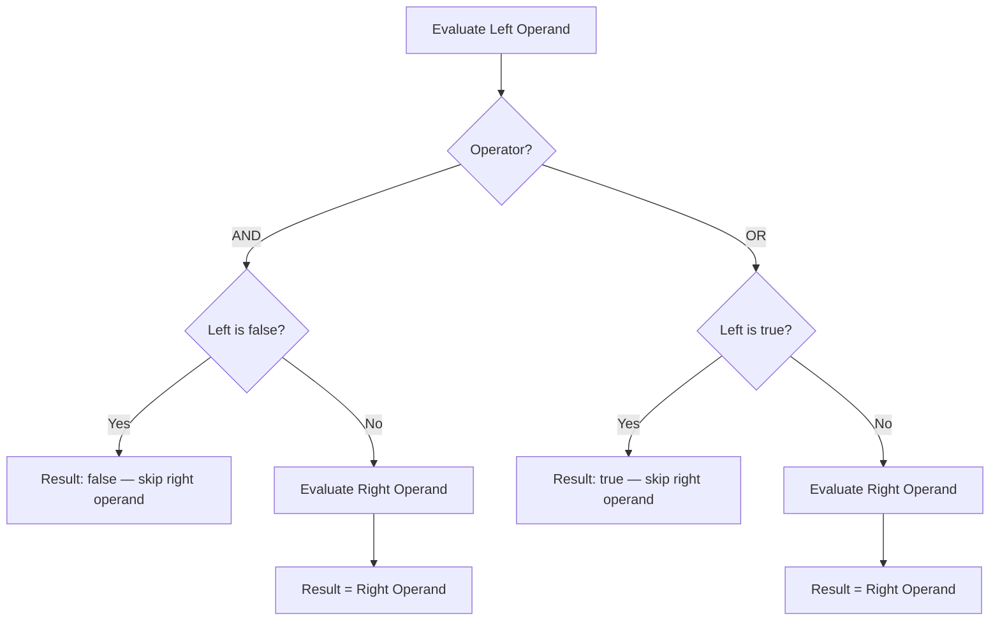

## Relational and Boolean Expressions

### Overview

Relational and boolean expressions form the foundation of decision-making in programming languages. Relational expressions compare two values and produce a boolean result, while boolean expressions combine or manipulate boolean values using logical operators. Together, they control the flow of execution in conditionals, loops, and guards, making them among the most frequently evaluated constructs in any program.

### Relational Expressions

A relational expression consists of two operands joined by a relational operator, evaluating to a boolean value (`true` or `false`) that expresses a comparison between the operands.

#### Common Relational Operators

| Operator | Meaning | Example (C-like) |
| --- | --- | --- |
| `==` | Equal to | `a == b` |
| `!=` or `<>` | Not equal to | `a != b` |
| `<` | Less than | `a < b` |
| `>` | Greater than | `a > b` |
| `<=` | Less than or equal to | `a <= b` |
| `>=` | Greater than or equal to | `a >= b` |

Different languages adopt different symbols for the same concepts. Pascal and some older languages use `<>` for "not equal," while C-derived languages use `!=`. Some functional languages, such as OCaml, distinguish structural equality (`=`) from physical/reference equality (`==`), which is a **[Unverified]**-worthy nuance only in the sense that the exact operator symbols and their precise semantics differ by language version and configuration; the general distinction between structural and reference equality itself is well documented and standard.

#### Type Considerations in Relational Expressions

The behavior of relational operators depends heavily on the type system of the language:

- **Statically typed languages** (Java, C#, Rust): the compiler enforces that both operands are of compatible types before allowing comparison. Comparing incompatible types (e.g., a string and an integer) typically produces a compile-time error.
- **Dynamically typed languages** (Python, JavaScript, Ruby): comparisons may be permitted between differing types at runtime, with the language defining coercion rules. JavaScript's `==` operator performs type coercion before comparison, whereas `===` performs strict comparison without coercion — a well-known and frequently cited source of subtle bugs.
- **Weakly typed languages** (older PHP, historical C via implicit conversions): comparisons can silently coerce values in ways that surprise programmers, such as comparing a string to a number.

#### Equality: Value vs. Reference

A critical distinction in relational expressions involving composite or reference types is whether `==` tests **value equality** (are the contents the same?) or **reference/identity equality** (do both variables point to the same memory location?).

- In Java, `==` on objects tests reference equality; the `.equals()` method must be overridden to test value equality.
- In Python, `==` invokes `__eq__` and generally tests value equality for built-in types, while the `is` operator tests identity.
- In C++, `==` can be overloaded per-class, meaning its behavior is entirely programmer-defined for user types.

This design choice reflects a tradeoff between performance (identity checks are O(1)) and intuitive semantics (value checks may require deep traversal of a structure), and language designers must decide which operator maps to which behavior by default.

#### Chained Relational Expressions

Some languages allow chaining of relational operators in a mathematically intuitive way, while others do not.

- **Python** supports chaining: `a < b < c` is evaluated as `(a < b) and (b < c)`, with `b` evaluated only once.
- **C, Java, and most C-derived languages** do not support true chaining. Writing `a < b < c` is legal syntax but evaluates left-to-right: `(a < b)` produces a boolean (`0` or `1` in C, or a `boolean` type in Java that cannot be compared to `c` without a type error), then that result is compared to `c`. This is a classic source of logic errors for programmers coming from mathematics or from chain-supporting languages.

### Boolean Expressions

Boolean expressions combine boolean-valued operands (which may themselves be relational expressions) using logical operators to produce a single boolean result.

#### Common Boolean Operators

| Operator | Meaning | Typical Symbol(s) |
| --- | --- | --- |
| AND | True if both operands are true | `&&`, `and`, `.and.` |
| OR | True if at least one operand is true | `||`, `or`, `.or.` |
| NOT | Inverts the boolean value | `!`, `not`, `.not.` |
| XOR | True if exactly one operand is true | `^` (in some languages), `xor` |

Naming and symbol conventions vary widely: C-family languages use `&&`, `||`, and `!`; Python and Ada use the English keywords `and`, `or`, `not`; older Fortran uses dot-notation operators like `.AND.` and `.OR.`.

#### Short-Circuit Evaluation

**Key Points**

- Short-circuit evaluation means the second operand of a boolean expression is evaluated only if necessary to determine the overall result.
- For `A and B`: if `A` is `false`, `B` is never evaluated, since the result is guaranteed to be `false`.
- For `A or B`: if `A` is `true`, `B` is never evaluated, since the result is guaranteed to be `true`.
- Most modern languages (C, C++, Java, Python, JavaScript, Rust) use short-circuit evaluation by default for `&&`/`and` and `||`/`or`.

Short-circuit evaluation is not merely a performance optimization; it is frequently relied upon as a control-flow idiom. A common pattern is the **guard expression**:

```c
if (ptr != NULL && ptr->value > 0) {
    // safe: ptr->value is only accessed if ptr is non-null
}
```

If evaluation were not short-circuited, this expression could dereference a null pointer and crash. This pattern — using the first condition to guard the safety of the second — is pervasive in null-checking, array-bounds checking, and division-by-zero avoidance across nearly all languages that support short-circuiting.

**Non-short-circuit (eager) evaluation** also exists in some languages, typically as a separate operator:

- Ada provides `and then` and `or else` as short-circuit forms, distinct from the eager `and` and `or`.
- Some languages provide bitwise operators (`&`, `|` in C/Java) that, when applied to boolean operands, evaluate both sides unconditionally — these are technically bitwise operators repurposed for booleans, and they do not short-circuit.

The choice of default (short-circuit vs. eager) has semantic consequences beyond performance: eager evaluation of `A and B` where `B` has a side effect (e.g., a function call that modifies state) will always execute that side effect, whereas short-circuit evaluation may skip it. Programmers relying on side effects within boolean expressions must know which evaluation strategy their language uses by default. **[Inference]**: because this behavior is easy to overlook, it is considered a common source of subtle bugs when developers port code between languages with different default evaluation strategies.

#### Boolean Expressions as Control Flow

Boolean expressions are the operand of choice for:

- `if`/`else` conditionals
- `while` and `do-while` loop conditions
- `for` loop termination conditions
- Ternary/conditional expressions (`condition ? thenExpr : elseExpr`)
- Guard clauses and assertions

In languages without a distinct boolean type (such as C prior to C99, and Lisp dialects using non-`nil` values as "truthy"), relational and boolean expressions instead produce or consume values from a broader domain — integers in C (`0` is false, nonzero is true), or truthy/falsy values in Lisp, Python, and JavaScript.

#### Truthiness in Languages Without Strict Booleans

Many dynamically typed languages generalize the boolean domain through the concept of **truthiness**: values other than an explicit boolean type are implicitly coerced to `true` or `false` in a boolean context.

- **Python**: `0`, `0.0`, `None`, empty strings `""`, and empty containers (`[]`, `{}`, `()`) are falsy; nearly everything else is truthy.
- **JavaScript**: `0`, `-0`, `NaN`, `""`, `null`, `undefined`, and `false` are falsy; all other values, including empty objects `{}` and empty arrays `[]`, are truthy.
- **C (pre-C99)**: any nonzero integer is true; zero is false. C99 introduced `_Bool` and the `<stdbool.h>` header providing `bool`, `true`, and `false` as macros, though the underlying representation is still integral.
- **Lisp/Scheme**: typically, everything except a designated "false" value (`nil` in many Lisps, `#f` in Scheme) is truthy, including numeric zero.

These rules differ enough between languages that a value considered falsy in one (e.g., an empty list in Python) may be truthy in another (e.g., an empty list in Scheme, which is often distinct from `#f`). Programmers must consult language-specific documentation rather than assume universal truthiness rules.

### Operator Precedence and Associativity

Relational and boolean operators participate in a precedence hierarchy that determines how compound expressions without explicit parentheses are parsed.

A typical precedence ordering (highest to lowest) in C-family languages:

1. `!` (logical NOT) — unary, binds tightly
2. `<`, `<=`, `>`, `>=` (relational)
3. `==`, `!=` (equality)
4. `&&` (logical AND)
5. `||` (logical OR)

This ordering means an expression such as:

```c
a < b && c == d || !e
```

is parsed as:

```c
((a < b) && (c == d)) || (!e)
```

Relational operators bind more tightly than equality operators in some languages (notably C), which is itself a point of frequent confusion, since many programmers assume `==` and `<` share the same precedence tier. Most languages place all relational and equality operators at a lower precedence than arithmetic operators but higher than boolean operators, so that expressions like `x + 1 < y * 2` parse as `(x + 1) < (y * 2)` without needing parentheses.

**[Inference]**: because precedence tables differ across languages in subtle ways (e.g., Python's chained comparisons interacting with `and`/`or` differently than C's flat left-to-right parsing), relying on explicit parentheses rather than memorized precedence is widely recommended as defensive coding practice, though this is a stylistic convention rather than a language rule.

### Operator Precedence Diagram

<svg xmlns="http://www.w3.org/2000/svg" viewBox="0 0 760 400" font-family="sans-serif">
<text x="380" y="30" text-anchor="middle" font-size="18" font-weight="bold" fill="#1a1a2e">Relational/Boolean Precedence (svg_diagram)</text>
<rect x="40" y="60" width="680" height="50" rx="6" fill="#4a4e69" />
<text x="380" y="90" text-anchor="middle" font-size="16" fill="white">Highest: ! (logical NOT, unary)</text>
<rect x="40" y="130" width="680" height="50" rx="6" fill="#5c6b8a" />
<text x="380" y="160" text-anchor="middle" font-size="16" fill="white">&lt; &lt;= &gt; &gt;= (relational)</text>
<rect x="40" y="200" width="680" height="50" rx="6" fill="#7d8fa8" />
<text x="380" y="230" text-anchor="middle" font-size="16" fill="white">== != (equality)</text>
<rect x="40" y="270" width="680" height="50" rx="6" fill="#a3b1c6" />
<text x="380" y="300" text-anchor="middle" font-size="16" fill="#1a1a2e">&amp;&amp; (logical AND)</text>
<rect x="40" y="340" width="680" height="50" rx="6" fill="#c9d3e0" />
<text x="380" y="370" text-anchor="middle" font-size="16" fill="#1a1a2e">Lowest: || (logical OR)</text>
</svg>

### Short-Circuit Evaluation Flow



### Example

**Python** (chained comparison, truthy/falsy, short-circuit):

```python
age = 25
is_member = True

# Chained relational expression
if 18 <= age < 65:
    print("Working-age adult")

# Boolean expression with short-circuit AND
if is_member and age >= 18:
    print("Eligible for discount")

# Truthy/falsy in boolean context
name = ""
if not name:
    print("Name is empty")  # "" is falsy
```

**C** (no chaining, integer-based booleans, guard pattern):

```c
#include <stdio.h>
#include <stdbool.h>

int main(void) {
    int age = 25;
    bool is_member = true;

    /* NOT a chained comparison — evaluates left to right */
    /* 18 <= age < 65 would actually compute (18 <= age) then compare that (0 or 1) to 65 */
    if (age >= 18 && age < 65) {
        printf("Working-age adult\n");
    }

    /* Short-circuit guard: avoids division by zero */
    int denominator = 0;
    if (denominator != 0 && (100 / denominator) > 1) {
        printf("Quotient exceeds 1\n");
    }

    return 0;
}
```

**JavaScript** (loose vs. strict equality):

```javascript
console.log(5 == "5");   // true  — coercion occurs
console.log(5 === "5");  // false — no coercion, types differ

let user = null;
// Short-circuit OR for default values
let displayName = user || "Guest";
console.log(displayName); // "Guest"
```

### Common Pitfalls

- Assuming `==` performs deep/value comparison for objects in languages like Java, where it actually performs reference comparison.
- Assuming chained comparisons (`a < b < c`) work mathematically in languages like C or Java, where they instead produce a type error or an unintended left-to-right evaluation.
- Relying on side effects inside the right-hand operand of `&&`/`||` in a language or context where evaluation order or short-circuiting is not guaranteed — this is well-defined in most mainstream languages but remains a readability hazard.
- Confusing bitwise operators (`&`, `|`) with logical operators (`&&`, `||`) in C-family languages; the former do not short-circuit and operate bitwise on integer representations, which can produce unexpected results when applied to non-0/1 integer "booleans."
- Overlooking language-specific truthiness rules when porting code (e.g., an empty list being falsy in Python but not in Scheme).

### Related Topics

- Arithmetic expressions and operator precedence
- Assignment statements and compound assignment operators
- Mixed-mode expressions and type coercion
- Short-circuit evaluation and side effects in expressions
- Conditional (ternary) expressions
- Control statements: selection (if/else, switch/case)
- Control statements: iteration (while, for, do-while)
- The boolean type across language paradigms (imperative, functional, logic programming)