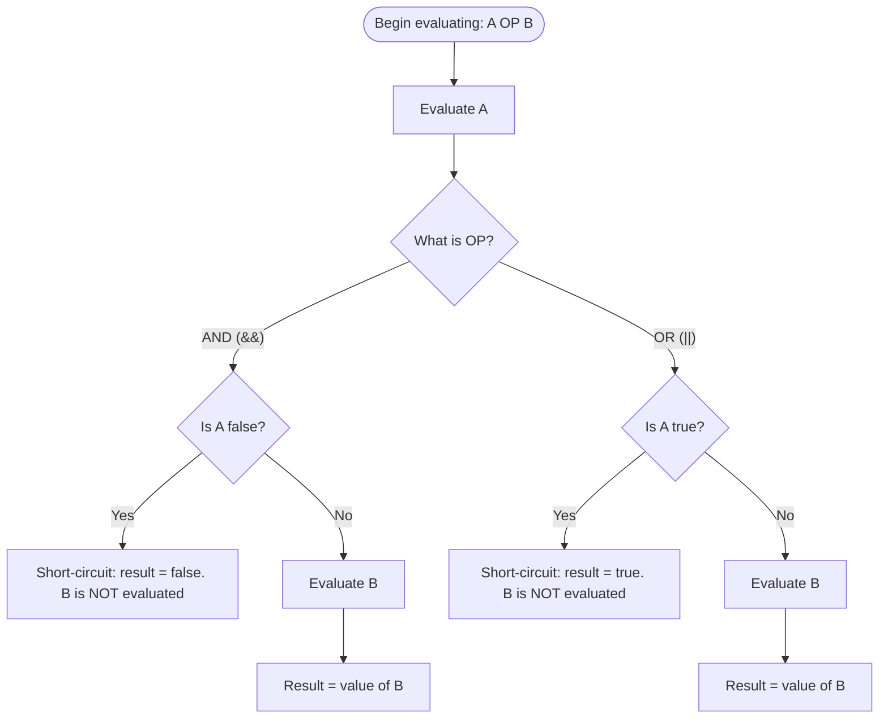

## Short-Circuit Evaluation

### Overview

Short-circuit evaluation is a strategy for evaluating boolean expressions in which the second (and any subsequent) operand of a logical operator is evaluated only if the result cannot already be determined from the operands evaluated so far. This strategy contrasts with **complete (eager) evaluation**, in which all operands of an expression are always evaluated regardless of whether doing so is logically necessary. Short-circuit evaluation affects not only performance but program correctness, since expressions in short-circuited languages may rely on the guarantee that certain subexpressions are never evaluated.

### The Core Rules

For the two fundamental binary logical operators:

- **Logical AND** (`&&`, `and`): if the left operand evaluates to `false`, the overall result is guaranteed to be `false` regardless of the right operand's value, so the right operand is **not evaluated**.
- **Logical OR** (`||`, `or`): if the left operand evaluates to `true`, the overall result is guaranteed to be `true` regardless of the right operand's value, so the right operand is **not evaluated**.

$$A \land B = \begin{cases} \text{false} & \text{if } A = \text{false (B not evaluated)} \\ B & \text{if } A = \text{true} \end{cases}$$


$$A \lor B = \begin{cases} \text{true} & \text{if } A = \text{true (B not evaluated)} \\ B & \text{if } A = \text{false} \end{cases}$$

This logic extends naturally to chains of more than two operands: in `A and B and C`, evaluation proceeds left to right and stops at the first `false` operand encountered.

### Why It Matters: Semantics, Not Just Speed

**Key Points**

- Short-circuit evaluation is often introduced as a performance optimization, but in most production code its primary value is as a **control-flow guarantee**.
- Programmers routinely write code whose correctness *depends on* the right-hand operand not being evaluated under certain conditions.
- Removing short-circuiting from a short-circuited language (or porting code to a non-short-circuited context) can introduce crashes, exceptions, or undefined behavior.

The canonical example is the **null/guard check**:

```java
if (obj != null && obj.getValue() > 0) {
    // safe
}
```

If `obj` is `null`, the left operand `obj != null` is `false`, so `&&` short-circuits and `obj.getValue()` is never called — avoiding a `NullPointerException`. If evaluation were eager, this line would throw whenever `obj` is `null`.

Similarly, for avoiding division by zero:

```python
if denominator != 0 and (numerator / denominator) > threshold:
    ...
```

And for avoiding out-of-bounds array access:

```c
if (index < array_length && array[index] == target) {
    ...
}
```

In each case, the first condition acts as a **guard** whose truth is a precondition for the safety of evaluating the second.

### Language Support

Short-circuit evaluation is the default behavior for the primary logical operators in the majority of widely used languages, though the exact operators and defaults vary.

| Language | Short-circuit AND | Short-circuit OR | Non-short-circuit equivalent |
| --- | --- | --- | --- |
| C / C++ | `&&` | `||` | `&`, `|` (bitwise; different semantics) |
| Java | `&&` | `||` | `&`, `|` (also valid on booleans, eager) |
| C# | `&&` | `||` | `&`, `|` (also valid on booleans, eager) |
| Python | `and` | `or` | — (no built-in eager boolean operator) |
| JavaScript | `&&` | `||` | — (no built-in eager boolean operator) |
| Ada | `and then` | `or else` | `and`, `or` (eager by default) |
| Pascal (standard) | — | — | `and`, `or` (traditionally eager; many implementations extend to short-circuit) |
| Ruby | `&&` | `||` | `&`, `|` (also valid on booleans, eager) |
| Rust | `&&` | `||` | `&`, `|` (also valid on booleans, eager) |

**Ada** is notable for making the distinction explicit at the syntax level: `and` and `or` are eager by default, while `and then` and `or else` are the short-circuit forms. This design forces the programmer to consciously choose evaluation strategy rather than relying on operator-overloading conventions or implicit default behavior.

**Pascal**, in its original standard definition, specifies `and` and `or` as evaluating both operands unconditionally (**[Unverified]** in the sense that many real-world Pascal compilers, such as Delphi/Free Pascal, provide a compiler switch to enable short-circuit behavior, deviating from the strict standard, so actual behavior is implementation- and configuration-dependent).

**C, Java, C#, Ruby, and Rust** additionally provide bitwise operators (`&`, `|`) that can be applied to boolean operands to force eager evaluation — these are not logical operators repurposed by coincidence, but rather the same bitwise operators used on integers, applied to the `0`/`1` (or `true`/`false`) representation of booleans.

### Order of Evaluation

Short-circuit evaluation is inseparable from a language's guarantee about **order of evaluation** for the operands of `&&` and `||`. In every mainstream short-circuiting language, the left operand is evaluated strictly before the right operand, and this left-to-right order is part of the language's defined semantics — not an implementation detail that may vary by compiler.

This matters because it enables **sequencing side effects** deliberately:

```javascript
// Common idiom: run functionB() only if functionA() succeeds
functionA() && functionB();

// Common idiom: provide a default only if the first expression is falsy
const name = userInput || "Anonymous";
```

The second example — using `||` for default values — is a widely used idiom in JavaScript, Python, Ruby, and similar languages, sometimes called the "or-default" or "null coalescing via OR" pattern. It works because `||` returns the actual value of whichever operand determined the result, not merely `true`/`false` — a property covered further below.

### Short-Circuit Operators Return Values, Not Just Booleans

In many dynamically typed and some statically typed languages, `&&` and `||` do not strictly return a boolean — they return **the value of whichever operand determined the result**, which enables idiomatic patterns beyond simple conditionals.

```python
x = None
y = x or "default"
print(y)  # "default" — or returns "default", not True

a = "hello"
b = a and "world"
print(b)  # "world" — and returns "world" since "hello" is truthy
```

```javascript
let config = userConfig || {};       // fallback object if userConfig is falsy
let result = isValid && computeResult(); // computeResult() only runs if isValid is truthy
```

This is distinct from languages with a strict, non-generalized boolean type (such as Java or C#'s `bool`/`boolean`), where `&&` and `||` are constrained to operate only on boolean operands and always return a boolean — no truthy/falsy generalization applies.

### Short-Circuiting and Side Effects: A Double-Edged Sword

**Key Points**

- Because the right operand may or may not execute, any side effects contained within it (assignments, I/O, function calls that mutate state) are conditionally executed.
- This is a deliberate and heavily used feature — but it is also a common source of subtle bugs, especially when developers are unaware of it or when code is ported between short-circuit and eager-evaluation languages.

```c
int counter = 0;

int increment_and_check(void) {
    counter++;
    return counter > 5;
}

if (0 && increment_and_check()) {
    // increment_and_check() is NEVER called here
    // counter remains 0
}
```

If a developer *expected* `increment_and_check()` to run regardless (perhaps porting from a language with eager `and`/`or`), the resulting bug — `counter` never incrementing — can be difficult to trace, since the code appears syntactically correct and produces no error or crash.

**[Inference]**: because this class of bug produces no compiler warning or runtime exception in most languages, it is generally considered good practice to avoid placing side-effecting calls inside the right-hand operand of a short-circuit expression unless the conditional execution is the explicit intent — though this remains a style guideline rather than a language rule.

### Short-Circuit Evaluation in Compound Boolean Expressions

For expressions with more than two operands, short-circuiting applies recursively at each step, evaluating strictly left to right (in all mainstream short-circuiting languages):

```plaintext
A and B and C and D
```

Evaluation proceeds: evaluate `A`. If `A` is false, stop — result is `false`. Otherwise, evaluate `B`. If `B` is false, stop — result is `false`. Otherwise, evaluate `C`. And so on, until either a `false` operand is found (for `and` chains) or all operands have been evaluated as `true`.

Mixed chains combining `and`/`or` follow standard operator precedence (with `and`/`&&` binding tighter than `or`/`||` in most languages), and short-circuiting is applied according to that parse structure — not left-to-right across the entire raw token sequence.

### Short-Circuit Evaluation Flowchart



### Comparing Short-Circuit vs. Eager Evaluation

<svg xmlns="http://www.w3.org/2000/svg" viewBox="0 0 760 320" font-family="sans-serif">
<text x="380" y="28" text-anchor="middle" font-size="18" font-weight="bold" fill="#1a1a2e">Short-Circuit vs. Eager Evaluation (svg_diagram)</text>
<rect x="30" y="55" width="330" height="230" rx="8" fill="#eef2f7" stroke="#4a4e69" stroke-width="2" />
<text x="195" y="85" text-anchor="middle" font-size="16" font-weight="bold" fill="#1a1a2e">Short-Circuit</text>
<text x="195" y="115" text-anchor="middle" font-size="13" fill="#333">A = false</text>
<text x="195" y="140" text-anchor="middle" font-size="13" fill="#333">A &amp;&amp; B</text>
<line x1="80" y1="155" x2="310" y2="155" stroke="#999" stroke-width="1" />
<text x="195" y="180" text-anchor="middle" font-size="13" fill="#c0392b">B is skipped</text>
<text x="195" y="205" text-anchor="middle" font-size="13" fill="#333">Result: false</text>
<text x="195" y="240" text-anchor="middle" font-size="12" fill="#555">Side effects in B</text>
<text x="195" y="258" text-anchor="middle" font-size="12" fill="#555">do NOT occur</text>
<rect x="400" y="55" width="330" height="230" rx="8" fill="#eef2f7" stroke="#4a4e69" stroke-width="2" />
<text x="565" y="85" text-anchor="middle" font-size="16" font-weight="bold" fill="#1a1a2e">Eager (Complete)</text>
<text x="565" y="115" text-anchor="middle" font-size="13" fill="#333">A = false</text>
<text x="565" y="140" text-anchor="middle" font-size="13" fill="#333">A &amp; B</text>
<line x1="450" y1="155" x2="680" y2="155" stroke="#999" stroke-width="1" />
<text x="565" y="180" text-anchor="middle" font-size="13" fill="#27ae60">B is evaluated</text>
<text x="565" y="205" text-anchor="middle" font-size="13" fill="#333">Result: false</text>
<text x="565" y="240" text-anchor="middle" font-size="12" fill="#555">Side effects in B</text>
<text x="565" y="258" text-anchor="middle" font-size="12" fill="#555">DO occur</text>
</svg>

### Example

**Python**:

```python
def expensive_check():
    print("expensive_check() was called")
    return True

# Short-circuit AND: expensive_check() never runs
if False and expensive_check():
    pass
# (no output — expensive_check was never invoked)

# Short-circuit OR: expensive_check() never runs
if True or expensive_check():
    pass
# (no output — expensive_check was never invoked)

# Using 'or' for default values
username = "" or "guest"
print(username)  # "guest"
```

**Java** (contrasting `&&` with `&`):

```java
public class ShortCircuitDemo {
    static boolean sideEffect() {
        System.out.println("sideEffect() called");
        return true;
    }

    public static void main(String[] args) {
        boolean a = false;

        System.out.println("Using &&:");
        if (a && sideEffect()) {
            // nothing prints from sideEffect — it never runs
        }

        System.out.println("Using &:");
        if (a & sideEffect()) {
            // "sideEffect() called" IS printed — & is eager
        }
    }
}
```

**Ada** (explicit short-circuit vs. eager keywords):

```ada
-- 'and then' is short-circuit; 'and' is eager
if Ptr /= null and then Ptr.Value > 0 then
   -- safe: Ptr.Value only accessed if Ptr is non-null
   null;
end if;

if Condition_A and Condition_B then
   -- both Condition_A and Condition_B are ALWAYS evaluated
   null;
end if;
```

### Common Pitfalls

- Assuming all languages short-circuit by default — some (like standard Pascal) historically do not, and behavior may depend on compiler flags.
- Confusing bitwise operators (`&`, `|`) with logical operators (`&&`, `||`) in C-family and Java-family languages, inadvertently disabling short-circuiting and triggering unwanted side effects or runtime errors.
- Placing necessary side effects (e.g., incrementing a counter, logging, mutating state) inside the right-hand operand of a short-circuit expression, then being surprised when that operand doesn't execute under certain conditions.
- Relying on short-circuit evaluation order in a language or context where operand evaluation order is unspecified — this is not a concern in mainstream short-circuiting languages (order is well-defined), but becomes a hazard when translating logic into contexts (such as certain expression-oriented DSLs or SQL, where `AND`/`OR` short-circuiting is *not* guaranteed) that do not provide the same guarantee.
- Forgetting that short-circuit operators in dynamically typed languages return the determining operand's actual value, not strictly `true`/`false`, which can produce unexpected non-boolean values downstream if not accounted for.

### Related Topics

- Relational and boolean expressions
- Truthiness and implicit type coercion in conditional contexts
- Guard clauses and defensive programming patterns
- Operator overloading and custom `&&`/`||` semantics
- Order of evaluation in function arguments and expressions
- Null/undefined handling: null coalescing operators
- Ada's explicit short-circuit vs. eager operator design
- Lazy evaluation in functional programming languages