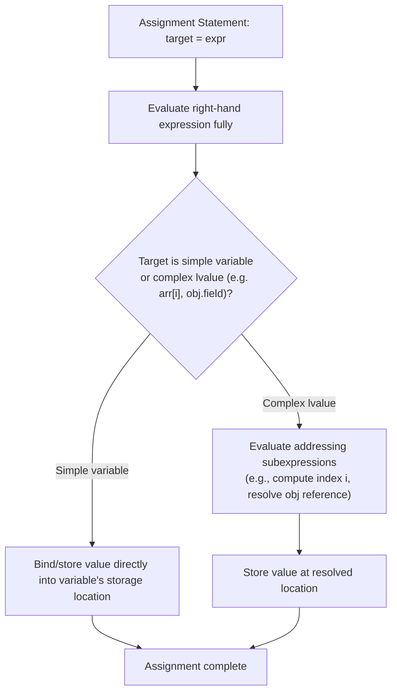

## Assignment Statements and Their Semantics


### Overview

An assignment statement binds a value to a variable (or, more generally, to a storage location), replacing whatever value that location previously held. Although assignment appears simple on the surface, its precise semantics vary considerably across programming languages and paradigms — differing in what is actually copied (value vs. reference), whether assignment is a statement or an expression, how type checking interacts with it, and what guarantees exist about evaluation order and atomicity. Understanding assignment semantics is foundational to understanding mutation, aliasing, and state in imperative and hybrid languages.

### The Basic Form

The canonical form of an assignment statement is:

$$\text{target} \leftarrow \text{expression}$$

In most C-derived languages this is written with `=`:

```c
x = 5;
```

Other symbols have historically been used to visually distinguish assignment from mathematical equality, since `=` is overloaded to mean both "assign" and "test equality" depending on language:

| Language | Assignment symbol | Equality-test symbol |
| --- | --- | --- |
| C, Java, C#, JavaScript | `=` | `==` |
| Pascal, Ada | `:=` | `=` |
| ALGOL | `:=` | `=` |
| Smalltalk | `:=` | `=` |
| BASIC (classic) | `=` (context-dependent) | `=` |
| Haskell (let bindings) | `=` | `==` |
| R | `<-` (conventional) or `=` | `==` |

Pascal-family and ALGOL-derived languages deliberately chose `:=` to avoid the ambiguity that C introduced by reusing `=` for assignment and `==` for equality — a design decision frequently cited as a source of the classic `if (x = 5)` bug in C, where an intended equality test is accidentally written as an assignment, itself a valid expression that evaluates to the assigned value.

### Statement vs. Expression

A key semantic divide among languages is whether assignment is a **statement** (producing no usable value, only a side effect) or an **expression** (evaluating to a value that can itself be used in a larger expression).

**Key Points**

- In C, C++, Java, C#, and JavaScript, assignment is an **expression** that evaluates to the assigned value, enabling chained assignment and embedding within other expressions.
- In Python, assignment is a **statement**, not an expression — `x = 5` cannot appear inside another expression such as `if (x = 5):`, which is a deliberate design choice to eliminate the equality/assignment confusion described above.
- Python 3.8 introduced the "walrus operator" `:=` as a limited, explicit way to perform assignment within an expression context, without overloading `=` itself.

**C (assignment as expression, enabling chaining):**

```c
int a, b, c;
a = b = c = 10;  // assignment is right-associative; all three become 10

int x;
if ((x = compute()) > 0) {
    // x is assigned inside the condition, then compared
}
```

**Python (assignment as statement, walrus operator as the expression escape hatch):**

```python
# x = 5 cannot be used as a condition directly
# if x = 5:   # SyntaxError

# Walrus operator provides assignment-as-expression explicitly
if (x := compute()) > 0:
    print(x)
```

Languages that treat assignment as an expression gain conciseness (chained assignment, embedding in conditions) at the cost of enabling the classic `=`/`==` confusion bug; languages that treat it as a pure statement sacrifice some conciseness for that class of error to be a compile-time or syntax error instead of a silent logic bug. **[Inference]**: this tradeoff is widely cited in language design literature as a deliberate lesson learned from C's design, though the specific claim that it was a primary motivator for any single later language's design choice would need that language's own design rationale to verify precisely.

### Simple vs. Compound Assignment

Most C-family and many other imperative languages provide **compound assignment operators** that combine an arithmetic or bitwise operation with assignment:

| Operator | Equivalent to |
| --- | --- |
| `x += y` | `x = x + y` |
| `x -= y` | `x = x - y` |
| `x *= y` | `x = x * y` |
| `x /= y` | `x = x / y` |
| `x %= y` | `x = x % y` |
| `x &= y` | `x = x & y` |
| `x |= y` | `x = x | y` |
| `x ^= y` | `x = x ^ y` |
| `x \<\<= y` | `x = x << y` |
| `x \>\>= y` | `x = x >> y` |

Compound assignment is not purely syntactic sugar in every language: in C and C++, `x += y` may evaluate `x` only once even when `x` is a complex expression with side effects (e.g., `arr[i++] += 1`), whereas the fully expanded form `x = x + y` would evaluate `x`'s addressing expression twice. This distinction matters for correctness when the left-hand side has side effects in its own evaluation (such as an index expression containing `++`).

### Increment and Decrement as Assignment-Adjacent Operators

C-family languages also provide `++` and `--`, which combine assignment with arithmetic in both prefix and postfix forms, differing in the value the *expression* produces (though the variable's final stored value is the same in both forms):

```c
int x = 5;
int a = x++;  // a = 5, x becomes 6 (postfix: original value used, then incremented)
int y = 5;
int b = ++y;  // b = 6, y becomes 6 (prefix: incremented first, then value used)
```

Not all languages provide these operators — Python, for example, deliberately omits `++`/`--` entirely, requiring `x += 1` instead, partly to avoid the readability and evaluation-order subtleties these operators can introduce in compound expressions.

### Multiple and Parallel Assignment

Some languages support assigning multiple targets from multiple values in a single statement, with semantics that guarantee the right-hand side is fully evaluated *before* any assignment occurs — critical for enabling idioms like variable swapping without a temporary variable.

**Python:**

```python
a, b = 1, 2
a, b = b, a  # swap — right-hand tuple (b, a) is fully evaluated first, then unpacked
print(a, b)  # 2 1
```

**Go:**

```go
a, b := 1, 2
a, b = b, a  // same swap semantics
```

**Ruby:**

```ruby
a, b = 1, 2
a, b = b, a
```

In languages lacking this construct (such as classic C), the equivalent swap requires an explicit temporary variable:

```c
int temp = a;
a = b;
b = temp;
```

The guarantee that the entire right-hand side is evaluated before any left-hand target is updated is what makes the swap idiom correct; without that guarantee, `a, b = b, a` could produce incorrect results if `a`'s new value were assigned before `b`'s original value was read.

### Value Semantics vs. Reference Semantics

Perhaps the most consequential semantic distinction in assignment is **what is actually copied** when assignment occurs — a full, independent copy of the value, or a reference/pointer to shared underlying data.

- **Value semantics**: assignment copies the actual data. Subsequent mutation of one variable does not affect the other. Primitive types (integers, floats, booleans, chars) in nearly all mainstream languages use value semantics.
- **Reference semantics**: assignment copies a reference (pointer/handle) to shared underlying data. Subsequent mutation through one variable is visible through the other, since both refer to the same underlying object.

```python
# Python: lists use reference semantics
a = [1, 2, 3]
b = a          # b now refers to the SAME list object as a
b.append(4)
print(a)       # [1, 2, 3, 4] — a is affected too

# Python: integers use value semantics (immutable)
x = 5
y = x
y = y + 1
print(x)       # 5 — x is unaffected
```

```java
// Java: objects (non-primitive types) use reference semantics
int[] arr1 = {1, 2, 3};
int[] arr2 = arr1;      // arr2 refers to the SAME array
arr2[0] = 99;
System.out.println(arr1[0]); // 99 — arr1 is affected too

// Java: primitives (int, double, boolean, etc.) use value semantics
int p = 5;
int q = p;
q = q + 1;
System.out.println(p); // 5 — p is unaffected
```

Languages differ substantially in where they draw this line:

- **C**: assignment always copies the value bit-for-bit, including for structs (`struct` assignment performs a shallow member-wise copy). Reference-like behavior is achieved explicitly through pointers, which the programmer must dereference deliberately.
- **C++**: similar to C by default (value semantics for objects via copy constructors), but supports references (`&`) and smart pointers as explicit mechanisms for shared/aliased access, and allows operator overloading of `=` to customize copy behavior entirely.
- **Java**: primitives use value semantics; all object types (including arrays and boxed types) use reference semantics — there is no way to get value-copy behavior for objects via plain `=`; an explicit copy method or copy constructor is required.
- **Python**: "everything is an object," and assignment always binds a name to an object reference; whether mutation is visible through another variable depends on whether the *object itself* is mutable (lists, dicts, sets) or immutable (ints, floats, strings, tuples) — not on the assignment mechanism, which is uniformly reference-binding in all cases.
- **Rust**: assignment of non-`Copy` types **moves** ownership by default — after `let b = a;` for a non-`Copy` type, `a` is no longer valid to use, a compile-time-enforced semantic distinct from both simple value-copy and simple reference-aliasing.

### Rust's Move Semantics: A Third Model

Rust's ownership model introduces a distinct assignment semantic not present in most other mainstream languages: for types that do not implement the `Copy` trait, assignment **transfers ownership** (a "move") rather than copying the value or creating an aliasable reference.

```rust
let a = String::from("hello");
let b = a;              // ownership of the String moves from a to b
// println!("{}", a);   // COMPILE ERROR: a's value was moved, a is no longer valid
println!("{}", b);      // OK

let x = 5;               // i32 implements Copy
let y = x;                // this is a copy, not a move
println!("{} {}", x, y); // OK — both valid, since i32 is Copy
```

This design eliminates an entire class of aliasing bugs (use of stale/dangling references, double-free errors) at compile time by ensuring that, for non-`Copy` types, only one variable can be considered the valid "owner" of a given piece of data at any time — enforced without a garbage collector.

### Assignment and Type Checking

Statically typed languages perform **type checking** on assignment, verifying that the expression's type is compatible with the target variable's declared (or inferred) type.

- **Strict/invariant typing**: the assigned expression's type must exactly match (or be an explicitly permitted subtype of) the target's type. Java and C# require this, with implicit widening conversions permitted for compatible numeric types (e.g., `int` to `long`) but not narrowing conversions without an explicit cast.
- **Structural/duck typing in dynamic languages**: Python, JavaScript, and Ruby perform no compile-time type check on assignment at all — a variable name can be rebound to a value of any type at any time, since the language associates types with values, not with variable names.
- **Type inference on assignment**: languages like Rust, Kotlin, Swift, and modern C++ (`auto`) allow the target's type to be inferred from the right-hand expression at the point of declaration/first assignment, while still enforcing static type checking on all subsequent assignments to that variable.

```rust
let x = 5;        // type inferred as i32
// x = "hello";    // COMPILE ERROR: x is i32, cannot assign a &str
let mut y = 5;
y = 10;            // OK — same type
// y = "hello";    // COMPILE ERROR
```

### Order of Evaluation in Assignment

The precise order in which the left-hand side (target address/location) and right-hand side (value expression) are evaluated is defined by each language's specification, and this ordering can matter when either side has side effects.

**[Inference]**: because unspecified or implementation-defined evaluation order historically existed in some C constructs (such as function argument evaluation order, and certain compound expressions involving `=` combined with other side-effecting operators), it is generally considered good defensive practice — though not a strict requirement in every language — to avoid writing a single statement in which the same variable is both read and written via side-effecting subexpressions in an order-dependent way, since such code invites conclusions specific to a single compiler's behavior rather than the language's guaranteed semantics.

Most modern languages (Java, C#, Python, JavaScript, Rust) fully specify left-to-right evaluation order for assignment operands, closing off this class of ambiguity that existed in some historical C constructs.

### Destructuring Assignment

Many modern languages extend assignment to support **destructuring** — extracting multiple values from a composite structure (array, tuple, object) into separate variables in a single statement.

**JavaScript:**

```javascript
const [first, second, ...rest] = [1, 2, 3, 4, 5];
console.log(first, second, rest); // 1 2 [3, 4, 5]

const { name, age } = { name: "Ana", age: 30, city: "Manila" };
console.log(name, age); // Ana 30
```

**Python:**

```python
first, *rest = [1, 2, 3, 4, 5]
print(first, rest)  # 1 [2, 3, 4, 5]
```

Destructuring assignment is generally syntactic sugar over a sequence of simpler assignments performed atomically with respect to the source structure being read first, similar in spirit to the multiple-assignment guarantee described earlier.

### Assignment Semantics Comparison Diagram

<svg xmlns="http://www.w3.org/2000/svg" viewBox="0 0 780 380" font-family="sans-serif">
<text x="390" y="28" text-anchor="middle" font-size="18" font-weight="bold" fill="#1a1a2e">Value vs. Reference vs. Move Semantics (svg_diagram)</text>
<rect x="20" y="55" width="230" height="290" rx="8" fill="#eef2f7" stroke="#4a4e69" stroke-width="2" />
<text x="135" y="85" text-anchor="middle" font-size="15" font-weight="bold" fill="#1a1a2e">Value Semantics</text>
<rect x="55" y="110" width="70" height="35" fill="#a3c9a8" stroke="#333" />
<text x="90" y="132" text-anchor="middle" font-size="12">a = 5</text>
<rect x="165" y="110" width="70" height="35" fill="#a3c9a8" stroke="#333" />
<text x="200" y="132" text-anchor="middle" font-size="12">b = 5</text>
<text x="135" y="165" text-anchor="middle" font-size="11" fill="#555">b = a (independent copy)</text>
<text x="135" y="185" text-anchor="middle" font-size="11" fill="#555">mutating b does not</text>
<text x="135" y="203" text-anchor="middle" font-size="11" fill="#555">affect a</text>
<text x="135" y="230" text-anchor="middle" font-size="11" fill="#333">e.g. C structs, Java</text>
<text x="135" y="248" text-anchor="middle" font-size="11" fill="#333">primitives, Python ints</text>
<rect x="270" y="55" width="230" height="290" rx="8" fill="#eef2f7" stroke="#4a4e69" stroke-width="2" />
<text x="385" y="85" text-anchor="middle" font-size="15" font-weight="bold" fill="#1a1a2e">Reference Semantics</text>
<rect x="330" y="110" width="110" height="35" fill="#f4c95d" stroke="#333" />
<text x="385" y="132" text-anchor="middle" font-size="12">[1,2,3] object</text>
<text x="345" y="170" font-size="12">a ──┐</text>
<text x="345" y="190" font-size="12">b ──┘ (both point here)</text>
<text x="385" y="230" text-anchor="middle" font-size="11" fill="#555">mutating via b</text>
<text x="385" y="248" text-anchor="middle" font-size="11" fill="#555">IS visible via a</text>
<text x="385" y="275" text-anchor="middle" font-size="11" fill="#333">e.g. Python lists,</text>
<text x="385" y="293" text-anchor="middle" font-size="11" fill="#333">Java objects/arrays</text>
<rect x="520" y="55" width="235" height="290" rx="8" fill="#eef2f7" stroke="#4a4e69" stroke-width="2" />
<text x="637" y="85" text-anchor="middle" font-size="15" font-weight="bold" fill="#1a1a2e">Move Semantics</text>
<rect x="555" y="110" width="80" height="35" fill="#e8b4b8" stroke="#333" stroke-dasharray="4,2" />
<text x="595" y="132" text-anchor="middle" font-size="11">a (invalid)</text>
<rect x="655" y="110" width="80" height="35" fill="#a3c9a8" stroke="#333" />
<text x="695" y="132" text-anchor="middle" font-size="11">b (valid)</text>
<text x="637" y="170" text-anchor="middle" font-size="11" fill="#555">let b = a; moves</text>
<text x="637" y="188" text-anchor="middle" font-size="11" fill="#555">ownership from a to b</text>
<text x="637" y="215" text-anchor="middle" font-size="11" fill="#c0392b">using a afterward is a</text>
<text x="637" y="233" text-anchor="middle" font-size="11" fill="#c0392b">compile-time error</text>
<text x="637" y="270" text-anchor="middle" font-size="11" fill="#333">e.g. Rust non-Copy types</text>
</svg>

### Assignment Evaluation Order Flow



### Common Pitfalls

- Confusing `=` (assignment) with `==` (equality) in languages where assignment is an expression, leading to accidental assignment inside conditionals — largely mitigated in languages requiring explicit boolean conditions or a distinct assignment symbol.
- Assuming assignment always copies data, when in fact many languages use reference semantics for composite/object types — leading to unintended shared mutation ("aliasing bugs").
- In Rust, attempting to use a variable after its value has been moved via assignment, without understanding that non-`Copy` types transfer ownership rather than being copied.
- Relying on a specific left-to-right or right-to-left evaluation order for compound assignment expressions with side effects, in a language or historical context where that order was unspecified or implementation-defined.
- Assuming compound assignment operators (`+=`, etc.) are always pure syntactic sugar — in languages like C++, they may evaluate the left-hand side only once, which matters when that expression has side effects.
- Overlooking that Python's assignment is a statement, not an expression, and being surprised that direct embedding in a condition requires the walrus operator (`:=`) rather than plain `=`.

### Related Topics

- Value semantics vs. reference semantics vs. move semantics (deep dive)
- Aliasing and its implications for program correctness
- Rust ownership, borrowing, and lifetimes
- Compound assignment operators and operator overloading
- Destructuring and pattern matching in assignment
- Constants and immutability (`const`, `final`, `let` vs `var`)
- Garbage collection and memory management models
- Type inference vs. explicit type declaration