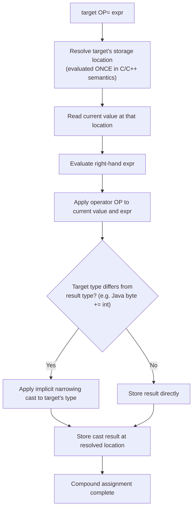

## Compound Assignment Operators

### Overview

Compound assignment operators combine a binary arithmetic, bitwise, or (in some languages) logical operation with assignment in a single operator, allowing a variable to be updated in place without repeating its name on both sides of an assignment. Beyond the obvious conciseness benefit, compound assignment operators carry semantic nuances involving how many times the left-hand side is evaluated, how implicit type conversions are applied, and how operator overloading interacts with them in languages that support user-defined types.

### Basic Form and Motivation

The general pattern is:

$$\text{target} \mathbin{\oplus}= \text{expression} \quad \equiv \quad \text{target} = \text{target} \mathbin{\oplus} \text{expression}$$

where $\oplus$ is some binary operator (`+`, `-`, `*`, `/`, `%`, `&`, `|`, `^`, `\<\<`, `\>\>`, and others depending on the language).

```c
int score = 10;
score += 5;   // equivalent to: score = score + 5;
score -= 2;   // equivalent to: score = score - 2;
```

The motivation is twofold: **conciseness** (avoiding repetition of the target's name, especially when the target is a long expression) and, in some languages, **efficiency** (avoiding redundant evaluation of a complex left-hand-side expression).

### Standard Set of Compound Assignment Operators

| Operator | Operation | Equivalent expanded form |
| --- | --- | --- |
| `+=` | Addition | `x = x + y` |
| `-=` | Subtraction | `x = x - y` |
| `*=` | Multiplication | `x = x * y` |
| `/=` | Division | `x = x / y` |
| `%=` | Modulo/remainder | `x = x % y` |
| `&=` | Bitwise AND | `x = x & y` |
| `|=` | Bitwise OR | `x = x | y` |
| `^=` | Bitwise XOR | `x = x ^ y` |
| `\<\<=` | Left shift | `x = x << y` |
| `\>\>=` | Right shift (arithmetic or logical, per language) | `x = x >> y` |
| `>>>=` | Unsigned right shift (Java, JavaScript only) | `x = x >>> y` |
| `**=` | Exponentiation (Python, JavaScript ES2016+) | `x = x ** y` |
| `//=` | Floor division (Python only) | `x = x // y` |

Not every language supports the full set. C provides all of the bitwise and arithmetic forms; Python omits `++`/`--` entirely and adds `**=` and `//=`; JavaScript added `**=` in ES2016 and later added logical compound assignment operators (`&&=`, `||=`, `??=`), discussed separately below.

### Left-Hand Side Evaluated Once: A Real Semantic Difference

**Key Points**

- In languages like C and C++, `x op= y` is not always strictly equivalent to `x = x op y` — when `x` is a complex expression with side effects (such as an array index containing a function call or an increment operator), the compound form guarantees the addressing computation for `x` is performed only **once**.
- The naive expansion `x = x op y` would evaluate `x`'s addressing expression **twice** — once to read the current value, once to determine where to store the result — which can produce different, and often incorrect, results if that addressing expression has side effects.

```c
#include <stdio.h>

int index = 0;

int next_index(void) {
    return index++;
}

int main(void) {
    int arr[5] = {10, 20, 30, 40, 50};

    index = 0;
    arr[next_index()] += 100;
    // next_index() called ONCE: arr[0] becomes 110, index becomes 1

    index = 0;
    arr[next_index()] = arr[next_index()] + 100;
    // next_index() called TWICE: first call returns 0 (for read),
    // second call returns 1 (for write) — arr[0] unchanged (except by the first
    // read's contribution to the sum), arr[1] receives the write

    return 0;
}
```

This distinction is why compound assignment operators are considered genuinely distinct operators in C's grammar and semantics, not mere syntactic sugar that a preprocessor-style textual substitution could faithfully replicate in all cases. **[Inference]**: because this evaluate-once guarantee is a specific, testable property of the C and C++ language standards rather than a universally observed convention, the general expectation that compound assignment operators evaluate their left-hand side once is reasonably treated as standard behavior in those languages, though the exact mechanism and applicability to arbitrary lvalue expressions should be checked against a given compiler's conformance for unusual edge cases.

### Compound Assignment and Implicit Type Conversion

In statically typed languages with numeric type hierarchies, compound assignment operators can behave differently from their fully expanded form with respect to implicit narrowing conversions.

In Java, for example, `x += y` performs an **implicit cast** back to `x`'s type, even when the expanded form `x = x + y` would not compile due to a narrowing conversion:

```java
byte b = 10;
// b = b + 5;    // COMPILE ERROR: b + 5 is promoted to int, cannot assign int to byte without a cast
b += 5;           // OK — compiles because += implicitly inserts a narrowing cast: b = (byte)(b + 5)
```

This is a documented, specified behavior of the Java Language Specification, not a quirk of a particular compiler — the compound assignment operator is defined to include an implicit cast to the target type, which the plain `+` and `=` combination does not provide.

### Compound Assignment with Operator Overloading

In languages that support operator overloading (C++, C#, Rust, and others), compound assignment operators can be overloaded independently of their corresponding binary operators, allowing classes to provide more efficient in-place mutation logic rather than relying on a generic `x = x op y` expansion that would construct a new temporary object.

**C++:**

```cpp
class BigNumber {
public:
    std::vector<int> digits;

    // Overloading += to mutate in place, avoiding a temporary object
    BigNumber& operator+=(const BigNumber& other) {
        // ... in-place addition logic, modifying this->digits directly
        return *this;
    }

    // operator+ can be implemented in terms of += for consistency,
    // but += itself avoids constructing an extra temporary when used directly
    BigNumber operator+(const BigNumber& other) const {
        BigNumber result = *this;
        result += other;
        return result;
    }
};
```

This pattern — implementing `operator+` in terms of `operator+=` rather than the reverse — is a widely followed C++ idiom, since it allows `+=` to avoid the overhead of constructing and discarding a temporary object, which matters for performance-sensitive types like large numeric or container classes.

**Rust** achieves the equivalent through the `AddAssign`, `SubAssign`, `MulAssign`, and related traits in `std::ops`, which types can implement to support `+=`, `-=`, `*=`, and so on for user-defined types.

```rust
use std::ops::AddAssign;

struct Point { x: i32, y: i32 }

impl AddAssign for Point {
    fn add_assign(&mut self, other: Point) {
        self.x += other.x;
        self.y += other.y;
    }
}
```

### Logical Compound Assignment Operators

Some languages extend the compound assignment pattern to logical/short-circuit operators, combining conditional evaluation with assignment.

**JavaScript** (ES2021 introduced these three):

| Operator | Equivalent to | Behavior |
| --- | --- | --- |
| `x &&= y` | `x = x && y` | Assigns `y` to `x` only if `x` is currently truthy |
| `x ||= y` | `x = x || y` | Assigns `y` to `x` only if `x` is currently falsy |
| `x ??= y` | `x = x ?? y` | Assigns `y` to `x` only if `x` is currently `null` or `undefined` |

```javascript
let config = null;
config ??= {};          // config becomes {} since it was null
console.log(config);    // {}

let flag = true;
flag &&= checkSomething();  // checkSomething() only runs because flag was truthy

let value = 0;
value ||= 42;            // value becomes 42, since 0 is falsy
console.log(value);      // 42
```

Because these operators are themselves short-circuiting, the right-hand side (`y`) is not evaluated at all when the assignment would not occur — meaning `x &&= y` does not evaluate `y` if `x` is already falsy, preserving the short-circuit guarantee even in the compound-assignment form. This makes them meaningfully different from a naive "always assign" compound operator, and useful specifically for conditionally initializing or updating a value without an explicit `if` statement.

### Languages Without Compound Assignment

Not every language provides compound assignment operators. Some, particularly in the functional paradigm or those emphasizing immutability, omit them because they either lack general-purpose mutable variables or discourage in-place mutation as an idiom.

- **Haskell**: has no built-in compound assignment operators in the traditional sense, since ordinary Haskell bindings are immutable by default; mutation, when needed, goes through explicit constructs like `IORef` and functions such as `modifyIORef`, which are function calls rather than operator syntax.
- **Standard ML / OCaml**: similarly favor immutable bindings by default; mutable references use explicit dereference/assignment syntax (`:=` for assignment to a `ref` in OCaml, `!` for dereferencing) rather than a family of compound operators.
- **Older BASIC dialects**: many lacked compound assignment operators entirely, requiring the fully expanded form (`LET X = X + 1`) for every update.

### Precedence and Associativity of Compound Assignment

Compound assignment operators, like simple assignment, are typically **right-associative** and have very low precedence — lower than nearly all other operators — meaning the entire right-hand expression is evaluated first, according to its own internal precedence rules, before the compound operation and assignment occur.

```c
int x = 10;
x += 2 * 3;   // parsed as: x = x + (2 * 3), NOT (x + 2) * 3
              // x becomes 16, not 36
```

Right-associativity also enables (though it is far less common in practice than for simple `=`) chaining involving compound operators in some languages, though most style guides discourage this due to reduced readability.

### Compound Assignment Expansion Diagram

<svg xmlns="http://www.w3.org/2000/svg" viewBox="0 0 740 300" font-family="sans-serif">
<text x="370" y="28" text-anchor="middle" font-size="18" font-weight="bold" fill="#1a1a2e">Compound Assignment: One Evaluation vs. Two (svg_diagram)</text>
<rect x="20" y="55" width="340" height="220" rx="8" fill="#eef2f7" stroke="#4a4e69" stroke-width="2" />
<text x="190" y="85" text-anchor="middle" font-size="15" font-weight="bold" fill="#1a1a2e">arr[f()] += 100;</text>
<rect x="60" y="105" width="260" height="35" fill="#a3c9a8" stroke="#333" />
<text x="190" y="127" text-anchor="middle" font-size="12">Evaluate f() ONCE → get index</text>
<rect x="60" y="150" width="260" height="35" fill="#a3c9a8" stroke="#333" />
<text x="190" y="172" text-anchor="middle" font-size="12">Read arr[index], add 100, store back</text>
<text x="190" y="215" text-anchor="middle" font-size="12" fill="#27ae60">Safe with side-effecting index expr</text>
<text x="190" y="240" text-anchor="middle" font-size="11" fill="#555">(C/C++ compound assignment guarantee)</text>
<rect x="380" y="55" width="340" height="220" rx="8" fill="#eef2f7" stroke="#4a4e69" stroke-width="2" />
<text x="550" y="85" text-anchor="middle" font-size="15" font-weight="bold" fill="#1a1a2e">arr[f()] = arr[f()] + 100;</text>
<rect x="420" y="105" width="260" height="35" fill="#e8b4b8" stroke="#333" />
<text x="550" y="127" text-anchor="middle" font-size="12">Evaluate f() FIRST TIME (read side)</text>
<rect x="420" y="150" width="260" height="35" fill="#e8b4b8" stroke="#333" />
<text x="550" y="172" text-anchor="middle" font-size="12">Evaluate f() SECOND TIME (write side)</text>
<text x="550" y="215" text-anchor="middle" font-size="12" fill="#c0392b">Risk: index may differ between calls</text>
<text x="550" y="240" text-anchor="middle" font-size="11" fill="#555">(naive manual expansion)</text>
</svg>

### Compound Assignment Evaluation Flow



### Example

**C** (compound assignment on struct members and arrays):

```c
#include <stdio.h>

typedef struct {
    int health;
    int shield;
} Player;

int main(void) {
    Player p = {100, 50};

    p.health -= 30;    // p.health becomes 70
    p.shield += 20;    // p.shield becomes 70

    int inventory[3] = {5, 10, 15};
    inventory[1] *= 2; // inventory[1] becomes 20

    printf("Health: %d, Shield: %d, Item1: %d\n", p.health, p.shield, inventory[1]);
    return 0;
}
```

**JavaScript** (mixing arithmetic and logical compound assignment):

```javascript
let cart = { items: 0, total: 0.0 };

cart.items += 3;
cart.total += 29.99 * 3;

let discountCode = "";
discountCode ||= "NONE";   // discountCode becomes "NONE" since "" is falsy

let cache = undefined;
cache ??= computeExpensiveValue(); // computeExpensiveValue() runs only because cache was undefined

console.log(cart, discountCode);
```

**Python** (compound assignment without `++`/`--`, plus floor-division and exponent forms):

```python
count = 0
count += 1        # count becomes 1

total = 100
total //= 3       # floor division compound assignment: total becomes 33

base = 2
base **= 8        # exponentiation compound assignment: base becomes 256

# No ++ or -- exist in Python:
# count++   # SyntaxError
```

### Common Pitfalls

- Assuming `x += y` is always a strictly literal textual substitution for `x = x + y` — in C/C++ this is false whenever `x`'s addressing expression has side effects, since the compound form evaluates that addressing expression only once.
- Overlooking that in Java, `x += y` performs an implicit narrowing cast back to `x`'s declared type, which can silently truncate or overflow a value in a way that the fully expanded form would have refused to compile.
- Forgetting that JavaScript's logical compound assignment operators (`&&=`, `||=`, `??=`) are short-circuiting — the right-hand side is not evaluated unless the assignment condition is met, which matters if that expression has side effects.
- Attempting to use `++`/`--` in languages that deliberately omit them (such as Python), or assuming their behavior transfers unchanged across languages that both support them but differ in edge-case semantics (e.g., applying them to non-numeric or reference types).
- Relying on chained compound assignment for readability; while often syntactically legal due to right-associativity, most style guides discourage it as it can obscure evaluation order for readers.
- Assuming all languages support the same set of compound operators — bitwise compound operators (`&=`, `|=`, `^=`, shifts) are common in C-family and Java-family languages but may be absent, differently named, or behave differently (e.g., arithmetic vs. logical shift) elsewhere.

### Related Topics

- Assignment statements and their semantics
- Operator overloading in object-oriented and generic programming
- Short-circuit evaluation
- Immutability and functional-style state management
- Increment/decrement operators and evaluation order pitfalls
- Type coercion and implicit conversions in expressions
- Rust's `std::ops` trait system for operator customization
- Nullish coalescing and optional/default value patterns across languages