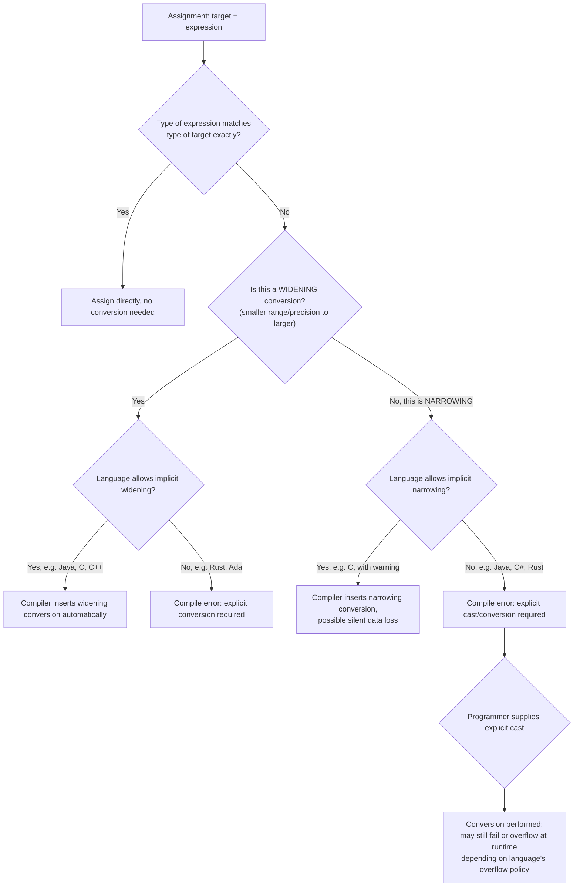

## Mixed-Mode Assignment

### Overview

Mixed-mode assignment occurs when the type of the expression on the right-hand side of an assignment differs from the declared or inferred type of the target variable on the left-hand side. When this happens, the language must decide whether to permit the assignment, and if so, how to reconcile the type mismatch — typically through an implicit conversion (coercion), an explicit conversion the programmer must write, or outright rejection at compile time or runtime. This is closely related to, but distinct from, mixed-mode *expressions* (where operands of differing types are combined within a single arithmetic or relational expression) — mixed-mode assignment specifically concerns the final step of storing a computed value into a differently typed variable.

### What Makes an Assignment "Mixed-Mode"

An assignment is mixed-mode when the static (or dynamic, in dynamically typed languages) type of the right-hand expression does not identically match the type of the left-hand target. Common cases include:

- Assigning an `int` value to a `float`/`double` variable (widening numeric conversion)
- Assigning a `double` value to an `int` variable (narrowing numeric conversion)
- Assigning a subclass instance to a superclass-typed variable (upcasting, generally safe)
- Assigning a superclass-typed value to a subclass-typed variable (downcasting, generally unsafe without an explicit check or cast)
- Assigning between numeric types of differing signedness or width (`short` to `int`, `unsigned` to `signed`, etc.)
- Assigning a value of one dynamically-typed variable's current type to a variable currently holding a different type (relevant mainly in dynamically typed languages, where "mixed-mode" is less a per-statement concern and more the default condition of every assignment)

### Widening vs. Narrowing Conversions

**Key Points**

- A **widening conversion** moves a value from a type with a smaller range or less precision to one with a larger range or more precision (e.g., `int` → `long`, `int` → `double`). Widening conversions are generally considered "safe" because they do not lose information (with a caveat for certain integer-to-floating-point conversions, noted below), and most statically typed languages perform them implicitly.
- A **narrowing conversion** moves a value from a type with a larger range or more precision to one with a smaller range or less precision (e.g., `double` → `int`, `long` → `short`). Narrowing conversions risk data loss (truncation, loss of precision, overflow) and are treated far more conservatively across languages — many require an explicit cast to signal that the programmer accepts this risk.

```java
// Widening: implicit, no cast required
int i = 100;
long l = i;        // OK — int widens to long implicitly
double d = l;       // OK — long widens to double implicitly

// Narrowing: requires explicit cast in Java
double pi = 3.14159;
// int truncated = pi;      // COMPILE ERROR
int truncated = (int) pi;   // OK — explicit cast required; truncated = 3
```

**[Unverified]**: whether a particular widening conversion between an integer type and a floating-point type can lose precision depends on the specific type widths involved (for example, a very large `long` value converted to `double` can lose precision because `double`'s 52-bit mantissa cannot represent every 64-bit integer exactly) — this is a well-documented property of IEEE 754 floating-point representation, though whether it affects a *specific* value depends on that value's magnitude, so it is not something a general statement can universally confirm or deny without knowing the value in question.

### Language-by-Language Behavior

Languages vary substantially in how permissive they are about mixed-mode assignment.

| Language | Widening (implicit) | Narrowing (implicit) | Notes |
| --- | --- | --- | --- |
| C | Yes | Yes (with compiler warning, not error) | C's weak type discipline permits most narrowing assignments silently; `-Wconversion` flags can surface warnings |
| C++ | Yes | Yes (with compiler warning under strict flags) | Similar to C; `{}`-brace initialization syntax forbids narrowing at compile time |
| Java | Yes | No — requires explicit cast | Strict distinction enforced by the compiler |
| C# | Yes | No — requires explicit cast | Similar to Java; `checked`/`unchecked` contexts affect overflow behavior on narrowing casts |
| Python | N/A (dynamic typing) | N/A (dynamic typing) | No static type check on assignment; rebinding a name to any type is always permitted |
| JavaScript | N/A (dynamic typing) | N/A (dynamic typing) | No static type check; but arithmetic *operators* perform extensive implicit coercion |
| Rust | No — even widening requires explicit `as` or `From`/`Into` | No — requires explicit `as` or fallible conversion (`TryFrom`) | Rust deliberately disallows *all* implicit numeric conversions, widening or narrowing |
| Ada | No — requires explicit conversion function/attribute | No — requires explicit conversion function/attribute | Ada's strong typing disallows implicit conversion even between closely related numeric types |

Rust and Ada represent the strict end of this spectrum: both require explicit conversion syntax for essentially all cross-type assignment, including conversions that other languages would consider "safe" widening.

```rust
let i: i32 = 100;
// let l: i64 = i;       // COMPILE ERROR: no implicit widening in Rust
let l: i64 = i as i64;    // OK — explicit conversion required
let l2: i64 = i.into();   // OK — using the Into trait, also explicit
```

C, by contrast, sits at the permissive end: both widening and narrowing conversions are implicitly allowed in ordinary assignment, with the compiler issuing, at most, a warning (not an error) for potentially lossy narrowing — a design choice inherited from C's minimalist type-checking philosophy and its historical proximity to assembly-level programming.

### Mixed-Mode Assignment in Statically Typed Object-Oriented Languages

Beyond numeric types, mixed-mode assignment applies to class hierarchies, governed by the **Liskov substitution principle**: a value of a subclass type can always be assigned to a variable of a superclass type (upcasting, implicit and safe), but the reverse (downcasting) requires an explicit cast and may fail at runtime if the actual object is not an instance of the target subclass.

```java
class Animal {}
class Dog extends Animal {}

Animal a = new Dog();      // OK — upcast, implicit; a Dog IS-A Animal
// Dog d = a;               // COMPILE ERROR: cannot implicitly downcast
Dog d = (Dog) a;            // OK — explicit downcast; succeeds here since a really holds a Dog

Animal a2 = new Animal();
// Dog d2 = (Dog) a2;       // COMPILES, but throws ClassCastException at RUNTIME
                             // since a2 does not actually hold a Dog instance
```

This illustrates that even with an explicit cast present, a mixed-mode assignment involving downcasting is not guaranteed safe at compile time in languages using nominal subtyping with runtime type identity (such as Java and C#) — the cast is a promise to the compiler that is checked only at runtime, and violating that promise produces a runtime exception rather than a silent error.

### Mixed-Mode Assignment and Implicit Coercion in Dynamically Typed Languages

In dynamically typed languages, the notion of "mixed-mode assignment" as a distinct per-statement type-checking event mostly does not apply, because a variable name is simply a reference that can be rebound to a value of any type at any time — there is no compile-time target type to compare against.

```python
x = 5          # x refers to an int
x = "hello"    # x now refers to a str — this is legal; no "mixed-mode" error occurs
x = [1, 2, 3]  # x now refers to a list
```

However, mixed-mode *behavior* still surfaces prominently in these languages at the point where **values of differing types are combined and the result is assigned**, since the coercion happens within the expression, not the assignment itself:

```javascript
let total = 5 + "5";   // "5" is coerced: total becomes "55" (string concatenation wins)
let sum = 5 + true;    // true is coerced to 1: sum becomes 6
```

This distinction is important: JavaScript's `+` operator performing mixed-mode coercion is a property of the *expression evaluation*, and the subsequent assignment (`total = ...`) simply stores whatever type that expression produced — the assignment step itself performs no additional coercion beyond binding the name to the resulting value.

### Compiler-Inserted Conversion Code

When a language permits implicit mixed-mode assignment, the compiler (or interpreter) must insert conversion logic at the assignment site. This is conceptually equivalent to the compiler silently rewriting:



```
target = expression;
```

into something like:



```
target = convert(expression, target_type);
```

For primitive numeric widening, this conversion is typically a single machine instruction (e.g., sign-extension for integer widening, or a floating-point conversion instruction). For narrowing, it may involve truncation, rounding, or — in overflow-checked contexts (such as C#'s `checked` blocks or Rust's explicit fallible conversions) — a runtime check that can raise an exception or return an error rather than silently producing an incorrect value.

```csharp
checked {
    int big = 300;
    byte b = (byte)big;   // In a checked context, this throws OverflowException
                            // since 300 does not fit in a byte's range (0–255)
}

unchecked {
    int big = 300;
    byte b = (byte)big;   // No exception; b silently becomes 44 (300 mod 256)
}
```

C#'s `checked`/`unchecked` contexts illustrate that even within a single language, the consequences of a narrowing mixed-mode assignment (via explicit cast) can be configured to either fail loudly or wrap silently, depending on the surrounding code block.

### Mixed-Mode Assignment Decision Flow



### Numeric Conversion Range Diagram

<svg xmlns="http://www.w3.org/2000/svg" viewBox="0 0 760 300" font-family="sans-serif">
<text x="380" y="28" text-anchor="middle" font-size="18" font-weight="bold" fill="#1a1a2e">Widening vs. Narrowing Conversion (svg_diagram)</text>

<text x="130" y="70" text-anchor="middle" font-size="13" font-weight="bold" fill="`#1a1a2e`">byte</text>

<rect x="60" y="80" width="140" height="30" fill="`#a3c9a8`" stroke="#333" />

<text x="130" y="100" text-anchor="middle" font-size="11">8-bit range</text>

<text x="380" y="70" text-anchor="middle" font-size="13" font-weight="bold" fill="`#1a1a2e`">int</text>

<rect x="230" y="80" width="300" height="30" fill="`#f4c95d`" stroke="#333" />

<text x="380" y="100" text-anchor="middle" font-size="11">32-bit range</text>

<text x="670" y="70" text-anchor="middle" font-size="13" font-weight="bold" fill="`#1a1a2e`">long</text>

<rect x="560" y="80" width="180" height="30" fill="`#e8b4b8`" stroke="#333" />

<text x="670" y="100" text-anchor="middle" font-size="11">64-bit range</text>

<path d="M 130 115 L 130 150 L 380 150 L 380 115" fill="none" stroke="#27ae60" stroke-width="2" marker-end="url(#arrowgreen)" />
<text x="255" y="170" text-anchor="middle" font-size="12" fill="#27ae60">Widening: byte → int (safe, implicit in most languages)</text>
<path d="M 670 115 L 670 200 L 130 200 L 130 235" fill="none" stroke="#c0392b" stroke-width="2" marker-end="url(#arrowred)" />
<text x="400" y="220" text-anchor="middle" font-size="12" fill="#c0392b">Narrowing: long → byte (risk of data loss, often requires explicit cast)</text>
</svg>

### Example

**C** (permissive implicit narrowing, with warning under strict flags):

```c
#include <stdio.h>

int main(void) {
    double price = 19.99;
    int wholePrice = price;   /* implicit narrowing: legal in C, truncates to 19 */

    long bigValue = 4000000000L;
    int narrowed = bigValue;  /* implementation-defined/undefined behavior if it
                                  overflows int's range on the target platform */

    printf("%d %d\n", wholePrice, narrowed);
    return 0;
}
```

**Java** (strict: widening implicit, narrowing requires cast):

```java
public class MixedMode {
    public static void main(String[] args) {
        int i = 42;
        double d = i;          // widening: implicit, safe

        double pi = 3.9999;
        int truncated = (int) pi;  // narrowing: explicit cast required; truncated = 3

        long bigLong = 10_000_000_000L;
        int overflowed = (int) bigLong; // explicit cast compiles, but silently
                                          // wraps/overflows at runtime — no exception
        System.out.println(d + " " + truncated + " " + overflowed);
    }
}
```

**Rust** (strictest: no implicit conversion at all, even widening):

```rust
fn main() {
    let small: i8 = 42;
    let big: i64 = small as i64;   // explicit conversion required even though widening

    let pi: f64 = 3.9999;
    let truncated: i32 = pi as i32; // explicit conversion; truncated = 3

    // Using TryFrom for a checked, fallible narrowing conversion instead of `as`:
    let big_value: i64 = 10_000_000_000;
    let result: Result<i32, _> = i32::try_from(big_value);
    match result {
        Ok(v) => println!("Fits: {}", v),
        Err(_) => println!("Value does not fit in i32"), // this branch executes here
    }
}
```

### Common Pitfalls

- Assuming a narrowing mixed-mode assignment that compiles (via explicit cast) is therefore guaranteed correct — in languages like Java, C#, and Rust's `as`, the cast silences the compiler but does not prevent silent truncation, wraparound, or precision loss at runtime.
- Relying on C's permissive implicit narrowing without enabling stricter compiler warnings (`-Wconversion`, `-Wnarrowing` or equivalent), which can mask genuine bugs where a value silently loses precision or overflows.
- Assuming all "widening" conversions are perfectly lossless — very large integer types converted to floating-point types can lose precision because the floating-point mantissa may not be able to represent every integer value in that range exactly.
- Forgetting that in nominally-typed object-oriented languages, an explicit downcast that compiles successfully can still throw a runtime exception (e.g., Java's `ClassCastException`) if the actual runtime type does not match the target type.
- Assuming dynamically typed languages have no "mixed-mode" concerns at all — while assignment itself performs no type checking, the expressions being assigned frequently involve implicit coercion rules (especially in JavaScript) that can produce surprising results.
- Confusing C#'s `checked`/`unchecked` (or similar overflow-detection mechanisms in other languages) as being the default behavior, when the default in most C-family languages is unchecked (silent wraparound) unless explicitly configured otherwise.

### Related Topics

- Assignment statements and their semantics
- Compound assignment operators
- Mixed-mode arithmetic expressions and operator promotion rules
- Type coercion and implicit conversion in expressions
- Explicit type casting and conversion functions
- Numeric overflow, underflow, and wraparound behavior
- Liskov substitution principle and subtype polymorphism
- Static vs. dynamic type systems