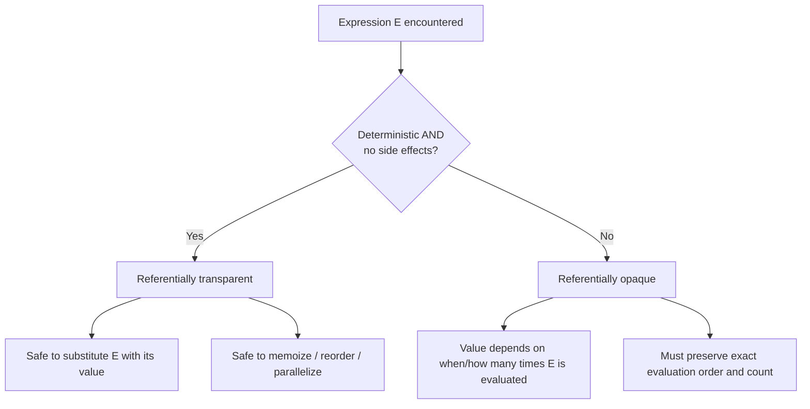

## Referential Transparency in Expressions

### Definition

An expression is referentially transparent if it can be replaced by its evaluated value, anywhere it appears in a program, without changing the program's behavior. Equivalently, a referentially transparent expression, given the same inputs, always evaluates to the same result and produces no observable side effects. This property is also called the **substitution property**, since it permits equational reasoning: an expression and its value are interchangeable.

Formally, an expression $E$ is referentially transparent if for any two occurrences of $E$ under the same environment (same variable bindings, same program state), both occurrences evaluate to the same value $v$, and replacing either occurrence with $v$ leaves the meaning of the program unchanged.

### Conditions for Referential Transparency

An expression is referentially transparent when it satisfies two conditions simultaneously:

- **Determinism** — the expression always produces the same output given the same inputs. There is no dependence on hidden state, randomness, or external mutable data.
- **No side effects** — evaluating the expression does not modify any state observable outside the expression itself (no assignment to variables outside its scope, no I/O, no mutation of shared data structures).

If either condition fails, the expression is referentially opaque.

### Referentially Transparent Examples

**Example**

```python
def square(x):
    return x * x

a = square(5) + square(5)
b = 25 + 25
```

Here `square(5)` always yields `25`; both occurrences of `square(5)` can be replaced by `25` without altering the meaning of `a`. The function has no side effects and depends only on its argument, so `a` and `b` are equivalent.

```c
int square(int x) {
    return x * x;
}
```

The same holds in C for a pure function like this, provided `x` is a local parameter and no global or static state is touched.

### Referentially Opaque Examples

**Example**

```python
counter = 0

def next_id():
    global counter
    counter += 1
    return counter

a = next_id() + next_id()   # 1 + 2 = 3
```

`next_id()` cannot be replaced by a single fixed value, because each call returns a different result depending on hidden mutable state (`counter`). The two calls are not interchangeable with any single literal — substituting the first call's result (`1`) for both occurrences would yield `2`, not `3`. This violates referential transparency.

Other common sources of referential opacity:

- Reading or writing global/static variables
- I/O operations (`print`, file reads, network calls)
- Reliance on mutable object state (e.g., a method that depends on an object's internal field, which other code may have changed)
- Random number generation
- Reading the system clock or environment variables
- Assignment statements themselves, in most imperative languages, since `x = x + 1` changes the meaning of `x` on each execution

### Relationship to Assignment Statements

Assignment statements are the canonical mechanism by which imperative languages introduce referential opacity. Consider:

```c
x = x + 1;
```

The right-hand side `x + 1` is not referentially transparent across repeated executions of this statement, because each execution changes the value bound to `x`. The expression's value depends on *when* it is evaluated relative to prior assignments, not solely on syntactic form. This is a direct consequence of mutable variables: a variable name in an imperative language denotes a storage location whose contents can change, rather than a fixed value.

Contrast this with a variable binding in a pure functional context:

```haskell
let x = 5 in x + 1
```

Within this scope, `x` is bound once and cannot be reassigned; every occurrence of `x` denotes the same value `5` for the lifetime of the binding. `x + 1` is therefore referentially transparent — it always evaluates to `6` wherever it appears within that scope.

### Why It Matters

- **Equational reasoning** — referentially transparent code allows programmers (and compilers) to reason about correctness by substituting expressions with their values, similar to algebra. This underlies formal verification and simplifies manual proof of program properties.
- **Compiler optimization** — a referentially transparent expression can be safely subjected to **common subexpression elimination**, memoization, or reordering, since evaluating it twice or once produces identical observable results. Referentially opaque expressions constrain these optimizations, since the compiler must preserve evaluation order and count.
- **Parallelism and concurrency** — expressions without side effects and without dependence on shared mutable state can be evaluated in parallel or in any order without risk of race conditions or inconsistent results.
- **Testability** — referentially transparent functions are easier to unit test, since output depends only on input; no test fixture needs to simulate hidden state.
- **Debugging** — because the value of an expression does not depend on execution history, referentially transparent code is generally easier to trace and less prone to bugs stemming from unexpected ordering or aliasing.

[Inference] The degree to which these benefits are realized in practice depends on how consistently a codebase avoids side effects; a single referentially opaque function can undermine local reasoning about code that calls it, even in an otherwise pure system.

### Referential Transparency and Programming Paradigms

Purely functional languages (e.g., Haskell) are designed so that, in the absence of explicit escape hatches (unsafe operations, monadic I/O), all expressions are referentially transparent by construction — variables are immutable bindings rather than mutable storage locations, and functions cannot perform side effects outside of tracked effect types like `IO`.

Imperative languages (e.g., C, Python, Java) permit mutable variables and side-effecting operations freely, so referential transparency is not a language-wide guarantee; it becomes a property that a programmer must deliberately preserve within specific functions or expressions, often termed writing in a "pure" style even within an otherwise impure language.

Multi-paradigm languages (e.g., Scala, Rust, JavaScript with `const` and pure functions) allow programmers to opt into referentially transparent style locally, without enforcing it globally.

### Diagram

<svg xmlns="http://www.w3.org/2000/svg" viewBox="0 0 760 360">
<text x="380" y="30" text-anchor="middle" font-size="18" font-weight="bold" fill="#1a1a1a">Referential Transparency: Substitution (svg_diagram)</text>
<rect x="30" y="70" width="320" height="120" rx="8" fill="#e8f4ea" stroke="#2f7d3f" stroke-width="1.5" />
<text x="190" y="95" text-anchor="middle" font-size="14" font-weight="bold" fill="#2f7d3f">Referentially Transparent</text>
<text x="50" y="120" font-size="13" fill="#1a1a1a">square(5) + square(5)</text>
<text x="70" y="145" font-size="20" fill="#2f7d3f">↓ substitute</text>
<text x="50" y="170" font-size="13" fill="#1a1a1a">25 + 25 (always valid)</text>
<rect x="410" y="70" width="320" height="120" rx="8" fill="#fbeaea" stroke="#b23b3b" stroke-width="1.5" />
<text x="570" y="95" text-anchor="middle" font-size="14" font-weight="bold" fill="#b23b3b">Referentially Opaque</text>
<text x="430" y="120" font-size="13" fill="#1a1a1a">next_id() + next_id()</text>
<text x="450" y="145" font-size="20" fill="#b23b3b">↓ substitute?</text>
<text x="430" y="170" font-size="13" fill="#1a1a1a">1 + 1 ≠ 1 + 2 (invalid)</text>
<line x1="190" y1="200" x2="190" y2="240" stroke="#2f7d3f" stroke-width="1.5" marker-end="url(#arrow1)" />
<line x1="570" y1="200" x2="570" y2="240" stroke="#b23b3b" stroke-width="1.5" marker-end="url(#arrow2)" />
<rect x="30" y="250" width="320" height="80" rx="8" fill="#f5f5f5" stroke="#555" stroke-width="1" />
<text x="190" y="275" text-anchor="middle" font-size="12" fill="#1a1a1a">Deterministic</text>
<text x="190" y="295" text-anchor="middle" font-size="12" fill="#1a1a1a">No side effects</text>
<text x="190" y="315" text-anchor="middle" font-size="12" fill="#1a1a1a">Safe to memoize / reorder</text>
<rect x="410" y="250" width="320" height="80" rx="8" fill="#f5f5f5" stroke="#555" stroke-width="1" />
<text x="570" y="275" text-anchor="middle" font-size="12" fill="#1a1a1a">Depends on hidden state</text>
<text x="570" y="295" text-anchor="middle" font-size="12" fill="#1a1a1a">Mutates shared data</text>
<text x="570" y="315" text-anchor="middle" font-size="12" fill="#1a1a1a">Order-sensitive, not substitutable</text>
</svg>

### Evaluation Order Flow



### Key Points

- Referential transparency means an expression can be replaced by its value without changing program behavior.
- It requires both determinism and the absence of side effects.
- Assignment to mutable variables is the primary source of referential opacity in imperative languages.
- Purely functional languages enforce referential transparency by disallowing mutable variable rebinding and unrestricted side effects.
- The property enables equational reasoning, compiler optimizations (common subexpression elimination, memoization), and safe parallel evaluation.
- [Inference] Whether a given codebase realizes these benefits in practice depends on how consistently referential transparency is preserved across the functions that make it up, since impurity in one part can propagate reasoning difficulty to callers.

**Related Topics**

- Side effects in expression evaluation
- Pure functions versus impure functions
- Lvalues and rvalues in assignment statements
- Immutability and variable binding in functional languages
- Common subexpression elimination and compiler optimization
- Monads and effect tracking (e.g., Haskell's `IO` type)
- Memoization and equational reasoning
- Aliasing and its effect on referential transparency