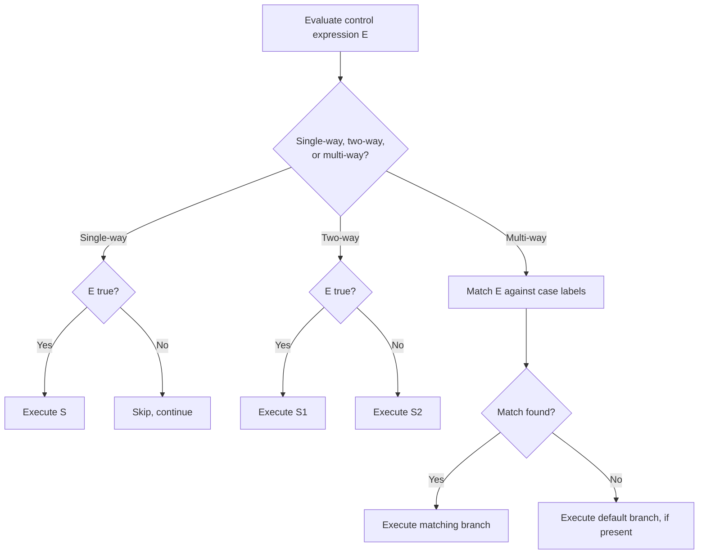

## Selection Statements: Single-Way and Multi-Way

### Overview

A selection statement allows a program to choose among alternative execution paths based on the evaluation of a control expression. Selection statements are one of the three fundamental control structures in imperative programming, alongside sequence and iteration. They are broadly classified by how many alternative paths they support: **single-way selection**, **two-way selection**, and **multi-way selection**.

### Single-Way Selection

A single-way selection statement evaluates a Boolean control expression and executes an associated block of code only if the expression evaluates to true; otherwise, execution simply skips the block and continues with the next statement. There is no alternative branch.

**Example**

```python
if temperature > 100:
    print("Boiling point reached")
```

```c
if (temperature > 100) {
    printf("Boiling point reached\n");
}
```

The general syntactic form is:

$$\text{if } (E) \ S$$

where $E$ is a Boolean-valued control expression and $S$ is a statement (or block) executed only when $E$ evaluates to true.

### Two-Way Selection

Two-way selection extends single-way selection with an alternative branch, executed when the control expression evaluates to false. This is the familiar `if-else` construct.

**Example**

```python
if age >= 18:
    print("Adult")
else:
    print("Minor")
```

Formally:

$$\text{if } (E) \ S_1 \ \text{else} \ S_2$$

Exactly one of $S_1$ or $S_2$ executes, never both and never neither, assuming $E$ terminates and produces a Boolean value.

**Nested Two-Way Selection and the Dangling Else**

Chaining two-way selections produces a common pattern for approximating multi-way selection:

```c
if (score >= 90) {
    grade = 'A';
} else if (score >= 80) {
    grade = 'B';
} else if (score >= 70) {
    grade = 'C';
} else {
    grade = 'F';
}
```

This is syntactically a sequence of nested `if-else` statements, where each `else` branch contains another `if`. A well-known ambiguity arises in languages with this construct: the **dangling else problem**, where a nested `if` without a matching `else` creates ambiguity about which `if` an `else` clause belongs to.

```c
if (a > 0)
    if (b > 0)
        printf("both positive\n");
    else
        printf("a positive, b not\n");
```

Most languages resolve this by binding `else` to the nearest unmatched `if` (a rule sometimes called the "nearest-if" or "dangling-else" resolution rule). [Unverified] Some languages avoid the ambiguity entirely by requiring mandatory delimiters or `end if` terminators (e.g., Ada, Fortran), which remove the need for a disambiguation rule at the grammar level.

### Multi-Way Selection

Multi-way selection allows a control expression to select among more than two alternative execution paths based on its value, typically without requiring explicit chained comparisons. The most common form is the **case** or **switch** statement.

**Example**

```c
switch (day) {
    case 1:
        printf("Monday\n");
        break;
    case 2:
        printf("Tuesday\n");
        break;
    default:
        printf("Other day\n");
        break;
}
```

```python
match day:
    case 1:
        print("Monday")
    case 2:
        print("Tuesday")
    case _:
        print("Other day")
```

Formally, a multi-way selection statement can be described as:

$$\text{switch } (E) \ \{ \ c_1: S_1; \ c_2: S_2; \ \ldots; \ c_n: S_n; \ \text{default}: S_{default} \ \}$$

where $E$ is evaluated once, and control transfers to the statement list associated with the matching case constant $c_i$, or to the `default` branch if no case matches (when a default branch is provided).

### Design Issues in Multi-Way Selection

- **Selector expression type** — some languages restrict the control expression to discrete ordinal types (e.g., C's `switch` historically supports only integral types and enumerations), while others permit strings or arbitrary patterns (e.g., Python's `match`, Rust's `match`).
- **Fall-through behavior** — in C-family `switch` statements, control flows from a matching case into subsequent cases unless an explicit `break` is used; this is called **fall-through**. Omitting a `break` is a common source of bugs.

```c
switch (x) {
    case 1:
        printf("one\n");
        // no break: falls through
    case 2:
        printf("two\n");
        break;
}
```

If `x` is `1`, both `"one"` and `"two"` print, because execution falls through from `case 1` into `case 2`.

Some languages eliminate fall-through by design. [Inference] This is generally considered a safer default because it removes an entire class of accidental-fall-through bugs, though it requires explicit syntax (e.g., a comma-separated case list) to intentionally group cases that should share behavior.

```python
match x:
    case 1 | 2:
        print("one or two")
```

- **Case value uniqueness** — case labels within a single selection statement typically must be distinct compile-time constants; duplicate labels are a compile error in most statically-checked languages.
- **Default/else clause** — most multi-way selection constructs allow an optional catch-all branch for values that match no explicit case; behavior when no default is provided and no case matches typically results in no branch executing and control passing to the statement following the selection construct.
- **Pattern matching extensions** — modern language designs generalize multi-way selection beyond value equality to structural pattern matching, allowing cases to destructure data (tuples, records, enum variants) and bind variables as part of the match.

```rust
match shape {
    Shape::Circle(radius) => std::f64::consts::PI * radius * radius,
    Shape::Rectangle(w, h) => w * h,
    _ => 0.0,
}
```

### Implementation Approaches for Multi-Way Selection

Compilers typically implement multi-way selection using one of the following strategies, chosen based on the density and distribution of case values:

- **Jump table (branch table)** — when case values are dense integers within a small range, the compiler generates an array of code addresses indexed directly by the (offset) selector value, giving $O(1)$ dispatch regardless of the number of cases.
- **Binary search on sorted case values** — when case values are sparse, the compiler may generate a sequence of comparisons structured as a binary search, giving $O(\log n)$ dispatch.
- **Sequential comparison chain** — semantically equivalent to a chain of `if-else` statements, giving $O(n)$ dispatch in the worst case; typically used when the number of cases is small or the compiler does not optimize further.

[Inference] The specific strategy chosen is a compiler implementation detail rather than a language-specified guarantee, so the same source-level `switch` or `match` statement may compile to different dispatch mechanisms across compilers or optimization levels.

### Diagram

<svg xmlns="http://www.w3.org/2000/svg" viewBox="0 0 780 380">
<text x="390" y="30" text-anchor="middle" font-size="18" font-weight="bold" fill="#1a1a1a">Selection Statement Forms (svg_diagram)</text>
<rect x="20" y="60" width="220" height="140" rx="8" fill="#eef3fb" stroke="#2f5f9d" stroke-width="1.5" />
<text x="130" y="85" text-anchor="middle" font-size="14" font-weight="bold" fill="#2f5f9d">Single-Way</text>
<text x="40" y="110" font-size="12" fill="#1a1a1a">if (E)</text>
<text x="55" y="130" font-size="12" fill="#1a1a1a">S</text>
<line x1="130" y1="150" x2="130" y2="170" stroke="#2f5f9d" stroke-width="1.5" />
<text x="40" y="190" font-size="11" fill="#555">true → run S</text>
<text x="40" y="205" font-size="11" fill="#555">false → skip</text>
<rect x="280" y="60" width="220" height="140" rx="8" fill="#eef3fb" stroke="#2f5f9d" stroke-width="1.5" />
<text x="390" y="85" text-anchor="middle" font-size="14" font-weight="bold" fill="#2f5f9d">Two-Way</text>
<text x="300" y="110" font-size="12" fill="#1a1a1a">if (E) S1</text>
<text x="300" y="130" font-size="12" fill="#1a1a1a">else S2</text>
<text x="300" y="160" font-size="11" fill="#555">true → run S1</text>
<text x="300" y="180" font-size="11" fill="#555">false → run S2</text>
<rect x="540" y="60" width="220" height="140" rx="8" fill="#eef3fb" stroke="#2f5f9d" stroke-width="1.5" />
<text x="650" y="85" text-anchor="middle" font-size="14" font-weight="bold" fill="#2f5f9d">Multi-Way</text>
<text x="560" y="110" font-size="12" fill="#1a1a1a">switch (E)</text>
<text x="560" y="128" font-size="11" fill="#555">case c1 → S1</text>
<text x="560" y="144" font-size="11" fill="#555">case c2 → S2</text>
<text x="560" y="160" font-size="11" fill="#555">default → Sd</text>
<text x="560" y="185" font-size="11" fill="#555">E matched once</text>
<rect x="150" y="240" width="480" height="110" rx="8" fill="#f5f5f5" stroke="#555" stroke-width="1" />
<text x="390" y="265" text-anchor="middle" font-size="13" font-weight="bold" fill="#1a1a1a">Common Design Concerns</text>
<text x="170" y="290" font-size="12" fill="#1a1a1a">• Dangling else (nested if-else ambiguity)</text>
<text x="170" y="310" font-size="12" fill="#1a1a1a">• Fall-through vs. no-fall-through in case branches</text>
<text x="170" y="330" font-size="12" fill="#1a1a1a">• Jump table vs. comparison chain implementation</text>
</svg>

### Control Flow



### Key Points

- Single-way selection executes a block conditionally with no alternative; two-way adds an `else` alternative; multi-way selects among more than two branches from a single control expression.
- The dangling-else ambiguity arises from nested single-way/two-way selection and is typically resolved by binding `else` to the nearest unmatched `if`.
- Multi-way selection (`switch`/`match`) evaluates its control expression once and dispatches to a matching case, with an optional default/catch-all branch.
- Fall-through behavior in `switch` statements varies by language design; C-family languages fall through by default unless `break` is used, while several modern languages default to no fall-through.
- Compilers may implement multi-way selection via jump tables, binary search, or sequential comparison chains depending on case density; [Inference] this choice is generally invisible at the source level and can vary across compilers.
- Pattern-matching constructs generalize multi-way selection to structural decomposition of values, not just equality comparison.

**Related Topics**

- Iteration statements (pre-test, post-test, and general loop structures)
- Boolean expressions and short-circuit evaluation
- Structural pattern matching in modern language design
- Compiler code generation for control structures
- Guard clauses and early-return control flow
- Exception handling as an alternative control-flow mechanism