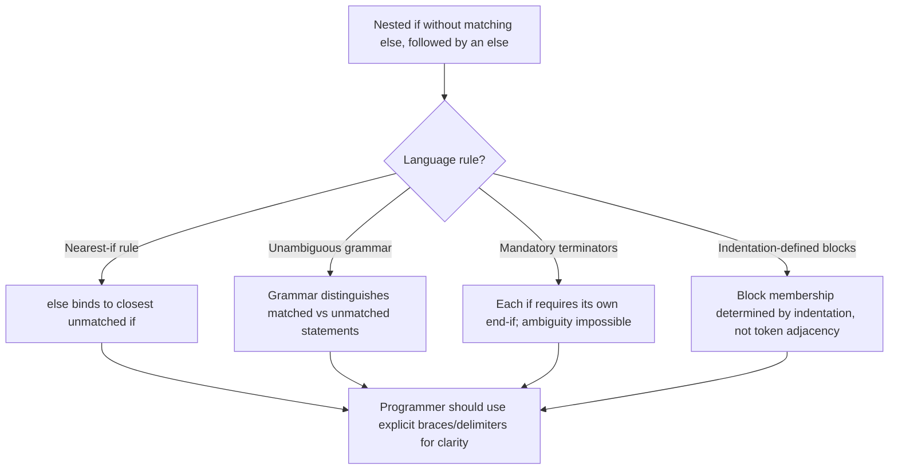

## Nesting Selectors and the Dangling Else Problem

### Overview

Nesting selection statements — placing one `if` or `switch` construct inside the branch of another — allows arbitrarily complex decision logic to be expressed as a tree of conditions. This nesting introduces a specific parsing ambiguity in languages whose grammar permits a single-way `if` (with no matching `else`) to nest inside another `if`: the **dangling else problem**. This section covers both the general mechanics of nested selection and the ambiguity and its resolutions in depth.

### Nesting Selection Statements

A selection statement is nested when its controlled statement (the branch body) is itself another selection statement. Nesting allows successive refinement of a decision.

**Example**

```python
if x > 0:
    if y > 0:
        print("Quadrant I")
    else:
        print("Quadrant IV")
else:
    if y > 0:
        print("Quadrant II")
    else:
        print("Quadrant III")
```

Nesting can occur to arbitrary depth, and each level introduces its own control expression evaluated independently, with inner conditions only reached if outer conditions are satisfied. Deep nesting is often restructured using **guard clauses** (early returns) or multi-way selection to improve readability, though this is a stylistic concern rather than a semantic one.

```c
if (x > 0) {
    if (y > 0) {
        printf("Quadrant I\n");
    } else {
        printf("Quadrant IV\n");
    }
} else if (y > 0) {
    printf("Quadrant II\n");
} else {
    printf("Quadrant III\n");
}
```

### The Dangling Else Problem

The dangling else problem arises in grammars that define selection statements roughly as:

$$\text{if } (E) \ S$$


$$\text{if } (E) \ S \ \text{else} \ S$$

When a single-way `if` (no `else`) is nested as the direct body of an outer `if`, and an `else` subsequently appears, the grammar does not by itself specify which `if` the `else` belongs to.

**Example**

```c
if (a > 0)
    if (b > 0)
        printf("both positive\n");
    else
        printf("ambiguous branch\n");
```

This could be parsed two ways:

**Interpretation 1** — `else` binds to the inner `if`:

```c
if (a > 0) {
    if (b > 0) {
        printf("both positive\n");
    } else {
        printf("ambiguous branch\n");
    }
}
```

**Interpretation 2** — `else` binds to the outer `if`:

```c
if (a > 0) {
    if (b > 0) {
        printf("both positive\n");
    }
} else {
    printf("ambiguous branch\n");
}
```

These two interpretations produce different behavior when `a <= 0`: Interpretation 1 prints nothing, while Interpretation 2 prints `"ambiguous branch"`. Because indentation is not semantically significant in C-family languages, the visual indentation shown in the source code does not affect which interpretation the compiler actually applies — a frequent source of confusion for programmers reading such code, since visually-suggested structure and actual parsed structure can diverge if the programmer relies on indentation alone.

### Formal Cause of the Ambiguity

The ambiguity is a property of the context-free grammar defining the language's selection statements. A grammar such as:

$$S \rightarrow \text{if } E \ \text{then} \ S \ \mid \ \text{if } E \ \text{then} \ S \ \text{else} \ S \ \mid \ \text{other}$$

is **ambiguous**: the string `if E1 then if E2 then S1 else S2` has two distinct parse trees, corresponding to the two interpretations above. A grammar is ambiguous when at least one input string admits more than one valid parse tree under that grammar, and selection-statement grammars of this shape are a canonical textbook example of the phenomenon.

### Resolution Strategies

**Nearest-if (most common) rule.** The majority of C-family languages resolve the ambiguity by specification rather than by grammar rewriting: the parser is directed to associate each `else` with the nearest preceding unmatched `if`. This is the behavior exhibited by C, C++, Java, C#, and Python (though Python enforces block structure via indentation, sidestepping the issue at the lexical level rather than the grammar level, discussed below). Under this rule, the earlier example resolves to Interpretation 1.

**Grammar rewriting (disambiguation via unambiguous grammar).** The ambiguity can be eliminated by rewriting the grammar itself to distinguish "matched" statements (those where every `if` has a corresponding `else`) from "unmatched" statements, and only permitting a matched statement as the body of an `if` that is itself nested inside another conditional body. This produces an equivalent but unambiguous grammar; [Inference] this technique is a standard approach described in compiler-construction texts for eliminating dangling-else ambiguity at the grammar level rather than through a parser-side disambiguation rule.

**Mandatory closing delimiters.** Some languages avoid the ambiguity structurally by requiring an explicit terminator for every selection statement, so that the boundary of each `if` is unambiguous regardless of nesting.



```
-- Ada
if A > 0 then
    if B > 0 then
        Put_Line("both positive");
    end if;
else
    Put_Line("a not positive");
end if;
```

Because each `if` requires its own `end if`, there is no syntactic position where an `else` could plausibly belong to more than one `if`.

**Mandatory braces / block delimiters.** Languages that require braces (or equivalent block delimiters) around every selection body, even single statements, eliminate the ambiguity by making block boundaries explicit rather than implicit.

```c
if (a > 0) {
    if (b > 0) {
        printf("both positive\n");
    }
} else {
    printf("a not positive\n");
}
```

[Inference] This is generally considered good practice in C-family languages specifically because it prevents dangling-else mistakes, even though the languages themselves do not enforce brace usage.

**Offside-rule / indentation-based block structure.** Python defines block boundaries using indentation rather than delimiters, so each `if`/`else` pair is delimited by consistent indentation rather than being reconstructed from a token stream; this removes the syntactic ambiguity entirely, since the block a given `else` belongs to is determined by its indentation level rather than by a disambiguation rule applied after parsing.

```python
if a > 0:
    if b > 0:
        print("both positive")
else:
    print("a not positive")
```

### Practical Implications

- **Readability risk** — even when a language defines a clear resolution rule (such as nearest-if), code that relies on the reader inferring structure from indentation alone can mislead a human reader while compiling correctly, since the compiler's parse and the reader's visual impression are not guaranteed to match unless the language enforces layout (as Python does) or the programmer uses explicit braces.
- **Defensive style** — a common practical guideline is to always use explicit block delimiters (braces, `end if`, etc.) around every selection body, even single-statement bodies, specifically to make the actual binding of `else` visually unambiguous. [Inference] This guideline is widely taught as defensive coding practice rather than being enforced by most C-family language specifications.
- **Linting** — many static analysis tools flag single-statement `if` bodies without braces, or nested `if` without braces followed by `else`, precisely because of this ambiguity's history as a source of logic errors.

### Diagram

<svg xmlns="http://www.w3.org/2000/svg" viewBox="0 0 780 400">
<text x="390" y="30" text-anchor="middle" font-size="18" font-weight="bold" fill="#1a1a1a">Dangling Else: Two Parse Trees (svg_diagram)</text>

<text x="190" y="55" text-anchor="middle" font-size="13" font-weight="bold" fill="`#2f5f9d`">Interpretation 1: else binds inner if</text>

<rect x="60" y="70" width="260" height="34" rx="6" fill="`#eef3fb`" stroke="`#2f5f9d`" />

<text x="190" y="92" text-anchor="middle" font-size="12" fill="`#1a1a1a`">if (a &gt; 0)</text>

<line x1="190" y1="104" x2="190" y2="124" stroke="`#2f5f9d`" />

<rect x="80" y="126" width="220" height="34" rx="6" fill="`#eef3fb`" stroke="`#2f5f9d`" />

<text x="190" y="148" text-anchor="middle" font-size="12" fill="`#1a1a1a`">if (b &gt; 0) ... else ...</text>

<text x="190" y="185" text-anchor="middle" font-size="11" fill="#555">else attaches to nearest if (b &gt; 0)</text>

<text x="590" y="55" text-anchor="middle" font-size="13" font-weight="bold" fill="`#b23b3b`">Interpretation 2: else binds outer if</text>

<rect x="460" y="70" width="260" height="34" rx="6" fill="`#fbeaea`" stroke="`#b23b3b`" />

<text x="590" y="92" text-anchor="middle" font-size="12" fill="`#1a1a1a`">if (a &gt; 0) ... else ...</text>

<line x1="590" y1="104" x2="590" y2="124" stroke="`#b23b3b`" />

<rect x="480" y="126" width="220" height="34" rx="6" fill="`#fbeaea`" stroke="`#b23b3b`" />

<text x="590" y="148" text-anchor="middle" font-size="12" fill="`#1a1a1a`">if (b &gt; 0) ...</text>

<text x="590" y="185" text-anchor="middle" font-size="11" fill="#555">else attaches to outer if (a &gt; 0)</text>

<rect x="80" y="230" width="620" height="140" rx="8" fill="#f5f5f5" stroke="#555" stroke-width="1" />
<text x="390" y="255" text-anchor="middle" font-size="13" font-weight="bold" fill="#1a1a1a">Common Resolutions</text>
<text x="100" y="280" font-size="12" fill="#1a1a1a">• Nearest-if rule (C, C++, Java, C#) — else binds to closest unmatched if</text>
<text x="100" y="300" font-size="12" fill="#1a1a1a">• Grammar rewriting — distinguish matched/unmatched statement productions</text>
<text x="100" y="320" font-size="12" fill="#1a1a1a">• Mandatory terminators (Ada's end if) — remove ambiguity structurally</text>
<text x="100" y="340" font-size="12" fill="#1a1a1a">• Indentation-defined blocks (Python) — ambiguity avoided at the lexical level</text>
</svg>

### Resolution Decision Flow



### Key Points

- Nesting selection statements allows compound decision logic but can introduce ambiguity when a single-way `if` is followed by an `else` that could grammatically attach to more than one `if`.
- The dangling else problem stems from an ambiguous context-free grammar, where a given token sequence has more than one valid parse tree.
- The nearest-if rule (else binds to the closest unmatched if) is the most common resolution in C-family languages.
- Alternative language designs avoid the ambiguity by rewriting the grammar, requiring mandatory closing delimiters (e.g., Ada's `end if`), or using indentation to define block structure (Python).
- Indentation in non-whitespace-sensitive languages does not affect parsing, so visually indented code can mislead readers even when the compiler's resolution rule is well-defined; explicit braces are commonly recommended as defensive style. [Inference] This recommendation is a style convention, not a language requirement, in most C-family languages.

**Related Topics**

- Context-free grammars and ambiguity in language specification
- Parsing techniques (LL, LR) and grammar rewriting for disambiguation
- Guard clauses and flattening deeply nested conditionals
- Offside rule and indentation-sensitive syntax (Python, Haskell, YAML)
- Multi-way selection as an alternative to deeply nested two-way selection
- Static analysis and linting for control-flow ambiguity