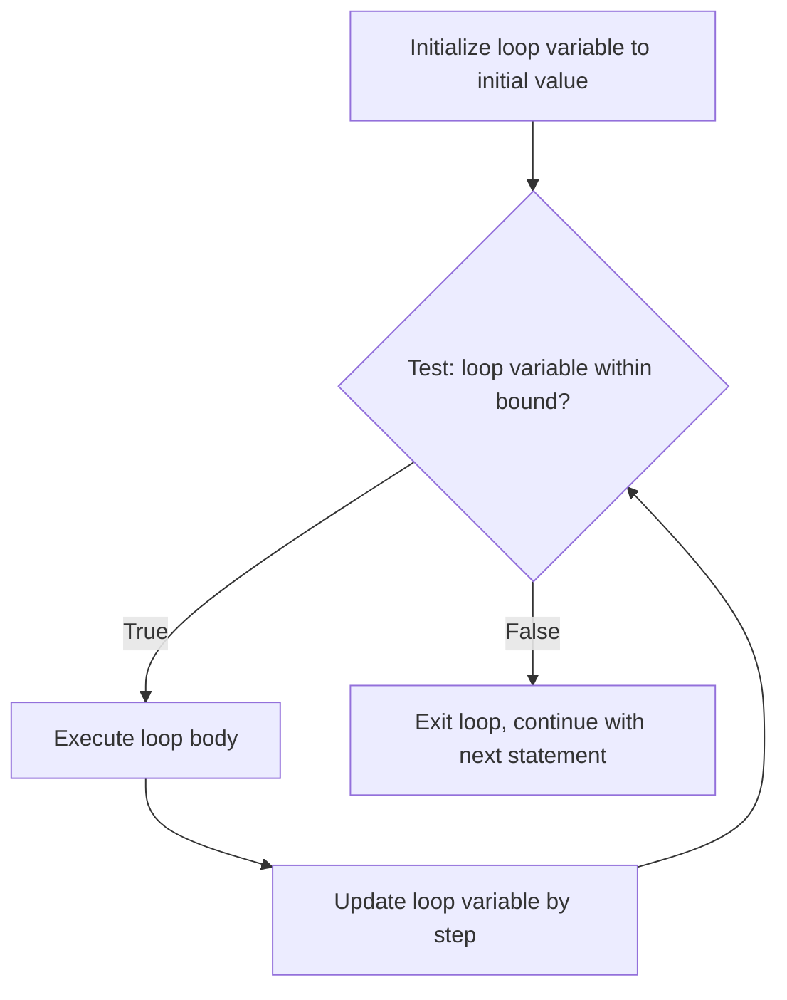

## Iterative Statements: Counter-Controlled Loops

### Overview

A counter-controlled loop (also called a **counting loop**) is an iterative statement whose repetition is governed by a control variable that takes on a predetermined sequence of values — typically incremented or decremented by a fixed step from an initial value to a final value. Because the number of iterations can, in principle, be determined before the loop body executes (assuming the loop parameters are not altered during execution), counter-controlled loops are distinguished from **logically controlled loops**, whose termination depends on a condition that may only become known during execution (e.g., searching for a value, reading until end-of-file).

### Core Components

A counter-controlled loop requires four defining elements:

- **Loop variable (counter)** — a variable that holds the current iteration value.
- **Initial value** — the value assigned to the loop variable before the first iteration.
- **Final value (or termination test)** — the bound against which the loop variable is compared to determine whether iteration continues.
- **Step size (increment/decrement)** — the amount by which the loop variable changes after each iteration; commonly $1$, but may be any nonzero value, including negative values for descending iteration.

**Example**

```python
for i in range(0, 10, 1):
    print(i)
```

```c
for (int i = 0; i < 10; i++) {
    printf("%d\n", i);
}
```

```pascal
for I := 1 to 10 do
    WriteLn(I);
```

### The Classic For-Loop Structure

The C-style `for` loop generalizes the counter-controlled loop into three independent clauses — initialization, test, and update — evaluated in a fixed sequence:

$$\text{for } (\text{init}; \ \text{test}; \ \text{update}) \ S$$

Execution proceeds as: evaluate `init` once; evaluate `test`; if true, execute $S$, then evaluate `update`, then re-evaluate `test`; repeat until `test` evaluates to false. Because each clause is a general expression rather than being restricted to counter arithmetic, the C-style `for` loop is more flexible than a purely counter-controlled loop and can, with different clause contents, express logically controlled iteration as well. [Inference] This flexibility is why some language design literature treats C's `for` as a generalized iteration construct rather than a strict counter-controlled loop, even though counter-controlled usage is its most common application.

### Design Issues in Counter-Controlled Loops

- **Scope of the loop variable** — some languages implicitly declare the loop variable within the scope of the loop body (e.g., `for (int i = 0; ...)` in C++, Java), preventing its use outside the loop and avoiding name collisions with variables declared elsewhere. Other languages (e.g., older C standards, BASIC) may require the loop variable to be declared outside the loop, making it accessible (and potentially a source of bugs) after the loop terminates.
- **Value of the loop variable after loop exit** — languages vary in whether the loop variable retains its final value, an incremented "one past" value, or becomes undefined after the loop completes normally, when the variable is declared outside the loop's own scope. [Unverified] Exact behavior for cases like early loop exit versus normal termination is language- and version-specific and should be checked against the relevant language specification rather than assumed.
- **Number of times the control expression is evaluated versus the loop body** — the test is generally evaluated one more time than the body executes (once to detect loop exit), which affects the design of any side-effecting expressions placed in the test.
- **Can the loop variable be modified within the loop body?** — many languages permit this syntactically but discourage it stylistically, since modifying the counter inside the body can produce iteration counts that diverge from what the initialization/test/update clauses alone would suggest, making the loop harder to reason about. Some languages (e.g., Ada, older Pascal) explicitly disallow assignment to the loop control variable within the loop body, precisely to preserve the guarantee that iteration count is determinable from the loop header alone.
- **Evaluation-time binding of the final/step value** — if the final bound or step size is itself an expression rather than a constant, some languages evaluate it once before the first iteration, while others re-evaluate it on every pass; this materially affects behavior if the expression's value can change during loop execution (e.g., if it references a variable mutated inside the loop body).

### Descending and Stepped Iteration

```python
for i in range(10, 0, -1):
    print(i)
```

```c
for (int i = 10; i > 0; i -= 2) {
    printf("%d\n", i);
}
```

Descending loops and non-unit step sizes are supported by most counter-controlled loop constructs, though the specific syntax for specifying a step differs considerably across languages — some require an explicit step clause (Pascal's `downto`, Ada's `reverse`), while C-style `for` loops express direction and step through the arbitrary update expression.

### Counter-Controlled Loops Over Non-Numeric Ranges

Some languages generalize the counting-loop concept to iterate over ranges of any discretely-ordered (ordinal) type, not merely integers.

```pascal
type Weekday = (Mon, Tue, Wed, Thu, Fri, Sat, Sun);
var d: Weekday;
for d := Mon to Fri do
    WriteLn(Ord(d));
```

This is still a counter-controlled loop in the formal sense — the loop variable takes a determinable, ordered sequence of values from a defined starting point to a defined ending point — even though the "counter" is not numeric.

### Relationship to For-Each / Iterator-Based Loops

Counter-controlled loops are distinct from **for-each** (collection-iteration) loops, which iterate over the elements of a collection rather than over a numeric or ordinal range.

```python
for item in ["a", "b", "c"]:
    print(item)
```

A for-each loop does not require the programmer to specify initial value, final value, or step size explicitly; the underlying collection or iterator protocol determines the sequence of values. [Inference] For-each loops are often considered a related but conceptually separate control structure from counter-controlled loops in language-design taxonomies, since the defining characteristic of a counter-controlled loop — a determinable arithmetic or ordinal progression specified by the programmer — is absent; the iteration sequence instead comes from the structure being traversed.

### Determinability of Iteration Count

A defining theoretical property of counter-controlled loops (in their strict, unmodified-loop-variable form) is that the number of iterations is computable from the initial value, final value, and step size before the loop body ever executes, via:

$$n = \left\lceil \dfrac{\text{final} - \text{initial} + 1}{\text{step}} \right\rceil$$

for an inclusive ascending range with unit or non-unit positive step (adjusted accordingly for descending ranges and exclusive bounds, depending on language semantics). This determinability is what distinguishes counter-controlled loops from logically controlled loops, in which the number of iterations generally cannot be known until the terminating condition is actually evaluated during execution — for example, a loop reading input until a sentinel value appears.

### Diagram



### Visual: Counter-Controlled Loop Components

<svg xmlns="http://www.w3.org/2000/svg" viewBox="0 0 760 300">
<text x="380" y="30" text-anchor="middle" font-size="18" font-weight="bold" fill="#1a1a1a">Anatomy of a Counter-Controlled Loop (svg_diagram)</text>
<rect x="40" y="60" width="680" height="60" rx="8" fill="#eef3fb" stroke="#2f5f9d" stroke-width="1.5" />
<text x="60" y="95" font-size="15" font-family="monospace" fill="#1a1a1a">for (i = 0; i &lt; 10; i++)</text>
<line x1="80" y1="125" x2="80" y2="150" stroke="#2f5f9d" />
<text x="80" y="170" text-anchor="middle" font-size="12" fill="#2f5f9d">Init</text>
<text x="80" y="188" text-anchor="middle" font-size="11" fill="#555">i = 0</text>
<line x1="270" y1="125" x2="270" y2="150" stroke="#2f5f9d" />
<text x="270" y="170" text-anchor="middle" font-size="12" fill="#2f5f9d">Test</text>
<text x="270" y="188" text-anchor="middle" font-size="11" fill="#555">i &lt; 10</text>
<line x1="490" y1="125" x2="490" y2="150" stroke="#2f5f9d" />
<text x="490" y="170" text-anchor="middle" font-size="12" fill="#2f5f9d">Update (step)</text>
<text x="490" y="188" text-anchor="middle" font-size="11" fill="#555">i++</text>
<rect x="120" y="220" width="520" height="60" rx="8" fill="#f5f5f5" stroke="#555" />
<text x="380" y="245" text-anchor="middle" font-size="12" fill="#1a1a1a">Iteration count is determinable before execution:</text>
<text x="380" y="265" text-anchor="middle" font-size="12" fill="#1a1a1a">n = ⌈(final − initial) / step⌉</text>
</svg>

### Key Points

- A counter-controlled loop repeats a fixed, determinable number of times, governed by an initial value, final value (or test), and step size.
- The C-style `for` loop generalizes this pattern into three independently evaluable clauses (init, test, update), making it more flexible than a strict counter-controlled loop while still commonly used as one.
- Key design issues include the scope of the loop variable, whether it can be modified inside the loop body, when the final/step expressions are evaluated, and the variable's value (if any) after loop exit.
- Counter-controlled loops can iterate over any ordinal type, not only numeric ranges, in languages that support this generalization (e.g., Pascal enumerations).
- For-each loops are a related but distinct construct, iterating over collection elements via an iterator protocol rather than an arithmetic or ordinal progression.
- The defining theoretical property of a strict counter-controlled loop is that its iteration count is computable before the loop body executes, distinguishing it from logically controlled loops. [Unverified] Exact edge-case behavior (loop variable value after early exit, re-evaluation timing of bounds) varies by language and should be confirmed against the specific language's specification.

**Related Topics**

- Logically controlled (condition-controlled) loops
- For-each / iterator-based loops
- Loop invariants and formal reasoning about iteration
- Early loop termination (`break`, `continue`, labeled loops)
- Nested loops and multi-dimensional iteration
- Tail recursion as an alternative to iterative constructs