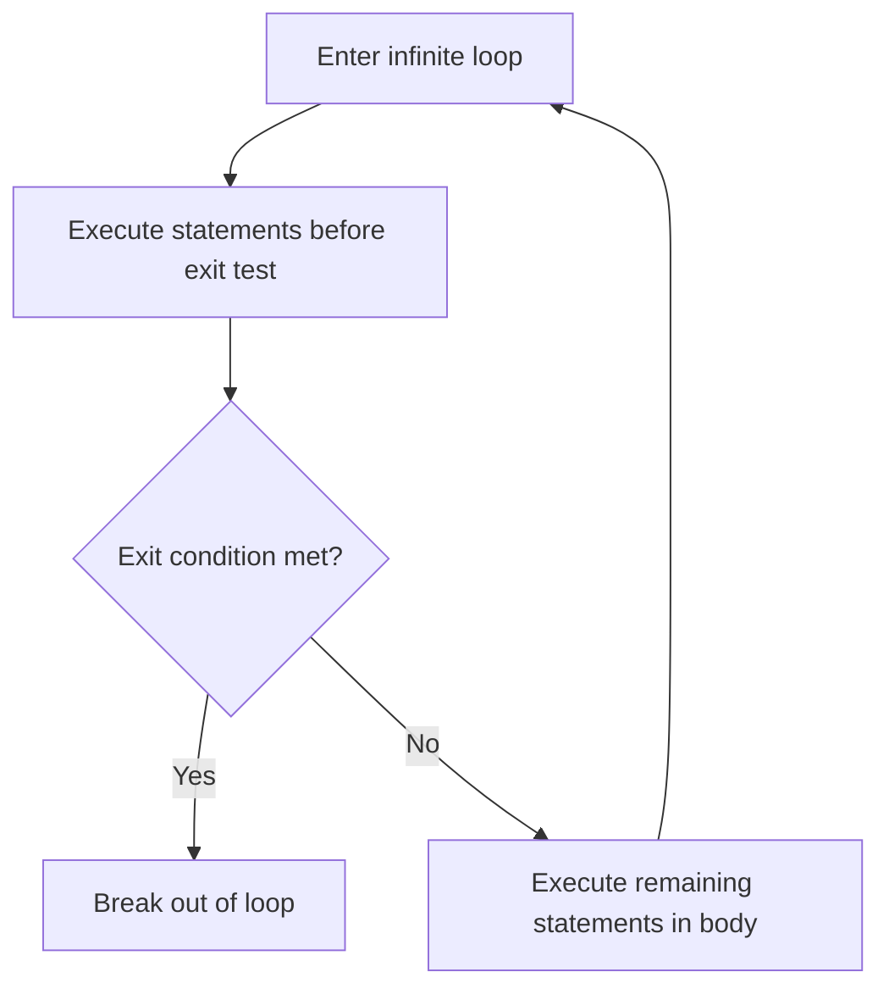

## Logically Controlled Loops

### Overview

A logically controlled loop repeats a statement or block of statements based on the value of a Boolean control expression, rather than on a predetermined count of iterations. The loop continues executing as long as (or until) the control expression evaluates to a particular truth value, and the number of iterations that will actually occur is, in general, not knowable before the loop begins executing — it depends on data or state evaluated during execution. This distinguishes logically controlled loops from counter-controlled loops, whose iteration count can typically be computed from the initial value, final value, and step size before the loop body runs.

### Pretest and Posttest Loops

Logically controlled loops are classified by **when** the control expression is evaluated relative to the loop body:

- **Pretest (top-tested) loop** — the control expression is evaluated before each execution of the loop body. If the expression is false on the first evaluation, the body never executes.
- **Posttest (bottom-tested) loop** — the control expression is evaluated after each execution of the loop body. The body always executes at least once, regardless of the initial value of the control expression.

**Pretest Example**

```c
while (n > 0) {
    process(n);
    n--;
}
```

```python
while n > 0:
    process(n)
    n -= 1
```

If `n` is `0` or negative on entry, the body never executes.

**Posttest Example**

```c
do {
    process(n);
    n--;
} while (n > 0);
```

```pascal
repeat
    process(n);
    n := n - 1;
until n <= 0;
```

The `do-while` (C-family) and `repeat-until` (Pascal-family) forms guarantee at least one execution of the body. Note the polarity difference: `do-while` continues while the condition is true, whereas `repeat-until` continues until the condition becomes true (i.e., it loops while the condition is false) — a subtle but important semantic distinction to observe when translating logic between languages that use one form or the other.

### Formal Semantics

**Pretest loop:**

$$\text{while } (E) \ S$$

Execution: evaluate $E$; if true, execute $S$, then repeat; if false, terminate. Equivalently, using a fixpoint-style description, the loop executes $S$ zero or more times.

**Posttest loop:**

$$\text{do } S \ \text{while } (E)$$

Execution: execute $S$; evaluate $E$; if true, repeat; if false, terminate. The loop executes $S$ one or more times.

### Choosing Between Pretest and Posttest

The choice between pretest and posttest forms depends on whether the loop body must logically execute at least once regardless of the initial condition.

**Example — Pretest is appropriate**

```python
while has_next_record():
    record = read_next_record()
    process(record)
```

Here, if there are no records at all, the body should never execute — a pretest loop is correct.

**Example — Posttest is appropriate**

```c
do {
    print_menu();
    choice = get_user_input();
} while (choice != EXIT);
```

Here, the menu must be displayed and input read at least once before the exit condition can even be evaluated meaningfully — a posttest loop avoids duplicating the body's logic before the loop.

[Inference] Using the wrong form (e.g., a pretest loop where the logic actually requires at least one unconditional execution) commonly leads to code duplication, where the loop body's first execution is written out separately before the loop, followed by a pretest loop for subsequent iterations — a pattern that a correctly chosen posttest loop would avoid.

### General (Midtest) Logically Controlled Loops

Some language designs support loops where the exit test can occur at an arbitrary point within the body, not strictly at the top or bottom — sometimes called a **midtest loop**, most commonly realized via an unconditional infinite loop combined with a conditional exit statement placed anywhere in the body.

```c
while (1) {
    read_value(&x);
    if (x == SENTINEL) {
        break;
    }
    process(x);
}
```

```ada
loop
    Get(X);
    exit when X = Sentinel;
    Process(X);
end loop;
```

This form is strictly more general than either pure pretest or pure posttest, since the exit condition can be placed before, after, or interleaved with other statements in the body, including multiple exit points within a single loop. [Inference] Language design literature often treats this as a distinct third category precisely because it cannot be reduced to a single top-of-loop or bottom-of-loop test without restructuring the code.

### Determinability of Iteration Count

Unlike counter-controlled loops, the number of iterations a logically controlled loop performs cannot, in the general case, be computed before execution begins, because the control expression may depend on:

- Input read during the loop (e.g., reading until end-of-file or a sentinel value)
- Mutable state modified by the loop body itself in a data-dependent way
- External conditions (e.g., a network response, a timer, user interaction)

This is a direct consequence of the **halting problem** in the general case: [Inference] for an arbitrary control expression and loop body, there is no general algorithm that can determine in advance how many times (or whether) the loop will terminate, though for many practical loops termination and iteration count are easy to reason about informally or prove with a loop invariant and variant function.

### Design Issues

- **Side effects in the control expression** — since the control expression of a pretest loop is evaluated at least once more than the body executes (to detect termination), and the control expression of a posttest loop is evaluated exactly as many times as the body executes, placing side-effecting expressions in the control test requires care to avoid off-by-one logic errors or unintended repeated effects.
- **Infinite loops and required exit paths** — a logically controlled loop whose control expression never becomes false (or whose midtest exit condition is never satisfied) will not terminate; ensuring the loop body actually progresses toward satisfying the termination condition is a correctness obligation of the programmer, not something enforced by the language in imperative languages generally.
- **Loop invariants** — a common formal reasoning tool for logically controlled loops is the **loop invariant**: a condition that holds true before and after every iteration of the loop, used to reason about correctness independent of how many iterations actually occur. Combined with a **variant function** (a quantity that strictly decreases toward a lower bound on each iteration), loop invariants support formal termination proofs.

$$\text{Invariant } P \text{ holds} \implies \{P \wedge E\} \ S \ \{P\}$$

This states that if invariant $P$ holds and the control expression $E$ is true, executing $S$ preserves $P$; combined with $P \wedge \neg E$ implying the desired postcondition, this supports a correctness proof independent of the actual iteration count.

### Diagram

<svg xmlns="http://www.w3.org/2000/svg" viewBox="0 0 780 340">
<text x="390" y="30" text-anchor="middle" font-size="18" font-weight="bold" fill="#1a1a1a">Pretest vs. Posttest Loops (svg_diagram)</text>

<text x="190" y="55" text-anchor="middle" font-size="13" font-weight="bold" fill="`#2f5f9d`">Pretest (while)</text>

<rect x="90" y="70" width="200" height="40" rx="6" fill="`#eef3fb`" stroke="`#2f5f9d`" />

<text x="190" y="95" text-anchor="middle" font-size="12" fill="`#1a1a1a`">Test E</text>

<line x1="190" y1="110" x2="190" y2="135" stroke="`#2f5f9d`" marker-end="url(#a1)" />

<rect x="90" y="137" width="200" height="40" rx="6" fill="`#eef3fb`" stroke="`#2f5f9d`" />

<text x="190" y="162" text-anchor="middle" font-size="12" fill="`#1a1a1a`">Execute S</text>

<path d="M290,157 C330,157 330,90 290,90" stroke="`#2f5f9d`" fill="none" marker-end="url(#a1)" />

<text x="190" y="205" text-anchor="middle" font-size="11" fill="#555">Body may execute 0 times</text>

<text x="590" y="55" text-anchor="middle" font-size="13" font-weight="bold" fill="`#b23b3b`">Posttest (do-while)</text>

<rect x="490" y="70" width="200" height="40" rx="6" fill="`#fbeaea`" stroke="`#b23b3b`" />

<text x="590" y="95" text-anchor="middle" font-size="12" fill="`#1a1a1a`">Execute S</text>

<line x1="590" y1="110" x2="590" y2="135" stroke="`#b23b3b`" marker-end="url(#a2)" />

<rect x="490" y="137" width="200" height="40" rx="6" fill="`#fbeaea`" stroke="`#b23b3b`" />

<text x="590" y="162" text-anchor="middle" font-size="12" fill="`#1a1a1a`">Test E</text>

<path d="M690,157 C730,157 730,90 690,90" stroke="`#b23b3b`" fill="none" marker-end="url(#a2)" />

<text x="590" y="205" text-anchor="middle" font-size="11" fill="#555">Body executes at least 1 time</text>

<rect x="140" y="240" width="500" height="80" rx="8" fill="#f5f5f5" stroke="#555" />
<text x="390" y="265" text-anchor="middle" font-size="12" fill="#1a1a1a">Iteration count not determinable before execution</text>
<text x="390" y="285" text-anchor="middle" font-size="12" fill="#1a1a1a">Depends on data, input, or mutable state evaluated at runtime</text>
</svg>

### Midtest Loop Flow



### Key Points

- Logically controlled loops repeat based on a Boolean control expression rather than a predetermined count; the number of iterations generally cannot be known before execution.
- Pretest (`while`) loops test before the body executes and may run zero times; posttest (`do-while`, `repeat-until`) loops test after the body executes and always run at least once.
- `do-while` continues while its condition is true; `repeat-until` continues until its condition is true — an important polarity distinction between otherwise similar posttest forms.
- Midtest loops, typically implemented as an infinite loop with a conditional exit (`break`/`exit when`), place the termination test at an arbitrary point in the body, generalizing beyond pure pretest or posttest structure.
- [Inference] In the general case, determining whether or when a logically controlled loop terminates is equivalent to an instance of the halting problem, though most practical loops are straightforward to reason about informally or via loop invariants and variant functions.
- Loop invariants (conditions preserved across iterations) and variant functions (strictly decreasing quantities) are standard formal tools for proving correctness and termination of logically controlled loops.

**Related Topics**

- Counter-controlled loops
- Loop invariants and formal verification of iterative code
- The halting problem and decidability of program termination
- `break`, `continue`, and labeled loop control statements
- Recursion as an alternative to logically controlled iteration
- Sentinel-controlled input loops