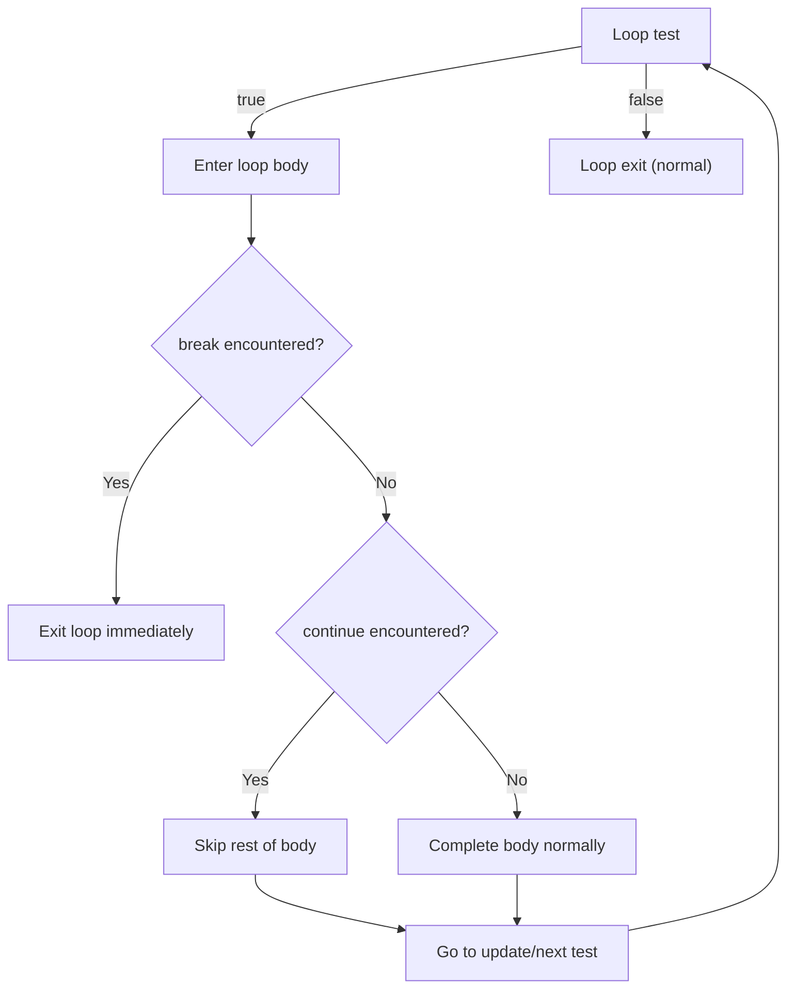

## User-Located Loop Control Mechanisms

### Overview

A user-located loop control mechanism is a control-flow construct that allows the programmer to alter or terminate a loop's iteration from a point chosen by the programmer within the loop body, rather than being restricted to the fixed test position dictated by a purely pretest or posttest loop structure. These mechanisms — most commonly `break`, `continue`, labeled loop exits, and `return` from within a loop — give the programmer flexibility to place exit or skip logic wherever it is most natural in the control flow, at the cost of making the loop's overall termination behavior less immediately visible from the loop header alone.

### The break Statement

The `break` statement immediately terminates the innermost enclosing loop (or, in some languages, a `switch` statement), transferring control to the statement immediately following the loop.

**Example**

```c
while (1) {
    read_value(&x);
    if (x == SENTINEL) {
        break;
    }
    process(x);
}
```

```python
while True:
    x = read_value()
    if x == SENTINEL:
        break
    process(x)
```

`break` effectively implements a midtest (or arbitrary-position) exit within what would otherwise be a pretest or posttest loop construct, letting the programmer place the termination test at any point in the body rather than only at the top or bottom.

### The continue Statement

The `continue` statement skips the remainder of the current iteration's body and transfers control to the loop's next test-and-update cycle, without terminating the loop itself.

**Example**

```c
for (int i = 0; i < 10; i++) {
    if (i % 2 == 0) {
        continue;
    }
    printf("%d\n", i);
}
```

```python
for i in range(10):
    if i % 2 == 0:
        continue
    print(i)
```

In a `for` loop, `continue` transfers control to the update clause before the next test, rather than skipping the update itself; in a `while` loop, `continue` transfers control directly to the test. This distinction matters because omitting it can cause an infinite loop if the update step is mistakenly assumed to run unconditionally in all loop forms.

### Labeled Loops (Nested Loop Control)

In loops nested within other loops, an unqualified `break` or `continue` affects only the innermost enclosing loop by default. Several languages provide **labeled** variants that allow the programmer to target an outer loop explicitly.

**Example**

```java
outer:
for (int i = 0; i < 5; i++) {
    for (int j = 0; j < 5; j++) {
        if (j == 3) {
            continue outer;
        }
        if (i == 4) {
            break outer;
        }
        System.out.println(i + "," + j);
    }
}
```

```rust
'outer: for i in 0..5 {
    for j in 0..5 {
        if j == 3 {
            continue 'outer;
        }
        if i == 4 {
            break 'outer;
        }
        println!("{},{}", i, j);
    }
}
```

Without labels, achieving the same effect typically requires an auxiliary Boolean flag variable checked in the outer loop's condition, or restructuring the nested loops into a single function so that `return` can exit both levels at once. [Inference] Language designers who omit labeled loop control (e.g., Python, which has no labeled `break`/`continue`) generally expect these auxiliary-flag or function-extraction patterns to be used instead, treating the added indirection as an acceptable tradeoff for a simpler control-flow grammar.

### return as Loop Control

Within a function, a `return` statement encountered inside a loop terminates not just the loop but the entire enclosing function invocation, transferring control back to the caller.

**Example**

```python
def find_first_negative(values):
    for v in values:
        if v < 0:
            return v
    return None
```

This is a common idiom for search loops, where the loop's sole purpose is to locate a value and return it as soon as found, avoiding both an unnecessary flag variable and continued iteration after the answer is known.

### exit / loop-with-condition Constructs

Some languages provide a dedicated construct that combines an unconditional loop with an inline conditional exit, syntactically distinct from `break` embedded in an `if`.

```ada
loop
    Get(X);
    exit when X = Sentinel;
    Process(X);
end loop;
```

This achieves the same semantic effect as a `while (1) { ... if (cond) break; ... }` pattern in C-family languages but makes the exit condition a first-class part of the loop syntax rather than a side effect of a nested conditional.

### Design Issues

- **Readability versus flexibility tradeoff** — user-located control statements let the programmer place termination or skip logic exactly where it is logically needed, avoiding artificial restructuring of the loop body; the tradeoff is that the loop's termination behavior can no longer be fully understood by reading only the loop header, since exits may occur from any point (or several points) within the body. [Inference] This tradeoff is widely discussed in language-design literature as a readability-versus-expressiveness tension, though opinions differ on where the balance should lie, and some structured-programming advocates have historically argued for minimizing or eliminating unconditional jumps of this kind (in the tradition of the "goto considered harmful" debate) in favor of single-entry, single-exit loop structures.
- **Multiple exit points** — a loop body may contain more than one `break` (or `exit when`), meaning termination can occur for several logically distinct reasons; some style guides recommend documenting or minimizing multiple exit points for clarity, though this is a stylistic rather than a language-enforced constraint in most imperative languages.
- **Scope interaction** — `break` and `continue` interact with the innermost enclosing loop by default; nested loop scenarios without labeled control require either restructuring or auxiliary state to affect an outer loop, as discussed above.
- **Interaction with try/finally or resource cleanup** — in languages with structured exception handling or deterministic resource cleanup (e.g., Java's `try-finally`, Python's `with`, C++ destructors via RAII), a `break`, `continue`, or `return` executed inside such a construct still triggers the associated cleanup logic before control actually leaves the block. [Inference] This behavior is a documented feature of these languages' exception/cleanup mechanisms, though the precise interaction (execution order relative to the jump) can vary by construct and should be verified against language-specific documentation when writing cleanup-sensitive code.

### Diagram

<svg xmlns="http://www.w3.org/2000/svg" viewBox="0 0 780 360">
<text x="390" y="30" text-anchor="middle" font-size="18" font-weight="bold" fill="#1a1a1a">User-Located Loop Control (svg_diagram)</text>
<rect x="240" y="55" width="300" height="230" rx="8" fill="#eef3fb" stroke="#2f5f9d" stroke-width="1.5" />
<text x="390" y="80" text-anchor="middle" font-size="13" font-weight="bold" fill="#2f5f9d">Loop Body</text>
<rect x="260" y="95" width="120" height="30" rx="5" fill="#ffffff" stroke="#2f5f9d" />
<text x="320" y="115" text-anchor="middle" font-size="11" fill="#1a1a1a">Statement A</text>
<rect x="260" y="135" width="120" height="30" rx="5" fill="#fbeaea" stroke="#b23b3b" />
<text x="320" y="155" text-anchor="middle" font-size="11" fill="#b23b3b">if (cond) break</text>
<path d="M380,150 C620,150 620,60 460,60" stroke="#b23b3b" fill="none" marker-end="url(#a3)" />
<text x="600" y="45" text-anchor="middle" font-size="11" fill="#b23b3b">exits loop entirely</text>
<rect x="260" y="175" width="120" height="30" rx="5" fill="#eaf5ea" stroke="#2f7d3f" />
<text x="320" y="195" text-anchor="middle" font-size="11" fill="#2f7d3f">if (cond) continue</text>
<path d="M380,190 C660,190 660,280 390,280" stroke="#2f7d3f" fill="none" marker-end="url(#a4)" />
<text x="600" y="300" text-anchor="middle" font-size="11" fill="#2f7d3f">skips to next test/update</text>
<rect x="260" y="215" width="120" height="30" rx="5" fill="#ffffff" stroke="#2f5f9d" />
<text x="320" y="235" text-anchor="middle" font-size="11" fill="#1a1a1a">Statement B</text>
<rect x="150" y="285" width="480" height="12" rx="4" fill="none" />
<line x1="390" y1="285" x2="390" y2="300" stroke="#555" />
<text x="390" y="320" text-anchor="middle" font-size="11" fill="#555">Loop test / update</text>
</svg>

### Control Flow of break vs. continue



### Key Points

- User-located loop control mechanisms (`break`, `continue`, labeled variants, `return`) let a programmer place exit or skip logic at any point within a loop body, rather than only at the loop's fixed test position.
- `break` terminates the innermost enclosing loop entirely; `continue` skips only the remainder of the current iteration and proceeds to the next test/update cycle.
- Labeled `break`/`continue` (available in languages such as Java and Rust) allow targeting an outer loop in nested loop structures; languages without labels (e.g., Python) generally rely on flag variables or function extraction with `return` instead.
- `return` inside a loop terminates both the loop and the enclosing function, commonly used in search-style loops.
- These mechanisms trade a fully header-visible termination condition for flexibility in where exit/skip logic is expressed; multiple exit points in one loop body are a known readability tradeoff. [Inference] Views on how heavily to rely on this flexibility versus more structured single-exit loop styles vary and reflect a longstanding structured-programming design debate rather than a settled consensus.
- Interaction between these control statements and resource cleanup constructs (`try-finally`, RAII, `with`) generally still runs the associated cleanup logic, though [Inference] exact ordering and guarantees are language- and construct-specific and should be checked against relevant documentation.

**Related Topics**

- Pretest, posttest, and midtest loop structures
- Structured programming and the "goto considered harmful" debate
- Exception handling and deterministic resource cleanup (RAII, `try-finally`, `with`)
- Nested loops and multi-dimensional iteration
- Recursion as an alternative to explicit loop control statements
- Guard clauses and early-return function design