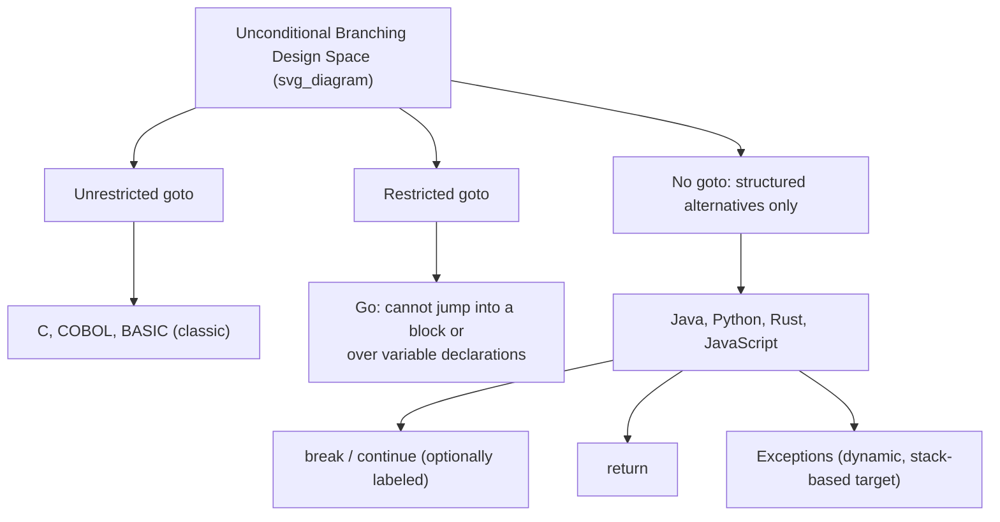

## Unconditional Branching and the Goto Controversy


### Overview

Unconditional branching is a control-flow mechanism that transfers execution to a specified point in a program without evaluating any condition. The most direct expression of this mechanism is the `goto` statement, which exists in some form in most imperative programming languages, though its use, restriction, or outright omission varies dramatically across language designs. The "goto controversy" refers to a decades-long debate in computer science, ignited by Edsger Dijkstra's 1968 letter "Go To Statement Considered Harmful," over whether unrestricted jump statements are a legitimate tool or a source of unmaintainable, error-prone code.

### What Unconditional Branching Is

At the machine level, all control flow ultimately reduces to conditional and unconditional jumps — instructions like `JMP`, `JZ`, `CALL`, and `RET` in assembly language. An unconditional jump changes the instruction pointer to a target address regardless of any runtime condition. High-level unconditional branching constructs are abstractions over this same idea, expressed as language-level statements rather than raw addresses.

**Key Points**

- Unconditional branching transfers control unconditionally — no boolean test decides whether the jump happens.
- It is distinct from conditional branching (`if`, `switch`), which transfers control only when a condition holds.
- Common high-level forms include `goto label`, `break`, `continue`, `return`, and exception-based unwinding.
- The controversy specifically concerns arbitrary, unrestricted `goto`, not the more disciplined forms like `break`/`continue`/`return`, which are themselves restricted, well-scoped unconditional jumps.

### Forms of Unconditional Branching Across Languages

#### The Classic `goto` Statement

Languages such as C, C++, Go, and PHP retain an explicit `goto` statement paired with labels.

```c
#include <stdio.h>

int main(void) {
    int i = 0;

cleanup_loop:
    if (i >= 5) {
        goto done;
    }
    printf("i = %d\n", i);
    i++;
    goto cleanup_loop;

done:
    printf("Finished\n");
    return 0;
}
```

In this C example, `goto cleanup_loop` and `goto done` both perform unconditional jumps to labeled points in the function body. The `if` here only decides *which* goto executes next; each `goto` itself is still unconditional once reached.

Go deliberately includes `goto` but imposes restrictions: a `goto` cannot jump into the scope of a variable declaration, and cannot jump into a block from outside it. [Inference] This design reflects Go's general philosophy of including low-level tools while structurally preventing their most dangerous misuses.

#### Restricted/Structured Alternatives

Many languages omit `goto` entirely and instead provide scoped unconditional jumps tied to specific control structures:

- **Java, Python, Ruby, JavaScript, Rust**: no general `goto`. Instead they offer `break`, `continue` (with labels in Java and Rust), and `return`.
- **Rust**: uses labeled loops for multi-level `break`/`continue`, and its `loop` expression can `break` with a value.

```rust
'outer: for i in 0..5 {
    for j in 0..5 {
        if i * j > 6 {
            break 'outer;
        }
    }
}
```

This is unconditional branching in the sense that `break 'outer` unconditionally exits both loops once reached, but it is lexically restricted to jumping out of enclosing loop structures — it cannot target an arbitrary label anywhere in the function.

- **COBOL, Fortran, BASIC (early dialects)**: historically relied heavily on `GOTO` as a primary control-flow tool, predating structured programming constructs.
- **Assembly languages**: `goto`-equivalents (`JMP`, `B`, `BRA`) are the fundamental and often only branching primitive; structured constructs like loops are themselves compiled down to these jumps.

#### Exceptions as Disciplined Non-Local Jumps

Exception handling (`try`/`catch`/`throw` in Java, C++, Python; `panic`/`recover` in Go) can be understood as a highly disciplined, structured form of unconditional non-local jump. [Inference] Unlike `goto`, an exception's target is determined dynamically by the nearest matching handler on the call stack rather than a statically fixed label, and the mechanism guarantees resource cleanup semantics (e.g., stack unwinding, `finally` blocks, RAII destructors in C++) that raw `goto` does not provide.

### The Goto Controversy

#### Origins: Dijkstra's Argument

In 1968, Edsger Dijkstra published a letter to the editor of *Communications of the ACM* titled "Go To Statement Considered Harmful" (the title was actually chosen by editor Niklaus Wirth, not Dijkstra himself — Dijkstra's original title was "A Case against the Go To Statement"). [Unverified] The exact editorial history is well documented in secondary sources, though Claude cannot verify the primary correspondence directly.

Dijkstra's core argument was not that `goto` was inherently evil in a moral sense, but that unrestricted jumps make it extremely difficult to reason about a program's state at any given point in its execution. He argued that the *quality* of programmers is inversely proportional to the density of `goto` statements in their programs, because structured constructs (sequence, selection, iteration) allow a programmer to map a static piece of text to a dynamic process — to reliably determine "where am I and what has happened so far" — while arbitrary jumps break this correspondence.

#### The Structured Programming Movement

Dijkstra's letter is closely associated with the broader structured programming movement, reinforced by the Böhm–Jacopini theorem (1966), which proved that any computable function expressible with unrestricted `goto` can also be expressed using only three control structures: sequence, selection (`if`/`else`), and iteration (`while`/`for` loops), possibly combined with additional boolean flag variables. This theorem provided formal justification that `goto` is not strictly *necessary*, only convenient — it demonstrated goto's replaceability, though it did not by itself settle whether replacing it always produces clearer code.

**Example**

A `goto`-based loop:

```c
int i = 0;
loop_start:
if (i < 10) {
    printf("%d\n", i);
    i++;
    goto loop_start;
}
```

The structured equivalent using iteration:

```c
for (int i = 0; i < 10; i++) {
    printf("%d\n", i);
}
```

Both are computationally equivalent per Böhm–Jacopini, but the `for` loop encodes the initialization, condition, and increment in one place, making the loop's bounds and progression immediately visible — whereas the `goto` version requires scanning the whole block to reconstruct the same information.

#### Counterarguments and Defenses of `goto`

The controversy was never fully one-sided. Notable counterpoints include:

- **Donald Knuth's response** ("Structured Programming with go to Statements," 1974) argued that `goto` is not inherently harmful and that in certain situations — particularly error handling, breaking out of deeply nested loops, and performance-critical code — a well-placed `goto` produces clearer or more efficient code than convoluted flag-variable workarounds forced by strict structured programming. [Unverified] The specific efficiency claims are tied to compiler technology of that era and may not generalize to modern optimizing compilers.
- **Linux kernel style**: the Linux kernel coding style guide explicitly endorses `goto` for centralized cleanup/error-handling paths in C functions, arguing it is clearer than deeply nested conditionals. This is a widely cited real-world counter-example to blanket goto avoidance. [Unverified — specific current wording of the kernel style guide is not verified here, though the general practice is well known.]

```c
int process(void) {
    int ret;
    struct resource *r1 = NULL, *r2 = NULL;

    r1 = acquire_resource_1();
    if (!r1) {
        ret = -1;
        goto out;
    }

    r2 = acquire_resource_2();
    if (!r2) {
        ret = -2;
        goto out_free_r1;
    }

    ret = do_work(r1, r2);

    free_resource_2(r2);
out_free_r1:
    free_resource_1(r1);
out:
    return ret;
}
```

This pattern — often called the "single exit via goto" or "goto chain" idiom — is a case where `goto` is used in a highly disciplined, forward-only, cleanup-oriented manner, quite different from the arbitrary backward-and-forward jumps Dijkstra criticized.

#### The Nuance: What Was Actually Being Criticized

A common misreading treats Dijkstra as condemning all unconditional jumps. [Inference] A closer reading suggests his objection was specifically to *unrestricted* `goto` that can jump to arbitrary points, creating tangled control flow sometimes nicknamed "spaghetti code," where the relationship between a program's textual structure and its runtime behavior becomes untraceable. Disciplined, scoped forms of unconditional branching — `return`, `break`, `continue`, exceptions, and even the Linux-style forward `goto`-to-cleanup-label pattern — are generally not considered part of the same problem, because they preserve a predictable, local relationship between code structure and control flow.

### Language Design Responses to the Controversy



Language designers since the 1970s have largely converged on one of three positions, as shown above:

1. **Keep unrestricted `goto`** for low-level control and legacy compatibility (C, C++).
2. **Keep `goto` but restrict its targets** to prevent scoping violations (Go).
3. **Omit `goto` entirely**, providing only structured, scope-limited unconditional jumps (Java, Python, Rust, JavaScript, C#).

Notably, even languages in category 3 still contain unconditional branching — they simply constrain *where* it can jump to, converting an arbitrary-target operation into a small family of well-scoped ones.

### Practical Guidance

- Prefer structured constructs (`for`, `while`, `if`/`else`, function calls) as the default; they keep the static text and dynamic execution order aligned, which is the property Dijkstra was actually arguing for.
- Reserve `goto`, where available, for narrow, well-understood idioms: centralized error cleanup in C-style resource management, or breaking out of deeply nested loops when the host language lacks labeled `break`.
- In languages with labeled `break`/`continue` (Java, Rust, Kotlin), prefer these over emulating `goto`-like behavior with flag variables, since they achieve the same clarity Knuth argued for without reopening arbitrary-jump risk.
- In languages with exceptions, prefer exceptions over manual error-code-plus-`goto` patterns when the runtime cost and semantics of exceptions are acceptable, since exception unwinding provides deterministic cleanup guarantees. [Inference] Whether exceptions are actually preferable is somewhat context- and performance-dependent, and some domains (e.g., embedded systems, some systems programming in Rust) deliberately avoid exceptions in favor of explicit error values.

**Conclusion**

The goto controversy is best understood not as "goto is bad" but as an early and influential argument that a program's control flow should remain traceable from its static text — a principle that reshaped language design even in languages that still technically permit `goto`. Modern languages largely resolve the debate by offering scoped, disciplined alternatives (`break`, `continue`, `return`, exceptions) that achieve goto's practical use cases — early loop exit, error handling, resource cleanup — without its unrestricted-target risks, while a minority of languages (C, C++, Go) retain `goto` itself, either unrestricted or with scoping guards, for cases where these alternatives are insufficient.

**Related Topics**

- Structured programming and the Böhm–Jacopini theorem in depth
- Labeled loops and multi-level break/continue across languages
- Exception handling as control flow: stack unwinding, `finally`/`defer`/RAII
- Tail calls and tail-call optimization as a disciplined jump mechanism
- Continuations and continuation-passing style (CPS) as generalized unconditional branching
- Non-local exits: `setjmp`/`longjmp` in C versus structured exception handling
- Coroutines and generators as suspension/resumption alternatives to jump-based control flow