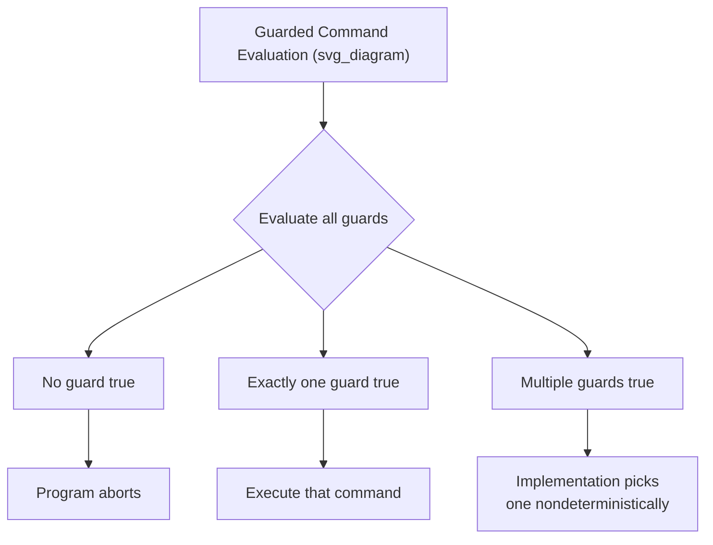

## Guarded Commands

### Overview

Guarded commands are a control-flow construct introduced by Edsger Dijkstra as an alternative to conventional `if`/`else` and `case`/`switch` statements. A guarded command pairs a boolean expression (the "guard") with a statement (the "command"), such that the command executes only if its guard evaluates to true. What distinguishes guarded commands from ordinary conditionals is that they are designed around **nondeterministic selection** among multiple simultaneously-true guards, rather than the strict top-to-bottom, first-match priority order used by `if`/`else if` chains in most mainstream languages.

### Origin and Motivation

Dijkstra introduced guarded commands in his 1975 paper "Guarded Commands, Nondeterminacy and Formal Derivation of Programs," and later in his 1976 book *A Discipline of Programming*. [Unverified — exact publication details recalled from general knowledge, not independently re-verified here.] His motivation was twofold:

- To provide a control structure well-suited to formal reasoning and proof of program correctness, since guarded commands map cleanly onto predicate logic and Hoare-logic-style pre/postcondition reasoning.
- To avoid a specific flaw in conventional `if`/`else` chains: when a programmer writes `if A then S1 else if B then S2`, the ordering of `A` and `B` implies a priority that may not reflect the actual logical structure of the problem. If both `A` and `B` are true, `S1` executes purely because it was written first — an accident of program text rather than a deliberate semantic decision. Dijkstra considered this a source of subtle bugs and unclear reasoning, since it forces the reader to track textual order as if it were meaningful, even when the underlying logic treats the guards as truly independent conditions.

**Key Points**

- A guarded command has the form `guard -> command`, where `guard` is a boolean expression and `command` is a statement or statement list.
- Multiple guarded commands can be grouped together using `[]` (Dijkstra's original notation) inside `if...fi` (selection) or `do...od` (iteration/looping) constructs.
- If **no guard** is true, the entire construct **aborts** — this is a deliberate design choice forcing the programmer to make guard coverage exhaustive or explicitly handle the "none apply" case.
- If **more than one guard** is true, an implementation may choose **any one** of the true guards nondeterministically — the language specification does not fix which one, and a correct program must not depend on a particular choice.

### Formal Syntax (Dijkstra's Notation)

Dijkstra's original guarded command language (GCL) used the following forms:

**Selection:**



```
if G1 -> S1
[] G2 -> S2
[] G3 -> S3
fi
```

**Iteration (repetition):**



```
do G1 -> S1
[] G2 -> S2
od
```

In the `if...fi` form, execution evaluates all guards `G1, G2, G3`; if none are true, the construct aborts (undefined/error behavior); if one or more are true, one of the corresponding commands is chosen and executed. In the `do...od` form, the loop repeats this same selection process on every iteration, terminating only when all guards evaluate to false.

### Nondeterminism as a Deliberate Feature

The nondeterministic choice among simultaneously true guards is not a limitation of guarded commands — it is central to their purpose.



**Example**

Consider computing the maximum of two integers, `x` and `y`, storing the result in `max`:



```
if x >= y -> max := x
[] y >= x -> max := y
fi
```

When `x` equals `y`, both guards are true. A conventional `if x >= y then max := x else max := y` would deterministically pick the first branch due to textual order, even though there is no logical reason to prefer `x` over `y` when they are equal — the guarded-command version makes this symmetry explicit: either assignment is an equally valid, correct outcome, and the specification does not privilege one over the other.

This matters for formal verification: a program proof written against guarded commands only needs to show that *some* true guard leads to a state satisfying the postcondition, not that a *specific* branch is taken. This generally produces a weaker, more general, and often simpler proof obligation than reasoning about a fixed evaluation order. [Inference] Whether this is simpler in practice can depend on the specific proof system and problem, but it is the standard argument made in the formal methods literature.

### Guarded Commands vs. Conventional Conditionals

| Aspect | `if`/`else if` chain | Guarded commands |
| --- | --- | --- |
| Evaluation order | Sequential, first-match wins | All guards conceptually evaluated; order is not semantically meaningful |
| Overlapping true conditions | Resolved by textual priority | Resolved nondeterministically — any true guard may be chosen |
| No condition true | Falls through to `else`, or does nothing if no `else` | Aborts (in Dijkstra's original semantics) |
| Primary use case | General-purpose branching in most languages | Formal specification, correctness proofs, some concurrent/distributed systems modeling |

### Guarded Commands in Real Languages

While few mainstream imperative languages adopt Dijkstra's exact `if...fi`/`do...od` syntax, the guarded-command *idea* — matching against multiple simultaneously-viable conditions with an unspecified or explicitly nondeterministic selection order — appears in several language families.

#### Occam and CSP-Influenced Languages

Occam, based on Tony Hoare's Communicating Sequential Processes (CSP), includes an `ALT` (alternation) construct that behaves like a guarded command over communication events: it waits on multiple channel-input guards simultaneously and proceeds with whichever channel becomes ready first, choosing nondeterministically among any that are simultaneously ready. [Unverified] The precise semantics of "simultaneously ready" resolution in Occam's ALT are implementation- and timing-dependent and not verified in detail here.

#### Go's `select` Statement

Go's `select` statement over channel operations is a direct, practical descendant of the guarded-command idea applied to concurrency:

```go
select {
case msg1 := <-ch1:
    fmt.Println("received from ch1:", msg1)
case msg2 := <-ch2:
    fmt.Println("received from ch2:", msg2)
default:
    fmt.Println("no channel ready")
}
```

Each `case` acts as a guard (is this channel ready to send/receive?). If multiple channels are simultaneously ready, Go's specification states that one is chosen at random (pseudo-uniformly) among the ready cases — an explicit, specified form of the same nondeterminism Dijkstra described, rather than a fixed textual priority.

#### Pattern Matching with Guard Clauses

Many functional and functional-influenced languages use the term "guard" for boolean conditions attached to pattern-matching branches — a related but distinct concept, since these are typically still evaluated in deterministic top-to-bottom order rather than Dijkstra's nondeterministic selection.

Haskell:

```haskell
classify :: Int -> String
classify n
| n < 0     = "negative"
| n == 0    = "zero"
| otherwise = "positive"
```

Erlang:

```erlang
classify(N) when N < 0 -> negative;
classify(N) when N =:= 0 -> zero;
classify(N) -> positive.
```

**Key Points**

- These guard clauses share Dijkstra's terminology and the "condition attached to a branch" idea, but they are deterministic — the first matching guard from top to bottom wins, which is the opposite of Dijkstra's nondeterministic model.
- They should be considered a *naming* descendant of guarded commands rather than a faithful semantic implementation of them.

### Guarded Commands and Formal Verification

Guarded commands remain significant primarily in formal methods and program derivation, rather than everyday application programming.

- **Weakest precondition calculus**: Dijkstra developed guarded commands alongside the *weakest precondition* (`wp`) predicate transformer semantics, used to formally derive a program from a specification by working backward from the desired postcondition. The `if...fi` and `do...od` constructs have clean, compositional `wp` definitions, which is a major reason they were designed the way they were.
- **TLA+ and specification languages**: [Inference] Modern formal specification languages for concurrent and distributed systems, such as TLA+, use nondeterministic action selection in a spirit closely related to guarded commands, though TLA+'s specific mathematical formulation (actions as predicates over state pairs) differs from Dijkstra's original GCL syntax.
- **Model checking**: The Promela language used by the SPIN model checker includes guarded-command-style nondeterministic selection (`if :: guard1 -> stmt1 :: guard2 -> stmt2 fi`), directly inheriting Dijkstra's notation almost verbatim, reflecting the construct's continued relevance in tools built for verifying concurrent system correctness.

### Guarded Iteration (`do...od`) in Detail

The looping form deserves separate attention because it generalizes the familiar `while` loop.



```
do G1 -> S1
[] G2 -> S2
[] G3 -> S3
od
```

This loop continues executing as long as *at least one* guard is true; on each iteration it nondeterministically picks among the currently-true guards. The loop terminates precisely when all guards become false simultaneously.

**Example**

The classic guarded-command solution to computing the greatest common divisor (a slightly generalized Euclid's algorithm), expressed with guarded iteration:



```
do x > y -> x := x - y
[] y > x -> y := y - x
od
```

This terminates when `x = y` (both guards false), at which point `x` (equal to `y`) holds the GCD. Note that this formulation does not specify an execution order between the two subtraction operations when both `x > y` and `y > x` could never simultaneously be true here — but in general guarded loops, when multiple guards are true, the loop body chosen on each pass can vary, and a correctness proof must hold regardless of which sequence of true guards gets selected.

### Practical Guidance

- Use guarded-command *thinking* — explicitly enumerating conditions rather than relying on `else`-as-catchall — when writing safety-critical or correctness-sensitive branching logic, even in languages without native guarded-command syntax, since it forces explicit consideration of the "no condition holds" case.
- Recognize `select` (Go), `ALT` (Occam), and similar concurrent-choice constructs as guarded commands adapted for I/O/channel readiness rather than pure boolean predicates.
- Do not conflate functional-language pattern-match "guards" (Haskell, Erlang, Scala's `case ... if`) with Dijkstra's guarded commands; the former are deterministic, ordered tests, while the latter are explicitly nondeterministic.
- When formally specifying or model-checking a concurrent system (e.g., in TLA+ or Promela), guarded-command-style nondeterministic choice is often the most natural way to express "any of these enabled actions could happen next," matching how such systems actually behave under scheduling uncertainty.

**Conclusion**

Guarded commands reframe conditional branching around explicit, potentially-overlapping guards and an unspecified selection rule for ties, rather than the textual priority ordering used by conventional `if`/`else`. Though rarely adopted verbatim in mainstream imperative languages, the construct's influence is visible in concurrency primitives like Go's `select`, in CSP-derived languages like Occam, and in formal specification and model-checking languages like Promela — anywhere that "multiple things might be ready to happen, and the system should not be forced to prefer one for accidental textual reasons" is a genuine property of the system being modeled.

**Related Topics**

- Weakest precondition calculus and predicate transformer semantics
- Communicating Sequential Processes (CSP) and process algebra
- Go's concurrency model: goroutines, channels, and `select`
- Nondeterminism versus randomness in formal semantics
- Model checking and the Promela/SPIN toolchain
- Pattern matching and guard clauses in functional languages
- Hoare logic and formal program verification