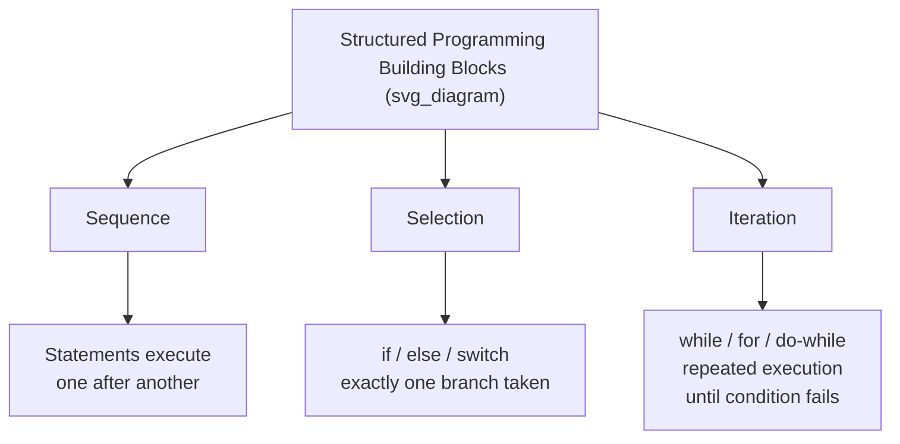

## Structured Programming Principles


### Overview

Structured programming is a programming paradigm and discipline, developed primarily in the late 1960s and early 1970s, that restricts control flow to a small set of composable constructs — sequence, selection, and iteration — in place of arbitrary jumps (`goto`). The goal is to make programs easier to read, verify, and maintain by ensuring that a program's static text structure closely mirrors its dynamic execution behavior. Structured programming underlies nearly all mainstream imperative and object-oriented languages in use today.

### Historical Origins

Structured programming emerged from several converging contributions in the late 1960s:

- **Corrado Böhm and Giuseppe Jacopini** proved in 1966 that any computable function expressible using unrestricted `goto`-based flowcharts can also be expressed using only three control structures: sequence, selection, and iteration (the **Böhm–Jacopini theorem**). This gave formal grounding to the claim that `goto` is not strictly necessary for computational completeness.
- **Edsger Dijkstra's** 1968 letter, "Go To Statement Considered Harmful," argued on practical and cognitive grounds that unrestricted jumps impede a programmer's ability to reason about program state, catalyzing broader industry and academic attention to disciplined control flow.
- **Dijkstra, along with Ole-Johan Dahl and C.A.R. Hoare**, further developed and popularized these ideas in the 1972 book *Structured Programming*, which extended the discussion beyond control flow into structured data and top-down design.

**Key Points**

- Structured programming is fundamentally about *disciplining control flow*, not merely avoiding the `goto` keyword.
- It is closely associated with, but distinct from, top-down design and stepwise refinement, which concern how a program is *decomposed*, not merely how control flows within it.
- Structured programming predates and heavily influenced object-oriented programming, which retained its control-flow discipline while adding encapsulation and modularity.

### The Three Core Control Structures



#### Sequence

Sequence is the default composition rule: statements execute one after another in the order they are written, each with a single entry point and single exit point that flows directly into the next statement.

```python
x = compute_initial_value()
y = transform(x)
z = finalize(y)
```

Here, execution enters at the top and exits at the bottom, with no branching — the textual order and the execution order are identical.

#### Selection

Selection chooses exactly one of several alternative paths based on a condition, then rejoins a single continuation point afterward.

```python
if temperature > 30:
    status = "hot"
elif temperature > 15:
    status = "mild"
else:
    status = "cold"
```

Regardless of which branch executes, control resumes at the statement following the entire `if`/`elif`/`else` block — there is one entry and, critically, one *effective* exit point for the whole construct, even though there are multiple internal paths.

#### Iteration

Iteration repeats a block of statements while (or until) a condition holds, again with a single entry and single exit.

```python
total = 0
i = 0
while i < len(items):
    total += items[i]
    i += 1
```

**Example**

The equivalent using `for`, which is a structured, syntactically compact form of iteration common across languages:

```python
total = 0
for item in items:
    total += item
```

### The Single-Entry, Single-Exit Principle

A recurring formalization of structured programming is the **single-entry, single-exit (SESE)** property: every control construct should have exactly one point where control enters the block and exactly one point where control leaves it. This property is what allows structured constructs to be treated as black boxes and composed hierarchically — a `while` loop containing an `if` statement can itself be nested inside another `if`, and at every level of nesting, the reader can reason about each block independently because it behaves predictably: it starts, it does its work, and it ends, without unpredictable jumps escaping to arbitrary other locations.

[Inference] Strict SESE is somewhat idealized; in practice, most structured languages relax it in controlled ways — `return`, `break`, and `continue` are all technically *additional* exit points from a block, deviating from pure single-exit. This is discussed further below, since it is a genuine point of nuance and disagreement in how strictly "structured programming" should be interpreted.

### Controlled Deviations from Strict SESE

Modern structured languages almost universally include constructs that are technically multiple-exit, yet are still considered acceptable within structured programming discipline because their targets are lexically scoped and predictable rather than arbitrary:

- **`return`**: exits a function early from within nested blocks. The exit target (the function's caller) is always well-defined and local to the function's own structure.
- **`break`**: exits the nearest enclosing loop (or a labeled outer loop, in languages supporting labeled break).
- **`continue`**: skips to the next iteration of the nearest enclosing loop.
- **Exceptions**: unwind the stack to the nearest matching handler, which is dynamically determined but still confined to a well-defined mechanism with guaranteed cleanup semantics (`finally`, RAII destructors, `defer`).

```java
public int findFirstNegative(int[] arr) {
    for (int i = 0; i < arr.length; i++) {
        if (arr[i] < 0) {
            return i; // early exit, but well-scoped
        }
    }
    return -1;
}
```

This function has two `return` statements — technically two exits — yet virtually no practitioner would call this "unstructured" in the way Dijkstra criticized `goto`, because both exits are function-local, clearly delimited, and do not require the reader to trace an arbitrary jump target elsewhere in the program.

### Structured Programming vs. Related but Distinct Ideas

It is a common conflation to treat "structured programming," "top-down design," and "modular programming" as synonyms. They are related but address different concerns:

| Concept | Concern | Primary Mechanism |
| --- | --- | --- |
| Structured programming | Control flow within a procedure | Sequence, selection, iteration; avoiding arbitrary goto |
| Top-down design / stepwise refinement | How a problem is decomposed into subproblems | Successive refinement from abstract to concrete steps |
| Modular programming | How code is organized into independent units | Modules, namespaces, information hiding |
| Structured data | How data is organized | Records/structs, arrays, avoiding untyped memory manipulation |

Dijkstra, Dahl, and Hoare's *Structured Programming* book actually addressed several of these together, which is part of why the term is sometimes used broadly to mean "disciplined, well-organized programming" generally, beyond just control flow. [Unverified] The precise scope of the term as originally intended by the three authors is a matter of some historical interpretation, though the control-flow-restriction meaning is the one most consistently emphasized in later computer science curricula.

### Language Support for Structured Programming

Structured control constructs are now essentially universal in general-purpose languages, though their specific menu of constructs varies:

- **C, Java, C#, JavaScript, Python, Go, Rust**: all provide `if`/`else`, some form of `switch`/`match`, `while`, `for`, `do-while` (in some), plus scoped `break`/`continue`/`return`.
- **Functional languages (Haskell, ML family, Scheme)**: achieve equivalent structuring through recursion, pattern matching, and expression-based conditionals (`if...then...else` as an expression, not a statement) rather than imperative loops, but retain the same underlying discipline — no unrestricted jumps, and every construct composes predictably.
- **Languages retaining `goto`** (C, C++, Go): permit it as an *exception* to structured discipline for specific idioms (see the goto controversy topic), rather than as the primary control mechanism it was in earlier unstructured languages like early BASIC or COBOL.

### Benefits and Criticisms

**Key Points — Benefits**

- Improves readability: static code layout mirrors dynamic execution flow, so a reader can trace a program by reading top-to-bottom rather than jumping around.
- Simplifies formal verification: pre/postcondition reasoning (Hoare logic) composes naturally over sequence, selection, and iteration, since each construct has a well-defined, compositional semantic rule.
- Reduces a specific class of bugs associated with unclear or duplicated jump targets and inconsistent program state at arbitrary jump points.
- Facilitates maintenance, since modifying one structured block has a bounded, predictable effect on surrounding code.

**Key Points — Criticisms and Limits**

- Strict adherence to single-exit-only (rejecting even `return`, `break`, `continue`) can, in some cases, force more convoluted code via extra boolean flag variables — this was part of Knuth's counterargument in the goto debate.
- Structured programming addresses control flow but does not by itself address other major sources of complexity, such as unconstrained shared mutable state, deep object hierarchies, or ad hoc data coupling — later paradigms (structured *data* design, OOP, functional programming) were partly motivated by addressing these separate concerns.
- [Inference] Some argue that structured programming's constructs, while sufficient for computability per Böhm–Jacopini, are not always the most *natural* fit for certain problems — event-driven, asynchronous, or highly concurrent systems often require additional coordination constructs (callbacks, promises, actors, channels) layered on top of basic structured control flow.

### Practical Guidance

- Default to sequence, selection, and iteration as the backbone of any function or method; treat `goto` (where available) as a narrow exception, not a routine tool.
- Accept `return`, `break`, and `continue` as pragmatic, well-scoped deviations from strict single-exit — they generally improve rather than harm readability when used for early termination on clearly-stated conditions.
- Keep individual structured blocks (loop bodies, conditional branches) small enough that their single-entry/single-exit property remains easy to verify by inspection; deeply nested structured code can become as hard to follow as unstructured code, even without a single `goto`.
- When refactoring legacy `goto`-heavy code (COBOL, older BASIC, early Fortran), apply the Böhm–Jacopini result as a guarantee that a structured equivalent exists, then work incrementally — this is a well-established, tractable refactoring class rather than a purely theoretical exercise.

**Conclusion**

Structured programming's lasting contribution is the insight that a small, composable set of control constructs — sequence, selection, iteration — is both computationally sufficient (per Böhm–Jacopini) and cognitively superior to arbitrary jumps, because it keeps a program's written form aligned with its runtime behavior. This principle is now so deeply embedded in mainstream language design that it rarely needs to be argued for explicitly; it surfaces today mainly in discussions of *where* to draw the line on controlled exceptions to single-exit discipline (`return`, `break`, exceptions), rather than in any live debate over whether structured control flow itself is worthwhile.

**Related Topics**

- Unconditional branching and the goto controversy
- Böhm–Jacopini theorem and its formal proof
- Hoare logic and axiomatic program verification
- Top-down design and stepwise refinement
- Structured data types: records, structs, and avoiding untyped memory access
- Exception handling as structured non-local control flow
- Recursion as a structured alternative to iteration in functional languages