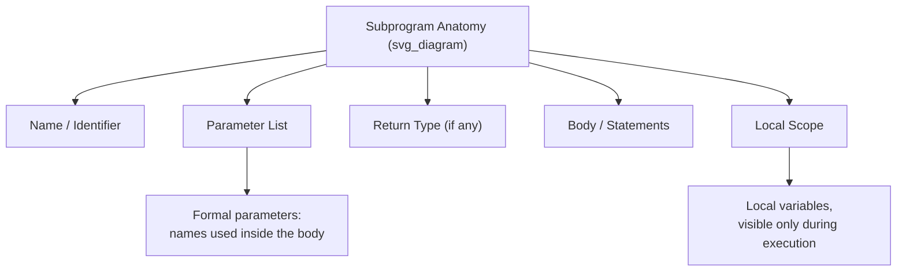
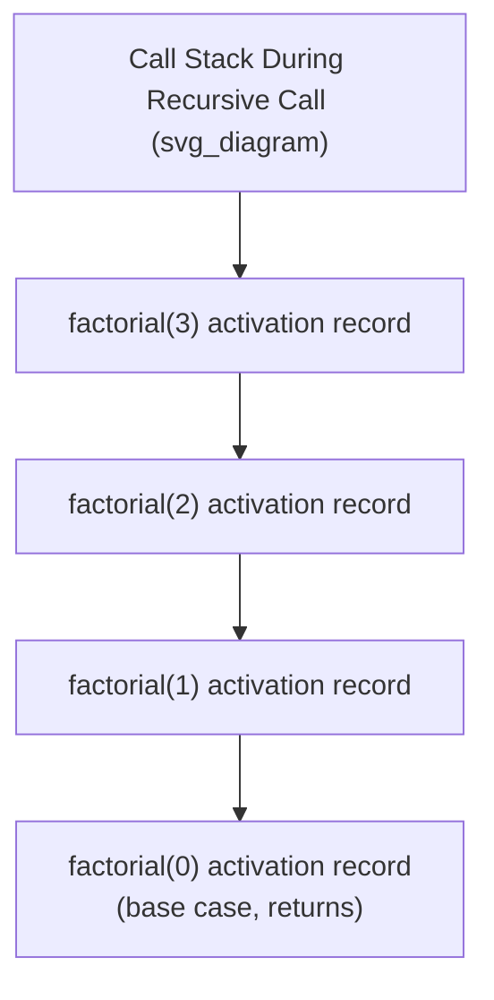

## Fundamentals of Subprograms


### Overview

A subprogram is a named, reusable unit of code — encompassing procedures, functions, subroutines, and methods — that encapsulates a computation and can be invoked from other parts of a program. Subprograms are one of the most fundamental abstraction mechanisms in programming language design, allowing programmers to decompose problems, avoid code duplication, and manage complexity through well-defined interfaces. Nearly every aspect of a language's runtime behavior — parameter passing, scoping, activation records, recursion — is shaped by how it implements subprograms.

### Terminology

Different language communities use different, overlapping terms for the same underlying concept:

- **Procedure / Subroutine**: a subprogram invoked for its side effects, not primarily for a return value (historically emphasized in Pascal, Fortran, Ada).
- **Function**: a subprogram that returns a value, conceptually modeled after mathematical functions (though in most imperative languages, functions may also have side effects, unlike pure mathematical functions).
- **Method**: a subprogram associated with a class or object in object-oriented languages, implicitly or explicitly operating on an instance (`this`/`self`).
- **Routine**: a general umbrella term sometimes used interchangeably with subprogram.

**Key Points**

- Some languages formally distinguish procedures from functions (Pascal's `procedure` vs. `function`; Ada's `procedure` vs. `function`).
- Other languages unify the concept — in C, every subprogram is a function, and a "procedure" is simply a function declared to return `void`.
- In functional languages (Haskell, ML family), the distinction largely disappears, since all subprograms are functions in the mathematical sense, and side-effecting operations are typically handled through explicit mechanisms (monads, effect systems) rather than a separate procedure category.

### Core Components of a Subprogram



Every subprogram definition, regardless of language, generally consists of:

1. **A name** (identifier) used to invoke it, though some languages support anonymous subprograms (lambdas/closures) without a bound name.
2. **A parameter list** (formal parameters) specifying what data the subprogram expects from its caller.
3. **A body** containing the statements or expressions that constitute the subprogram's behavior.
4. **A return type or value specification** (in functions), indicating what, if anything, is passed back to the caller.
5. **A local scope**, in which local variables exist only for the duration of a single invocation (in the common, non-static case).

```c
int add(int a, int b) {
    int result = a + b;
    return result;
}
```

Here, `add` is the name, `(int a, int b)` are the formal parameters, `int` before the name is the return type, and the body computes and returns `result`, a local variable.

### Formal Parameters vs. Actual Arguments

A critical distinction in subprogram terminology: **formal parameters** are the names declared in the subprogram's definition, while **actual arguments** (or actual parameters) are the specific values or expressions supplied at a particular call site.

```python
def greet(name, greeting):  # name, greeting: formal parameters
    return f"{greeting}, {name}!"

result = greet("Mayya", "Hello")  # "Mayya", "Hello": actual arguments
```

**Key Points**

- The formal parameter list defines an interface — a contract about what kind and how many values the subprogram expects.
- Binding of actual arguments to formal parameters happens at call time and can follow different rules depending on the language's parameter-passing semantics (positional, named/keyword, default values).

### Parameter Passing Mechanisms

How arguments are transmitted from caller to callee is one of the most consequential design decisions in a language's subprogram model, since it determines whether and how a subprogram can affect the caller's data.

#### Pass-by-Value

The subprogram receives a copy of the actual argument's value. Modifications to the formal parameter inside the subprogram do not affect the caller's original data.

```c
void increment(int x) {
    x = x + 1; // modifies local copy only
}

int main(void) {
    int a = 5;
    increment(a);
    // a is still 5
}
```

#### Pass-by-Reference

The subprogram receives a reference (alias) to the caller's actual storage location. Modifications to the formal parameter inside the subprogram directly affect the caller's original data.

```cpp
void increment(int &x) {
    x = x + 1; // modifies caller's variable
}

int main() {
    int a = 5;
    increment(a);
    // a is now 6
}
```

#### Pass-by-Value-Result (Copy-Restore)

The subprogram receives a copy of the value (like pass-by-value), but upon return, the final value of the formal parameter is copied back into the caller's actual argument. [Unverified — this mechanism is a documented historical technique, notably associated with Ada's `in out` mode in certain implementations, but its precise prevalence in modern practice is not independently re-verified here.] This differs from pass-by-reference primarily in aliasing edge cases: if two formal parameters alias the same actual argument, pass-by-value-result and pass-by-reference can produce different results, since the former only writes back at the end.

#### Pass-by-Name (Historical)

Used notably in Algol 60, pass-by-name textually substitutes the actual argument expression for each occurrence of the formal parameter, re-evaluating the expression each time it is used — closer to macro substitution than to conventional value or reference passing. [Unverified] This mechanism is largely of historical interest today; it produced famously subtle behaviors such as "Jensen's Device" and has been abandoned by virtually all modern language designs in favor of value or reference semantics.

#### The "Pass-by-Object-Reference" Model (Java, Python, JavaScript)

Many modern languages use a model sometimes informally called "pass-by-object-reference" or "call-by-sharing": the *reference itself* is passed by value, meaning the formal parameter receives a copy of the reference (pointing to the same underlying object), but reassigning the formal parameter to a *different* object does not affect the caller's variable.

```python
def modify_list(lst):
    lst.append(4)       # mutates the shared object — caller sees this
    lst = [99, 100]      # rebinds local name only — caller unaffected

my_list = [1, 2, 3]
modify_list(my_list)
# my_list is now [1, 2, 3, 4] — the append is visible,
# but my_list does NOT become [99, 100]
```

**Key Points**

- This is a frequent source of confusion because it is neither pure pass-by-value nor pure pass-by-reference: mutations to the referenced object's *contents* are visible to the caller, but reassignment of the *local reference variable* is not.
- Java, Python, JavaScript, Ruby, and C# (for reference types by default) all follow this model, though C# additionally offers explicit `ref` and `out` keywords for true pass-by-reference semantics when needed.

### Parameter Passing Comparison Table

| Mechanism | Caller data mutable via parameter? | Representative Languages |
| --- | --- | --- |
| Pass-by-value | No | C (primitives), Java (primitives), Pascal (`value` params) |
| Pass-by-reference | Yes | C++ (`&`), Pascal (`var` params), C# (`ref`/`out`) |
| Pass-by-value-result | Yes, but only after return | Some Ada `in out` implementations [Unverified] |
| Pass-by-name | Yes, via re-evaluated expression | Algol 60 (largely historical) |
| Pass-by-object-reference / call-by-sharing | Object mutations yes; rebinding no | Java, Python, JavaScript, Ruby |

### Activation Records (Stack Frames)

Each invocation of a subprogram typically creates an **activation record** (also called a stack frame), a runtime data structure holding the information needed for that specific call: parameter values, local variables, a return address, and often a saved reference to the caller's own activation record.



**Example**

```python
def factorial(n):
    if n == 0:
        return 1
    return n * factorial(n - 1)
```

Each recursive call to `factorial` creates a new activation record on the call stack, holding its own copy of `n`. This is precisely what makes recursion possible: without a fresh activation record per call, there would be no way to distinguish `n = 3`'s local state from `n = 2`'s.

**Key Points**

- Activation records are typically allocated on a **call stack**, growing with each nested or recursive call and shrinking on return — this is why unbounded recursion eventually causes a **stack overflow**.
- Some languages and implementations support **tail-call optimization (TCO)**, reusing the current activation record for a tail-recursive call instead of allocating a new one, avoiding stack growth for that specific pattern. [Inference] Support for TCO varies significantly by language and even by implementation — Scheme guarantees it per its standard, while most JavaScript engines, despite it being specified in ES2015, do not reliably implement it in practice.

### Local Scope and Lifetime

Variables declared within a subprogram body are, by default in most languages, **local** — visible only within that subprogram and existing only for the duration of a single activation (unless declared `static` or equivalent, which persists a variable's value across calls).

```c
void counter(void) {
    static int count = 0; // persists across calls
    int local = 0;         // reinitialized every call
    count++;
    local++;
    printf("count=%d local=%d\n", count, local);
}
```

Calling `counter()` repeatedly prints `count` incrementing across calls (`1, 2, 3, ...`) while `local` always prints `1`, illustrating the difference between a `static` variable's lifetime (persists for the whole program) and an ordinary local variable's lifetime (bound to a single activation).

### Overloading, Default Parameters, and Variadic Parameters

Modern subprogram designs commonly extend the basic name-plus-parameter-list model:

- **Overloading**: multiple subprograms share a name but differ in parameter type or count, resolved at compile time based on the call site's argument types (C++, Java, C#).
- **Default parameter values**: a formal parameter may specify a value used when the caller omits a corresponding actual argument (C++, Python, JavaScript, Kotlin).
- **Variadic parameters**: a subprogram accepts a variable number of arguments (C's `printf`-style `...`, Python's `*args`, Java's varargs `...`).

```python
def greet(name, greeting="Hello", *extras):
    message = f"{greeting}, {name}!"
    for e in extras:
        message += f" ({e})"
    return message
```

This single Python function combines a required parameter (`name`), a default parameter (`greeting`), and a variadic parameter (`*extras`) — illustrating how far modern subprogram interfaces have extended beyond a strict fixed-arity model.

### Practical Guidance

- Choose pass-by-reference (or `ref`/`out`-style explicit reference parameters) only when a subprogram genuinely needs to mutate caller state; default to pass-by-value or immutable data where possible, since it limits the surface area for unintended side effects and makes reasoning about a subprogram's behavior from its signature alone more reliable.
- In languages using the pass-by-object-reference model (Python, Java, JavaScript), be explicit in documentation or naming about whether a function mutates its argument in place or returns a new value — this ambiguity is a common source of real-world bugs.
- Be cautious about relying on tail-call optimization for correctness (not just performance) unless the specific language and runtime guarantee it in its specification; treat it as an optimization detail rather than a semantic guarantee unless explicitly documented as such (Scheme is the primary language where it is a true guarantee).
- Prefer named/default parameters over long positional parameter lists once a subprogram accumulates more than a handful of parameters, since positional calls become error-prone and hard to read at the call site as parameter count grows.

**Conclusion**

Subprograms are the foundational unit of reuse and abstraction in imperative and object-oriented languages, and the specific choices a language makes around parameter-passing semantics, activation record management, and scoping rules ripple outward into nearly every other part of its design — from how recursion behaves, to how mutable state can (or cannot) leak across function boundaries, to how errors and stack traces are structured at runtime.

**Related Topics**

- Recursion: direct, indirect, and mutual recursion
- Closures and lexical scoping in nested/anonymous functions
- Tail-call optimization and its language-specific guarantees
- Higher-order functions and functions as first-class values
- Function overloading versus generic/templated functions
- Scope rules: static (lexical) versus dynamic scoping
- Coroutines and generators as extended subprogram models