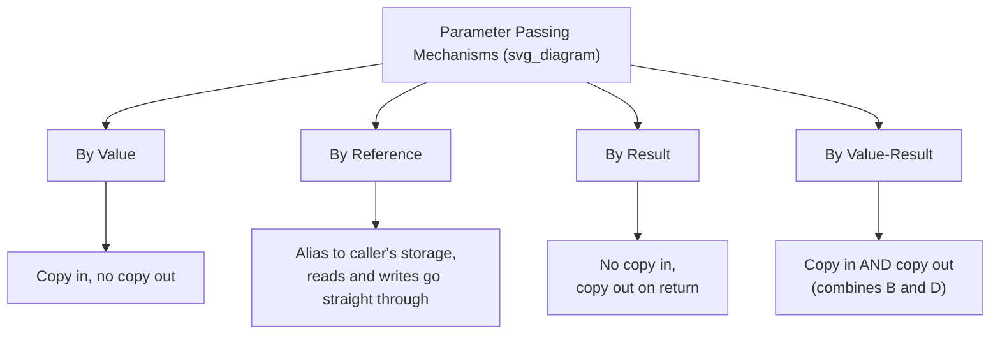

## Parameter Passing: By Value, By Reference, By Result

### Overview

Parameter passing methods define how actual arguments supplied at a call site are bound to a subprogram's formal parameters, and — critically — whether and how changes made to a parameter inside the subprogram are reflected back in the caller's data. This topic focuses in depth on three specific mechanisms: pass-by-value, pass-by-reference, and pass-by-result (along with its close relative, pass-by-value-result), examining their semantics, implementation, and the distinct bugs and design tradeoffs each one produces.

### Why Parameter Passing Semantics Matter

The choice of parameter-passing mechanism determines a subprogram's **interface contract** with its caller: can the caller trust that its data is untouched after the call, or must it assume the subprogram may modify it? This single design decision affects reasoning about aliasing, side effects, performance (copying large data structures vs. passing a reference), and the safety of concurrent or recursive code.



### Pass-by-Value

In pass-by-value, the actual argument is evaluated, and a **copy** of its value is placed into the formal parameter's storage location at call time. The subprogram operates entirely on this copy; the caller's original variable is never touched, regardless of what the subprogram does to the formal parameter.

```c
#include <stdio.h>

void modify(int x) {
    x = x * 100;
    printf("Inside modify: x = %d\n", x);
}

int main(void) {
    int value = 5;
    modify(value);
    printf("After call: value = %d\n", value);
    return 0;
}
```

**Output**



```
Inside modify: x = 500
After call: value = 5
```

**Key Points**

- The caller's `value` is unaffected because `modify` only ever operates on its own local copy, `x`.
- Pass-by-value is the default parameter-passing mode in C, Java (for primitive types), Pascal (unless declared `var`), and Go.
- It is generally the **safest** mechanism from a reasoning standpoint: a function signature using pass-by-value parameters guarantees the caller's arguments cannot be mutated through those parameters, which simplifies local reasoning about a function's effects.
- The main cost is **copying overhead**: for large structures (big structs, arrays passed by value in C, large records in Pascal), each call copies the entire value, which can be a genuine performance concern for large data. [Inference] The practical significance of this overhead depends heavily on the size of the data and call frequency; for small primitive types it is negligible.

### Pass-by-Reference

In pass-by-reference, the formal parameter becomes an **alias** for the actual argument's storage location — no copying of the underlying value occurs. Reads and writes to the formal parameter inside the subprogram act directly on the caller's original variable.

```cpp
#include <iostream>

void modify(int &x) {
    x = x * 100;
    std::cout << "Inside modify: x = " << x << std::endl;
}

int main() {
    int value = 5;
    modify(value);
    std::cout << "After call: value = " << value << std::endl;
    return 0;
}
```

**Output**



```
Inside modify: x = 500
After call: value = 500
```

**Key Points**

- Because `x` is bound directly to `value`'s storage, the modification inside `modify` is visible to the caller after the call returns.
- C++ provides explicit reference parameters (`&`); Pascal uses `var` parameters; C# and VB.NET provide explicit `ref` (and `out`) keywords; Fortran historically passed all parameters by reference by default.
- Pass-by-reference avoids copying overhead entirely, which is valuable for large data structures.
- It introduces **aliasing risk**: if two formal parameters happen to reference the same actual variable (or overlapping memory), a subprogram's behavior can become surprising, since writes through one parameter are visible through the other.

**Example — Aliasing Hazard**

```cpp
void combine(int &a, int &b) {
    a = a + b;
    b = a + b;
}

int main() {
    int x = 3;
    combine(x, x); // both formal parameters alias the SAME variable
    // What is x now? Depends on evaluation order inside combine,
    // and is easy to get wrong when reasoning about it.
}
```

When `combine(x, x)` is called with the same variable for both arguments, `a` and `b` become aliases of the same storage, so the two assignment statements interact in a way that would not occur if `a` and `b` referred to genuinely distinct variables — this is a canonical illustration of why aliasing complicates reasoning about reference-passed code. [Inference] The exact resulting value is implementation-defined behavior dependent on execution order within the function body, and is precisely the kind of subtlety pass-by-reference introduces that pass-by-value avoids by construction.

### Pass-by-Result

In pass-by-result, **no value is copied in** to the formal parameter at call time — the formal parameter starts uninitialized from the caller's perspective. The subprogram computes a value into the formal parameter during its execution, and **upon return**, that final value is copied **out** to the caller's actual argument location.

**Key Points**

- Pass-by-result is essentially a **write-only, output-only** parameter: the subprogram cannot rely on any incoming value (there isn't one, semantically), and the caller's original value (if any existed) is overwritten only at the moment the subprogram returns.
- This mechanism is most closely associated with Ada's `out` mode parameters. [Unverified] The precise formal semantics of Ada's `out` mode (whether the parameter is truly "uninitialized" at entry, or implementation-defined) are governed by the Ada Language Reference Manual, which is not independently re-verified in full detail here — but the conceptual model of "output only, copied back at return" is the standard description of pass-by-result.

```ada
procedure Compute_Square (N : in Integer; Result : out Integer) is
begin
   Result := N * N;
end Compute_Square;
```

Here, `Result` is a pass-by-result (`out` mode) parameter: the procedure does not read any prior value of the caller's argument through `Result` — it only computes and writes a new value, which is copied back to the caller's variable when `Compute_Square` returns.

- Conceptually, pass-by-result is the mirror image of pass-by-value: pass-by-value is "copy in, no copy out," while pass-by-result is "no copy in, copy out."
- Because there is no meaningful "incoming" value, pass-by-result parameters are unsuitable for any computation that needs to read the caller's current value — that requires either pass-by-reference or the combined mechanism below.

### Pass-by-Value-Result (Copy-Restore)

Pass-by-value-result (sometimes called **copy-restore** or **copy-in/copy-out**) combines the two mechanisms above: at call time, the actual argument's value **is** copied into the formal parameter (like pass-by-value), the subprogram operates on this local copy throughout execution, and **upon return**, the final value of the formal parameter is copied back out to the caller's actual argument location (like pass-by-result).

**Key Points**

- This corresponds most closely to Ada's `in out` mode parameters. [Unverified] As with `out` mode above, the precise guarantees are specified in the Ada Language Reference Manual; the general copy-in/copy-out model is the standard textbook characterization.
- Pass-by-value-result behaves identically to pass-by-reference in the **common case** where there is no aliasing between formal parameters — the caller sees the final computed value either way.
- The mechanisms **diverge** specifically in aliasing scenarios: pass-by-reference writes are visible immediately and can affect other aliased parameters *during* execution, while pass-by-value-result only writes back once, at the very end, so intermediate writes are never visible to an aliased parameter during the call.

**Example — Where Value-Result and Reference Diverge**

Consider a hypothetical procedure with two `in out` (value-result) parameters, called with the same variable for both:



```
procedure Swap_Add (X : in out Integer; Y : in out Integer) is
begin
   X := X + 1;
   Y := Y + 1;
end Swap_Add;
```

If called as `Swap_Add(Z, Z)` where both parameters alias the same caller variable `Z`:

- **Under pass-by-reference semantics**: `X` and `Y` are the *same* storage location throughout. `X := X + 1` increments `Z`, then `Y := Y + 1` reads the *already-incremented* `Z` and increments it again — `Z` ends up increased by 2.
- **Under pass-by-value-result semantics**: `X` and `Y` are *independent local copies*, both initialized to `Z`'s original value. Each is incremented once, independently, and **whichever formal parameter's copy-out happens last** determines `Z`'s final value — so `Z` ends up increased by only 1, not 2, and the specific outcome can depend on parameter copy-out order, which some language specifications leave unspecified.

This divergence is the classic textbook illustration of why pass-by-reference and pass-by-value-result are **not** semantically identical mechanisms, even though they behave the same in the non-aliased case. [Inference] Whether a given real Ada implementation exhibits exactly this behavior in this exact example is implementation- and specification-detail-dependent; the example illustrates the *conceptual* divergence point rather than a verified trace of a specific compiler's output.

### Comparison Table

| Mechanism | Copy in? | Copy out? | Aliasing behavior | Representative Languages |
| --- | --- | --- | --- | --- |
| By value | Yes | No | N/A — no caller-visible writes at all | C, Java (primitives), Go, Pascal (default) |
| By reference | No (direct alias) | N/A — writes are immediate | Immediate, can affect other aliases mid-call | C++ (`&`), Pascal (`var`), C#/VB.NET (`ref`/`out`) |
| By result | No | Yes | N/A — no incoming value to alias against | Ada `out` mode [Unverified — exact ARM semantics] |
| By value-result | Yes | Yes | Deferred — only visible after return, order-dependent under aliasing | Ada `in out` mode [Unverified — exact ARM semantics] |

### Why Most Mainstream Languages Only Offer Value and Reference

Pass-by-result and pass-by-value-result are comparatively rare in mainstream language design today. [Inference] The most plausible reasons, drawing on standard language-design discussion, are:

- The **aliasing divergence** described above is a subtle correctness hazard that most language designers consider not worth the complexity for typical application code, especially given that the common (non-aliased) case behaves identically to simpler pass-by-reference.
- Pass-by-reference already provides the "let the callee affect the caller's data" capability that value-result is mainly useful for, without needing a separate copy-out step, at the cost of the aliasing subtlety pass-by-reference itself introduces.
- Modern language designs increasingly favor **immutable-by-default** or **explicit mutation markers** (Rust's `&mut`, Kotlin's absence of `out` parameters in favor of returning tuples/data classes) over four-way parameter-passing taxonomies, simplifying the mental model down to essentially "value" vs. "reference," with explicit return values preferred for producing new data.

### Practical Guidance

- Prefer **pass-by-value** as the default for parameters a subprogram should only read, since it gives the strongest, simplest guarantee against unintended side effects on caller data.
- Use **pass-by-reference** (or a language's explicit reference/`ref`/`out` mechanism) only when a subprogram genuinely needs to mutate the caller's variable in place, and document this clearly at the call site or in the signature, since it is a common source of surprise for readers unfamiliar with the function.
- Be alert to **aliasing** whenever passing the same variable (or overlapping data, such as two array elements or two references to the same object) into multiple reference or value-result parameters of the same call — this is a narrow but genuine correctness hazard, most relevant in Ada-style `in out` parameters or C++ reference parameters.
- When working in languages without true pass-by-result/value-result (nearly all mainstream languages today), the idiomatic replacement is typically to **return a value** (or a tuple/struct of multiple values) rather than mutate an output parameter — this sidesteps the aliasing subtleties entirely and is generally considered clearer in modern style guides.
- In performance-sensitive code involving large data structures, weigh pass-by-value's copying cost against pass-by-reference's aliasing risk explicitly; many languages (C++, Rust) provide `const` reference or borrow mechanisms specifically to get reference-passing's performance without granting mutation rights, combining the safety of value semantics with the efficiency of reference semantics.

**Conclusion**

Pass-by-value, pass-by-reference, pass-by-result, and pass-by-value-result represent four distinct answers to the question of what a subprogram call actually transmits between caller and callee — a copy, an alias, an output-only channel, or a copy with deferred write-back. While mainstream languages today have largely consolidated around value and reference semantics (with return values displacing most historical uses of result/value-result parameters), understanding the full taxonomy, and particularly the aliasing divergence between reference and value-result semantics, remains valuable for reading formally-specified languages like Ada and for reasoning precisely about correctness in any language that permits parameter aliasing.

**Related Topics**

- Fundamentals of subprograms: activation records and local scope
- Pass-by-name and Algol 60's evaluation semantics (historical)
- Aliasing and its impact on compiler optimization
- Ada's parameter modes (`in`, `out`, `in out`) in full
- Immutability and const-correctness as alternatives to strict parameter-mode taxonomies
- Rust's borrow checker as a static solution to aliasing hazards
- Return values, tuples, and multiple-value returns as alternatives to output parameters