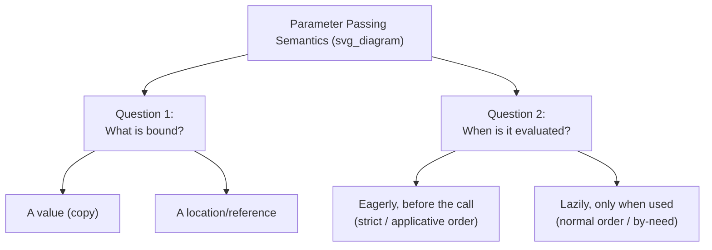

## Parameter Passing Modes and Semantics Models


### Overview

Beyond the individual mechanisms of value, reference, result, and value-result passing, language designers organize parameter passing around higher-level **semantic models** — formal frameworks that describe, at a more abstract level, what a "binding" between a formal parameter and an actual argument actually means. This topic surveys the major semantics models used to classify and reason about parameter passing across languages: the l-value/r-value distinction, the "mode" system (in/out/in-out), copy semantics versus sharing semantics, and how these models interact with type systems, mutability, and evaluation strategy (strict vs. lazy).

### Two Orthogonal Questions Every Model Must Answer



Any parameter-passing model can be decomposed into two largely independent design questions:

1. **What does the formal parameter become bound to** — a copy of a value, or a reference to a storage location (an l-value)?
2. **When is the actual argument evaluated** — eagerly at the call site (strict/applicative-order evaluation), or lazily, only when the formal parameter's value is actually needed inside the subprogram body (normal-order or by-need evaluation)?

Most mainstream discussions of "pass-by-value vs. pass-by-reference" implicitly assume strict evaluation and only vary along the first axis. However, the second axis produces an entirely separate family of models — pass-by-name and pass-by-need — that historically preceded and influenced how value/reference semantics were later formalized.

### The L-Value / R-Value Semantic Model

A foundational model, especially prominent in C-family language semantics, distinguishes between:

- **L-value**: an expression that refers to a storage location and can (in principle) appear on the left side of an assignment — it denotes "a place."
- **R-value**: an expression that denotes only a value, not a location — it denotes "a thing," and generally cannot be assigned to.

```c
int a = 5;
int b = a;      // 'a' used as an r-value: its VALUE is read and copied
int *p = &a;    // 'a' used as an l-value: its LOCATION is taken
```

**Key Points**

- Pass-by-value semantics, formally, means the actual argument is evaluated as an r-value (its value is extracted and copied) at the call site.
- Pass-by-reference semantics means the actual argument is evaluated as an l-value (its location is extracted) and that location is bound to the formal parameter.
- This framing explains why pass-by-reference parameters typically **require** the actual argument to be a valid l-value (a variable, array element, or dereferenced pointer) — you cannot take a reference to a literal like `5`, since it has no storage location of its own. C++ reflects this directly: `void f(int &x)` cannot be called as `f(5)`, but `void f(const int &x)` can, because C++ specifically permits binding a `const` reference to a temporary, materializing a hidden temporary storage location for the literal.

### The Mode System: In, Out, In-Out

A second, largely orthogonal semantic model classifies parameters by **information flow direction** rather than by copy-versus-reference mechanics. This is the model formalized explicitly in Ada:

| Mode | Direction | Typical implementation |
| --- | --- | --- |
| `in` | Caller → subprogram only | Pass-by-value (or pass-by-reference for efficiency, if the language guarantees no observable difference) |
| `out` | Subprogram → caller only | Pass-by-result |
| `in out` | Both directions | Pass-by-reference or pass-by-value-result |

**Key Points**

- The mode system describes **intent and information flow**, while pass-by-value/reference/result describe **mechanism**. Ada's design deliberately separates these: a programmer declares a parameter's mode (`in`, `out`, `in out`), and the language implementation is permitted some latitude in how it actually realizes that mode (by-value or by-reference), provided the *observable* behavior matches the mode's contract. [Unverified] The precise latitude Ada implementations are granted, and under what conditions, is specified in the Ada Language Reference Manual in detail beyond what is re-verified here.
- This separation of "intent" from "mechanism" is a notably different philosophy from C++ or Pascal, where the programmer directly chooses the mechanism (`&`, `var`) rather than declaring a direction and letting the compiler choose.
- Modern API design in mechanism-only languages often reconstructs the mode system informally through documentation or naming conventions — e.g., a C function taking `const int *in_param, int *out_param` is communicating the same in/out distinction Ada makes part of the language's formal grammar.

### Copy Semantics vs. Sharing (Reference) Semantics at the Type-System Level

A third model, increasingly prominent in modern language design, ties parameter-passing behavior to a type's fundamental identity — whether it is a **value type** or a **reference type** — rather than treating passing mode as a purely per-parameter, per-call decision.

- **Value types** (structs in C#/Go/Swift, primitives in Java, records in many languages): passing an instance of a value type inherently copies it, by the type's own definition, regardless of any special reference syntax used elsewhere in the call.
- **Reference types** (classes in Java/C#, objects in Python/JavaScript/Ruby): the variable itself holds a reference (pointer) to heap-allocated data; passing such a variable passes a copy of the *reference*, not the underlying object — this is precisely the "pass-by-object-reference" or "call-by-sharing" model discussed under subprogram fundamentals.

```csharp
struct Point { public int X, Y; }       // value type
class Circle { public int Radius; }      // reference type

void ModifyPoint(Point p) { p.X = 100; }      // caller's Point unaffected
void ModifyCircle(Circle c) { c.Radius = 100; } // caller's Circle IS affected
```

**Key Points**

- In this model, "pass-by-value" and "pass-by-reference" become properties that emerge from the type system's value/reference distinction, layered with any additional per-parameter modifiers the language offers (C#'s `ref struct Point` would force reference-passing for an otherwise-value type, for example).
- Swift, Go, C#, and Rust all lean heavily on this model: whether copying happens is substantially determined by whether a type is declared as a struct/value type or a class/reference type, making parameter-passing semantics a *type-level* property first, and a call-site-syntax property second.
- [Inference] This model is generally considered to scale better to large codebases than a purely per-call, per-parameter mechanism choice, since a type's copy-or-share behavior is consistent everywhere it is used, rather than varying by which function signature a given value happens to flow through.

### Evaluation-Strategy Models: Strict vs. Lazy Parameter Binding

The second orthogonal axis — *when* an argument is evaluated — produces models distinct from the value/reference/copy taxonomy above.

#### Call-by-Value (Strict/Applicative Order)

The standard model in most imperative and eager functional languages: actual arguments are fully evaluated **before** the call, and the resulting values (or, per the models above, references) are what get bound to formal parameters.

```javascript
function first(a, b) {
    return a;
}
first(1 + 1, expensiveComputation()); // expensiveComputation() runs even though 'b' is unused
```

Here, `expensiveComputation()` executes fully before `first` is even entered, because JavaScript uses strict (call-by-value) evaluation — the fact that `b` is never used inside `first` does not prevent its evaluation.

#### Call-by-Name

As introduced under subprograms, call-by-name (notably in Algol 60) textually substitutes the unevaluated actual argument *expression* for each occurrence of the formal parameter, re-evaluating it fresh every time it is referenced in the body. [Unverified] Detailed formal semantics of Algol 60's call-by-name, including the famous Jensen's Device technique that exploited it, are documented in historical language-design literature not independently re-verified here in full.

#### Call-by-Need (Lazy Evaluation with Memoization)

Used as the default evaluation strategy in Haskell: like call-by-name, the actual argument is not evaluated until its value is actually needed inside the subprogram — but unlike call-by-name, the **result is memoized** the first time it is computed, so subsequent uses of the same formal parameter within the same call reuse the cached value rather than re-evaluating the expression.

```haskell
first :: a -> b -> a
first a b = a

main = print (first (1 + 1) (error "never evaluated"))
-- prints 2; the 'error' expression is never forced, so no error occurs
```

Because Haskell uses call-by-need, `error "never evaluated"` is never actually evaluated — `b` is never demanded by `first`'s body, so the potentially-erroring expression is simply never run. This is a direct, observable consequence of the evaluation-strategy model, distinct from any value/reference mechanism question.

**Key Points**

- Call-by-value, call-by-name, and call-by-need differ specifically in **evaluation timing and repetition**, not in whether a copy or a reference is ultimately bound.
- Call-by-need's memoization is what distinguishes it from call-by-name: call-by-name can perform the same computation redundantly many times if a parameter is used multiple times in the body, while call-by-need computes it at most once.
- [Inference] The practical performance implications of call-by-need vs. call-by-value are highly workload-dependent — lazy evaluation can avoid unnecessary work entirely (as in the example above) but can also introduce unpredictable memory buildup from unevaluated "thunks" accumulating (sometimes informally called a "space leak" in Haskell discussions), a well-known tradeoff in lazy-evaluation language design.

### Combining the Models: A Full Semantic Description

A complete, precise description of any language's parameter-passing behavior generally requires specifying a position on **both** axes simultaneously, plus the type-system layer where relevant:

| Language | Binding model | Evaluation strategy | Type-system layer |
| --- | --- | --- | --- |
| C | Copy (value) or explicit pointer | Strict | N/A — mechanism is uniform, chosen via pointer syntax |
| C++ | Copy, reference (`&`), or pointer | Strict | Value types by default; reference explicit |
| Java | Copy of value or copy of reference | Strict | Primitives = value type; objects = reference type |
| C# | Copy or reference, mode-explicit (`ref`/`out`/`in`) | Strict | `struct` = value type; `class` = reference type |
| Ada | Mode-declared (`in`/`out`/`in out`) | Strict | Mechanism latitude granted to implementation |
| Haskell | Effectively reference/sharing to a thunk | Lazy (call-by-need) | Immutable by default, sidesteps most aliasing concerns |
| Algol 60 | Name-based textual substitution | Lazy, non-memoized | Largely historical |

### Practical Guidance

- When precisely documenting or reasoning about a subprogram's parameter behavior, separate the two axes explicitly: state both *what* is bound (value, reference, or shared-reference-to-mutable-object) and, if the language has non-strict evaluation anywhere (default arguments in some languages, lazy sequences, Haskell generally), *when* it is evaluated — conflating these two questions is a common source of imprecise explanations.
- In type systems that distinguish value types from reference types (C#, Swift, Go, Rust), rely on the type declaration itself as the primary source of truth for copy-vs-share behavior, rather than trying to infer it per-call-site — this is generally more maintainable and matches how these languages' own documentation and tooling reason about the distinction.
- When working in or reading about Ada or similarly mode-explicit languages, remember that the `in`/`out`/`in out` mode describes a **contract**, not a mechanism — do not assume `in out` always means literal pass-by-reference under the hood, since the language may permit value-result implementation instead, with potentially different aliasing behavior.
- When debugging unexpected behavior involving mutable default arguments, memoized/lazy values, or repeated side-effecting expressions passed as arguments, consider whether the issue stems from the *binding* model (value vs. reference) or the *evaluation* model (strict vs. lazy/re-evaluated) — they are frequently conflated but require different fixes.

**Conclusion**

Parameter passing is best understood not as a single flat list of mechanisms, but as points within a small set of largely independent design axes: what gets bound (value, reference, or shared reference), when it is evaluated (strict, by-name, or by-need), and, in mode-explicit languages like Ada, what directional *contract* the parameter is meant to fulfill regardless of implementation mechanism. Modern type-system-integrated approaches (C#, Swift, Go, Rust) increasingly fold the "what gets bound" question into the type system itself, making a type's value/reference nature — rather than per-call syntax — the primary source of parameter-passing semantics.

**Related Topics**

- Parameter passing methods: by value, by reference, by result (mechanism-level detail)
- Lazy evaluation, thunks, and call-by-need in Haskell
- Value types versus reference types across Go, Swift, Rust, and C#
- L-values, r-values, and move semantics in C++11 and later
- Ada's parameter mode system in full detail
- Immutability as a design strategy for sidestepping aliasing semantics
- Jensen's Device and the historical mechanics of Algol 60's call-by-name