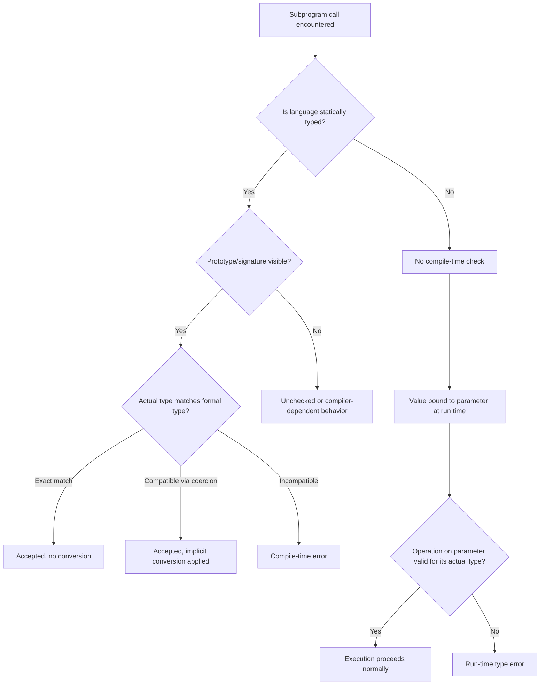

## Type Checking of Parameters

### Overview

Type checking of parameters is the process by which a language verifies that the arguments supplied in a subprogram call are compatible with the types of the corresponding formal parameters declared in the subprogram's definition. This check exists to prevent a common and dangerous class of errors: passing data of the wrong type or wrong size into a subprogram, which can lead to corrupted values, misinterpreted bit patterns, or memory corruption, depending on the language and its underlying implementation.

The strength and timing of this checking varies enormously across languages, and this variation is one of the clearest dividing lines in programming language design between "safe" and "unsafe" languages.

### Why Parameter Type Checking Matters

When a subprogram is called, actual parameters (the values or variables supplied by the caller) are bound to formal parameters (the names used inside the subprogram body). If the types of these do not match — or are not compatible in a way the language allows — several problems can arise:

- The subprogram may interpret the bit pattern of the actual parameter incorrectly (for example, treating a float's bit representation as an integer).
- Memory access may go out of bounds if a smaller structure is passed where a larger one is expected.
- Logic errors may occur silently if an implicit, unintended conversion happens (such as a float silently truncating to an int).

Strong type checking of parameters is one of the primary tools a language uses to catch these errors, ideally at compile time rather than at run time.

### Historical Context

Older languages such as the original (pre-ANSI) C and early FORTRAN performed **no compile-time parameter type checking** between separately compiled functions. A function could be called with the wrong number or types of arguments, and the compiler would not detect it — the mismatch would only manifest, if at all, as corrupted data or a crash during execution. This was a well-known and significant source of bugs.

The introduction of **function prototypes** in ANSI C (C89) was a direct response to this problem: by declaring a function's parameter types ahead of its use, the compiler could check calls against that declaration, even across separately compiled files. Every function in a program has a type that is derived from the types of its parameters and the type of its return value, and the concept of function prototypes was introduced into the C language to specify this type for a function whose definition appeared separately or later.

### What "Compatible" Means

Languages differ in how strictly they define type compatibility for parameter passing. There are generally three levels of strictness:

**1. Exact type match required**

The actual parameter's type must be identical to the formal parameter's declared type. No conversions are performed. This is the strictest form.

**2. Compatible types allowed (coercion permitted)**

The actual parameter's type may differ from the formal parameter's type, provided the language defines an implicit conversion (coercion) between them — for example, passing an `int` where a `double` is expected. The value is automatically converted.

**3. No compatibility checking (weak or absent typing)**

The language performs little or no checking, and the actual parameter is used essentially as-is, regardless of type mismatch. This is characteristic of older or low-level languages.

### Compile-Time Versus Run-Time Checking

Type checking of parameters can occur at two distinct times, and this distinction matters for both safety and performance:

- **Static (compile-time) checking**: The compiler verifies parameter types against the subprogram's declaration before the program ever runs. Errors are caught early, before deployment. This requires that the type information be available to the compiler at the call site, which is why forward declarations, headers, or module interfaces are often necessary.
- **Dynamic (run-time) checking**: The type check is deferred until the actual call occurs during execution. This is typical of dynamically typed languages, where a variable's type is not fixed until a value is assigned to it. If an incompatible type is passed, the error surfaces as a run-time exception rather than a compile-time diagnostic.

[Inference] Static checking generally offers stronger safety guarantees because it eliminates an entire category of errors before the program is ever run, but this comes at the cost of requiring more upfront type declarations and can reduce flexibility for genuinely polymorphic code.

### Language-by-Language Behavior

**Ada**

Ada enforces strict compile-time type checking of parameters. In Ada, subprogram parameters can be typed, and violations of the type compatibility rules are, of course, detected by the compiler. Ada additionally uses **strong typing with named (derived) types**, meaning that even two types with identical underlying representations (such as two different integer subtypes) are treated as distinct and incompatible unless explicitly converted. This is stricter than mere structural compatibility.

**C and C++**

Modern C (post-ANSI) and C++ perform compile-time parameter type checking whenever a function prototype is visible at the call site. Prototypes allow type checking of the parameters when a function is called, as well as return type checking, and function calls that do not correspond in number and type of parameters to a given function prototype are flagged as errors by the compiler.

However, this checking is contingent on the prototype being visible. If a function is called without a prior prototype or declaration in scope, older-style implicit behaviors or compiler-specific handling could bypass some checks — this is one reason modern C and C++ practice strongly discourages omitting prototypes. C also permits parameters of type `void *` in some cases, which effectively opts out of compile-time checking for that parameter, deferring safety to programmer discipline.

**Java, C#, and similar statically typed OOP languages**

These languages require strict compile-time parameter type checking as a core part of their type systems. Method signatures are matched exactly to argument types (accounting for defined widening conversions, such as `int` to `long`, and subtype polymorphism, such as passing a subclass instance where a superclass is expected). Overload resolution at compile time depends heavily on this type checking to determine which overloaded method to invoke.

**Python, Ruby, JavaScript, and other dynamically typed languages**

These languages generally do **not** perform compile-time parameter type checking, because variables are not statically typed — a parameter can be bound to a value of any type. Instead, type-related errors surface at run time, typically when an operation inside the subprogram body is attempted on a value of an incompatible type (a `TypeError` in Python, for instance). This is sometimes called **duck typing**: the parameter's suitability is judged by whether it supports the operations used on it, not by its declared type, since no such declaration exists.

[Inference] Optional static type-checking layers added on top of dynamically typed languages (such as type hints in Python checked by external tools like mypy, or TypeScript layered over JavaScript) exist specifically to reintroduce compile-time-style parameter checking without abandoning the base language's dynamic semantics.

**FORTRAN (pre-90 standards)**

Older FORTRAN standards had weak or nonexistent inter-procedural type checking, particularly for separately compiled subprograms, contributing to a long history of parameter-mismatch bugs in large FORTRAN codebases. Later standards (FORTRAN 90 and beyond) introduced explicit interface blocks that allow the compiler to check parameter types across program units.

### Type Checking and Polymorphic or Generic Parameters

Type checking becomes more nuanced when a language supports parametric polymorphism (generics/templates) or subtype polymorphism (inheritance-based substitution):

- With **generics/templates** (as in Java generics, C++ templates, or Ada generics), the type checking is deferred in a structured way: the subprogram is defined once with a type parameter, and the compiler checks each instantiation against the constraints of that type parameter. This preserves compile-time checking while allowing type flexibility.
- With **subtype polymorphism**, a formal parameter of type `Animal` may legally accept an actual parameter of type `Dog` if `Dog` is a subtype of `Animal`. The type check here is not for exact equality but for the "is-a" relationship, verified at compile time in statically typed languages via the class/interface hierarchy.

### Coercion Rules and Their Risks

Even in strongly typed languages, some implicit coercions are permitted for parameters, and these rules are a frequent source of subtle bugs:

- Widening conversions (e.g., `int` to `float`) are generally considered safe because they do not lose information (aside from potential precision issues in very large integers converted to floating point).
- Narrowing conversions (e.g., `double` to `int`) are often disallowed implicitly, requiring an explicit cast, precisely because they can silently lose information.

[Unverified] The exact set of implicit conversions allowed for parameter passing differs enough between language specifications and even between compiler versions or compilation modes that no single universal rule can be stated; this must be confirmed against the specific language standard in use.

### Visual Summary

The following diagram illustrates the decision path a language typically follows when checking a parameter at a call site.



### Illustrative Example

Consider a simplified comparison of the same logical function across a statically checked language and a dynamically typed one.

**Statically checked (Ada-style pseudocode)**



```
procedure Print_Total (Count : in Integer; Price : in Float) is
begin
   Put_Line(Integer'Image(Count) & " items at " & Float'Image(Price));
end Print_Total;

Print_Total(5, 9.99);      -- Accepted: types match
Print_Total(5, "9.99");    -- Rejected at compile time: String is not Float
```

**Dynamically checked (Python-style)**

```python
def print_total(count, price):
    print(f"{count} items at {price}")

print_total(5, 9.99)     # Runs fine
print_total(5, "9.99")   # Also runs — no type check occurs here at all,
                          # since the function body only uses string formatting
```

The Python example highlights an important nuance: even in a dynamically typed language, a type "error" only surfaces if the mismatched type causes an actual operational failure inside the subprogram body. If the body's operations happen to tolerate the actual type given, no error occurs at all — correct or not by the programmer's intent.

### Key Points

- Parameter type checking verifies that actual parameters supplied at a call site are compatible with the formal parameters declared by the subprogram.
- Checking can occur statically (compile time) or dynamically (run time), with static checking generally preventing more errors before deployment.
- Strongly typed languages like Ada enforce strict compile-time checks, including distinguishing between types with identical structure but different names.
- C and C++ rely on function prototypes to enable compile-time parameter checking across separately compiled code.
- Dynamically typed languages defer all type-related failures to run time and rely on duck typing rather than declared type compatibility.
- Coercion rules determine which type mismatches are silently resolved via conversion versus flagged as errors, and narrowing conversions are the most common source of risk.

### Related Topics

- Subprograms — Parameter passing modes (by value, by reference, by result)
- Subprograms — Overloading and signature matching
- Type systems — Strong versus weak typing
- Type systems — Static versus dynamic typing
- Generic subprograms and parametric polymorphism
- Subtype polymorphism and Liskov substitution in parameter binding
- Compile-time versus run-time error handling strategies