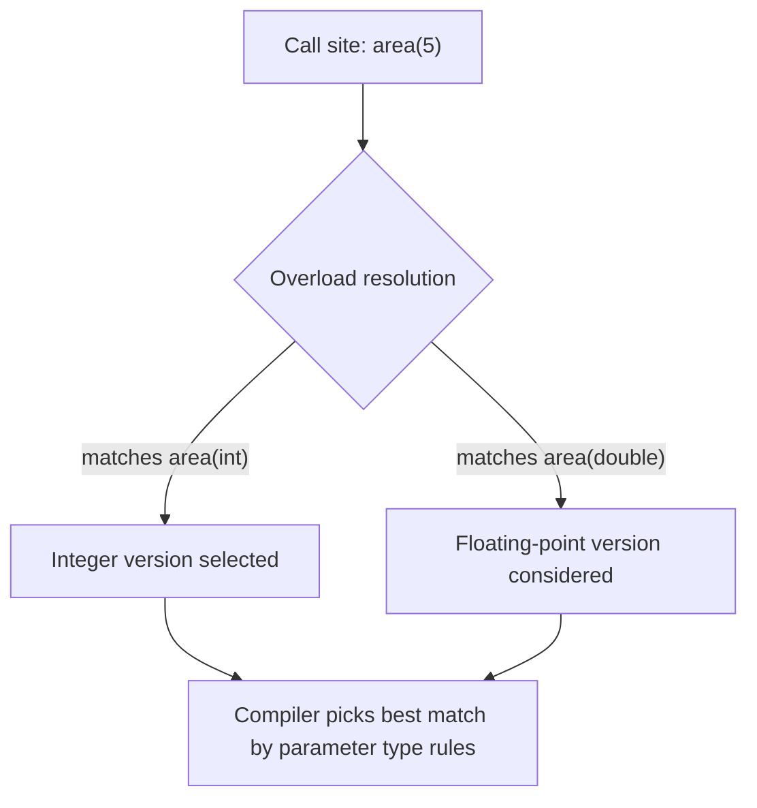

## Design Issues for Functions

### Overview

Designing functions (subprograms that return a value, as distinguished from procedures/subroutines that typically don't) requires language designers to resolve several interlocking questions: how parameters are passed, whether and how side effects are permitted, how the return value is specified and typed, whether functions can be used as parameters or return values themselves, and how closely functions must resemble mathematical functions. These design decisions shape the reliability, performance, and referential transparency of programs written in the language.

### Parameter Passing Methods for Functions

Functions face the same parameter-passing choices as procedures — pass-by-value, pass-by-reference, pass-by-result, pass-by-value-result, pass-by-name — but the choice interacts more directly with the question of side effects, discussed below.

- **Pass-by-value**: the callee receives a copy; changes made inside the function do not propagate to the caller's argument. This is the default in C, Java (for primitives and object references themselves, though not the referenced object's fields), and most functional languages.
- **Pass-by-reference**: the callee receives access to the caller's actual variable, so modifications are visible to the caller. C++ supports this via `&` reference parameters; Fortran traditionally passes everything by reference.
- **Pass-by-value-result** (copy-in/copy-out): a hybrid where the callee works on a local copy and the result is copied back to the caller's variable at the end. Ada supports this for `in out` parameters in some implementations.

[Inference] The choice matters more acutely for functions than procedures because a function's primary conceptual role is to *compute and return a value*, and allowing it to also mutate its arguments blurs that role — see side effects below.

### Should Functions Be Allowed Side Effects?

This is the central design tension for functions. A **pure function** — in the mathematical sense — depends only on its parameters and produces no observable effect other than its return value: no modification of parameters, no modification of global or nonlocal state, no I/O.

Allowing side effects in functions creates several concrete problems:

- **Order-of-evaluation dependence**: if `f(x)` and `g(x)` both modify a shared global variable, the expression `f(x) + g(x)` may produce different results depending on which function is evaluated first, and many languages leave this evaluation order unspecified.
- **Referential transparency loss**: an expression is referentially transparent if it can be replaced by its value without changing program behavior. Side-effecting functions break this, which complicates reasoning, optimization (e.g., common subexpression elimination becomes unsafe), and parallelization.
- **Aliasing through reference or global access**: if a function can modify a parameter passed by reference and that same variable is also accessible globally or via another alias, the function's effect on program state becomes harder to trace.

Language responses to this problem differ substantially:

- **C** places no restriction: functions can freely modify global variables and can modify caller data through pointer parameters.
- **Ada** allows parameter modes (`in`, `out`, `in out`) but conventionally restricts function parameters to mode `in` only, disallowing `out` or `in out` in function parameter lists in many contexts — pushing side effects toward procedures instead. [Inference: enforcement specifics vary by Ada version and are a matter of language-lawyer detail beyond the scope of a general overview.]
- **Pure functional languages** (Haskell being the paradigmatic example) forbid side effects in ordinary functions entirely; effects that must happen (I/O, mutation) are pushed into monadic types (e.g., `IO a`) that make the effect explicit in the type system, so a function's type signature reveals whether it can perform effects.
- **Functional-influenced languages with escape hatches** (Scala, F#, OCaml, Rust to varying degrees) default toward immutability and pure functions but allow explicit mutation and effects when the programmer opts in.

Diagram summarizing this design spectrum:

<svg xmlns="http://www.w3.org/2000/svg" viewBox="0 0 760 260">
  <text x="380" y="28" text-anchor="middle" font-size="18" font-weight="bold" fill="#1a1a1a">Side-Effect Permissiveness Spectrum (svg_diagram)</text>

  <line x1="60" y1="140" x2="700" y2="140" stroke="#333" stroke-width="2" />
  <polygon points="700,140 690,134 690,146" fill="#333" />

  <text x="60" y="165" font-size="12" text-anchor="middle" fill="#555">Fully Pure</text>
  <text x="700" y="165" font-size="12" text-anchor="middle" fill="#555">Unrestricted</text>

  <circle cx="110" cy="140" r="7" fill="#2ecc71" />
  <text x="110" y="115" text-anchor="middle" font-size="12">Haskell</text>
  <text x="110" y="190" text-anchor="middle" font-size="10" fill="#555">effects via</text>
  <text x="110" y="203" text-anchor="middle" font-size="10" fill="#555">IO monad type</text>

  <circle cx="260" cy="140" r="7" fill="#27ae60" />
  <text x="260" y="115" text-anchor="middle" font-size="12">OCaml / F#</text>
  <text x="260" y="190" text-anchor="middle" font-size="10" fill="#555">immutable by</text>
  <text x="260" y="203" text-anchor="middle" font-size="10" fill="#555">default, opt-in mutation</text>

  <circle cx="410" cy="140" r="7" fill="#f1c40f" />
  <text x="410" y="115" text-anchor="middle" font-size="12">Ada</text>
  <text x="410" y="190" text-anchor="middle" font-size="10" fill="#555">function params</text>
  <text x="410" y="203" text-anchor="middle" font-size="10" fill="#555">conventionally 'in' only</text>

  <circle cx="550" cy="140" r="7" fill="#e67e22" />
  <text x="550" y="115" text-anchor="middle" font-size="12">Java / C#</text>
  <text x="550" y="190" text-anchor="middle" font-size="10" fill="#555">globals/fields</text>
  <text x="550" y="203" text-anchor="middle" font-size="10" fill="#555">freely mutable</text>

  <circle cx="670" cy="140" r="7" fill="#c0392b" />
  <text x="670" y="115" text-anchor="middle" font-size="12">C</text>
  <text x="670" y="190" text-anchor="middle" font-size="10" fill="#555">no restrictions</text>
  <text x="670" y="203" text-anchor="middle" font-size="10" fill="#555">at all</text>

  <text x="380" y="240" text-anchor="middle" font-size="13" fill="#555">Position reflects how much the language/culture discourages functions from having side effects</text>
</svg>

### Number and Type of Return Values

Language designers must decide how many values a function may return and how the return type is specified.

- **Single return value** is the traditional model: C, Pascal, Java, and most C-family languages restrict a function to exactly one returned value, specified by a single return type in the signature.
- **Multiple return values** are supported natively in some languages either via true multiple-return syntax or via tuple-like sugar:
  - **Go** supports genuine multiple return values as a core language feature: `func divide(a, b int) (int, int, error)`.
  - **Python** simulates multiple returns via automatic tuple packing/unpacking: `def divmod2(a, b): return a // b, a % b`.
  - **C, Java, C#** (pre-tuple-syntax) require workarounds: output parameters (pass-by-reference), a struct/object wrapping multiple values, or (in C#) `System.Tuple`/`ValueTuple` and `out` parameters.

[Inference] The trend in more recently designed or actively evolving languages (Go, Python, Rust via tuples, Swift, modern C# with `ValueTuple`) has been toward first-class or near-first-class multiple return value support, reflecting a practical software-engineering preference for avoiding output-parameter workarounds. This is a design trend observation rather than a documented universal law.

### Return Type Determination: Static vs. Inferred

Some languages require an explicit return type declaration (C, Java, C#, Ada), while others allow or require the compiler to infer it from the function body:

```haskell
-- Haskell: type inferred, though it can be declared explicitly
square x = x * x
```

```rust
// Rust: return type must be declared explicitly in the signature,
// but the compiler infers types WITHIN the body
fn square(x: i32) -> i32 {
    x * x
}
```

```cpp
// C++14 and later: auto return type deduction from the function body
auto square(int x) {
    return x * x;
}
```

[Inference] Full return-type inference (as opposed to declared-signature-with-inferred-body, which is far more common) is largely confined to languages in or influenced by the Hindley-Milner type-inference tradition (ML family, Haskell, F#, OCaml), since whole-program or whole-function type inference of this kind requires a sufically expressive and decidable type system.

### Can Functions Return Functions? (Functions as First-Class Values)

A major design axis is whether functions are **first-class values** — whether a function can be:

1. Passed as an argument to another function (a higher-order function parameter)
2. Returned as the result of another function
3. Assigned to a variable
4. Stored in a data structure

Languages vary widely:

- **Full first-class support**: JavaScript, Python, Haskell, Scala, Ruby, modern C++ (via `std::function` and lambdas), and most functional and multi-paradigm scripting languages.
- **Partial support historically**: C supports function pointers, which allow functions to be passed and stored, but C has no closures — a function pointer cannot capture surrounding local state, limiting its expressiveness compared to a true closure.
- **Retrofitted support**: Java added lambda expressions and functional interfaces in Java 8; earlier Java required simulating first-class functions via objects implementing a single-method interface (the "functor object" or strategy pattern).

```javascript
// JavaScript: functions returning functions (closures) are idiomatic
function makeMultiplier(factor) {
    return function (x) {
        return x * factor;
    };
}
const triple = makeMultiplier(3);
```

This example also touches **closures**: `triple` retains access to `factor` even after `makeMultiplier` has returned, because the returned function captures its defining environment. Whether a language's functions support closures — capturing enclosing lexical scope by reference or by value — is itself a distinct and important design issue tied to first-class function support.

### Coercion and Implicit Type Conversion of Return Values

Some languages allow the returned expression's type to differ from the declared return type if an implicit conversion exists (C historically allows `int` to `double` coercion on return), while more strictly typed languages require an exact type match or explicit conversion. [Inference] Looser coercion rules reduce boilerplate at the cost of potentially masking programmer errors (e.g., accidentally returning an integer-divided value where a float was intended), a trade-off broadly consistent with each language's general philosophy on implicit conversions elsewhere in the type system.

### Recursive Functions and Reentrancy

A related design issue is whether a function can call itself, directly or indirectly (mutual recursion), and whether the runtime model supports this correctly. This generally requires:

- A stack-based (or equivalent) activation record model so each invocation gets its own local storage.
- No reliance on static/single shared storage for locals, which would corrupt state across recursive calls (an issue historically relevant to early Fortran, which lacked recursion support in earlier standards because subprogram locals were statically allocated).

[Unverified] Whether a specific older Fortran standard fully disallowed recursion versus merely not requiring compiler support for it is a standards-history detail that can vary by exact version and compiler.

### Functions vs. Procedures: Should the Distinction Exist at All?

Some languages maintain a hard syntactic distinction between functions (return a value, used in expressions) and procedures/subroutines (no return value, called as a statement) — Pascal, Ada, and Fortran are classic examples. Others unify the concept:

- **C-family unification**: C, C++, Java, C# treat "procedures" as functions with a `void` return type — there is only one syntactic category (the function/method), with `void` signaling "no meaningful return value."
- **Full unification with implicit return**: languages like Ruby and Rust treat every function as returning a value; a "procedure-like" function simply returns a trivial value (`nil` in Ruby, `()` — the unit type — in Rust) when nothing else is specified.

```rust
// Rust: a function with no explicit return returns the unit type ()
fn greet(name: &str) {
    println!("Hello, {name}");
} // implicitly returns ()
```

This design issue affects language uniformity: unifying functions and procedures reduces the number of core language constructs but can obscure, at a glance, whether a call is being made purely for its side effect or for its return value.

### Functions and Overloading

A further design issue is whether multiple functions may share the same name (**overloading**), differentiated by parameter type or count, and how the language resolves which overload applies at a call site.



Languages supporting overloading (C++, Java, C#, Ada) must define precise **overload resolution rules** — exact match preferred over promotion, promotion preferred over user-defined conversion, and so on — and must reject genuinely ambiguous calls at compile time. Languages without overloading (C, traditional Pascal) require distinct function names for each variant (`area_int`, `area_double`), trading conciseness for resolution simplicity.

### Design Issues Summary Table

| Design Issue | Key Question | Representative Approaches |
|---|---|---|
| Side effects | Can a function modify state beyond its return value? | Forbidden (Haskell) vs. unrestricted (C) |
| Parameter passing | By value, reference, or hybrid? | By-value default (Java, Python) vs. by-reference available (C++, Fortran) |
| Number of return values | One value or several? | Single (C, Java) vs. native multiple (Go, Python tuples) |
| Return type specification | Declared explicitly or inferred? | Explicit (C, Java) vs. inferred (Haskell, ML family) |
| First-class status | Can functions be passed/returned/stored? | Full (JavaScript, Python) vs. pointer-only (C) vs. retrofitted (Java 8+) |
| Closures | Can returned functions capture enclosing scope? | Yes (JavaScript, Python, Scala) vs. no true closures (C) |
| Function/procedure distinction | Separate categories or unified? | Separate (Pascal, Ada) vs. unified via void/unit (C, Rust) |
| Overloading | Can names be reused across signatures? | Supported (C++, Java) vs. unsupported (C) |
| Recursion | Can functions call themselves safely? | Stack-based activation records (most modern languages) |

### Key Points

- The most consequential and actively debated design issue for functions is whether side effects should be permitted, because this decision determines whether a language can guarantee referential transparency and predictable evaluation order.
- Parameter passing method interacts directly with the side-effect question: pass-by-reference parameters are a primary channel through which a function can affect caller state.
- Whether functions are first-class values (passable, returnable, storable) and whether they support closures are separate but related design issues that determine how naturally a language supports higher-order and functional programming styles.
- Many modern languages are trending toward unifying functions and procedures into a single construct and toward providing native multiple-return-value or tuple support, reducing historical workarounds like output parameters.

### Related Topics

- Parameter passing modes (by-value, by-reference, by-value-result, by-name)
- Closures and lexical scoping in nested functions
- Referential transparency and pure functional programming
- Higher-order functions and function composition
- Overload resolution algorithms
- Generic/polymorphic function design
- Activation records and the runtime call stack
- Tail-call optimization and recursion in functional languages