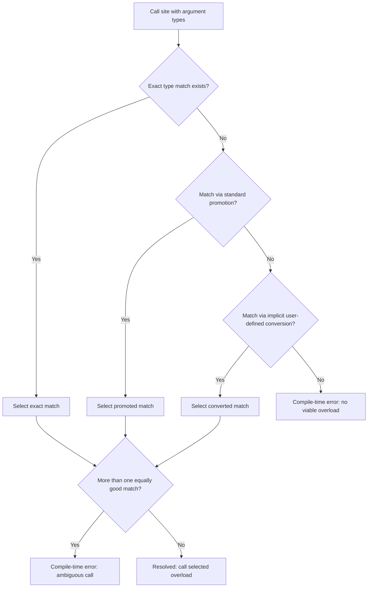

## Overloaded Subprograms

### Overview

An overloaded subprogram is a subprogram (procedure or function) that shares its name with one or more other subprograms in the same scope, distinguished from one another by the number, order, or types of their parameters. The language's compiler or interpreter resolves which specific version to invoke at each call site based on the arguments supplied — a process called **overload resolution**. This is distinct from generic/polymorphic subprograms, which use a single implementation across multiple types rather than multiple independent implementations.

### Motivation

Overloading exists primarily to let related operations share a conceptually unified name, so callers do not need to remember artificially distinct names for what is logically "the same operation" applied to different data:

```c
// Without overloading (C):
int add_int(int a, int b);
double add_double(double a, double b);

// With overloading (C++):
int add(int a, int b);
double add(double a, double b);
```

[Inference] This is primarily a readability and API-design convenience rather than a capability unavailable through other means, since any overloaded call can in principle be replaced by uniquely named functions plus manual dispatch logic — but overloading shifts that dispatch burden to the compiler.

### How Overload Resolution Works

At each call site, the compiler examines the number and types of arguments supplied and searches the set of subprograms sharing that name for the one whose parameter list matches. Most languages that support overloading use a tiered matching strategy, attempting a stricter match first and relaxing progressively:



This general shape — exact match, then promotion, then user-defined conversion, with ambiguity as an error at any tier — is common to C++ and, with language-specific variations, to Java, C#, and Ada. The precise rules for each tier (which conversions count as "promotions" versus "conversions," how ambiguity is defined) differ by language specification and are often among the more intricate corners of a language's formal semantics.

### What Can Distinguish Overloads

Languages differ on which aspects of a signature are permitted to vary across overloads of the same name.

- **Number of parameters (arity)**: nearly universally allowed where overloading exists at all.
  ```java
  void log(String msg) { }
  void log(String msg, int level) { }
  ```
- **Parameter types**: the most common basis for overloading.
  ```cpp
  void print(int x);
  void print(const std::string& x);
  ```
- **Parameter order**: some languages permit distinguishing overloads by the order of differing types, though this is comparatively rare as a deliberate design pattern and can create ambiguity risk.
- **Return type alone**: generally **not** sufficient to distinguish overloads in C++, Java, and C#, because overload resolution in these languages is based on the argument list at the call site, not on the expected/assigned return type — a call like `f(x);` with no use of the return value gives the compiler no information to disambiguate purely by return type. [Inference: this restriction follows from how call-site resolution is defined in these languages' specifications, since resolution must be determinable from the call expression itself in the general case.]

  ```java
  // Illegal in Java — differs only by return type, not allowed:
  int getValue() { return 1; }
  double getValue() { return 1.0; } // compile-time error: same erasure
  ```

- **Parameter names alone**: not sufficient in mainstream statically typed languages, since parameter names are not part of the type signature used for resolution (though some languages, like Swift, do incorporate argument labels into what effectively distinguishes call signatures — see the Swift subsection below).

### Overloading vs. Default Parameters

Overloading and default parameter values often serve overlapping purposes and can sometimes substitute for one another:

```cpp
// Overloading approach:
void greet();
void greet(std::string name);

// Default-parameter approach (also valid C++):
void greet(std::string name = "friend");
```

[Inference] Languages that support default parameter values (C++, Python, C#, Ada) reduce some of the practical need for arity-based overloading, since a single subprogram with defaults can cover cases that would otherwise require multiple overloaded signatures — though type-based overloading (distinguishing by parameter *type* rather than count) still requires true overloading, since default values don't let one parameter accept fundamentally different types without a variant/union mechanism.

### Language-by-Language Treatment

**C** does not support subprogram overloading at all in the traditional sense; each function name must be unique within its scope, which is why the C standard library uses distinctly named functions like `abs`, `labs`, and `fabs` for integer, long, and floating-point absolute value respectively, rather than a single overloaded `abs`.

**C++** supports extensive overloading, including operator overloading (allowing operators like `+` and `==` to be redefined per type) in addition to ordinary function overloading. C++ overload resolution is governed by a detailed ranking of conversion sequences (exact match, promotion, standard conversion, user-defined conversion, ellipsis match) and is widely regarded as one of the more complex areas of the language's specification.

```cpp
void area(int side);           // square, integer side
void area(double radius);      // circle, floating radius
void area(int base, int height); // triangle, two ints
```

**Java** supports overloading resolved at compile time based on static (declared) argument types, distinct from **overriding**, which is resolved at runtime based on the dynamic type of the receiving object in an inheritance hierarchy. Confusing overloading with overriding is a common source of subtle bugs, since a method call that looks like it should dispatch polymorphically may instead resolve statically if it's actually an overload rather than an override.

```java
class Printer {
    void print(Object o) { System.out.println("Object: " + o); }
    void print(String s) { System.out.println("String: " + s); }
}
```

Calling `print(someVariable)` where `someVariable` is statically declared as type `Object` but holds a `String` at runtime will invoke the `Object` overload, because Java resolves overloads using the *compile-time* declared type, not the runtime type — this is a frequently cited example of the overloading/overriding distinction.

**C#** supports overloading similarly to Java and C++, with its own detailed "better function member" resolution algorithm, and additionally supports **named and optional arguments**, which interact with overload resolution rules in ways the language specification addresses explicitly.

**Ada** supports overloading of both subprograms and operators, and additionally allows overloading to be resolved partly using the *expected result type* at the call site in some contexts (unlike C++/Java/C#), because Ada's overload resolution can take the surrounding expression context into account rather than being purely argument-driven. [Inference: this is a genuine and often-cited difference in Ada's resolution model, though exact scope of when result-type-based resolution applies is a language-lawyer-level detail.]

**Swift** incorporates **argument labels** as part of a function's effective signature, meaning two functions with identical parameter types but different external argument labels are considered distinct and do not "overload-collide":

```swift
func move(from start: Int, to end: Int) { }
func move(after start: Int, before end: Int) { }
```

Because the external labels (`from`/`to` versus `after`/`before`) differ, these are treated as distinguishable at the call site (`move(from:to:)` versus `move(after:before:)`), which is a design choice fairly specific to Swift compared to the C-family languages above.

**Python** does not support traditional compile-time overloading at all, since Python is dynamically typed and a later `def` with the same name simply rebinds the name, shadowing the earlier definition entirely:

```python
def greet(name):
    print(f"Hello, {name}")

def greet(name, greeting):   # This REPLACES the previous greet entirely
    print(f"{greeting}, {name}")

greet("Sam")  # TypeError: missing required argument 'greeting'
```

Python code that wants overload-like behavior typically uses default parameter values, `*args`/`**kwargs` for variable arity, manual `isinstance()` type-checking inside a single function body, or the `functools.singledispatch` decorator for type-based dispatch on the first argument — none of which is true compile-time overload resolution, since Python resolves everything at call time against a single function object.

**Haskell** does not support ad hoc overloading of ordinary function names in the C++/Java sense (a name in a given scope refers to one specific function). Instead, Haskell achieves overloading-like polymorphism through **type classes**, where a function like `(+)` is defined once per type via a class instance, and the compiler selects the appropriate instance based on the inferred type of the arguments — a related but structurally distinct mechanism from arity/type-signature overloading in C-family languages.

### Overload Resolution Pitfalls

- **Ambiguous calls from implicit conversions**: if a language allows implicit numeric conversions (e.g., `int` to `double`), a call with an argument of an intermediate type may match multiple overloads equally well, forcing a compile-time ambiguity error.
  ```cpp
  void f(int x);
  void f(long x);
  f(3.14f);  // float could convert to either int or long — potentially ambiguous depending on conversion ranking
  ```
- **Overloading combined with default parameters** can create ambiguity: a call that satisfies one overload's required parameters and another overload's parameters-with-defaults simultaneously may become genuinely ambiguous or may silently prefer one, depending on the language's specific tie-breaking rules.
- **Overloading combined with variadic or "catch-all" parameters** (e.g., C's varargs, C++'s ellipsis, or a generic `Object...` parameter in Java) can unintentionally "steal" calls that a more specific overload was intended to handle, since the catch-all may technically match many argument combinations. [Inference: the specific ranking that avoids this — treating ellipsis matches as lowest priority — is a documented rule in C++ overload resolution, though the general risk pattern also applies conceptually elsewhere.]
- **Confusing overloading with overriding** (Java, C#, C++ virtual functions): as noted above, a call that looks like it should dispatch based on runtime type may instead resolve statically at compile time if the methods in question are overloads rather than true overrides, since overload resolution and virtual dispatch are separate mechanisms operating at different times (compile time vs. runtime).

### Overloading and Type Inference Interaction

In languages with return-type polymorphism achieved through type classes or similar mechanisms (Haskell), or with generic type inference (C++ templates, Java generics), overload-like resolution can become entangled with the type inference algorithm itself, since the compiler may need to simultaneously infer type parameters and select among candidate overloads — a source of some of the more opaque compiler error messages in these languages when resolution fails. [Speculation: the specific claim that this interaction is a leading cause of "opaque" errors is a common practitioner observation rather than a formally measured or benchmarked fact.]

### Overloading vs. Generic (Parametric Polymorphic) Subprograms

It's worth distinguishing overloading from genericity, since both let one name apply across multiple types but via different mechanisms:

| Aspect | Overloading | Generic/Parametric Subprogram |
|---|---|---|
| Implementation | Multiple distinct implementations, one per signature | Single implementation, parameterized over a type variable |
| Resolution | Compiler picks among multiple concrete subprograms | Compiler instantiates or type-checks a single template/generic body |
| Type-specific logic allowed | Yes — each overload can do something entirely different | No — generic body must work uniformly for all permitted types (constrained by any type-class/interface bounds) |
| Example | `print(int)` vs. `print(String)`, doing different formatting | `<T> T identity(T x) { return x; }`, same logic for all `T` |

```java
// Overloading: different logic per type
void describe(int x) { System.out.println("int: " + x); }
void describe(String x) { System.out.println("string: " + x); }

// Generics: same logic, one type parameter
<T> void printTwice(T x) {
    System.out.println(x);
    System.out.println(x);
}
```

### Key Points

- Overload resolution is fundamentally a compile-time (or, in dynamically typed languages, effectively call-time-by-shadowing) process of matching call-site argument types against a set of candidate signatures.
- Return type alone is generally insufficient to distinguish overloads in mainstream statically typed languages, because resolution must be determinable from the call expression's arguments.
- Overloading must not be confused with overriding: overloading is resolved by static/declared types at compile time, while overriding is resolved by the dynamic type of the receiver at runtime — a distinction that frequently produces subtle bugs when conflated.
- Language support ranges from extensive and conversion-rank-based (C++), to compile-time-and-signature-based with clean separation from overriding semantics (Java, C#), to argument-label-based (Swift), to entirely absent in favor of type-class polymorphism (Haskell) or dynamic rebinding (Python).
- Overloading and generic/parametric subprograms both allow a name to apply across multiple types but are structurally different: overloading uses multiple distinct implementations, while genericity uses one implementation parameterized over a type.

### Related Topics

- Operator overloading and user-defined operators
- Overriding and dynamic (virtual) dispatch in object-oriented languages
- Generic and parametric polymorphism
- Default and optional parameter values
- Type coercion and implicit conversion rules
- Type classes (Haskell) as an alternative to ad hoc overloading
- Name mangling and how compilers encode overloaded signatures
- `functools.singledispatch` and dynamic-dispatch simulation in dynamically typed languages