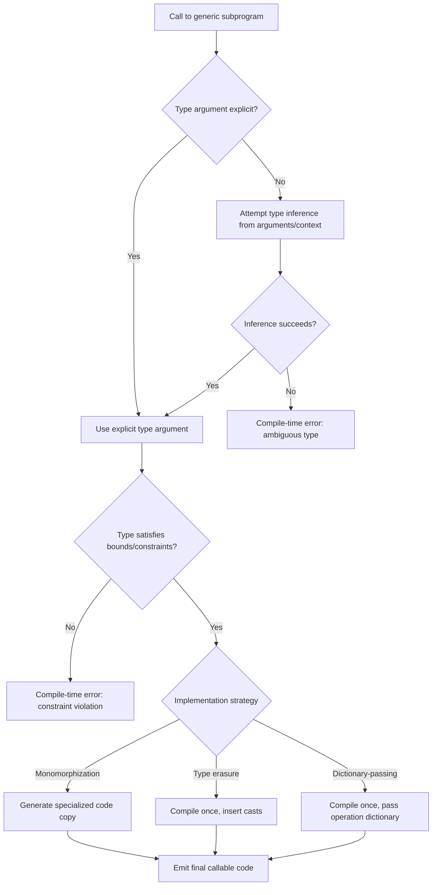

## Generic Subprograms and Parametric Polymorphism

### Definition and Core Concept

A generic subprogram is a procedure or function written to operate on values without committing to a single concrete type at the point of definition. Instead of hardcoding a type, the subprogram is parameterized over one or more type variables, and a concrete type is supplied — explicitly or by inference — when the subprogram is instantiated or called.

Parametric polymorphism is the underlying type-theoretic property this enables: a single piece of code can be applied uniformly to arguments of many types, with the code's behavior identical regardless of which type is substituted in. This distinguishes it sharply from other forms of polymorphism, covered below.

### Why Generic Subprograms Exist

Without parametric polymorphism, a language forces one of two unattractive choices for a function like "find the maximum of two values":

- Write a separate version for every type (`max_int`, `max_float`, `max_string`, ...), duplicating logic.
- Write against a single universal type (e.g., `Object` or `void*`), sacrificing compile-time type safety and often requiring runtime casts.

Generic subprograms give a third path: write the logic once, parameterize over the type, and let the compiler (or runtime) specialize it per use, preserving both code reuse and static type checking.

### Parametric Polymorphism vs Other Polymorphism Forms

**Key Points**

- **Parametric polymorphism**: one implementation works uniformly across all substituted types; the function has no knowledge of which type it will receive. Example: a generic `identity(x)` that returns `x` unchanged, for any type.
- **Ad-hoc polymorphism (overloading)**: multiple distinct implementations share a name, selected by the compiler based on argument types. Each implementation may behave completely differently.
- **Subtype polymorphism**: a function accepts any type that is a subtype of some base/interface type, and behavior varies through dynamic dispatch (virtual methods).
- **Overloading vs generics distinction**: overloading resolves to different code bodies per type; a generic subprogram is a single code body, type-erased or type-instantiated, that behaves identically regardless of type.

These forms are not mutually exclusive — many languages combine parametric polymorphism with ad-hoc polymorphism via **bounded quantification** (see below), or with subtype polymorphism via generic interfaces.

### Formal Basis: Universal Quantification

Parametric polymorphism corresponds, in type theory, to universal quantification over types. A generic identity function is typed as:

$$\text{identity} : \forall \alpha.\ \alpha \rightarrow \alpha$$

This reads as "for all types $\alpha$, `identity` takes an $\alpha$ and returns an $\alpha$." The type variable $\alpha$ is not fixed until instantiation, at which point $\alpha$ is substituted with a concrete type, e.g., $\alpha = \text{Int}$ yields $\text{Int} \rightarrow \text{Int}$.

This formalism originates in System F (the polymorphic lambda calculus), which underlies the type systems of ML-family languages, Haskell, and — with significant surface-level differences — Java and C#'s generics.

### Syntax Across Languages

**Example**



```
// Java
public static <T> T identity(T value) {
    return value;
}

// C#
public static T Identity<T>(T value) {
    return value;
}

// C++ (template)
template <typename T>
T identity(T value) {
    return value;
}

// Haskell (type inferred automatically as forall a. a -> a)
identity :: a -> a
identity x = x

// Rust
fn identity<T>(value: T) -> T {
    value
}

// TypeScript
function identity<T>(value: T): T {
    return value;
}
```

Across all of these, `T` (or `a`, or `α`) is a type parameter — a placeholder filled in at each call site.

### Instantiation: Explicit vs Inferred

A generic subprogram's type parameter can be supplied in two ways:

- **Explicit instantiation**: the caller states the type directly, e.g., `identity<int>(5)` in C# or `identity::<i32>(5)` in Rust.
- **Type inference**: the compiler deduces the type parameter from the argument or context, e.g., `identity(5)` infers `T = int` from the literal `5`.

Most mainstream languages default to inference and only require explicit instantiation when the compiler cannot resolve the type unambiguously (for instance, when the type parameter appears only in the return position with no argument to infer from).

### Implementation Strategies

**Key Points**

- **Monomorphization (C++ templates, Rust)**: the compiler generates a distinct specialized copy of the subprogram's machine code for each concrete type used at a call site. This produces code as efficient as hand-written type-specific versions, at the cost of larger binary size ("code bloat") and longer compile times.
- **Type erasure (Java generics)**: type parameters exist only during compilation for type-checking purposes; at runtime, the compiled bytecode operates on a single erased representation (typically `Object`), with compiler-inserted casts. This keeps binaries small and avoids recompilation per type, but loses type information at runtime (`instanceof List<String>` cannot be checked) and requires boxing for primitive types.
- **Uniform representation with dictionary-passing (Haskell typeclasses, ML functors in some implementations)**: a single compiled version of the function exists, and any type-specific operations (like an equality or ordering function) are passed implicitly as a "dictionary" of operations alongside the polymorphic value. This supports bounded polymorphism efficiently without full monomorphization.

[Inference] The choice among these strategies is generally driven by whether a language's primary goals favor runtime performance and static specialization (monomorphization) or compiled-code compactness and platform portability (erasure); actual compiler behavior varies by implementation and version.

### Bounded (Constrained) Parametric Polymorphism

Pure parametric polymorphism permits *no* operations on the generic type beyond those valid for all types (assignment, passing as argument, returning). Most practical generic code needs more — e.g., a generic `max` function needs comparison. **Bounded quantification** restricts the type parameter to types satisfying some interface or trait:



```
// Java: T must implement Comparable<T>
public static <T extends Comparable<T>> T max(T a, T b) {
    return a.compareTo(b) >= 0 ? a : b;
}

// Rust: T must implement the Ord trait
fn max<T: Ord>(a: T, b: T) -> T {
    if a >= b { a } else { b }
}

// Haskell: type class constraint
maxVal :: Ord a => a -> a -> a
maxVal a b = if a >= b then a else b
```

Formally, this changes the universal quantification from unrestricted $\forall \alpha$ to a bounded form $\forall \alpha \leq \tau$ (in subtyping-bound systems) or $\forall \alpha.\ C(\alpha) \Rightarrow \ldots$ (in typeclass/trait-constraint systems), where $C(\alpha)$ is a constraint the type must satisfy.

### Multiple Type Parameters and Higher-Kinded Generics

Generic subprograms may take more than one type parameter, and those parameters may themselves be generic:



```
// Two independent type parameters
function pair<A, B>(a: A, b: B): [A, B] {
    return [a, b];
}

// Higher-kinded: F is itself a type constructor (e.g., List, Option)
// This example is Scala-like pseudocode illustrating the concept
def mapGeneric[F[_], A, B](fa: F[A], f: A => B): F[B]
```

[Unverified] Not all mainstream languages support higher-kinded polymorphism directly; Java, C#, and C++ generics are first-order only, while Scala and Haskell support higher-kinded type parameters natively. Verify against the current language specification, since generics features are an active area of language evolution.

### Variance in Generic Subprograms

When generic subprograms accept or return parameterized types (e.g., a container type `List<T>`), variance rules govern whether `List<Dog>` can be used where `List<Animal>` is expected:

- **Covariant** (`out T` in C#, `+T` in Scala): safe when the generic type only produces/returns `T` values.
- **Contravariant** (`in T` in C#, `-T` in Scala): safe when the generic type only consumes `T` values (e.g., as a function parameter).
- **Invariant** (default in Java and most languages without explicit variance annotations): no subtyping relationship is assumed between `List<Dog>` and `List<Animal>`, avoiding the type-unsoundness that naive covariant mutable containers would introduce.

This matters directly for generic subprogram signatures: a generic method accepting `List<? extends Animal>` (Java wildcard, use-site covariance) can accept `List<Dog>`, whereas one accepting plain `List<Animal>` cannot.

### Control Flow of Generic Subprogram Resolution

The following diagram illustrates the compiler's typical decision path when processing a call to a generic subprogram.



### Parametric Polymorphism and the Parametricity Theorem

A theoretically significant property of pure parametric polymorphism (Reynolds' abstraction theorem, popularized as "theorems for free") is that a function's type signature alone can constrain its possible implementations. For $\text{identity} : \forall \alpha.\ \alpha \rightarrow \alpha$, parametricity guarantees the function *must* return its argument unchanged — it cannot inspect the value's type and branch on it, because it has no information about $\alpha$ beyond its existence.

This guarantee weakens or disappears once a language permits runtime type inspection (reflection, `typeof`, pattern matching on erased types), which several mainstream languages do allow, breaking strict parametricity in exchange for expressive power.

### Generic Subprograms vs Generic Classes/Types

**Key Points**

- A **generic subprogram** parameterizes an individual function or procedure; the type parameter's scope is that one subprogram.
- A **generic type** (class, struct, interface) parameterizes an entire data structure; all its methods share the same type parameter binding once instantiated.
- The two compose: a generic class can contain both generic and non-generic methods, and a non-generic class can contain a generic method (a method introducing its own additional type parameter distinct from the class's).



```
class Container<T> {
    private T value;

    // Non-generic method: reuses the class's T
    T get() { return value; }

    // Generic method: introduces its own type parameter U,
    // independent of the class's T
    <U> Pair<T, U> zipWith(U other) {
        return new Pair<>(value, other);
    }
}
```

### Illustration: Type Parameter Substitution

The diagram below shows the substitution process at instantiation for a generic swap subprogram.

<svg xmlns="http://www.w3.org/2000/svg" viewBox="0 0 700 320">
<text x="350" y="30" font-size="18" font-weight="bold" text-anchor="middle" fill="#1a1a1a">Generic Subprogram Instantiation (svg_diagram)</text>
<rect x="40" y="60" width="280" height="90" rx="8" fill="#eef2ff" stroke="#4f46e5" stroke-width="2" />
<text x="180" y="90" font-size="14" font-weight="bold" text-anchor="middle" fill="#1a1a1a">Generic Definition</text>
<text x="180" y="115" font-size="13" text-anchor="middle" font-family="monospace" fill="#333">swap&lt;T&gt;(a: T, b: T)</text>
<text x="180" y="135" font-size="12" text-anchor="middle" fill="#555">T is unbound type variable</text>
<rect x="420" y="60" width="240" height="90" rx="8" fill="#ecfdf5" stroke="#059669" stroke-width="2" />
<text x="540" y="90" font-size="14" font-weight="bold" text-anchor="middle" fill="#1a1a1a">Call Site</text>
<text x="540" y="115" font-size="13" text-anchor="middle" font-family="monospace" fill="#333">swap(1, 2)</text>
<text x="540" y="135" font-size="12" text-anchor="middle" fill="#555">arguments are Int</text>
<line x1="320" y1="105" x2="415" y2="105" stroke="#666" stroke-width="2" marker-end="url(#arrow1)" />
<text x="368" y="95" font-size="11" text-anchor="middle" fill="#666">infer T</text>
<line x1="540" y1="150" x2="540" y2="200" stroke="#666" stroke-width="2" marker-end="url(#arrow1)" />
<text x="590" y="180" font-size="11" text-anchor="middle" fill="#666">T := Int</text>
<rect x="380" y="210" width="320" height="90" rx="8" fill="#fef3c7" stroke="#d97706" stroke-width="2" />
<text x="540" y="240" font-size="14" font-weight="bold" text-anchor="middle" fill="#1a1a1a">Instantiated Version</text>
<text x="540" y="265" font-size="13" text-anchor="middle" font-family="monospace" fill="#333">swap(a: Int, b: Int)</text>
<text x="540" y="285" font-size="12" text-anchor="middle" fill="#555">T substituted throughout</text>
<line x1="180" y1="150" x2="180" y2="255" stroke="#666" stroke-width="2" />
<line x1="180" y1="255" x2="375" y2="255" stroke="#666" stroke-width="2" marker-end="url(#arrow1)" />
<text x="260" y="245" font-size="11" text-anchor="middle" fill="#666">substitute into body</text>
</svg>

### Interaction with Overload Resolution

In languages supporting both generics and overloading, resolution order matters: most languages prefer a more specific non-generic (or more tightly bounded generic) overload over a fully generic one when both are applicable, since the specific version is assumed to encode more precise, potentially more efficient behavior. [Inference] Exact tie-breaking rules (specificity ordering, arity preference) are language-specification-defined and differ in edge cases; consult the relevant language spec for precise resolution semantics in ambiguous cases.

### Constraints on Generic Code Bodies

Because a generic subprogram must compile successfully for *any* type satisfying its declared bounds, the operations permitted inside its body are restricted to exactly what the bounds guarantee:

- With no bounds: only universal operations (assignment, pass-by-value/reference, structural operations like tuple construction).
- With a bound like `Comparable<T>` or `Ord`: only the operations that interface/trait declares (`compareTo`, `<`, etc.).
- Attempting an operation not guaranteed by the bound (e.g., calling `.toUpperCase()` on an unbounded `T`) is a compile-time error, since some substituted type might not support it.

This is the practical, code-level consequence of the parametricity property discussed above.

### Common Pitfalls

**Key Points**

- **Primitive type overhead under erasure**: languages using erasure (Java) require boxing primitives (`int` → `Integer`) to fit the erased representation, incurring allocation and unboxing overhead absent from monomorphized code.
- **Code bloat under monomorphization**: heavy generic use in C++/Rust across many distinct types can significantly increase binary size, since each instantiation duplicates the specialized machine code.
- **Over-constraining bounds**: adding unnecessary trait/interface bounds reduces a generic subprogram's applicability without benefit; bounds should be minimal — only what the implementation body actually requires.
- **Confusing generics with dynamic typing**: a generic subprogram is still statically type-checked per instantiation; it differs from dynamically-typed "duck typing" in that violations of type constraints are caught at compile time, not at runtime.
- **Variance mistakes**: assuming covariant subtyping applies to mutable generic containers by default can introduce type-unsoundness; this is why most statically-typed languages default generic type parameters to invariant unless variance is explicitly annotated.

### Conclusion

Generic subprograms operationalize parametric polymorphism by allowing a single subprogram definition to be safely and efficiently reused across many types. The concept rests on universal quantification over types, is realized through compiler strategies like monomorphization, type erasure, or dictionary-passing, and is made practically useful through bounded quantification that permits type-specific operations while preserving compile-time safety. The parametricity property gives pure generic code strong correctness guarantees, at the cost of restricting what a generic body can do internally to only what its bounds explicitly permit.

### Related Topics

- Ad-hoc polymorphism and function/operator overloading resolution
- Subtype polymorphism and dynamic dispatch mechanisms
- Type classes (Haskell) vs traits (Rust) vs interfaces (Java/C#) as bounding mechanisms
- Existential types and their relationship to generics
- Higher-kinded types and higher-rank polymorphism
- Variance annotations (covariance, contravariance) in generic type systems
- Monomorphization cost analysis and compile-time/binary-size trade-offs
- Reynolds' parametricity theorem and "theorems for free"
- Generic constraints via associated types (Rust) vs multi-parameter type classes (Haskell)
- Template metaprogramming as an extension of C++ generics