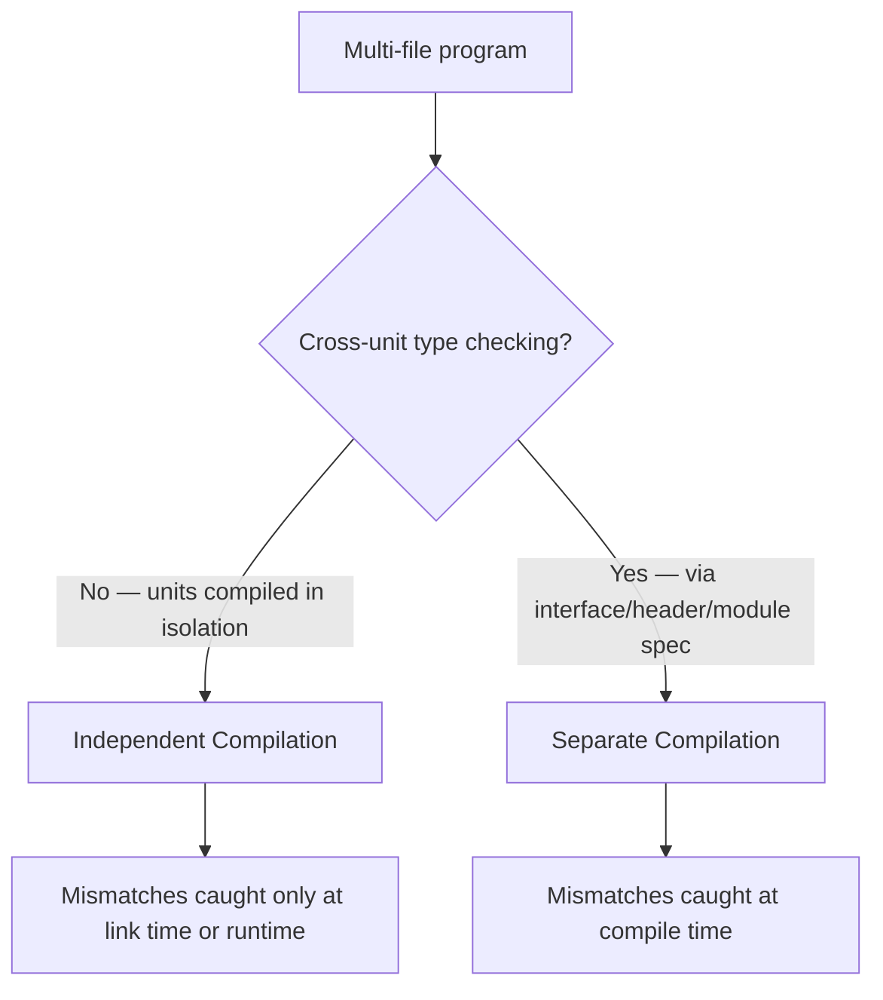

## Separate and Independent Compilation

### Overview

Separate compilation and independent compilation are two related but distinct mechanisms that let a program's source code be divided into multiple files (compilation units) and compiled one at a time rather than requiring the entire program to be compiled as a single unit. The distinction between the two turns on whether the compiler checks type consistency *across* compilation unit boundaries.

### Defining the Two Terms

- **Independent compilation**: each compilation unit is compiled with no knowledge of, and no type checking against, other units. The compiler processes one file in isolation and has no mechanism to verify that a function called from another file matches the signature declared where it's defined. Type mismatches across units are not caught until link time (if at all) or, worse, manifest only as runtime corruption.
- **Separate compilation**: each compilation unit can still be compiled on its own, but the language provides a mechanism — typically an interface file, header, or module specification — that lets the compiler check type consistency across unit boundaries, even though the units are compiled at different times and possibly by different invocations of the compiler.



[Inference] The terminology itself ("independent" vs. "separate") is not universally applied with perfect consistency across every textbook and language community, but the underlying distinction — whether cross-unit type checking occurs — is the substantive point most language-design references agree on.

### Why This Distinction Matters

Without any form of separate or independent compilation, an entire program must be recompiled as a single monolithic unit every time any part of it changes, which becomes impractical as program size grows: compilation time scales with total program size rather than with the size of the changed portion. Both mechanisms solve the "must recompile everything" problem, but only separate compilation additionally solves the "how do we catch cross-file type errors before runtime" problem.

The practical cost of independent compilation without cross-checking is that a common class of bugs — declaring a function one way in the file that defines it and calling it inconsistently from another file — goes undetected by the compiler and can produce undefined behavior, since the linker generally matches symbols by name only, not by full type signature. [Inference: the specific runtime consequences (crash, silent corruption, or apparent success) are implementation- and platform-dependent, so this is described qualitatively rather than as a universal guarantee.]

### C: The Canonical Independent Compilation Example

C is frequently cited as a language with fundamentally independent compilation at the language-specification level, because the C compiler, in the general case, compiles each `.c` file without inherent knowledge of other `.c` files' contents. The header-file (`.h`) mechanism is a *convention*, not a compiler-enforced guarantee: headers are copy-pasted via textual `#include` and rely entirely on programmer discipline to keep declarations consistent with definitions.

```c
/* file: mathutils.h */
int compute(int x, int y);

/* file: mathutils.c */
int compute(int x, int y) {
    return x + y;
}

/* file: main.c — if this header is NOT included or is inconsistent: */
extern double compute(double x, double y);  /* mismatched signature */
int result = compute(3, 4);  /* undefined behavior at link/runtime, not caught at compile time in general */
```

If `main.c` fails to `#include "mathutils.h"` (or includes an inconsistent declaration), the C compiler has no mechanism, in general, to detect the mismatch when compiling `main.c` in isolation, since it processes `main.c`'s textual content alone. [Unverified: whether a specific modern compiler-and-linker combination might catch some such mismatches via optional stricter linking flags or LTO diagnostics is implementation- and toolchain-specific, and shouldn't be read as a guarantee of the base C model.] The header convention substantially mitigates this risk in disciplined codebases, but the mitigation is a matter of programmer/build-system convention layered on top of the language, not a language-enforced guarantee, which is why C is generally classified as independent rather than separate compilation.

### Ada: The Canonical Separate Compilation Example

Ada was explicitly designed to support separate compilation with full cross-unit type checking, motivated substantially by large-scale, safety-critical software engineering concerns. An Ada package is split into a **specification** (visible interface) and a **body** (implementation), and the specification can be compiled and checked independently, with the compiler retaining enough information to verify that any unit depending on the package uses it consistently.

```ada
-- package specification (mathutils.ads)
package MathUtils is
   function Compute(X, Y : Integer) return Integer;
end MathUtils;

-- package body (mathutils.adb)
package body MathUtils is
   function Compute(X, Y : Integer) return Integer is
   begin
      return X + Y;
   end Compute;
end MathUtils;

-- consuming unit
with MathUtils;
procedure Main is
   Result : Integer;
begin
   Result := MathUtils.Compute(3, 4);  -- compiler verifies signature against the spec
end Main;
```

The Ada compiler maintains a library of compiled unit information (specification data) so that when `Main` is compiled, the call to `MathUtils.Compute` is checked against the actual declared specification, catching type mismatches, arity mismatches, or missing units at compile time rather than deferring the error to link time or runtime.

### Java: Separate Compilation via the Class File and Classpath Model

Java achieves separate compilation because each compiled `.class` file retains full type signature information (method signatures, field types) as part of its bytecode metadata. When compiling a file that references another class, `javac` consults the referenced class's compiled `.class` file (or source, if compiling together) to verify method signatures, producing a compile-time error for mismatches rather than deferring to runtime — although Java additionally performs some verification at class-loading time as a defense against stale or tampered `.class` files, since compilation and execution can be separated in time and across environments.

### C++: A Hybrid, Historically Closer to C's Model

C++ inherits C's textual `#include` header mechanism and, in its traditional model, is generally regarded as closer to independent compilation in the same sense as C — headers are a convention enforced by programmer discipline and the "One Definition Rule" (ODR), and violations of the ODR across translation units are frequently *not* diagnosed at compile time, since each translation unit is still processed largely in isolation. Mismatched declarations across translation units can produce undefined behavior undetected until, at best, a linker error (if signatures differ enough to produce different mangled names) or, at worst, silent runtime misbehavior (if the mismatch doesn't affect mangling but does affect actual layout or semantics).

C++20 introduced **modules** as a language feature specifically intended to address this gap, providing a compiler-checked interface mechanism conceptually similar in spirit to Ada's package specifications, replacing textual header inclusion with a compiled module interface that the compiler can consult directly. [Inference: describing C++20 modules as addressing "the same problem class" that separate compilation in Ada solves is a reasonable characterization of the design motivation, though the specific adoption maturity and toolchain support for modules varies and is a fast-moving, implementation-dependent area better verified against current compiler documentation than treated as settled here.]

### Comparative Table

| Language | Model | Mechanism for cross-unit consistency | Detected at |
|---|---|---|---|
| C | Independent (by convention only) | `#include` header convention, not compiler-enforced | Link time or runtime, in general |
| C++ (pre-modules) | Independent (by convention, ODR relies on discipline) | `#include` header convention + ODR | Link time or runtime, in general |
| C++20 (modules) | Separate | Compiled module interface | Compile time |
| Ada | Separate | Package specification + compiled library units | Compile time |
| Java | Separate | Bytecode signature metadata in `.class` files | Compile time (plus runtime class-loading verification) |
| C# | Separate | Compiled assembly metadata (similar in spirit to Java) | Compile time |
| Rust | Separate | Crate metadata / compiled `.rlib` interface information | Compile time |

[Inference] Rust and C# are included based on their general architectural approach of embedding rich interface metadata in compiled artifacts (crates and assemblies respectively), which is the same structural pattern that makes Java's and Ada's models "separate" rather than "independent" — this is a reasonable extrapolation from that shared architecture rather than a claim verified against each language's formal specification here.

### Build System and Practical Implications

- **Independent compilation** places the burden of consistency on external tooling and human discipline: header discipline, `-Wall`/strict warning flags, static analyzers, or link-time optimization diagnostics in C/C++ toolchains act as partial mitigations layered on top of what the base language guarantees.
- **Separate compilation** shifts that burden into the compiler and its unit-library bookkeeping, generally at the cost of requiring compiled artifacts (module interface files, `.class` files, package library files) to be regenerated and kept consistent with their sources — a dependency-tracking problem that build systems (Make, Maven, Cargo, `gprbuild` for Ada) are designed to manage.
- Both models support **incremental compilation** (recompiling only changed units), but only separate compilation additionally gives strong compile-time guarantees about cross-unit consistency without relying on the linker or runtime to catch mismatches.

Diagram contrasting the two compilation flows:

<svg xmlns="http://www.w3.org/2000/svg" viewBox="0 0 780 320">
  <text x="390" y="26" text-anchor="middle" font-size="18" font-weight="bold" fill="#1a1a1a">Independent vs. Separate Compilation Flow (svg_diagram)</text>

  <text x="195" y="55" text-anchor="middle" font-size="14" font-weight="bold" fill="#2c3e50">Independent Compilation (e.g., C)</text>
  <rect x="40" y="70" width="120" height="40" rx="4" fill="#ecf0f1" stroke="#333" />
  <text x="100" y="94" text-anchor="middle" font-size="11">main.c</text>
  <rect x="220" y="70" width="120" height="40" rx="4" fill="#ecf0f1" stroke="#333" />
  <text x="280" y="94" text-anchor="middle" font-size="11">mathutils.c</text>

  <rect x="40" y="130" width="120" height="34" rx="4" fill="#3498db" fill-opacity="0.2" stroke="#333" />
  <text x="100" y="151" text-anchor="middle" font-size="10">compiled alone</text>
  <rect x="220" y="130" width="120" height="34" rx="4" fill="#3498db" fill-opacity="0.2" stroke="#333" />
  <text x="280" y="151" text-anchor="middle" font-size="10">compiled alone</text>

  <line x1="100" y1="110" x2="100" y2="130" stroke="#333" stroke-width="1.5" />
  <line x1="280" y1="110" x2="280" y2="130" stroke="#333" stroke-width="1.5" />

  <line x1="100" y1="164" x2="190" y2="200" stroke="#c0392b" stroke-width="1.5" />
  <line x1="280" y1="164" x2="190" y2="200" stroke="#c0392b" stroke-width="1.5" />
  <rect x="130" y="200" width="120" height="34" rx="4" fill="#e74c3c" fill-opacity="0.15" stroke="#c0392b" />
  <text x="190" y="221" text-anchor="middle" font-size="10" fill="#c0392b">Linker: name match only</text>
  <text x="190" y="250" text-anchor="middle" font-size="10" fill="#c0392b">No cross-file type check</text>

  <text x="585" y="55" text-anchor="middle" font-size="14" font-weight="bold" fill="#2c3e50">Separate Compilation (e.g., Ada, Java)</text>
  <rect x="440" y="70" width="120" height="40" rx="4" fill="#ecf0f1" stroke="#333" />
  <text x="500" y="94" text-anchor="middle" font-size="11">Main unit</text>
  <rect x="620" y="70" width="120" height="40" rx="4" fill="#ecf0f1" stroke="#333" />
  <text x="680" y="94" text-anchor="middle" font-size="11">Package spec</text>

  <line x1="560" y1="90" x2="620" y2="90" stroke="#27ae60" stroke-width="1.5" marker-end="url(#arrow2)" />
  <text x="590" y="82" text-anchor="middle" font-size="9" fill="#27ae60">checked against</text>

  <rect x="530" y="130" width="120" height="34" rx="4" fill="#2ecc71" fill-opacity="0.2" stroke="#333" />
  <text x="590" y="151" text-anchor="middle" font-size="10">Compile-time check passes</text>

  <line x1="500" y1="110" x2="560" y2="130" stroke="#333" stroke-width="1.5" />
  <line x1="680" y1="110" x2="620" y2="130" stroke="#333" stroke-width="1.5" />

  <text x="590" y="290" text-anchor="middle" font-size="12" fill="#555">Compiled unit library retains interface data for cross-checking</text>
</svg>

### Modules as the Modern Convergence Point

Many contemporary language designs — Rust's crate/module system, C++20 modules, Java's earlier class-file model, and Python's import-with-`.pyi`-stub-checking-via-external-type-checkers (e.g., mypy) — converge on the same underlying idea: compile a unit once, produce or retain enough structured interface metadata, and let subsequent compilations of dependent units consult that metadata rather than re-parsing or blindly trusting textual declarations. [Inference] This convergence suggests that separate compilation with cross-unit checking, rather than independent compilation relying on convention, has become the generally preferred approach in newer or actively evolving language designs — though this is an observed trend rather than a strict rule, since C continues to be widely used in its traditionally independent-compilation form and Python's static type-checking is optional and external to the core language runtime.

### Key Points

- The defining distinction is whether the compiler checks type consistency *across* compilation unit boundaries: independent compilation does not; separate compilation does, via some interface or metadata mechanism.
- C, and C++ prior to modules, are the canonical examples of independent compilation, where header-file discipline is a convention rather than a compiler-enforced guarantee, leaving cross-file mismatches to surface at link time or, worse, at runtime.
- Ada is the canonical example of separate compilation by explicit design, using package specifications and a compiled unit library so the compiler can verify cross-unit consistency.
- Java, C#, and Rust achieve separate compilation by embedding rich interface metadata (signatures, types) in their compiled artifacts (`.class` files, assemblies, crate metadata), which dependent compilations consult directly.
- Both independent and separate compilation solve the "avoid recompiling the whole program" problem; only separate compilation additionally solves the "catch cross-file type errors at compile time" problem.

### Related Topics

- Header files, the One Definition Rule, and C/C++ translation units
- Ada package specifications and bodies
- C++20 modules and their relationship to traditional headers
- Linkers, symbol tables, and name mangling
- Incremental compilation and build system dependency tracking
- Static type checkers as external separate-compilation-like tools (e.g., mypy for Python)
- Java bytecode verification and classloading
- Whole-program vs. modular compilation trade-offs for optimization (e.g., link-time optimization)