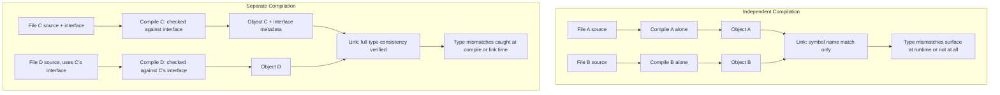

## Separate and Independent Compilation

### Definition and Core Distinction

Separate compilation and independent compilation are two related but distinct approaches to building a program from multiple source files, differing in how much a compiler checks about cross-file dependencies at compile time.

- **Separate compilation**: source files are compiled individually, but the compiler enforces type-consistency checks across file boundaries, typically via interface information (headers, module interfaces, or symbol tables) shared between compilation units. Inconsistencies between a subprogram's declaration and its use elsewhere are caught either at compile time or link time.
- **Independent compilation**: source files are compiled individually with no cross-file consistency checking at all. Each file is compiled as if it were the entire program, and any mismatches (e.g., calling a function with the wrong argument types) are not caught by the compiler — they may surface only as runtime errors, incorrect behavior, or not at all.

The core difference: separate compilation preserves whole-program type safety across the module boundary despite compiling in pieces; independent compilation drops that safety in exchange for a simpler compilation model.

### Motivation

**Key Points**

- **Compilation time**: recompiling millions of lines of source on every change is infeasible for large systems. Compiling only changed files (and relinking) shrinks build times drastically.
- **Modularity and team scaling**: separate compilation units allow independent teams to develop, compile, and test different parts of a system without the full source of the whole system.
- **Encapsulation**: a compiled unit can expose only an interface (declarations) while hiding its implementation (definitions), supporting information hiding at the build level, not just the language-semantic level.
- **Incremental builds and distribution**: precompiled libraries can be distributed as object code without exposing source, and consumers link against them without recompiling the library itself.

### Historical Context

**Key Points**

- Early languages such as original FORTRAN supported only independent compilation — subprograms compiled with no cross-unit checking, reflecting more limited compiler and linker technology of the era. [Unverified] Exact behavior varies by specific FORTRAN standard revision and compiler implementation; consult the relevant standard for precise guarantees.
- C historically leaned toward independent compilation in practice: the preprocessor-based `#include` mechanism shares declarations textually, but the language does not mandate strict type-checking across translation units beyond what the linker's symbol resolution catches (which is largely name- and size/arity-based, not full type-based, for external linkage in older implementations).
- Ada was explicitly designed to enforce true separate compilation: compilation units carry explicit interface (package specification) versus implementation (package body) distinctions, and the compiler tracks dependency and consistency information across units to guarantee type-safe linking.
- Modern languages (Java, C#, Rust, Go) generally adopt strict separate-compilation models with strong cross-unit type checking, reflecting a broader trend toward eliminating independent-compilation-style gaps.

### The C Model: Header Files and Translation Units

C organizes independent/separate compilation using headers to communicate declarations between translation units.



```
// point.h -- interface (declarations only)
#ifndef POINT_H
#define POINT_H

typedef struct {
    double x;
    double y;
} Point;

double distance(Point a, Point b);

#endif

// point.c -- implementation (this file's translation unit)
#include "point.h"
#include <math.h>

double distance(Point a, Point b) {
    double dx = a.x - b.x;
    double dy = a.y - b.y;
    return sqrt(dx * dx + dy * dy);
}

// main.c -- consumer (a separate translation unit)
#include "point.h"
#include <stdio.h>

int main(void) {
    Point p1 = {0.0, 0.0};
    Point p2 = {3.0, 4.0};
    printf("%f\n", distance(p1, p2));
    return 0;
}
```

Each `.c` file compiles into a separate object file (`point.o`, `main.o`); the linker then resolves the `distance` symbol reference in `main.o` against its definition in `point.o`. The header's role is purely textual inclusion — the compiler re-parses the declaration in every file that includes it, and nothing prevents `point.h` and `point.c` from silently diverging if a programmer edits one without the other (e.g., changing `distance`'s signature in the `.c` file but not the `.h` file), since the linker's cross-check is limited to symbol name and, in many toolchains, does not perform full argument-type verification for functions with C linkage.

This is why C is often described as supporting independent compilation in practice, despite having compile-time declaration mechanisms that resemble separate compilation.

### The Ada Model: Explicit Compilation Units

Ada enforces genuine separate compilation via distinct specification and body units, with the compiler maintaining a library of compiled unit interfaces used to check consistency across compilations.



```
-- point.ads -- package specification (interface)
package Point_Pkg is
   type Point is record
      X, Y : Float;
   end record;

   function Distance (A, B : Point) return Float;
end Point_Pkg;

-- point.adb -- package body (implementation)
package body Point_Pkg is
   function Distance (A, B : Point) return Float is
   begin
      return Sqrt((A.X - B.X) ** 2 + (A.Y - B.Y) ** 2);
   end Distance;
end Point_Pkg;

-- main.adb -- consumer
with Point_Pkg; use Point_Pkg;
with Ada.Text_IO; use Ada.Text_IO;

procedure Main is
   P1 : Point := (X => 0.0, Y => 0.0);
   P2 : Point := (X => 3.0, Y => 4.0);
begin
   Put_Line(Float'Image(Distance(P1, P2)));
end Main;
```

If `point.adb`'s `Distance` signature does not match the specification declared in `point.ads`, the compiler rejects the body at compile time — before `main.adb` is even compiled. If `main.adb` is compiled against a stale or mismatched version of `Point_Pkg`, Ada's compilation-order and consistency-checking rules (tracked via compiler-maintained library information) catch the mismatch, rather than deferring the error to link time or runtime.

### Comparison Diagram



### Consequences for Type Safety

**Key Points**

- Under independent compilation, a program can compile and link successfully while containing a **type error across the module boundary** — for example, calling a function with the wrong number or type of arguments if the declaration seen by the caller does not match the actual definition. This is a well-known class of bug in older C codebases, historically mitigated (not eliminated) by disciplined header usage and, later, by compiler warnings and static analyzers.
- Under separate compilation, the compiler (or a combination of compiler and linker acting on richer symbol/type metadata) guarantees that if all units compile and link successfully, cross-unit calls are type-consistent — the same soundness guarantee as if the whole program had been compiled as one unit.
- This makes separate compilation a precondition for strong whole-program type safety in a multi-file build, while independent compilation trades that guarantee for a simpler (often older) toolchain design.

### Modern Language Approaches

**Key Points**

- **Java**: `.java` source files compile to `.class` bytecode files; the compiler and, redundantly, the JVM's class-loading/verification step both check type consistency across class boundaries, giving strong separate-compilation guarantees plus a runtime safety net.
- **C#**: assemblies carry rich metadata (via the Common Language Infrastructure) describing every public type and member; the compiler checks cross-assembly usage against this metadata, and cross-module type mismatches are compile-time errors.
- **Rust**: crates are the unit of separate compilation; the compiler's metadata format (rmeta) exposes a crate's public interface to dependent crates, and Rust's strict type system plus lack of implicit conversions make cross-crate type errors compile-time failures.
- **Go**: packages compile separately with the compiler generating export data describing each package's public API; consuming packages are checked against this export data, giving separate-compilation guarantees without header files.
- **Module systems (C++20 modules, ML functors/signatures, Haskell modules)**: represent an evolution toward first-class module interfaces, reducing reliance on textual header inclusion (in C++'s case) while providing separate-compilation-style guarantees.

### Interface vs Implementation Separation

A recurring structural pattern across languages with true separate compilation is the explicit division between:

- **Interface (specification)**: what a unit exposes to the rest of the program — type signatures, public declarations, exported names.
- **Implementation (body)**: how the unit's behavior is actually realized — private details, algorithm bodies, internal state.

This division is the mechanism that makes separate compilation practical: a consuming unit only needs the interface to be compiled and type-checked; it does not need — and in encapsulated designs should not have access to — the implementation. This is expressed differently per language:

| Language | Interface Artifact | Implementation Artifact |
| --- | --- | --- |
| Ada | package specification (`.ads`) | package body (`.adb`) |
| C (by convention) | header file (`.h`) | source file (`.c`) |
| Modula-2 | definition module | implementation module |
| Java | public class members / interfaces | method bodies |
| Rust | public items + crate metadata | private items, function bodies |
| OCaml | `.mli` signature file | `.ml` implementation file |

### Recompilation and Dependency Tracking

**Key Points**

- A key practical benefit of true separate compilation is precise **incremental recompilation**: since the compiler tracks which units depend on which interfaces, a build system can determine exactly which units must be recompiled after a change (any unit whose depended-upon interface changed) and which can be safely skipped (unchanged interfaces, even if depended upon).
- Under weaker independent-compilation models relying on textual inclusion (C/C++ headers), build systems often must conservatively recompile more than strictly necessary, since header content is copy-pasted into every including file and the build system typically cannot verify a header change didn't semantically affect other includers without recompiling and checking.
- [Inference] Languages designed later, with module systems built from the start (Ada, Java, Rust, Go), generally afford finer-grained dependency tracking than languages that added stricter interface separation onto a pre-existing textual-inclusion model (C, and C++ prior to modules); actual incremental-build performance is toolchain- and configuration-dependent.

### Linker's Role

The linker's participation differs meaningfully between the two models:

- **Independent compilation (weak-typed linking)**: the linker resolves symbols primarily by name (and sometimes by size or calling-convention metadata), without verifying full type signatures match between a symbol's use and its definition. This is characteristic of classic C/C++ linkers operating on object files without rich type-carrying debug/metadata sections being consulted for correctness.
- **Separate compilation (type-consistent linking)**: either the compiler front-end performs all cross-unit type checking before object files are even produced (common in Ada, Rust, Go, where compilation of a dependent unit requires access to the dependency's interface metadata, not just its compiled object code), or the linking step itself is type-aware (as in strongly-typed bytecode/IL systems like the JVM and CLR, where verification happens partly at class-load/assembly-load time).

### Practical Trade-offs

**Key Points**

- **Build speed vs safety guarantee strength**: independent compilation's simplicity (no cross-file interface database to maintain) can make toolchains simpler to implement, but shifts error detection later (link time, runtime, or never) and to the programmer's discipline.
- **Header duplication problem (C/C++ specific)**: because headers are textually included, the same declarations are re-parsed by every including translation unit, contributing to slow compile times in large C++ codebases — a problem C++20 modules were designed specifically to address.
- **Distribution of precompiled libraries**: separate compilation with well-defined interface metadata (Rust's `.rlib`, Java's `.jar`/`.class`, .NET assemblies) enables safe distribution of precompiled dependencies with compile-time-checked APIs, something weaker independent-compilation models support less robustly.
- **Whole-program optimization tension**: separate compilation, by design, compiles units without full knowledge of the whole program, which can limit certain cross-unit optimizations (inlining across compilation-unit boundaries) unless the toolchain adds link-time optimization (LTO) as a supplementary phase.

### Illustration: Compile-Time Consistency Checking Boundary

<svg xmlns="http://www.w3.org/2000/svg" viewBox="0 0 720 300">
<text x="360" y="28" font-size="18" font-weight="bold" text-anchor="middle" fill="#1a1a1a">Where Consistency Is Checked (svg_diagram)</text>
<rect x="30" y="60" width="300" height="200" rx="8" fill="#fef2f2" stroke="#dc2626" stroke-width="2" />
<text x="180" y="85" font-size="14" font-weight="bold" text-anchor="middle" fill="#1a1a1a">Independent Compilation</text>
<rect x="55" y="105" width="110" height="45" rx="5" fill="#fff" stroke="#dc2626" />
<text x="110" y="132" font-size="12" text-anchor="middle" font-family="monospace">File A.c</text>
<rect x="185" y="105" width="110" height="45" rx="5" fill="#fff" stroke="#dc2626" />
<text x="240" y="132" font-size="12" text-anchor="middle" font-family="monospace">File B.c</text>

<text x="180" y="175" font-size="12" text-anchor="middle" fill="`#7f1d1d`">no shared interface check</text>

<text x="180" y="195" font-size="12" text-anchor="middle" fill="`#7f1d1d`">linker checks name only</text>

<text x="180" y="225" font-size="13" font-weight="bold" text-anchor="middle" fill="`#991b1b`">Mismatch: runtime failure</text>

<text x="180" y="245" font-size="13" font-weight="bold" text-anchor="middle" fill="`#991b1b`">or undefined behavior</text>

<rect x="390" y="60" width="300" height="200" rx="8" fill="#f0fdf4" stroke="#16a34a" stroke-width="2" />
<text x="540" y="85" font-size="14" font-weight="bold" text-anchor="middle" fill="#1a1a1a">Separate Compilation</text>
<rect x="415" y="105" width="110" height="45" rx="5" fill="#fff" stroke="#16a34a" />
<text x="470" y="132" font-size="12" text-anchor="middle" font-family="monospace">Unit C.ads</text>
<rect x="545" y="105" width="110" height="45" rx="5" fill="#fff" stroke="#16a34a" />
<text x="600" y="132" font-size="12" text-anchor="middle" font-family="monospace">Unit D.adb</text>
<line x1="470" y1="150" x2="470" y2="170" stroke="#16a34a" stroke-width="2" />
<line x1="600" y1="150" x2="600" y2="170" stroke="#16a34a" stroke-width="2" />
<line x1="470" y1="170" x2="600" y2="170" stroke="#16a34a" stroke-width="2" />
<text x="535" y="190" font-size="11" text-anchor="middle" fill="#166534">interface checked against usage</text>

<text x="540" y="225" font-size="13" font-weight="bold" text-anchor="middle" fill="`#14532d`">Mismatch: compile-time</text>

<text x="540" y="245" font-size="13" font-weight="bold" text-anchor="middle" fill="`#14532d`">error, before linking</text>

</svg>

### Conclusion

Separate and independent compilation both address the same practical need — building large programs from multiple source files without recompiling everything on every change — but they diverge sharply on type-safety guarantees. Independent compilation, exemplified historically by FORTRAN and structurally still present in C's header-based model, permits cross-unit mismatches to go undetected until link time, runtime, or never. Separate compilation, exemplified by Ada's specification/body model and adopted broadly by modern languages (Java, C#, Rust, Go), maintains compiler-tracked interface metadata that preserves whole-program type-consistency guarantees despite compiling in pieces. The distinction has shaped both language design (explicit interface/implementation separation) and toolchain evolution (module systems replacing textual inclusion).

### Related Topics

- Module systems and their evolution (C++20 modules, ML signatures, Java modules/JPMS)
- Linker symbol resolution and name mangling
- Incremental compilation and build system dependency graphs
- Link-time optimization (LTO) and whole-program optimization
- Header file discipline and the C preprocessor's role in compilation
- Package/crate/assembly metadata formats across language ecosystems
- Binary compatibility and ABI stability across separately compiled units
- Static vs dynamic linking trade-offs
- Ada's compilation order rules and library unit dependency tracking
- Bytecode verification as a runtime safety net (JVM, CLR)