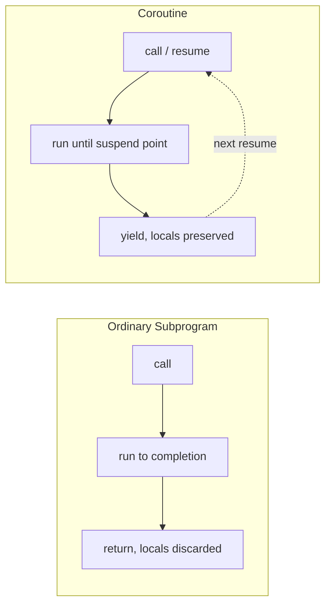

## Coroutines

### Overview

A coroutine is a generalized subprogram that can suspend its execution at designated points and later resume from exactly where it left off, retaining its local state across suspensions. This distinguishes coroutines from ordinary subprograms, which always begin execution at the top and run to completion (or to a return statement) each time they are invoked. Coroutines enable cooperative multitasking, generators, and certain elegant formulations of producer-consumer and state-machine-like control flow, without necessarily requiring operating-system threads.

### Coroutines vs. Ordinary Subprograms

An ordinary subprogram call has a single entry point (the top of the subprogram body) and, conceptually, a single logical exit (return), after which its local state is discarded. A coroutine has multiple possible resumption points — every place it previously suspended — and its local state persists across suspensions rather than being torn down.



### Coroutines vs. Ordinary Subprogram Calls: Symmetric Control Transfer

A key conceptual distinction, historically emphasized in language-design literature, is that a call to an ordinary subprogram is **asymmetric**: the caller is "in charge," and the callee always returns control back to its caller. A coroutine transfer is closer to **symmetric**: control passes from one coroutine to another (or back), and neither party is intrinsically "the caller" in a strict master-subordinate sense — both are peers that pass control back and forth. Many practical implementations (generators, `async`/`await`) use an asymmetric variant of this idea layered on top of a scheduler or driving loop, but the original conceptual model, associated historically with Melvin Conway's early description of coroutines, emphasizes this peer-like symmetry. [Inference: characterizing the "originally conceived" model this way reflects how coroutines are commonly described in language-design textbooks discussing control-flow history, though exact historical framing can vary by source.]

### Core Coroutine Operations

Most coroutine models expose some variant of these operations:

- **Create/instantiate**: allocate a coroutine's persistent execution state (its own stack or equivalent frame).
- **Resume**: transfer control into the coroutine, either at its start (first resume) or at its last suspension point (subsequent resumes).
- **Yield/suspend**: from inside the coroutine, transfer control back out, optionally passing a value, while preserving the coroutine's current execution position and local state.
- **Terminate/exhaust**: the coroutine runs to completion (falls off the end of its body, or hits an explicit return), after which it can no longer be resumed and any attempt to do so typically raises an error or returns a sentinel/exhausted indication.

### Generators: The Most Widely Encountered Coroutine Form

**Generators** are a restricted, commonly implemented form of coroutine — often called *semi-coroutines* — that can suspend (yield a value out) but conventionally cannot receive new input on resumption beyond simply "continue" in their most basic form, though many modern implementations extend generators to also accept values sent in on resume, blurring this historical distinction.

**Python** generators, using `yield`, are a canonical example:

```python
def counter(start):
    n = start
    while True:
        received = yield n   # suspend here, produce n, optionally receive a value on resume
        if received == "reset":
            n = start
        else:
            n += 1

gen = counter(0)
print(next(gen))         # 0 — runs to first yield
print(next(gen))         # 1 — resumes after yield, runs to next yield
print(gen.send("reset")) # 0 — resumes with received == "reset"
```

Each call to `next()` or `send()` resumes execution exactly where the generator last suspended, with all local variables (`n`, `start`) retained — behavior an ordinary function cannot exhibit, since an ordinary function's locals are discarded on return and recreated fresh on the next call.

**JavaScript** generators use the `function*` / `yield` syntax with closely analogous semantics:

```javascript
function* counter(start) {
    let n = start;
    while (true) {
        const received = yield n;
        n = received === "reset" ? start : n + 1;
    }
}
const gen = counter(0);
console.log(gen.next().value);        // 0
console.log(gen.next().value);        // 1
console.log(gen.next("reset").value); // 0
```

**C#** provides `yield return` inside an `IEnumerable`/`IEnumerator`-producing method, which the compiler transforms into a state machine implementing the same suspend/resume semantics:

```csharp
IEnumerable<int> Counter(int start) {
    int n = start;
    while (true) {
        yield return n;
        n++;
    }
}
```

### Full (Asymmetric) Coroutines: `async`/`await`

The `async`/`await` pattern, found in JavaScript, C#, Python (`async def`/`await`), and Rust (`async fn`/`.await`), builds on the same underlying suspend/resume machinery as generators but is oriented specifically around suspending while waiting for an asynchronous operation (I/O, a timer, another coroutine) to complete, with an event loop or executor acting as the driver that decides when to resume each suspended coroutine.

```javascript
async function fetchData(url) {
    const response = await fetch(url);  // suspend until the fetch resolves
    const data = await response.json(); // suspend until parsing resolves
    return data;
}
```

Here, `await` is conceptually a yield point: execution suspends, control returns to the event loop, and the coroutine resumes automatically once the awaited operation completes — the programmer does not manually call something equivalent to `next()`, because the runtime's scheduler handles resumption. This is a case where the coroutine abstraction is present but partially hidden behind syntax and a runtime scheduler, distinguishing it from Python generators' fully manual `next()`/`send()` resumption model.

### Full (Symmetric) Coroutines: Lua

**Lua** provides one of the more direct, general-purpose coroutine implementations among mainstream languages, via the `coroutine` library, explicitly exposing create/resume/yield as first-class operations without requiring an implicit event loop:

```lua
local co = coroutine.create(function(a)
    print("first", a)
    local b = coroutine.yield(a + 1)
    print("second", b)
    local c = coroutine.yield(b + 1)
    print("third", c)
    return c + 1
end)

print(coroutine.resume(co, 10))  -- prints "first 10", returns true, 11
print(coroutine.resume(co, 20))  -- prints "second 20", returns true, 21
print(coroutine.resume(co, 30))  -- prints "third 30", returns true, 31
```

Each `coroutine.resume` call passes a value in (available to the coroutine as the result of `coroutine.yield`) and receives a value out (the argument to the next `coroutine.yield` or the coroutine's final return value), illustrating the fully bidirectional data flow that distinguishes general coroutines from the more restricted generator model.

### Implementation: What a Coroutine Needs to Persist State

For a coroutine's local state to survive across suspension, its implementation needs somewhere to preserve at least:

- The program counter / resumption point (where execution should continue)
- Local variable values
- Any saved register state relevant to the suspended computation

Two broad implementation strategies exist:

- **Stackful coroutines**: each coroutine has its own independently allocated execution stack (distinct from the OS thread's main call stack), so suspending simply means saving the current stack pointer/registers and switching to a different stack — conceptually similar to a lightweight context switch. Lua coroutines and many "fiber" implementations (e.g., in some systems programming contexts) use this model, allowing a coroutine to suspend from *within* nested function calls, not just at its own top level.
- **Stackless coroutines**: the compiler transforms the coroutine's body into a state machine (or equivalent heap-allocated frame capturing just the locals that need to survive), without allocating a full separate stack. C#'s `yield return` and JavaScript generators are commonly implemented this way, and this approach generally restricts suspension (`yield`/`await`) to occur only directly within the coroutine's own body, not from inside an arbitrary called function several levels deep, unless that called function is itself coroutine-aware. [Inference: the specific restriction on where `yield`/`await` may syntactically appear varies by language and is a documented rule in each language's specification (e.g., Python and JavaScript both restrict `yield`/`await` to lexically appear only within a generator/async function body, not inside an ordinary nested function called from it), so this is stated as a general pattern rather than a single universal rule verified across every language.]

Diagram contrasting the two implementation strategies:

<svg xmlns="http://www.w3.org/2000/svg" viewBox="0 0 780 300">
  <text x="390" y="26" text-anchor="middle" font-size="18" font-weight="bold" fill="#1a1a1a">Stackful vs. Stackless Coroutine Implementation (svg_diagram)</text>

  <text x="195" y="55" text-anchor="middle" font-size="14" font-weight="bold" fill="#2c3e50">Stackful (e.g., Lua)</text>
  <rect x="60" y="70" width="270" height="150" rx="6" fill="#f4f6f8" stroke="#333" />
  <rect x="80" y="90" width="90" height="110" fill="#3498db" fill-opacity="0.2" stroke="#333" />
  <text x="125" y="150" text-anchor="middle" font-size="11">Main stack</text>
  <rect x="200" y="90" width="90" height="110" fill="#2ecc71" fill-opacity="0.2" stroke="#333" />
  <text x="245" y="150" text-anchor="middle" font-size="11">Coroutine's own stack</text>
  <line x1="170" y1="145" x2="200" y2="145" stroke="#c0392b" stroke-width="2" marker-end="url(#a3)" />
  <line x1="200" y1="165" x2="170" y2="165" stroke="#c0392b" stroke-width="2" marker-end="url(#a3)" />
  <text x="195" y="235" text-anchor="middle" font-size="11" fill="#555">Suspend = save registers, switch stack pointer</text>
  <text x="195" y="252" text-anchor="middle" font-size="11" fill="#555">Can yield from nested calls</text>

  <text x="585" y="55" text-anchor="middle" font-size="14" font-weight="bold" fill="#2c3e50">Stackless (e.g., C#, JS generators)</text>
  <rect x="450" y="70" width="270" height="150" rx="6" fill="#f4f6f8" stroke="#333" />
  <rect x="470" y="90" width="230" height="40" fill="#e67e22" fill-opacity="0.2" stroke="#333" />
  <text x="585" y="114" text-anchor="middle" font-size="11">Heap-allocated state object</text>
  <rect x="470" y="140" width="230" height="40" fill="#9b59b6" fill-opacity="0.2" stroke="#333" />
  <text x="585" y="164" text-anchor="middle" font-size="11">Compiler-generated state machine</text>
  <text x="585" y="235" text-anchor="middle" font-size="11" fill="#555">Suspend = save locals to heap frame, return</text>
  <text x="585" y="252" text-anchor="middle" font-size="11" fill="#555">Generally restricted to top-level yield/await points</text>
</svg>

### Coroutines and Concurrency: An Important Distinction

Coroutines provide **concurrency structure** — the ability to interleave logically independent sequences of execution — but do not, by themselves, provide **parallelism**: a language runtime built on single-threaded cooperative coroutines (as in JavaScript's event loop, Python's `asyncio`, or Lua's coroutine library) executes only one coroutine's code at any given instant, switching between them only at explicit suspension points. This is fundamentally different from OS threads or true parallel execution, where the operating system can preemptively suspend a thread at essentially any instruction. [Inference] Because coroutine switches happen only at points the coroutine itself designates (`yield`, `await`), coroutine-based concurrency is often described as "cooperative," in contrast to the "preemptive" scheduling used by OS threads — a widely used framing in concurrency literature, though some language runtimes (e.g., Go's goroutines) combine cooperative-style lightweight coroutine scheduling with genuine OS-level parallelism across multiple threads, which is a further hybrid worth distinguishing from pure single-threaded cooperative models.

### Go: Goroutines as a Related but Distinct Construct

Go's goroutines are sometimes discussed alongside coroutines but differ in an important respect: goroutines are scheduled by the Go runtime across potentially multiple OS threads, and the Go scheduler can, in effect, preempt a goroutine at safe points without the goroutine explicitly yielding via a syntactic construct in the way `yield`/`await` require in other languages — making goroutines closer to lightweight, runtime-managed threads than to the classic explicit-suspend-point coroutine model, even though they share the "many lightweight units of execution multiplexed onto fewer OS threads" motivation. [Unverified: the precise current preemption mechanism and scheduling guarantees of the Go runtime are implementation details that have evolved across Go versions, so specifics should be checked against current Go documentation rather than treated as fixed here.]

### Practical Use Cases

- **Lazy sequence generation**: producing potentially infinite or expensive-to-compute sequences on demand (Python/JavaScript generators), without materializing the entire sequence in memory upfront.
- **Producer-consumer pipelines**: two coroutines passing data back and forth without needing a full thread-synchronization mechanism (locks, condition variables) when running cooperatively on a single thread.
- **Asynchronous I/O without callback nesting**: `async`/`await` restructures code that would otherwise require deeply nested callbacks into a linear-looking sequence, while preserving non-blocking behavior underneath.
- **Cooperative multitasking and simple game/state-machine logic**: Lua's coroutines are commonly used in this way in game-scripting contexts, letting a script "wait" for several frames without blocking the entire game loop. [Inference: this is a widely cited practical use pattern in game-scripting communities rather than a claim about Lua's formal design intent.]

### Comparative Table

| Language | Construct | Bidirectional data flow | Driver |
|---|---|---|---|
| Python | Generators (`yield`) | Yes, via `.send()` | Manual (`next()`/`send()`) |
| Python | `async def` / `await` | Values via awaited results | Event loop (`asyncio`) |
| JavaScript | Generators (`function*`) | Yes, via `.next(value)` | Manual |
| JavaScript | `async`/`await` | Values via awaited promises | Event loop |
| C# | `yield return` (iterators) | Output only (classic form) | Manual (`MoveNext()`/`foreach`) |
| C# | `async`/`await` (Tasks) | Values via awaited tasks | Task scheduler |
| Lua | `coroutine` library | Yes, fully bidirectional | Manual (`resume`/`yield`) |
| Rust | `async fn` / `.await` | Values via awaited futures | External executor (e.g., Tokio) |
| Go | Goroutines | Via channels, not yield | Go runtime scheduler |

### Key Points

- The defining property of a coroutine is preserved local state and multiple resumption points, contrasting with an ordinary subprogram's single entry point and discarded-on-return local state.
- Generators are a restricted, widely implemented coroutine form (historically "semi-coroutines"), typically oriented around producing a sequence of values; `async`/`await` builds on similar suspend/resume machinery but is oriented around awaiting asynchronous operations and is driven automatically by a scheduler rather than manual resumption calls.
- Lua provides one of the more general-purpose, explicitly symmetric coroutine models among mainstream languages, exposing `create`/`resume`/`yield` directly with full bidirectional data passing.
- Coroutines provide cooperative concurrency structure but not inherent parallelism; whether a language's lightweight-execution-unit model (coroutines, goroutines, green threads) also achieves true parallel execution depends on the runtime's scheduling architecture, which varies significantly across languages.
- Stackful implementations allow suspension from within nested calls at the cost of maintaining a separate stack per coroutine; stackless implementations avoid that overhead via compiler-generated state machines but generally restrict where suspension can syntactically occur.

### Related Topics

- Generators and lazy evaluation
- `async`/`await` and Promise/Future-based asynchronous programming
- Cooperative vs. preemptive scheduling
- Fibers and green threads
- Go goroutines and channel-based concurrency (CSP model)
- Continuation-passing style and first-class continuations
- Event loops and single-threaded concurrency models
- State machines as a compilation target for coroutine transformation