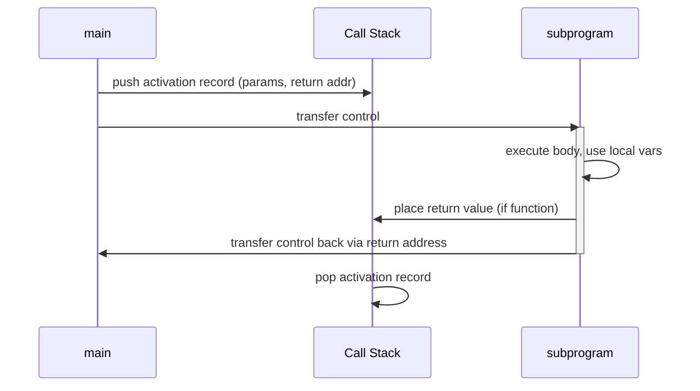
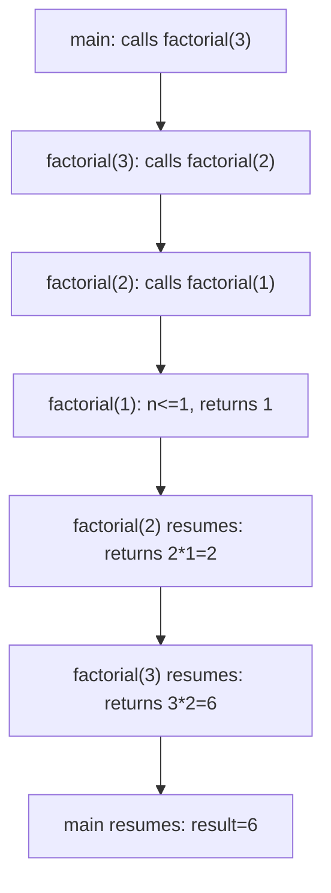

## The General Semantics of Calls and Returns

### Overview

Subprogram calls and returns are the mechanism by which control and data move between a caller and a subprogram (procedure or function). Beneath the surface syntax of a call, several coordinated actions must occur: control must transfer to the subprogram's code, the subprogram needs a place to store its local data, parameters must be communicated, and upon completion, control (and possibly a value) must return to the point immediately after the call. This sequence is one of the oldest and most heavily optimized parts of language implementation, and nearly every runtime feature — recursion, closures, exceptions, coroutines — is built on top of it.

### The Call Semantics

A subprogram call requires the following actions, in order:

- **Save the execution status of the caller.** The values of registers and the location of the next instruction to execute after the subprogram returns (the return address) must be preserved so execution can resume correctly.
- **Carry out the parameter-passing process.** Actual parameters are bound to formal parameters according to the language's parameter-passing mode (by value, by reference, and so on).
- **Pass the return address to the called subprogram.** The subprogram needs to know where to transfer control back to once it finishes.
- **Transfer control to the called subprogram.** This is the actual jump/branch in machine code.

### The Return Semantics

Returning from a subprogram is the mirror image of the call and requires:

- **If the subprogram is a function, place the return value in a place accessible to the caller.** This is often a designated register or a location in the caller's frame.
- **Restore the execution status of the caller.** Registers, stack pointer, and other environment state saved at call time are restored.
- **Transfer control back to the caller**, using the previously saved return address.

### Activation Records

The data needed for a single execution (activation) of a subprogram is collected into a compile-time-designed template called an **activation record**. An instance of this template, filled with actual runtime values, is called an **activation record instance**, and it is typically allocated on a runtime stack (the **call stack**) when the subprogram is called.

A typical activation record includes:

- **Return address** — where to resume execution in the caller.
- **Parameters** — actual parameter values or references, depending on passing mode.
- **Local variables** — storage for variables declared inside the subprogram.
- **Dynamic link** — a pointer to the activation record instance of the caller, used to support returning and, in some designs, to support access to nonlocal variables.
- **Static link** — used in languages with nested subprograms (like Pascal or Ada) to support **static-scoped** access to nonlocal variables; points to the activation record of the lexically enclosing subprogram.
- **Saved registers and machine status** — whatever the calling convention specifies must be preserved across calls.
- **Return value slot** — for functions, a location where the returned value is placed, often a register in practice rather than a stack slot. [Inference — implementation detail; some languages/ABIs pass small return values in registers and only use a stack slot for large aggregate return types]

Below is the general layout of an activation record instance:

<svg xmlns="http://www.w3.org/2000/svg" viewBox="0 0 520 460">
<text x="260" y="30" font-size="16" font-weight="bold" text-anchor="middle" fill="#1a1a1a">Activation Record Layout (svg_diagram)</text>
<rect x="120" y="60" width="280" height="50" fill="#e8f0fe" stroke="#3b5bdb" stroke-width="1.5" />
<text x="260" y="90" font-size="14" text-anchor="middle" fill="#1a1a1a">Return Value</text>
<rect x="120" y="110" width="280" height="50" fill="#fff3bf" stroke="#f08c00" stroke-width="1.5" />
<text x="260" y="140" font-size="14" text-anchor="middle" fill="#1a1a1a">Actual Parameters</text>
<rect x="120" y="160" width="280" height="50" fill="#e6fcf5" stroke="#0ca678" stroke-width="1.5" />
<text x="260" y="190" font-size="14" text-anchor="middle" fill="#1a1a1a">Return Address</text>
<rect x="120" y="210" width="280" height="50" fill="#fff0f6" stroke="#d6336c" stroke-width="1.5" />
<text x="260" y="240" font-size="14" text-anchor="middle" fill="#1a1a1a">Dynamic Link</text>
<rect x="120" y="260" width="280" height="50" fill="#f3f0ff" stroke="#7048e8" stroke-width="1.5" />
<text x="260" y="290" font-size="14" text-anchor="middle" fill="#1a1a1a">Static Link (if applicable)</text>
<rect x="120" y="310" width="280" height="50" fill="#f1f3f5" stroke="#495057" stroke-width="1.5" />
<text x="260" y="340" font-size="14" text-anchor="middle" fill="#1a1a1a">Saved Registers / Status</text>
<rect x="120" y="360" width="280" height="70" fill="#f8f9fa" stroke="#212529" stroke-width="1.5" stroke-dasharray="4" />
<text x="260" y="390" font-size="14" text-anchor="middle" fill="#1a1a1a">Local Variables</text>
<text x="260" y="410" font-size="12" text-anchor="middle" fill="#495057">(size varies per call)</text>

<text x="70" y="85" font-size="12" text-anchor="end" fill="`#495057`">higher</text>

<text x="70" y="405" font-size="12" text-anchor="end" fill="`#495057`">lower</text>

<line x1="90" y1="65" x2="90" y2="425" stroke="`#adb5bd`" stroke-width="1" />

<polygon points="90,65 85,75 95,75" fill="`#adb5bd`" />

<text x="60" y="250" font-size="11" fill="`#495057`" transform="rotate(-90 60 250)">stack growth ↓</text>

</svg>

### The Call Stack

Most contemporary imperative languages implement subprogram calls using a **stack-dynamic** allocation strategy: each call pushes a new activation record instance onto a runtime stack, and each return pops it off. This design directly supports **recursion**, since each active call — even calls to the same subprogram — gets its own independent activation record instance, so local variables and parameters from different invocations never collide.

The sequence for a chain of calls looks like this:



### Dynamic Link vs. Static Link

These two are frequently confused, so it is worth separating them explicitly:

- **Dynamic link** points to the activation record instance of the subprogram that *called* this one — i.e., it reflects the **call chain** (call history) at runtime. It is used to restore the caller's environment on return and, in languages with **dynamic scoping**, to resolve nonlocal references.
- **Static link** points to the activation record instance of the subprogram that **lexically encloses** this one in the source code — i.e., it reflects **nesting structure**, not call history. It is used in languages with nested subprograms and **static scoping** (e.g., Pascal, Ada, Python's closures conceptually) to resolve references to nonlocal variables based on where the code is written, not how it was called.

These two links can differ substantially. If subprogram `A` is lexically nested inside `B`, but at runtime `C` calls `A` directly, then `A`'s dynamic link points to `C`'s activation record, while `A`'s static link still points to `B`'s activation record (or the most recent instance of it).

### Register-Based Optimizations

While the conceptual model places everything in the activation record, real implementations aggressively optimize:

- Many ABIs (Application Binary Interfaces) pass the first several parameters in **registers** rather than on the stack, falling back to the stack only when registers are exhausted. [Inference — the specific number of register-passed parameters and which registers are used is ABI- and architecture-specific, e.g., the System V AMD64 ABI uses different conventions than ARM's AAPCS]
- The return address is often kept in a dedicated **link register** on RISC architectures (e.g., ARM's `LR`) rather than always being pushed to the stack, with a push/pop only needed if the subprogram itself makes further calls.
- **Tail-call optimization** can, in some language implementations, allow certain calls to *reuse* the caller's activation record instead of allocating a new one, when the call is the very last action performed before returning. [Inference — this is a language/compiler-dependent optimization, not a universal semantic guarantee; e.g., Scheme mandates it, while C and Java implementations do not guarantee it]

### Example: A Traced Call Sequence

Consider the following pseudocode:

```plaintext
function factorial(n)
    if n <= 1 then
        return 1
    else
        return n * factorial(n - 1)
    end if
end function

main:
    result = factorial(3)
```

**Key Points**

- Each recursive call to `factorial` creates a **new** activation record instance, distinct from all others on the stack, even though the code being executed is the same.
- At the deepest call (`factorial(1)`), the call stack contains four stacked activation record instances: one for `main`, and one each for `factorial(3)`, `factorial(2)`, `factorial(1)`.
- As each call returns, its activation record instance is popped, its return value is used by the multiplication in its caller's frame, and control resumes at the instruction right after that particular call.



### Complicating Factors

The basic call/return model above becomes more intricate under several common language features:

- **Nested subprograms with static scoping** require the static link (or an equivalent mechanism, such as a **display**, an array of pointers to enclosing scopes' activation records) to resolve nonlocal variable references at runtime.
- **Coroutines and generators** break the strict "last called, first returned" discipline: control can suspend and resume a subprogram's activation record instance without it being the most recent one on the stack, which typically requires the activation record to be **heap-allocated** rather than stack-allocated. [Inference — implementation strategy varies; some languages implement coroutines via stackful continuations, others via state machines that don't use a traditional stack frame at all]
- **First-class functions and closures** require that the environment (including references to nonlocal variables) survive after the enclosing subprogram returns, which forces at least part of the activation record's data — the captured variables — onto the **heap** rather than being purely stack-allocated, since a stack frame's lifetime would otherwise end when the enclosing call returns.
- **Exception handling** requires the runtime to walk back through the chain of dynamic links (a process often called **stack unwinding**) to find a handler, popping activation records along the way and running any necessary cleanup (destructors, `finally` blocks) as it goes.

### Related Topics

- Parameter-passing methods (pass-by-value, pass-by-reference, pass-by-name)
- Local referencing environments and scope rules (static vs. dynamic scoping)
- Implementing dynamic scoping (deep access vs. shallow access)
- Displays as an alternative to static links for nested subprogram access
- Blocks and their implementation using activation records
- Implementing closures and heap-allocated activation records
- Coroutine implementation strategies
- Exception propagation and stack unwinding mechanics