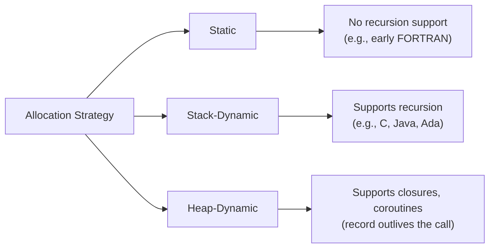

## Activation Records

### Overview

An activation record is the compile-time template describing what information must be maintained for a single execution of a subprogram. Every time a subprogram is called, an **activation record instance** — the template filled in with actual runtime values — is created to hold that execution's local data, parameters, and bookkeeping information needed to correctly resume the caller when the subprogram finishes. Activation records are the central data structure underlying subprogram implementation, and their design directly determines what language features (recursion, nested subprograms, closures, coroutines) a runtime can support.

### Why Activation Records Exist

A subprogram's code is typically static — one copy exists regardless of how many times it is called or how many calls are simultaneously active (as with recursion). What changes from call to call are the local variables, parameters, and control-flow bookkeeping. Separating "the code" (fixed, reusable) from "the data for one particular call" (fresh, per-invocation) is the core idea. The activation record is exactly that per-invocation data.

### General Layout

While exact layouts are language- and implementation-specific, most activation records include the following fields:

- **Local variables** — storage for variables declared within the subprogram, scoped to that particular call.
- **Parameters** — either the actual values (in pass-by-value) or references/addresses (in pass-by-reference and similar modes), depending on the language's parameter-passing semantics.
- **Return address** — the location in the caller's code to resume after the subprogram completes.
- **Dynamic link** — a pointer to the caller's activation record instance, reflecting the actual call chain at runtime; used to restore the caller's environment and to support dynamic scoping where applicable.
- **Static link** — a pointer to the activation record instance of the lexically enclosing subprogram, used in languages with nested subprograms and static scoping to resolve nonlocal variable references.
- **Return value slot** — for functions, a location where the computed value is placed for the caller to retrieve. [Inference — in practice this is frequently a register rather than a stack slot, with the stack used mainly for large aggregate return values; the exact convention is ABI-specific]
- **Saved registers/machine status** — whatever register or processor state the calling convention requires to be preserved across the call.

<svg xmlns="http://www.w3.org/2000/svg" viewBox="0 0 520 430">
<text x="260" y="30" font-size="16" font-weight="bold" text-anchor="middle" fill="#1a1a1a">General Activation Record Fields (svg_diagram)</text>
<rect x="110" y="55" width="300" height="45" fill="#e8f0fe" stroke="#3b5bdb" stroke-width="1.5" />
<text x="260" y="82" font-size="14" text-anchor="middle" fill="#1a1a1a">Return Value</text>
<rect x="110" y="100" width="300" height="45" fill="#fff3bf" stroke="#f08c00" stroke-width="1.5" />
<text x="260" y="127" font-size="14" text-anchor="middle" fill="#1a1a1a">Parameters</text>
<rect x="110" y="145" width="300" height="45" fill="#e6fcf5" stroke="#0ca678" stroke-width="1.5" />
<text x="260" y="172" font-size="14" text-anchor="middle" fill="#1a1a1a">Return Address</text>
<rect x="110" y="190" width="300" height="45" fill="#fff0f6" stroke="#d6336c" stroke-width="1.5" />
<text x="260" y="217" font-size="14" text-anchor="middle" fill="#1a1a1a">Dynamic Link</text>
<rect x="110" y="235" width="300" height="45" fill="#f3f0ff" stroke="#7048e8" stroke-width="1.5" />
<text x="260" y="262" font-size="14" text-anchor="middle" fill="#1a1a1a">Static Link (if nested subprograms)</text>
<rect x="110" y="280" width="300" height="45" fill="#f1f3f5" stroke="#495057" stroke-width="1.5" />
<text x="260" y="307" font-size="14" text-anchor="middle" fill="#1a1a1a">Saved Registers / Status</text>
<rect x="110" y="325" width="300" height="65" fill="#f8f9fa" stroke="#212529" stroke-width="1.5" stroke-dasharray="4" />
<text x="260" y="352" font-size="14" text-anchor="middle" fill="#1a1a1a">Local Variables</text>
<text x="260" y="372" font-size="12" text-anchor="middle" fill="#495057">(variable size, known at compile time)</text>
</svg>

### Static vs. Dynamic Portions

Activation records can be divided conceptually into two parts:

- **Static portion** — fields whose size and offset are known at compile time: return address slot, dynamic link, static link, saved registers, and fixed-size local variables. The compiler determines exactly where each of these lives relative to the start of the record.
- **Dynamic portion** — anything whose size cannot be determined until runtime, such as parameters passed via variable-length constructs, or local arrays whose bounds depend on runtime values. [Inference — languages differ on whether such variable-length locals are allowed at all; e.g., traditional C disallows non-constant array sizes as true locals (pre-VLA), while Ada and C99 permit runtime-sized local arrays]

### Allocation Strategies

How an activation record instance is allocated depends on the language's subprogram semantics:

- **Stack-dynamic allocation** — the most common strategy for languages supporting recursion (C, Java, Python, Ada, etc.). Each call pushes a new instance onto a runtime call stack; each return pops it. This naturally supports recursion, since simultaneously active calls to the same subprogram each get independent storage.
- **Static allocation** — used historically in languages that disallow recursion (early FORTRAN). A single fixed memory area is bound to the subprogram at compile time, reused on every call. This is simpler and faster but cannot support recursion, since a recursive call would overwrite the data of the still-active outer call.
- **Heap allocation** — required when an activation record's lifetime must outlive the call that created it, most notably to support **closures** (which capture nonlocal variables that must persist after the enclosing subprogram returns) and certain **coroutine**/**generator** implementations (which suspend and resume out of strict call/return order). [Inference — heap allocation strategy and exactly which fields get "escaped" onto the heap is implementation-specific; some compilers only heap-allocate the specific captured variables rather than the whole record]



### Layout for a Language Without Nested Subprograms

Languages like C do not support nested subprogram definitions, so their activation records omit the static link entirely — only the dynamic link is needed, since nonlocal references are resolved through global scope or explicit closures/pointers rather than lexical nesting of subprograms.

### Layout for a Language With Nested Subprograms

Languages like Pascal or Ada allow subprograms to be nested inside other subprograms, and references to nonlocal (but non-global) variables must be resolved according to the **lexical structure** of the source code. This requires the static link field, which is set at call time to point to the activation record instance of the subprogram that lexically (textually) encloses the called subprogram — not necessarily the subprogram that actually called it.

**Example**

```plaintext
procedure Outer is
    X : Integer;

    procedure Inner is
    begin
        X := X + 1;  -- nonlocal reference to Outer's X
    end Inner;

begin
    Inner;
end Outer;
```

When `Inner` executes, its activation record's static link points to `Outer`'s activation record instance, allowing `X` to be resolved by following that one link. If `Inner` were nested more deeply, resolving a nonlocal reference could require following the static link chain multiple levels up — each level of nesting away from the reference costs one additional link traversal. [Inference — the exact traversal cost/complexity is a well-known consequence of this design but specific performance figures depend on nesting depth and are implementation/hardware dependent]

### Activation Record Instance Lifecycle

```mermaid
sequenceDiagram
    participant Caller
    participant Stack as Runtime Stack
    participant Instance as Activation Record Instance

    Caller->>Stack: allocate new instance (push)
    Stack->>Instance: initialize (params, return addr, links)
    Instance->>Instance: execute subprogram body
    Instance->>Caller: place return value (if function)
    Caller->>Stack: deallocate instance (pop)
    Note over Instance: instance destroyed;<br/>locals no longer accessible
```

### Complicating Cases

- **Recursion** — each active call gets a distinct activation record instance, so recursive calls to the same subprogram never interfere with each other's local variables or parameters, even though they share the same code.
- **Closures** — when a subprogram returns a function value that references its own local variables, those specific variables (the captured environment) must survive past the subprogram's return, which typically forces at least those variables onto the heap rather than the stack.
- **Coroutines/generators** — since these can suspend mid-execution and be resumed later, potentially after other unrelated calls have run, their activation record instance generally cannot live purely on a strict last-in-first-out stack and is instead heap-allocated or otherwise separately managed. [Inference — some implementations use separate stacks per coroutine ("stackful" coroutines) rather than heap-allocating individual records; the specific mechanism is implementation-dependent]
- **Exception handling** — unwinding the stack to find a handler requires walking the chain of dynamic links, deallocating activation record instances as the search proceeds, and running any associated cleanup code along the way.

### Related Topics

- Parameter-passing methods and their effect on activation record contents
- Static vs. dynamic scoping and their implementation implications
- Static links vs. displays for accessing nonlocal variables
- Stack-dynamic vs. heap-dynamic local variable allocation
- Closures and heap-allocated activation records
- Coroutine and generator implementation strategies
- Blocks as a special case of nested activation records
- Exception propagation and stack unwinding